# Especificación Funcional Definitiva del ERP GreatPhones

> **Propósito de este documento**: describir el comportamiento de NEGOCIO del ERP GreatPhones —hoy implementado sobre Google Apps Script y Google Sheets— con el nivel de detalle suficiente para que un equipo de desarrollo completamente nuevo pueda reconstruirlo en cualquier tecnología (React, Next.js, NestJS, Laravel, Django, etc.) sin leer una sola línea del código actual.
>
> Este documento **no describe código, funciones ni implementación técnica**. Describe el negocio: entidades, reglas, procesos, eventos y dependencias. Toda afirmación aquí contenida está verificada contra el comportamiento real del sistema (no se documenta ninguna funcionalidad supuesta o ideal). Donde el sistema tiene comportamiento heredado, duplicado, inconsistente o en riesgo, se señala explícitamente como tal.

## Índice

1. [Introducción](#1-introducción)
2. [Arquitectura funcional](#2-arquitectura-funcional)
3. [Modelo conceptual del negocio](#3-modelo-conceptual-del-negocio)
4. [Módulos](#4-módulos)
   - [4.1 Compras](#41-compras)
   - [4.2 Ventas](#42-ventas)
   - [4.3 Preventas](#43-preventas)
   - [4.4 Entrega de Preventas](#44-entrega-de-preventas)
   - [4.5 Compras de Accesorios](#45-compras-de-accesorios)
   - [4.6 Ventas de Accesorios](#46-ventas-de-accesorios)
   - [4.7 Stock (Equipos y Accesorios)](#47-stock-equipos-y-accesorios)
   - [4.8 Reparaciones](#48-reparaciones)
   - [4.9 Garantías](#49-garantías)
   - [4.10 Clientes](#410-clientes)
   - [4.11 Gastos, Cambio de Moneda y Ajuste de Caja](#411-gastos-cambio-de-moneda-y-ajuste-de-caja)
   - [4.12 Caja](#412-caja)
   - [4.13 Libro Diario](#413-libro-diario)
   - [4.14 Mis Operaciones](#414-mis-operaciones)
   - [4.15 Comisiones](#415-comisiones)
   - [4.16 Dashboard](#416-dashboard)
   - [4.17 Reportes](#417-reportes)
   - [4.18 Auditoría](#418-auditoría)
   - [4.19 Operadores](#419-operadores)
   - [4.20 Configuraciones](#420-configuraciones)
   - [4.21 Inversores](#421-inversores)
   - [4.22 Regalos Automáticos](#422-regalos-automáticos)
   - [4.23 Anulaciones y Correcciones](#423-anulaciones-y-correcciones)
   - [4.24 Backups de Operación](#424-backups-de-operación)
   - [4.25 Transacciones](#425-transacciones)
   - [4.26 Estado ERP y Salud ERP](#426-estado-erp-y-salud-erp)
5. [Eventos del sistema](#5-eventos-del-sistema)
6. [Reglas de negocio](#6-reglas-de-negocio)
7. [Dependencias entre módulos](#7-dependencias-entre-módulos)
8. [Flujo completo del ERP](#8-flujo-completo-del-erp)
9. [Principios de diseño](#9-principios-de-diseño)
10. [Riesgos](#10-riesgos)
11. [Recomendaciones para migración](#11-recomendaciones-para-migración)

**Parte II — El proyecto GreatPhones (nueva plataforma)**

12. [Introducción a GreatPhones y arquitectura general](#12-introducción-a-greatphones-y-arquitectura-general)
13. [Modelo conceptual de datos de GreatPhones](#13-modelo-conceptual-de-datos-de-greatphones)
14. [Módulos de GreatPhones](#14-módulos-de-greatphones)
15. [Eventos del sistema GreatPhones](#15-eventos-del-sistema-greatphones)
16. [Reglas de negocio de GreatPhones](#16-reglas-de-negocio-de-greatphones)
17. [Riesgos y hallazgos específicos de GreatPhones](#17-riesgos-y-hallazgos-específicos-de-greatphones)

**Parte III — Documento maestro comparativo (ERP ↔ GreatPhones)**

18. [Matriz completa de eventos (unificada)](#18-matriz-completa-de-eventos-unificada)
19. [Contrato funcional de cada módulo](#19-contrato-funcional-de-cada-módulo)
20. [Mapa de dependencias (unificado)](#20-mapa-de-dependencias-unificado)
21. [Comparación ERP vs GreatPhones](#21-comparación-erp-vs-greatphones)
22. [Matriz de reutilización](#22-matriz-de-reutilización)
23. [Brechas funcionales](#23-brechas-funcionales)
24. [Roadmap funcional de migración](#24-roadmap-funcional-de-migración)

**Parte IV — Decisión de arquitectura: Google Sheets como repositorio histórico**

25. [Google Sheets como repositorio histórico](#25-google-sheets-como-repositorio-histórico)
26. [Matriz de sincronización](#26-matriz-de-sincronización)
27. [Clasificación de las hojas actuales del ERP](#27-clasificación-de-las-hojas-actuales-del-erp)

**Parte V — Arquitectura de eventos del negocio**

28. [Arquitectura basada en eventos](#28-arquitectura-basada-en-eventos)
29. [Catálogo de eventos del negocio](#29-catálogo-de-eventos-del-negocio)

---

## 1. Introducción

### 1.1 Qué es GreatPhones ERP

GreatPhones ERP es el sistema de gestión integral de un negocio de compraventa de celulares usados y nuevos, accesorios y reparaciones técnicas. Cubre el ciclo completo del negocio: ingreso de mercadería (compra o consignación de equipos y accesorios), venta directa, venta anticipada (preventa) con entrega diferida, reparaciones y diagnósticos técnicos, gestión de caja multi-moneda (pesos y dólares), contabilidad centralizada, gestión de inversores externos que aportan capital al negocio, y un sistema propio de integridad, auditoría y reversión de operaciones.

El sistema no tiene usuarios ni contraseñas: es operado por un grupo reducido y fijo de personas ("operadores") que comparten los mismos dispositivos físicos en el local, y cada una se identifica manualmente en cada operación que realiza.

### 1.2 Objetivo del sistema

Dar a un negocio de tamaño pequeño/mediano, con múltiples personas operando simultáneamente sobre los mismos datos, una herramienta que:

- Registre cada operación de negocio (compra, venta, preventa, reparación, gasto, movimiento de inversor, etc.) en el momento en que ocurre, sin pasos administrativos posteriores.
- Mantenga, sin intervención manual, una contabilidad centralizada y siempre actualizada (saldo de caja por medio de pago, ganancia, y stock).
- Permita revertir o corregir cualquier error humano de carga sin perder trazabilidad de qué pasó, quién lo hizo y por qué.
- No dependa de que cada operador recuerde hacer un paso adicional (todo lo contable, todo lo de stock, y toda la trazabilidad debe dispararse automáticamente al confirmar la operación de negocio).

### 1.3 Problemas que resuelve

- **Falta de un libro contable único**: antes de la contabilidad centralizada (Libro Diario), cada tipo de operación podía mover dinero sin que quedase un rastro consolidado. El ERP resuelve esto generando automáticamente un asiento contable por cada movimiento de valor, sin que el operador tenga que registrarlo aparte.
- **Errores de carga sin forma de deshacerse con seguridad**: el sistema de Anulaciones/Correcciones resuelve el problema de "me equivoqué al cargar una venta, ¿ahora qué hago?" sin recurrir a borrar filas a mano (lo cual rompería la numeración, el stock y la contabilidad).
- **Desconocimiento de quién hizo qué**: al no haber login, el sistema de Operadores resuelve la trazabilidad de responsabilidad exigiendo la identificación manual del operador en cada acción sensible.
- **Cobro anticipado de un equipo que todavía no existe en stock**: el módulo de Preventas resuelve la necesidad comercial de "vender antes de tener el equipo", sin ensuciar el stock real ni duplicar cobros al momento de la entrega.
- **Reparaciones sin presupuesto objetivo**: el sistema de tarifario (propio + de un proveedor externo, "Icare") resuelve la necesidad de cotizar una reparación de forma consistente en vez de "a ojo".
- **Ejecuciones que se cortan a mitad de camino** (por límites técnicos de la plataforma): el sistema de Transacciones resuelve la necesidad de saber si una anulación/restauración terminó bien o quedó a medio camino, para poder auditarla.

### 1.4 Principios y filosofía del sistema

- **Nunca se borra información.** Anular no es eliminar: es marcar un estado y revertir efectos, preservando el registro original para siempre.
- **Todo dato de negocio se identifica por nombre, no por posición.** El sistema no asume un orden fijo de columnas; busca cada dato por su nombre de campo, permitiendo evolucionar el modelo de datos sin romper lo existente.
- **Toda operación de valor genera contabilidad automáticamente.** El operador nunca tiene que "acordarse" de registrar un movimiento de caja aparte.
- **La responsabilidad se declara, no se infiere.** Como no hay sesiones de usuario, cada acción sensible pregunta explícitamente quién la está ejecutando.
- **Prioridad a la continuidad operativa sobre la perfección técnica.** Ante fallos en capas secundarias (por ejemplo, que no se pueda generar un backup de una operación), el sistema privilegia que la operación de negocio se complete, dejando constancia del fallo secundario en vez de bloquear al operador.
- **Todo debe ser reconstruible y verificable.** El sistema puede reconstruir el Libro Diario desde un subconjunto declarado de sus hojas fuente (no la totalidad de los tipos de movimiento — ver limitación en §10.1), y puede autodiagnosticar su propia salud (Health Check) de forma periódica.

### 1.5 Qué garantiza el sistema

- Que cada operación que mueve dinero queda reflejada en la contabilidad central (Libro Diario), salvo fallos documentados de la capa de logging (ver §10 Riesgos).
- Que el stock de equipos siempre refleja el estado real de cada compra individual (por número de operación), nunca un conteo aparte editable a mano.
- Que ninguna anulación borra un registro: siempre queda visible el histórico completo (registro original + auditoría + backups).
- Que una preventa nunca incrementa el stock de equipos hasta que el equipo efectivamente ingresa por una compra.
- Que entregar una preventa nunca vuelve a cobrar lo ya cobrado en la preventa original: solo cobra el saldo pendiente.

### 1.6 Qué nunca debe romperse

- El principio de "nunca borrar": cualquier reconstrucción del sistema en otra tecnología debe preservar el historial completo de operaciones, anuladas o no.
- La independencia del orden/estructura de columnas: el modelo de datos debe seguir siendo tolerante a evolución de campos sin romper datos históricos.
- La generación automática de asientos contables ante cualquier movimiento de valor.
- La trazabilidad de operador + motivo en cualquier anulación o corrección.
- La regla de que una preventa no es una venta con stock: es un compromiso comercial cobrado por adelantado, sin impacto en inventario físico hasta la compra real del equipo.

---

## 2. Arquitectura funcional

El ERP se organiza en tres grandes capas funcionales que se comunican entre sí, no en la forma en que están implementadas técnicamente sino en la forma en que el negocio las percibe:

```mermaid
flowchart TB
    subgraph CAPTURA["Capa de Captura — Operaciones de Negocio"]
        Compras
        Ventas
        Preventas
        EntregaPreventa["Entrega de Preventa"]
        Reparaciones
        Gastos["Gastos / Cambio Moneda / Ajuste Caja"]
        AccesoriosOps["Compra / Venta de Accesorios"]
        Inversores
    end

    subgraph NUCLEO["Capa de Núcleo Transversal"]
        Stock["Motor de Stock (Equipos + Accesorios)"]
        LibroDiario["Libro Diario (contabilidad central)"]
        Operadores["Sistema de Operadores (trazabilidad de responsable)"]
        Regalos["Regalos Automáticos"]
    end

    subgraph INTEGRIDAD["Capa de Integridad y Gobierno"]
        Auditoria["Auditoría"]
        Transacciones
        Backups["Backups de Operación"]
        Anulaciones["Anulaciones / Restauraciones"]
        Correcciones
        SaludERP["Salud ERP / Estado ERP"]
    end

    subgraph CONSULTA["Capa de Consulta y Decisión"]
        Dashboard
        Reportes
        MisOperaciones["Mis Operaciones"]
        Comisiones
        Caja["Vista de Caja / Conciliación"]
    end

    subgraph CONFIG["Datos Maestros y Configuración"]
        ListaPrecios["Lista de Precios"]
        TomaEquipos["Toma de Equipos"]
        ConfigCuotas["CONFIG_CUOTAS"]
        ConfigReparaciones["CONFIG_REPARACIONES"]
        ConfigRegalos["CONFIG_REGALOS"]
        ConfigFeriados["CONFIG_FERIADOS"]
        TarifarioIcare["TARIFARIO_ICARE (proveedor externo)"]
        Config["Config global (parámetros, prefijos, cotización de respaldo)"]
    end

    CAPTURA --> NUCLEO
    NUCLEO --> INTEGRIDAD
    NUCLEO --> CONSULTA
    INTEGRIDAD --> CONSULTA
    CONFIG --> CAPTURA
    CONFIG -.->|"solo lectura"| NUCLEO
```

### 2.1 Capa de Captura de Operaciones de Negocio

Es la capa donde el operador registra un hecho comercial real: una compra, una venta, una preventa, una entrega, una reparación, un gasto, un movimiento de inversor. Cada módulo de esta capa es dueño de su propia entidad de datos (una compra, una venta, etc.) y es responsable de disparar, al confirmarse, los efectos correspondientes sobre la capa de Núcleo Transversal.

### 2.2 Capa de Núcleo Transversal

Contiene los mecanismos que **todas** las operaciones de negocio comparten:

- El **motor de Stock**, que nunca es editado directamente: se recalcula a partir del estado de Compras (para equipos) o de Compras/Ventas de Accesorios (para accesorios).
- El **Libro Diario**, el registro contable único de todo movimiento de valor del negocio.
- El **sistema de Operadores**, que etiqueta cada operación y cada asiento contable con la persona responsable.
- Los **Regalos Automáticos**, un comportamiento que se dispara después de confirmarse una venta o entrega de preventa.

### 2.3 Capa de Integridad y Gobierno

Es la capa que garantiza que el sistema puede reconstruirse, auditarse y revertirse con seguridad: Auditoría (registro permanente de quién hizo qué), Transacciones (detección de ejecuciones que se cortaron a mitad de camino), Backups de Operación (fotos previas a cualquier anulación/restauración), Anulaciones y Correcciones (reversión y reemplazo de operaciones), y Salud ERP / Estado ERP (autodiagnóstico periódico de inconsistencias).

### 2.4 Capa de Consulta y Decisión

Capa de solo lectura (con una excepción: la actualización manual de reportes) que consolida información de las capas anteriores para que el dueño del negocio y los operadores tomen decisiones: Dashboard (foto general), Reportes (consolidado contable y comercial), Mis Operaciones (historial + acciones de anular/corregir), Comisiones (indicadores por operador).

### 2.5 Datos Maestros y Configuración

Información de referencia cargada manualmente y consumida (nunca modificada automáticamente) por la capa de Captura: precios de venta y preventa por modelo, valores de referencia para tasación de equipos usados, coeficientes de financiación en cuotas, configuración de reparaciones, configuración de regalos automáticos por familia de modelo, calendario de feriados, y el tarifario de un proveedor externo de repuestos.

### 2.6 Cómo fluye la información (vista de alto nivel)

1. Un operador registra una operación desde la aplicación web (Capa de Captura), identificándose como responsable.
2. La operación escribe su propio registro de negocio y dispara automáticamente: actualización de Stock (si corresponde), generación de asiento(s) en el Libro Diario, y el etiquetado de Operador tanto en su hoja como en el asiento contable.
3. Si la operación es una venta o una entrega de preventa, se evalúa adicionalmente si corresponde un Regalo Automático.
4. La Capa de Consulta lee en todo momento el estado más reciente de las capas anteriores; no se duplica información hacia estas vistas. Dashboard y Mis Operaciones se recalculan en cada consulta; Reportes es la excepción (ver §2.4 y §4.17): se recalcula bajo demanda (botón manual o movimiento de caja manual), no automáticamente tras cada venta, compra u otra operación de negocio.
5. Si una operación necesita anularse o corregirse, la Capa de Integridad toma una foto de "antes", revierte los efectos (stock, contabilidad, vínculos), dejando constancia en Auditoría, y — en el caso de una corrección — crea una nueva operación en su lugar, vinculada a la original.
6. Un chequeo de salud automático corre periódicamente sobre toda la información para detectar inconsistencias entre módulos que ninguna validación en el momento de la carga pudo haber prevenido.

---

## 3. Modelo conceptual del negocio

> **Nota metodológica importante**: no existe en el sistema actual una única función o archivo que centralice la definición del modelo de datos. El modelo de datos se reconstruye en tiempo de ejecución a partir de los nombres de columna usados en cada operación. Existe una función (`llenarNuevoSheet`) que en un primer análisis podría confundirse con la definición del esquema, pero **no lo es**: es una herramienta de migración de datos usada una única vez para trasladar información desde una planilla predecesora hacia la estructura actual, y no participa del funcionamiento diario del ERP. El modelo de entidades que sigue está reconstruido cruzando el comportamiento real de cada módulo.

### 3.1 Compra

**Objetivo:** representar el ingreso de un equipo (celular) al inventario del negocio, sea porque el negocio lo adquiere en firme (compra) o porque lo recibe en consignación de un tercero.

**Información almacenada:**
- Número de operación (correlativo único, prefijo configurable, por defecto "CMP").
- Fecha de ingreso.
- Tipo de ingreso: COMPRA o CONSIGNACION.
- Proveedor / origen del equipo.
- Modelo del equipo.
- IMEI.
- Color.
- Estado físico: Excelente / Bueno / Regular / Para Reparación.
- Precio de compra (si es COMPRA) — mutuamente excluyente con:
- Precio acordado de consignación (si es CONSIGNACION).
- Forma de pago: Efectivo / Transferencia / Mixto / Pendiente.
- Indicador de si necesita reparación, y costo estimado de esa reparación.
- Precio estimado de venta (proyección, no un compromiso ni un precio final).
- Estado de negocio (ver más abajo).
- Observaciones.
- Número de preventa asociada (opcional, si el equipo nace ya reservado para una preventa existente).
- Operador responsable.
- Fecha de creación (timestamp técnico, no editable).
- Estado de registro (ACTIVO/ANULADO — capa transversal de integridad).

**Estados posibles** (por prioridad de asignación, de mayor a menor):
1. Preventa + Reparación — reservado para una preventa y además necesita reparación.
2. Reservado Preventa — reservado para una preventa pendiente de entrega.
3. En Reparación — necesita reparación, sin preventa asociada.
4. En Stock — disponible para la venta (caso normal).
5. Vendido — asignado cuando se confirma la venta del equipo.
6. Anulado — asignado cuando se anula la compra (a nivel de estado de negocio, adicional al estado de registro técnico).

**Relaciones:** una Compra puede estar vinculada a una Preventa (0 o 1); genera, al venderse, exactamente una Venta; puede ser el origen de asientos en el Libro Diario; participa del Stock mientras su estado sea uno de los cuatro primeros de la lista.

**Restricciones:** precio de compra y precio de consignación son mutuamente excluyentes según el tipo; no puede anularse si el equipo ya está "Vendido" (debe anularse primero la venta); no puede venderse si su estado no es exactamente "En Stock".

### 3.2 Venta

**Objetivo:** representar la venta consumada de un equipo que estaba disponible en Stock, incluyendo opcionalmente hasta 3 accesorios vendidos en la misma operación.

**Información almacenada:** número de venta (prefijo "VTA"), fecha, número de compra vinculada, tipo de origen (propio/consignación, heredado de la compra), modelo, IMEI, cliente (texto libre), teléfono, montos cobrados discriminados por medio (Efectivo/Transferencia/Cuotas/USD), ganancia teórica, ganancia cobrada (dos magnitudes distintas — ver §6), tipo de ganancia ("Ganancia directa" o "Comisión" según origen del equipo), estado ("PROCESADA" o "PREVENTA ENTREGADA" si proviene de una entrega de preventa), operador/vendedor, observaciones, operación de origen (si es resultado de una corrección), estado de registro.

**Estados:** PROCESADA (venta directa) / PREVENTA ENTREGADA (venta generada al entregar una preventa) — no hay más estados de negocio; el ciclo de vida posterior se gestiona vía Anulación/Corrección.

**Relaciones:** referencia siempre a una Compra; puede tener hasta 3 (o más, vía multilínea) Ventas de Accesorios asociadas; puede provenir de una Preventa.

**Restricciones:** el total cobrado (todos los medios, USD convertido a pesos) debe igualar el total de la operación (precio del celular + accesorios) con tolerancia de $1; solo puede venderse un equipo en estado exactamente "En Stock".

### 3.3 Preventa

**Objetivo:** representar el compromiso de venta futura de un modelo que el negocio todavía no tiene físicamente, cobrando total o parcialmente por adelantado.

**Información almacenada:** número de preventa (prefijo "PRE"), fecha, cliente, teléfono, modelo solicitado, vendedor (rol distinto de "operador": quien concreta la venta comercialmente), fecha prometida de entrega (desde/hasta, 7 a 10 días hábiles por defecto), precio de venta pactado, montos cobrados por medio (Efectivo/Transferencia/Cuotas/USD — USD conservado como dólares reales), total cobrado, saldo pendiente, estado, número de compra asociada, número de venta asociada, observaciones, operador, estado de registro.

**Estados:**
- 🟡 Esperando compra (inicial).
- 🟠 Comprado (ya se vinculó/generó la compra del equipo, aún no entregado).
- 🟢 Entregado con saldo (se entregó el equipo pero queda saldo pendiente de cobro).
- ✅ Entregado (cierre definitivo: entregado y saldado por completo).
- ❌ Cancelado.
- (transversal) Anulado — vía estado de registro.

**Relaciones:** 0 o 1 Compra asociada (vinculación bidireccional); 0 o 1 Venta asociada (generada al entregarse).

**Restricciones:** el total cobrado nunca puede superar el precio pactado (tolerancia de centavos); no puede entregarse dos veces (si ya está "✅ Entregado"); no puede entregarse si está "Cancelado"; no puede anularse si ya fue entregada por completo o si tiene compra/venta activa vinculada.

### 3.4 Reparación

**Objetivo:** representar el ciclo de vida de un equipo ingresado para reparación o diagnóstico técnico.

**Información almacenada:** número de reparación (prefijo "REP"), tipo de reparación (Particular / Garantía / Preventa / Interno), fecha, cliente, teléfono, equipo (texto libre), IMEI opcional, PIN opcional, falla principal, falla secundaria opcional, trabajos seleccionados (hasta 11 categorías: Batería, Pantalla, Cámara, Micrófono, Parlante, Tapa Trasera, Marco, Pin de Carga, Flex de Carga, Botones Laterales, Chasis), detalle textual del presupuesto (incluye cómo se calculó cada ítem), precio calculado por el sistema, precio cobrado real, tiempo estimado (horas), indicador "Es Diagnóstico", estado del presupuesto de diagnóstico (PENDIENTE/ACEPTADO/RECHAZADO), estado general, fecha de egreso, observaciones, operador, operación de origen (si viene de una corrección o de la aceptación de un diagnóstico), estado de registro.

**Estados generales:**
- PARA DIAGNOSTICAR (ingreso sin saber la falla).
- PARA REPARAR (ingreso con trabajo ya determinado).
- 🔴 Ingresado (**heredado** — ya no lo asigna el alta; solo seleccionable manualmente, ver §10).
- 🟡 En Proceso.
- 🟢 Listo (dispara fecha de egreso automática).
- ✅ Retirado (terminal; dispara fecha de egreso automática; excluye la reparación de "abiertas").
- 🔄 Garantía (reingreso por reclamo sobre una reparación anterior).

**Estados del presupuesto de diagnóstico** (campo aparte, solo relevante si el tipo de ingreso es diagnóstico): PENDIENTE / ACEPTADO / RECHAZADO.

**Relaciones:** puede generar, al aceptarse un presupuesto de diagnóstico, una nueva Reparación (vía mecanismo de Corrección) con precio cobrado en 0.

**Restricciones:** exige cliente, equipo y falla principal; solo genera asiento contable si el precio cobrado es mayor a 0; la garantía de toda reparación (no diagnóstico) es fija de 90 días.

### 3.5 Gasto

**Objetivo:** representar un egreso operativo del negocio no vinculado a compra de mercadería.

**Información almacenada:** número de gasto (prefijo "GST"), fecha, categoría (Alquiler, Sueldos, Servicios, Repuestos, Publicidad, Transporte, Comida, Impuestos, Mantenimiento, Otros — lista cerrada), descripción, monto en efectivo, monto en transferencia, monto en USD (cantidad real de dólares), responsable (quien autorizó, distinto del operador que carga), número de comprobante opcional, monto total declarado (opcional, solo para validación cruzada), observaciones, operador, estado de registro.

**Restricciones:** el total pagado debe ser mayor a 0; si se declara un monto total esperado, debe coincidir (tolerancia $1) con la suma real de los medios.

### 3.6 Cambio de Moneda

**Objetivo:** representar la conversión interna de dinero entre la caja en dólares y una caja en pesos (efectivo o transferencia).

**Información almacenada:** número de operación, fecha, operador, caja de origen, caja de destino, monto en USD, cotización utilizada (puede diferir de la oficial del día), monto en pesos resultante (siempre calculado en el servidor), dirección (derivada de cuál lado es USD), observaciones, estado de registro.

**Restricciones:** origen y destino deben ser distintos; exactamente uno de los dos debe ser la caja USD; monto y cotización mayores a 0; siempre genera dos asientos contables simultáneos (egreso en origen, ingreso en destino).

### 3.7 Ajuste de Caja

**Objetivo:** representar formalmente una diferencia detectada en un arqueo de caja (sobrante o faltante).

**Información almacenada:** número de operación, fecha, operador, caja afectada (Efectivo/Transferencia/USD), tipo (Sobrante/Faltante), monto, motivo (obligatorio), observaciones, estado de registro.

**Restricciones:** motivo obligatorio; monto mayor a 0; Sobrante siempre genera ingreso, Faltante siempre genera egreso.

### 3.8 Inversor / Movimiento de Inversor

**Objetivo:** llevar la cuenta corriente de cada inversor externo del negocio.

**Información almacenada (por inversor, en un panel dedicado):** nombre, capital invertido, pagado total (acumulado histórico de rendimiento pagado), pendiente de pago, rendimiento mensual (tasa, 20% por defecto), tabla de movimientos de capital (fecha, tipo, detalle, monto, capital resultante, operador), tabla de rendimientos mensuales (período, capital base, rendimiento calculado, estado PENDIENTE/pagado).

**Tipos de movimiento:** INGRESO_CAPITAL, RETIRO_CAPITAL, PAGO_RENDIMIENTO, AJUSTE.

**Restricciones:** un retiro no puede superar el capital invertido actual; un pago de rendimiento no puede superar lo pendiente de pago; no puede generarse rendimiento duplicado para el mismo inversor en el mismo período; todo movimiento se contabiliza siempre como medio "Transferencia".

**Nota de modelo de datos:** a diferencia de todas las demás entidades, los movimientos de inversor no tienen un número de operación único — se identifican por el nombre del inversor. Esto es una limitación de diseño reconocida (ver §10).

### 3.9 Compra de Accesorios

**Objetivo:** representar el ingreso de mercadería de accesorios (multilínea: varios productos distintos en una sola operación).

**Información almacenada (una fila por línea, todas comparten N° de Compra):** número de compra (prefijo "CAC"), fecha, proveedor, operador, categoría, producto, marca, color, cantidad, costo unitario, precio de venta sugerido, stock mínimo, forma de pago (Efectivo/Transferencia/USD), observaciones, estado de registro.

**Restricciones:** al menos una línea con producto; cada línea con cantidad mayor a 0; el total pagado debe coincidir (tolerancia $1) con el costo total calculado; no puede anularse si dejaría el stock del producto en negativo.

### 3.10 Venta de Accesorios

**Objetivo:** representar la venta de uno o varios productos de accesorios, sea de forma simple (una línea, texto libre) o multilínea (varios productos por SKU, con prorrateo de medios de pago).

**Información almacenada:** número de operación, fecha, vendedor/operador, categoría, producto, marca, color (o SKU en el flujo multilínea), cantidad, precio unitario, costo unitario, cliente, teléfono, montos cobrados por medio, ganancia (cobrado − costo), número de venta de celular asociada (opcional, si se vendió junto a un equipo o como regalo automático), estado de registro.

**Restricciones:** vendedor/producto obligatorios; cobro total mayor a 0 (salvo regalos automáticos, con precio $0 deliberado); en el flujo multilínea, el total cobrado debe coincidir (tolerancia $1) con el total de las líneas, y el stock disponible se valida acumulando todas las líneas que pidan el mismo SKU.

### 3.11 Catálogo de Accesorios (SKU)

**Objetivo:** identificar de forma única cada producto de accesorio.

**Información almacenada:** SKU (correlativo, prefijo "SKU"), categoría, producto, marca, color.

**Regla de identidad:** un producto se identifica únicamente por la combinación normalizada (sin mayúsculas/espacios) de Categoría+Producto+Marca+Color; combinaciones idénticas comparten el mismo SKU; el catálogo crece orgánicamente a partir de las compras (no requiere alta manual previa).

### 3.12 Stock (Equipos)

**Objetivo:** vista siempre actualizada de qué equipos están disponibles, en reparación o reservados. Es una proyección derivada de Compras, nunca una fuente primaria editable.

**Información almacenada (por equipo):** número de operación de compra, fecha de compra, tipo, modelo, IMEI, costo, días en stock (calculado), estado, color de fila (codificación visual del estado).

### 3.13 Stock de Accesorios

**Objetivo:** vista siempre actualizada de la cantidad disponible de cada SKU de accesorio. Se recalcula íntegramente (no incrementalmente) a partir de Catálogo + Compras no anuladas − Ventas no anuladas.

**Información almacenada (por SKU):** cantidad en stock, costo unitario vigente (de la compra más reciente), costo promedio ponderado histórico, precio de venta sugerido, stock mínimo, ubicación física (único campo de mantenimiento manual, preservado en cada recálculo), valor de stock, estado (Sin stock / Bajo stock / OK).

### 3.14 Libro Diario (Asiento Contable)

**Objetivo:** registro contable central de todo movimiento de valor del negocio.

**Información almacenada (por asiento):** ID único de asiento, timestamp, fecha de la operación, origen (módulo que lo generó), número de operación relacionado, descripción, categoría, tipo (INGRESO/EGRESO/NEUTRO), medio de pago, monto, saldo anterior, saldo nuevo, referencia, observaciones, registrado por (operador).

**Restricciones:** el saldo se calcula en cadena (saldo anterior = saldo nuevo del asiento anterior); INGRESO suma, EGRESO resta, NEUTRO no modifica saldo.

### 3.15 Auditoría

**Objetivo:** registro permanente (solo agregado, nunca editado ni borrado) de toda anulación y restauración ocurrida en el sistema.

**Información almacenada:** fecha/hora, usuario, tipo de operación, número de operación, acción (ANULACION/RESTAURACION), observaciones (motivo).

### 3.16 Transacción (del sistema de integridad)

**Objetivo:** registrar el inicio y fin de cada anulación/restauración, para detectar ejecuciones que se cortaron a mitad de camino.

**Información almacenada:** identificador, operación afectada, acción, estado (INICIO/OK/ERROR/ABORTADA), duración, detalle de error.

### 3.17 Backup de Operación (Snapshot)

**Objetivo:** conservar una "foto" completa de una operación y todo lo relacionado, tomada siempre antes de anularla o restaurarla.

**Información almacenada:** UUID, tipo y número de operación, acción, JSON con el registro principal, los asientos de Libro Diario asociados, y los registros relacionados relevantes según el tipo (compra vinculada, preventa detrás de una compra, accesorios de una venta, líneas y stock afectado si es compra de accesorios).

### 3.18 Corrección

**Objetivo:** registrar el reemplazo de una operación con datos erróneos por una nueva con los datos correctos.

**Información almacenada:** fecha, operador solicitante, tipo, número de operación original, número de operación nueva, motivo.

**Restricciones:** solo aplica a Compra, Venta, Preventa, Reparación y Gasto; una operación que ya es resultado de una corrección no puede volver a corregirse (no se admiten cadenas de corrección sobre una corrección).

### 3.19 Cliente

**Objetivo declarado en el negocio:** identificar a la persona que compra, encarga una reparación o entrega un equipo en preventa.

**Estado real en la implementación actual:** no existe una entidad Cliente centralizada ni un módulo de alta/consulta de clientes. El nombre y teléfono del cliente se capturan como texto libre, de forma independiente y no deduplicada, en cada operación de Venta, Preventa y Reparación. No hay historial de cliente, no hay CRM, no hay validación de que un mismo cliente ya existente se reutilice. (Ver §4.10 y §10 para el detalle de esta brecha).

### 3.20 Operador

**Objetivo:** identificar a la persona física responsable de cada operación, en ausencia de un sistema de login.

**Información almacenada:** nombre (de una lista cerrada y fija: Martin, Maca, Sam, Eva, Buda), declarado manualmente en cada operación, propagado también al asiento del Libro Diario correspondiente.

### 3.21 Diagrama de relaciones entre entidades principales

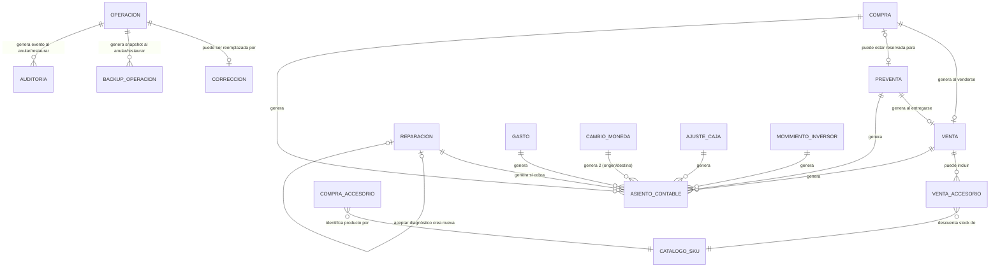

---

## 4. Módulos

### 4.1 Compras

**Objetivo de negocio:** registrar el ingreso de un equipo (celular) al inventario, propio o en consignación.

**Problema que resuelve:** dar de alta un activo vendible con toda la información necesaria para tasarlo, ofrecerlo y eventualmente venderlo, sin pasos administrativos adicionales.

**Entradas:** ver §3.1. El formulario alterna entre modo "EQUIPO" y modo "ACCESORIOS" (este último documentado en §4.5); son dos procesos de negocio independientes en una misma pantalla.

**Proceso completo:**
1. El operador elige el modo, completa los datos (ver §3.1), y si corresponde, marca que el equipo está vinculado a una preventa existente (el sistema le ofrece únicamente las preventas en estado "Esperando compra" no anuladas).
2. El sistema determina el estado inicial del equipo según la prioridad de 4 niveles descrita en §3.1.
3. Se genera el número correlativo, se guarda el registro con formato de fecha/moneda y un color de fondo distintivo según el estado.
4. Si está vinculada a una preventa, se actualiza esa preventa a estado "🟠 Comprado", registrando el vínculo en ambos sentidos (preventa→compra y compra→preventa).
5. Se recalcula el Stock, incorporando el equipo.
6. Se genera un asiento contable: EGRESO por el precio de compra si es tipo COMPRA; NEUTRO por monto 0 si es CONSIGNACIÓN (no hay egreso real hasta la venta).
7. El operador queda etiquetado como responsable de la operación y del asiento contable.

**Salidas:** registro de Compra, entrada en Stock, asiento(s) en Libro Diario, actualización de estado de la Preventa si corresponde.

**Eventos que dispara:** actualización de Stock; generación de asiento contable; (si aplica) actualización de estado de Preventa.

**Dependencias:** Configuración (prefijo de numeración, cotización); Preventas (para vinculación opcional); Operadores (etiquetado).

**Reglas:** ver listado consolidado en §6.

**Errores posibles:** modelo vacío; precio inconsistente con el tipo de ingreso (COMPRA sin precio de compra, o CONSIGNACIÓN sin precio acordado); columna de hoja faltante (error de integridad estructural); vínculo a preventa marcado sin preventa elegida.

**Casos especiales:** compra generada automáticamente al entregar una preventa sin equipo aún comprado (ver §4.4); compra que simultáneamente necesita reparación y está reservada para preventa (estado combinado de máxima prioridad).

### 4.2 Ventas

**Objetivo de negocio:** registrar la venta consumada de un equipo disponible en stock, calculando la ganancia real según el origen del equipo (propio o consignación) y distribuyendo el cobro entre los medios de pago utilizados.

**Problema que resuelve:** consumar una venta con cálculo automático de ganancia real (no solo teórica) y sin exigir que el operador prorratee manualmente el cobro cuando se venden accesorios junto con el equipo.

**Entradas:** ver §3.2.

**Proceso completo:**
1. El operador elige un equipo del listado de "En Stock" (único criterio de disponibilidad).
2. El sistema recupera de la Compra original el modelo, IMEI, tipo de origen y costo base.
3. Obtiene la cotización oficial vigente.
4. Prorratea el cobro total entre el celular y cada accesorio, en proporción al valor de cada ítem sobre el total de la operación.
5. Calcula ganancia teórica (precio pactado − costo base) y ganancia cobrada (lo efectivamente percibido del celular − costo base); el tipo de ganancia se llama "Comisión" si el origen es consignación, o "Ganancia directa" si es compra propia.
6. Guarda el registro de venta con estado "PROCESADA".
7. Marca la Compra original como "Vendido".
8. Recalcula Stock (el equipo deja de estar disponible).
9. Genera un asiento contable de INGRESO por cada medio de pago usado (uno por medio, nunca uno "mixto"); el monto en USD se registra como dólares reales.
10. Si se cargaron accesorios, cada uno se registra como una Venta de Accesorio independiente, con su porción prorrateada del cobro. Si falla el registro de algún accesorio, la venta del equipo ya confirmada **no se revierte** (falla parcial tolerada, con aviso).
11. Si corresponde (según configuración de regalos por familia de modelo), se dispara la entrega de un Regalo Automático — esto solo ocurre desde el flujo con operador, nunca desde el registro puro de venta.

**Salidas:** registro de Venta, Compra marcada "Vendido", Stock actualizado, asiento(s) contables, ventas de accesorios asociadas, eventualmente un regalo entregado.

**Eventos que dispara:** actualización de Stock; generación de asiento(s) contable(s); registro de ventas de accesorios asociadas; evaluación de regalo automático.

**Dependencias:** Compras (equipo de origen); Configuración (cotización); Ventas de Accesorios (si aplica); Regalos Automáticos; Operadores.

**Errores posibles:** número de compra no encontrado; descuadre entre total cobrado y total de la operación (bloquea el registro); columnas faltantes.

**Casos especiales:** venta con múltiples medios de pago simultáneos; venta de equipo en consignación (cambia terminología y fórmula de ganancia); falla parcial en el registro de accesorios asociados sin revertir la venta principal.

### 4.3 Preventas

**Objetivo de negocio:** reservar la venta futura de un modelo que el negocio no tiene físicamente, cobrando por adelantado.

**Problema que resuelve:** permitir vender "a pedido" sin comprometer el stock real ni inventar un equipo inexistente en el inventario.

**Entradas:** ver §3.3.

**Proceso completo:**
1. El operador completa cliente, modelo, vendedor, plazo de entrega (autocalculado 7-10 días hábiles, editable), precio pactado y el cobro inicial recibido (parcial o total).
2. Se valida que el total cobrado no supere el precio pactado.
3. Se genera el número correlativo, se calcula el saldo pendiente, y se guarda con estado inicial "🟡 Esperando compra".
4. Se genera un asiento de INGRESO en el Libro Diario por cada medio de pago con monto mayor a 0 (el USD se conserva como dólares reales).

**Salidas:** registro de Preventa; asiento(s) contable(s) por lo efectivamente cobrado.

**Eventos que dispara:** generación de asiento(s) contable(s). **No dispara actualización de Stock** — esta es una regla de negocio explícita y verificada: registrar una preventa nunca aumenta el stock de equipos.

**Dependencias:** Configuración (cotización, prefijo); Días Hábiles (cálculo del plazo de entrega prometido).

**Errores posibles:** cobro que supera el precio pactado; datos obligatorios faltantes (cliente, modelo, vendedor); rango de fechas de entrega inválido (Hasta anterior a Desde).

**Casos especiales:** ninguno de los medios de pago es obligatorio individualmente, pero el total cobrado debe ser mayor a 0 (a diferencia de Ventas, no se exige cobrar el 100%).

### 4.4 Entrega de Preventas

**Objetivo de negocio:** convertir una preventa reservada en una venta consumada y en la entrega física del equipo, cobrando el saldo pendiente.

**Problema que resuelve:** cerrar el círculo de una preventa sin duplicar el cobro ya percibido, permitiendo además que el equipo se compre recién en este momento si todavía no existía en stock.

**Entradas:** preventa a entregar (cualquier estado salvo "✅ Entregado" o "Cancelado"); cobro adicional por medio de pago; hasta 3 accesorios vendidos en el acto de entrega; si la preventa no tiene compra asociada, los datos mínimos del equipo (IMEI, costo, proveedor, fecha).

**Proceso completo:**
1. Se valida que la preventa exista, no esté cancelada ni ya entregada por completo.
2. Si no tiene compra asociada, se crea automáticamente una Compra con estado especial "🔵 Reservado Preventa" (no ofrecible a otro cliente) y se genera de inmediato el asiento de EGRESO correspondiente al costo del equipo.
3. Se calcula el máximo cobrable ahora = saldo pendiente + accesorios de esta entrega. Si el operador intenta cobrar más, se rechaza. Si corresponde cobrar algo y no se ingresó nada, se exige confirmación explícita para "entregar con deuda".
4. El cobro ingresado se prorratea entre el saldo del celular y cada accesorio.
5. Se calcula ganancia teórica y ganancia cobrada (acumulando lo cobrado en la preventa original + lo cobrado ahora).
6. Si ya existía una Venta previa para esta preventa (entrega parcial anterior), se **actualiza** esa misma fila (nunca se duplica); si es la primera entrega, se crea la Venta con estado "PREVENTA ENTREGADA".
7. La Compra asociada pasa a "✅ Vendido"; se recalcula Stock.
8. Se genera un asiento de INGRESO por cada medio de pago con monto mayor a 0, correspondiente exclusivamente a la porción atribuida al celular.
9. Se actualiza la Preventa: monto acumulado cobrado, saldo pendiente recalculado, y estado final: "🟢 Entregado con saldo" si queda saldo, o "✅ Entregado" si se saldó por completo.
10. Los accesorios de la entrega se registran como Ventas de Accesorios independientes, con su porción prorrateada.

**Salidas:** Compra generada o actualizada; Venta creada o actualizada; Preventa actualizada; asientos contables; ventas de accesorios asociadas.

**Eventos que dispara:** posible creación de Compra; creación/actualización de Venta; actualización de Stock; generación de asiento(s) contable(s); registro de ventas de accesorios; evaluación de regalo automático (desde el flujo con operador).

**Dependencias:** Preventas; Compras; Ventas; Stock; Libro Diario; Prorrateo de medios de pago.

**Reglas críticas verificadas:**
- **Entregar una preventa nunca vuelve a cobrar el monto ya percibido en la preventa original.** El sistema calcula el máximo cobrable como saldo pendiente, nunca el precio total.
- El sistema permite entregar el equipo dejando saldo pendiente ("deuda"), priorizando la entrega física sobre el cobro completo.

**Errores posibles:** intento de cobrar más del máximo permitido; preventa inexistente, cancelada o ya entregada; datos de compra faltantes cuando no hay compra vinculada.

**Casos especiales:** entregas parciales sucesivas sobre la misma preventa (actualizan la misma Venta en vez de duplicarla).

### 4.5 Compras de Accesorios

**Objetivo de negocio:** registrar el ingreso de mercadería de accesorios, permitiendo cargar varios productos en una sola operación.

**Problema que resuelve:** dar de alta stock de productos fungibles (no serializados como los equipos) con control de costos y creación automática de catálogo.

**Entradas:** ver §3.9.

**Proceso completo:**
1. El operador carga una o más líneas de producto.
2. Por cada línea, se calcula el costo total (cantidad × costo unitario) y se resuelve o crea el SKU correspondiente en el catálogo (protegido por un bloqueo de concurrencia de hasta 15 segundos, para evitar SKUs duplicados por compras simultáneas del mismo producto nuevo).
3. Se exige que el total pagado (Efectivo + Transferencia + USD convertido) coincida con el costo total calculado (tolerancia $1).
4. Se genera el número correlativo (una compra multilínea = varias filas con el mismo número).
5. Se recalcula el Stock de Accesorios completo.
6. Se genera un asiento contable por cada medio de pago utilizado.

**Salidas:** líneas de Compra de Accesorios; SKUs nuevos o reutilizados; Stock de Accesorios recalculado; asientos contables.

**Eventos que dispara:** creación/reutilización de SKU; recálculo íntegro de Stock de Accesorios; generación de asiento(s) contable(s).

**Dependencias:** Catálogo de Accesorios; Configuración (cotización); Libro Diario.

**Errores posibles:** ninguna línea con producto; línea con cantidad inválida; descuadre entre pago y costo total.

**Casos especiales:** esta operación no reutiliza el motor de Compras de equipos (es una implementación paralela deliberada, para no modificar el motor de compras protegido).

### 4.6 Ventas de Accesorios

**Objetivo de negocio:** registrar la venta de accesorios, sea de forma simple (una línea, sin control de stock por SKU) o multilínea (contra el catálogo, con control de stock y prorrateo).

**Problema que resuelve:** vender productos sueltos de mostrador o varios productos combinados en una sola operación de cobro.

**Dos flujos vigentes y distintos, no uno reemplazando al otro:**

**a) Venta simple** (por diálogo, texto libre, sin SKU): una línea por operación; no controla stock por SKU; calcula ganancia = cobrado − costo; genera asiento por cada medio.

**b) Venta multilínea** (Web App, contra catálogo por SKU):
1. Valida que cada línea tenga SKU y cantidad > 0.
2. Verifica stock disponible **acumulando** todas las líneas que pidan el mismo SKU (para no permitir que dos líneas del mismo producto superen en conjunto el stock real).
3. Calcula el valor total y exige que el cobro total coincida (tolerancia $1).
4. Prorratea los medios de pago entre las líneas.
5. Registra cada línea como fila independiente, recalcula Stock de Accesorios.

**Salidas:** registro(s) de Venta de Accesorio; Stock de Accesorios actualizado; asiento(s) contable(s) (solo en el flujo simple, ver riesgo abajo).

**Eventos que dispara:** recálculo de Stock de Accesorios; generación de asiento contable (flujo simple).

**Dependencias:** Catálogo/Stock de Accesorios; Configuración (cotización).

**Riesgo documentado** (ver también §10): la venta multilínea de accesorios **no** dispara Auditoría, Backup de Operación, Transacción ni actualización de Reportes — a diferencia de prácticamente todas las demás operaciones del sistema. Es una asimetría real de trazabilidad, no un error de lectura.

**Errores posibles:** SKU o cantidad inválidos; stock insuficiente acumulado; descuadre de cobro.

### 4.7 Stock (Equipos y Accesorios)

**Objetivo de negocio:** ofrecer una vista siempre actualizada de qué hay disponible para vender o en proceso, sin que nadie tenga que mantenerla manualmente.

**Problema que resuelve:** eliminar la posibilidad de vender algo que ya no existe, y dar visibilidad inmediata de inventario y su valorización.

**Proceso — Stock de Equipos:**
- Es una proyección exclusiva del campo Estado de Compras. Nunca se edita directamente.
- Dos modos de actualización: total (reconstruye todo desde cero, usado para el botón manual y validaciones) y puntual (actualiza/inserta/elimina solo la fila del equipo afectado, disparada automáticamente tras cada operación que lo afecta).
- "Días en Stock" se calcula como la diferencia entre hoy y la fecha de ingreso original de la compra.
- Codificación visual por color de fila según el estado (violeta = preventa+reparación, lila = reservado preventa, naranja = en reparación, celeste = en stock simple).

**Proceso — Stock de Accesorios:**
- Se recalcula íntegramente (nunca incrementalmente) cada vez que hay una compra o venta de accesorios: Catálogo + Compras no anuladas (costo promedio ponderado) − Ventas no anuladas.
- El costo/precio "vigente" es el de la compra más reciente por fecha; el costo promedio es ponderado histórico.
- Estado automático: Sin stock (≤0) / Bajo stock (por debajo del mínimo) / OK.
- Ubicación física es el único campo de mantenimiento manual, preservado en cada recálculo.

**Validación de consistencia** (herramienta manual de diagnóstico, no de negocio transaccional): verifica existencia de todas las hojas requeridas y parámetros de configuración clave, y cruza Compras vs. Ventas para detectar equipos vendidos en Ventas cuyo estado en Compras no dice "Vendido", o compras sin estado asignado.

**Eventos que dispara:** ninguno hacia afuera — es puramente receptor de eventos de otros módulos.

**Dependencias:** Compras; Compras/Ventas de Accesorios.

**Errores posibles:** hoja de Stock no encontrada (aborta silenciosamente el recálculo); columna faltante (error explícito).

### 4.8 Reparaciones

**Objetivo de negocio:** gestionar el ciclo completo de un equipo que ingresa para reparación o diagnóstico, desde el ingreso hasta la entrega, con presupuesto automático.

**Problema que resuelve:** cotizar de forma objetiva y consistente el costo de una reparación, y dar seguimiento a su estado sin perder el vínculo con el cobro real.

**Entradas:** ver §3.4.

**Proceso completo — ingreso:**
1. El operador completa cliente, equipo, fallas, y elige si es "Reparación" (con trabajos puntuales tildados) o "Diagnóstico" (falla desconocida, sin trabajos ni precio fijado).
2. Si no es diagnóstico, el sistema calcula el presupuesto: para cada trabajo tildado, busca primero un precio en el tarifario de un proveedor externo ("Icare") para ese modelo+categoría; si no existe, recurre al método propio (el descuento que esa misma parte tendría en la tabla de Toma de Equipos, multiplicado por un factor configurado por categoría); si ninguna fuente tiene dato, el trabajo queda "sin configurar" y no participa del precio total.
3. El precio total = suma de los trabajos con precio resuelto. El tiempo estimado = el máximo (no la suma) de horas entre los trabajos elegidos.
4. Si es diagnóstico, el precio queda "a confirmar" con una estimación fija de 48 horas, estado del presupuesto "PENDIENTE".
5. Se calcula una "Diferencia" (precio cobrado vs. calculado) puramente informativa — nunca impacta caja ni libro diario.
6. Se guarda el registro. **Solo si el precio cobrado es mayor a 0**, se genera un asiento de INGRESO (en efectivo o transferencia, priorizando efectivo si ambos tienen monto — ver inconsistencia en §10).

**Proceso completo — actualización de estado:** el operador elige una reparación abierta (no "Retirado") y el nuevo estado; "Listo" y "Retirado" registran automáticamente fecha de egreso; las observaciones se concatenan, no se sobreescriben. No dispara ningún asiento ni actualización de stock adicional.

**Proceso — presupuesto de diagnóstico (aceptar/rechazar):**
- **Rechazo:** solo cambia el campo del presupuesto a "RECHAZADO" y deja constancia en Auditoría. No crea operación nueva ni afecta caja/stock.
- **Aceptación:** se trata como una Corrección: el diagnóstico se anula (marcado primero "ACEPTADO", no como simple descarte) y se crea una reparación real en estado "PARA REPARAR", con precio cobrado deliberadamente en 0 (aceptar un presupuesto no es cobrar).

**Salidas:** registro de Reparación; presupuesto textual imprimible/enviable; asiento contable (si corresponde); etiqueta física.

**Eventos que dispara:** generación de asiento contable (solo si hay cobro); (en aceptación de diagnóstico) anulación + creación de reparación vía Corrección.

**Dependencias:** Toma de Equipos (fuente de valores base); CONFIG_REPARACIONES; TARIFARIO_ICARE; Días Hábiles (comunicación del plazo en días).

**Errores posibles:** falta cliente, equipo o falla principal; hoja o columna faltante.

**Casos especiales:** reingreso por garantía (🔄 Garantía); reparación de origen "Preventa" o "Interno" (clasificaciones de tipo, sin lógica diferenciada de cobro detectada en el frontend).

### 4.9 Garantías

**Estado real en la implementación actual:** no existe un módulo ni una entidad "Garantía" independiente en el sistema vigente. El concepto de garantía está embebido dentro de Reparaciones de dos formas:
1. Como uno de los cuatro valores posibles del campo "Tipo de reparación" (Particular / **Garantía** / Preventa / Interno) — clasifica el origen del ingreso, sin lógica de negocio diferenciada detectada más allá de la clasificación.
2. Como uno de los estados posibles del ciclo de vida de una reparación (🔄 Garantía), que representa el reingreso de un equipo por un reclamo sobre una reparación previa.
3. Como un texto fijo ("garantía de 90 días") impreso en el presupuesto/ticket de toda reparación no-diagnóstico, sin ningún campo de fecha de vencimiento, sin seguimiento automático de vigencia, y sin bloqueo si un cliente reclama fuera de ese plazo.

Existe evidencia (en la función histórica de migración `llenarNuevoSheet`, ver §3) de que un sistema predecesor tenía una hoja "GARANTÍAS" con Estado ("Abierto" por defecto) como entidad propia — pero el ERP actual no mantiene ni usa esa hoja en su operación diaria. **Para la migración, se recomienda decidir explícitamente si Garantías debe convertirse en una entidad de primera clase con fecha de vencimiento y trazabilidad propia**, ya que hoy es solo una etiqueta textual sin control automático (ver §11).

### 4.10 Clientes

**Estado real en la implementación actual:** no existe un módulo de Clientes, ni un catálogo, ni una entidad centralizada con historial. El nombre y el teléfono de un cliente se capturan como texto libre e independiente en cada operación de Venta, Preventa y Reparación — no hay deduplicación, no hay validación cruzada, no hay forma de ver "todo lo que compró tal cliente" sin buscar manualmente por texto en cada módulo.

Al igual que con Garantías, existe evidencia de una hoja "Clientes" en el sistema predecesor migrado (con campos Id, Tipo Cliente/Proveedor, Nombre, y flags de "es proveedor"/"es cliente"), pero el ERP actual no la mantiene activamente como parte de su flujo operativo. **Esta es una de las brechas funcionales más relevantes a resolver explícitamente en cualquier migración** (ver §10 y §11): cualquier plataforma nueva que aspire a mejorar sobre el sistema actual debería considerar introducir una entidad Cliente real, sin que eso implique alterar el comportamiento actual documentado en este informe (que es deliberadamente "cliente como texto libre por operación").

### 4.11 Gastos, Cambio de Moneda y Ajuste de Caja

Estos tres procesos comparten una misma pantalla (con pestañas) pero son módulos de negocio independientes entre sí, cada uno con su propia hoja de datos.

**Gastos** — ver §3.5 y §4 (proceso descrito allí): egreso operativo no vinculado a mercadería; admite combinación de tres medios de pago simultáneos; genera un asiento por cada medio con monto mayor a 0.

**Cambio de Moneda** — ver §3.6: conversión interna entre caja en dólares y caja en pesos. Reglas clave: la dirección se deriva de cuál lado es USD (nunca se declara aparte); el monto en pesos siempre se calcula en el servidor (nunca se acepta precalculado del cliente, para evitar manipulación); genera siempre exactamente dos asientos simultáneos (egreso en origen, ingreso en destino) bajo el mismo número de operación; la cotización usada puede diferir deliberadamente de la oficial del día (por ejemplo, si se cambió en una casa de cambio con otra cotización).

**Ajuste de Caja** — ver §3.7: corrección manual de una diferencia detectada en un arqueo. El motivo es obligatorio (a diferencia de la mayoría de los demás módulos, donde las observaciones son opcionales) — refleja que es una operación excepcional que siempre debe quedar justificada.

**Eventos que disparan los tres:** generación de asiento(s) contable(s); actualización de Reportes (en el caso de movimientos de caja en general).

**Dependencias:** Configuración (cotización); Libro Diario.

### 4.12 Caja

**Objetivo de negocio:** dar visibilidad del saldo disponible del negocio, discriminado por medio de pago y por moneda.

**Proceso:** el saldo de cada medio (Efectivo, Transferencia, USD, Cuotas) se calcula sumando/restando directamente, para ese medio específico, los montos de INGRESO/EGRESO del Libro Diario — **nunca** mediante un acumulado global mezclado entre medios (esto fue, según evidencia del propio sistema, la corrección de un bug histórico real). El saldo en USD se mantiene y se muestra siempre en dólares reales; su conversión a pesos es solo informativa y usa la cotización vigente al momento de la consulta, nunca un valor histórico. Los movimientos marcados como anulados se excluyen del cálculo, pero la fila nunca se borra.

**Movimiento manual de caja:** permite registrar Ingreso/Egreso/Transferencia con una categoría de una lista amplia predefinida (VENTA, COMPRA, SERVICIO TECNICO, RETIRO, INVERSOR, REPUESTOS, PAGO A PROVEEDORES, PRESTAMO, AJUSTE_POSITIVO, AJUSTE_NEGATIVO, DEVOLUCION, GASTO_EXTRA, TRANSFERENCIA_INTERNA, COMPRA_USD, VENTA_USD, SUELDO, IMPUESTO, OTROS), combinando varios medios de pago simultáneos, cada uno generando su propio asiento. Exige monto total mayor a 0 y descripción. Dispara automáticamente el recálculo de Reportes.

**Conciliación de saldos:** operación de solo lectura/informativa (no ajusta nada) que muestra los saldos actuales por medio para verificación rápida por parte del operador.

**Eventos que dispara:** generación de asiento(s) contable(s) (movimiento manual); recálculo de Reportes.

**Dependencias:** Libro Diario (fuente exclusiva del cálculo de saldo).

**Riesgo documentado** (ver §10): coexiste un mecanismo legado ("Anular Movimiento", desde el menú de hoja de cálculo) que solo oculta visualmente una fila del Libro Diario sin revertir efectos ni pasar por el sistema formal de anulaciones — una fila "anulada" por este camino seguiría contando en saldos y reportes.

### 4.13 Libro Diario

Ver descripción exhaustiva de la entidad en §3.14. Es el módulo/entidad más transversal del sistema: prácticamente todo módulo de captura genera al menos un asiento aquí.

**Reconstrucción completa del Libro Diario** (operación de mantenimiento, no de uso diario): recorre en orden cronológico Compras (tipo COMPRA con precio > 0), Ventas (excluyendo las que provienen de una entrega de preventa, para no duplicar el ingreso ya contabilizado en la preventa), Reparaciones (con cobro > 0), Gastos, Preventas (todo cobro > 0) y Movimientos de Caja manuales, regenerando el saldo corrido desde cero. **Esta operación borra primero el 100% de los asientos existentes y solo los regenera desde esas 6 fuentes — no es una reconstrucción íntegra**: Cambio de Moneda, Ajuste de Caja, Compras/Ventas de Accesorios y Movimientos de Inversor no forman parte de las fuentes recorridas, por lo que ejecutarla borra de forma permanente e irrecuperable el historial contable de esos cinco tipos de movimiento. **Riesgo documentado** (ver §10.1): además, esta reconstrucción no filtra explícitamente registros marcados como anulados en la mayoría de las fuentes que sí recorre (salvo el caso de ventas de preventa entregada) — debe verificarse con cuidado en la migración para no reincorporar montos de operaciones anuladas.

**Regla de negocio central:** el Libro Diario es la fuente de verdad contable — el saldo de caja del negocio se deriva de él, nunca de un cálculo paralelo independiente.

### 4.14 Mis Operaciones

**Objetivo de negocio:** dar a cualquier operador una vista unificada de todas las operaciones del sistema (no solo las propias, por defecto se muestran todas), con capacidad de ver el detalle completo, corregir, anular o consultar el historial de correcciones.

**Proceso:** el listado combina Compras, Ventas, Preventas, Reparaciones, Gastos, Compras/Ventas de Accesorios, Cambios de Moneda y Ajustes de Caja, excluyendo lo anulado, ordenado por el momento real de creación (no por la fecha de negocio, que solo tiene granularidad de día). Cada fila permite: Ver (detalle completo, incluyendo relaciones y asientos generados), Corregir (solo si el tipo lo admite y la operación no es ya el resultado de una corrección), Anular (siempre disponible, cualquier operador, exige motivo), Historial (solo si forma parte de una cadena de correcciones), y Etiqueta (solo Reparaciones, imprime etiqueta física).

Una segunda pestaña, "Operaciones Anuladas", es una vista puramente derivada (no una tabla propia) que combina el estado de registro, la Auditoría y las Correcciones para mostrar qué se anuló, por quién y por qué.

**Regla de negocio explícita y central de este módulo:** cualquier operación puede anularse o corregirse en cualquier momento, por cualquier operador — no existe restricción de "solo quien la creó puede tocarla" ni límite de tiempo. Toda acción queda registrada en Auditoría, Backups y Correcciones.

**Eventos que dispara:** invoca los mecanismos de Anulación y Corrección (ver §4.23).

**Dependencias:** prácticamente todos los módulos de captura; Auditoría; Correcciones; Backups.

### 4.15 Comisiones

**Objetivo de negocio declarado:** dar visibilidad de la actividad de cada operador para, eventualmente, determinar una comisión a pagar.

**Estado real:** el módulo **no calcula ningún monto de comisión en dinero** — es un tablero de indicadores agregados por operador: cantidad de ventas, facturación, ganancia, preventas, reparaciones, cantidad e importe de accesorios vendidos (excluyendo explícitamente los regalos automáticos, contados aparte), regalos entregados, y cantidad de correcciones/anulaciones realizadas por ese operador (indicador de calidad operativa). La fórmula real de comisión, si existe, no vive en el sistema — se calcula manualmente fuera de él a partir de estos indicadores.

**Dependencias:** Ventas, Preventas, Reparaciones, Ventas de Accesorios, Regalos, Correcciones, Anulaciones.

### 4.16 Dashboard

**Objetivo de negocio:** dar al dueño del negocio una foto instantánea del estado general sin recorrer módulo por módulo.

**Contenido:** equipos en stock y su valor invertido; stock de accesorios (cantidad, valor, alertas de bajo/sin stock); preventas por estado (esperando compra / comprado); reparaciones abiertas (todo lo que no sea "Retirado"); caja separada explícitamente en pesos (Efectivo+Transferencia+Cuotas) y en dólares (**nunca mezclados**, regla de negocio explícita); ventas y ganancia del mes calendario en curso (usando "Ganancia Cobrada" con preferencia sobre "Ganancia Neta" si ambas existen); indicadores del día agregados para todos los operadores (operaciones, ventas, ganancia, preventas, reparaciones).

**Dependencias:** todos los módulos de captura y Stock; es puramente de lectura, recalculado en cada consulta, sin tabla de indicadores materializada.

### 4.17 Reportes

**Objetivo de negocio:** consolidar en un bloque contable/comercial la información dispersa en las hojas fuente.

**Contenido — bloque base:** saldos por medio de pago; saldo total combinado (USD convertido); ventas totales; ingresos por reparaciones; egresos por compras; egresos por gastos; utilidad (ventas + reparaciones − compras − gastos).

**Contenido — bloque detallado** (subrutina interna del mismo proceso, no un proceso alternativo): cantidad y montos de ventas (pactado vs. cobrado, pesos + USD); ganancia teórica vs. ganancia cobrada; conteo de preventas por estado; accesorios vendidos (cantidad, facturación, ganancia); resumen por vendedor/operador.

**Regla de negocio:** todos los cálculos excluyen las filas marcadas como anuladas. Los Reportes nunca almacenan un valor manual persistente: cada actualización sobrescribe por completo el bloque calculado.

**Disparo:** existe un botón manual de "Actualizar Reportes"; además se dispara automáticamente después de un movimiento manual de caja. **Confirmado**: Reportes **no** se recalcula automáticamente tras una venta, compra, preventa, entrega, reparación o gasto — la única invocación automática del recálculo ocurre dentro del registro de un movimiento manual de caja; en todos los demás casos depende del botón manual. Esto es distinto del comportamiento de Dashboard, que sí es siempre en vivo (§4.16).

**Libro Diario reciente:** vista de consulta (no de recálculo) de los movimientos de las últimas 96 horas, con filtros por operador, origen, medio de pago y número de operación, calculando totales dinámicos sobre el conjunto ya filtrado.

**Conciliación de Saldos:** vista de solo lectura, sin efecto sobre los datos.

### 4.18 Auditoría

Ver descripción de la entidad en §3.15. **Objetivo de negocio:** dejar constancia permanente e inmutable de toda anulación y restauración ocurrida en el sistema, para responder siempre "quién anuló qué, cuándo y por qué".

**Regla de negocio central:** la auditoría nunca se edita ni se borra; toda fila es un evento histórico permanente.

**Alcance:** registra únicamente anulaciones/restauraciones (no la creación original de una operación, que es responsabilidad de cada módulo de captura).

### 4.19 Operadores

Ver descripción de la entidad en §3.20. **Objetivo de negocio:** dar trazabilidad de responsable sin necesidad de un sistema de login, en un contexto donde varias personas comparten los mismos dispositivos físicos.

**Mecanismo:** cada acción sensible (registrar una operación, anular, corregir) exige seleccionar explícitamente qué persona la ejecuta, de una lista fija; ese valor se propaga tanto al registro de negocio como al asiento contable relacionado. El sistema deliberadamente no persiste esta identidad entre acciones (no hay "sesión"), para no atribuir por error una acción a la última persona que usó el dispositivo.

**Regla de negocio central:** cualquier operador puede anular o corregir cualquier operación de cualquier otro operador, sin restricción de permisos ni de tiempo.

**Indicadores derivados:** operaciones del día por operador; resumen de comisiones (ver §4.15); conteo de correcciones y anulaciones "puras" (no las que forman parte de una corrección, para no contar dos veces el mismo evento) por operador, usado como medida de calidad operativa.

**Riesgo documentado** (ver §10): la lista de operadores válidos (Martin, Maca, Sam, Eva, Buda) está escrita directamente en varios archivos de interfaz en vez de leerse de una única fuente de configuración — riesgo de inconsistencia si el equipo de personas cambia.

### 4.20 Configuraciones

**Objetivo de negocio:** centralizar parámetros de negocio que cambian con el tiempo sin requerir modificar el comportamiento del sistema.

**Config (global):** pares clave-valor con prefijos de numeración por tipo de operación, nombres de hojas (permitiendo renombrarlas sin romper el sistema), cotización de dólar de respaldo (usada solo si la fuente externa en tiempo real falla), y la lista de inversores habilitados. Se cachea 60 segundos en memoria de ejecución para no releerse constantemente.

**Lista de Precios:** dato maestro cargado a mano (no calculado); precio de venta contado y de preventa por modelo, en pesos y en dólares, con descuentos asociados. **No existe ninguna fórmula automática de costo + margen en el ERP** — todo precio de venta es una decisión manual cargada en esta hoja.

**Toma de Equipos:** dato maestro con el "Precio Impecable" por modelo y ocho descuentos fijos por tipo de falla (Batería, Pantalla, Cámara, Micrófono, Parlante, Tapa Trasera, Marco, Pin de Carga) — fuente tanto para la calculadora de canje como (indirectamente) para el presupuesto de reparaciones.

**CONFIG_CUOTAS:** coeficientes de financiación por cantidad de cuotas, con indicadores de activo/visible al público.

**CONFIG_REPARACIONES:** multiplicador y horas estimadas por categoría de trabajo de reparación, con indicador de activo.

**CONFIG_REGALOS:** qué familia de modelos regala qué accesorio (funda/cable) al venderse.

**CONFIG_FERIADOS:** calendario de feriados usado exclusivamente para calcular el plazo de entrega de una preventa en días hábiles.

**TARIFARIO_ICARE:** lista de precios de un proveedor externo de repuestos, importada manualmente desde un archivo CSV/TXT, con una política de importación conservadora (se documenta en §4.22 y §6).

**Regla transversal:** toda búsqueda de un valor de configuración es tolerante a ausencia — si falta una fila o columna, el sistema recurre a un valor por defecto o deja el ítem "sin configurar", nunca rompe la operación completa por un dato de configuración faltante.

### 4.21 Inversores

Ver descripción de la entidad en §3.8. **Objetivo de negocio:** llevar la cuenta corriente de cada inversor externo que aporta capital al negocio, y calcular periódicamente el rendimiento que se le debe.

**Proceso de generación de rendimiento mensual:** ejecutado manualmente, por período, para todos los inversores configurados a la vez; calcula el rendimiento como capital × tasa mensual (20% por defecto); no permite duplicar el mismo período para el mismo inversor; **no genera asiento contable ni mueve caja** — solo deja constancia de que se "devengó" un rendimiento pendiente. El pago real es un movimiento separado (PAGO_RENDIMIENTO).

**Reglas:** un retiro de capital no puede superar el capital invertido actual; un pago de rendimiento no puede superar lo pendiente de pago; el pago de rendimiento no afecta el capital invertido, solo el acumulado pagado; todo movimiento se contabiliza siempre como medio "Transferencia" (limitación de diseño, no refleja necesariamente el medio real).

**Riesgo documentado** (ver §10 y §4.23): los movimientos de inversores se identifican por nombre de inversor, no por un número de operación único, lo cual impide al sistema de Anulaciones ubicar automáticamente y de forma unívoca el asiento contable puntual a revertir.

### 4.22 Regalos Automáticos

**Objetivo de negocio:** entregar automáticamente, sin cargo, un accesorio de regalo (típicamente funda y/o cable) al vender ciertos modelos de celular, según reglas comerciales configuradas.

**Proceso:**
1. Al confirmarse una venta o una entrega de preventa (solo desde el flujo con operador, nunca desde el registro puro), se determina la "familia" del modelo vendido buscando, dentro del texto libre del modelo, cuál familia configurada aparece como coincidencia (si varias coinciden, se prioriza la de nombre más largo/específico).
2. Se busca en el Stock de Accesorios un producto de la categoría correspondiente (funda o cable) que contenga el identificador de familia/tipo en su nombre.
3. Si existe y hay stock, se registra una Venta de Accesorio a precio $0 pero con el costo real (para que impacte en el costo/ganancia, sin cobrar al cliente), asociada al número de venta del celular.
4. Si no se encuentra el producto o no hay stock, **no se bloquea ni revierte la venta del celular**: se deja constancia en Auditoría de la omisión y se informa como advertencia al operador.

**Dependencias:** CONFIG_REGALOS; Stock de Accesorios; Ventas/Entrega de Preventas.

**Regla de negocio central:** un regalo entregado nunca cuenta como "venta de accesorio" a efectos de facturación o comisión — se cuenta en un indicador aparte, para no inflar artificialmente esos números con operaciones de importe $0.

### 4.23 Anulaciones y Correcciones

**Objetivo de negocio:** permitir revertir o reemplazar cualquier operación cargada por error, sin borrar nunca información y manteniendo trazabilidad completa.

Son dos mecanismos relacionados pero distintos:

**Anulación:** revierte los efectos de una operación existente (stock, caja, vínculos), marcándola con estado "ANULADO" (nunca se elimina la fila). Detalle por tipo de operación:

| Tipo | Efecto revertido | Restricción para anular |
|---|---|---|
| Compra | Equipo pasa a "Anulado"; recalcula Stock; si estaba reservada para una preventa activa, esta vuelve a "Esperando compra" | No se puede si el equipo ya está "Vendido" (anular primero la Venta) |
| Venta | Equipo vuelve a Stock con el estado que corresponda a su historial (reservado/en reparación/disponible); anula en cadena los accesorios vendidos junto al equipo (incluidos regalos automáticos) | — (advertencia: si venía de una preventa, los montos ya cobrados en la entrega **no se revierten automáticamente**, requiere revisión manual) |
| Preventa | Pasa a estado "Cancelado" | No se puede si ya fue entregada por completo, o si tiene Compra/Venta activa vinculada |
| Reparación / Gasto / Cambio de Moneda / Ajuste de Caja | Marca asientos y registro como anulados (sin relaciones cruzadas complejas) | — |
| Venta de Accesorio | Repone stock del SKU vendido | — |
| Compra de Accesorios | Repone/revierte líneas | No se puede si dejaría el stock del producto en negativo (deben anularse primero las ventas de ese producto) |
| Movimiento de Inversor | Marca el movimiento como anulado en Inversores | El asiento contable puntual no puede ubicarse automáticamente (se identifica por nombre, no por número) — requiere revisión manual del Libro Diario |

**Restauración:** operación inversa — reactiva estado, asientos y vínculos. No se puede restaurar una Venta si el equipo fue vendido nuevamente en otra operación mientras estaba anulada, ni si su operación relacionada (Compra/Preventa) sigue anulada.

**Corrección:** reemplaza una operación con datos incorrectos por una nueva con los datos correctos, dejando el vínculo explícito entre ambas. Mecanismo: (1) anula la original con motivo "Corrección: …"; (2) crea la nueva con los datos corregidos, pasando por el mismo circuito normal de alta (incluido el etiquetado de operador); (3) si la creación de la nueva falla, se **restaura automáticamente** la original para no dejar el negocio sin ningún registro de esa operación. Solo aplica a Compra, Venta, Preventa, Reparación y Gasto. Una operación que ya es resultado de una corrección no puede volver a corregirse (no se admiten cadenas de corrección sobre una corrección) — sí puede anularse normalmente.

**Regla de negocio central y no negociable:** cualquier operador puede anular o corregir cualquier operación, de cualquier tipo, en cualquier momento — no hay restricción de "solo mis operaciones" ni límite de tiempo desde la carga. Toda acción exige un motivo obligatorio y queda registrada en Auditoría, Backup de Operación y (si es corrección) en la hoja de Correcciones.

**Dependencias:** Auditoría; Backups de Operación; Transacciones; Stock; Libro Diario; el módulo de negocio original correspondiente.

### 4.24 Backups de Operación

Ver descripción de la entidad en §3.17. **Objetivo de negocio:** conservar una "foto" recuperable de cómo estaba todo justo antes de anular o restaurar cualquier operación, como capa de seguridad adicional a la reversión automática.

**Regla de negocio:** el backup nunca bloquea la operación de negocio aunque falle su generación (por ejemplo, por exceder el límite de tamaño de una celda) — se deja constancia del fallo, pero la anulación/restauración sigue su curso. Los backups nunca se borran (histórico acumulativo) y pueden consultarse en formato legible por número de operación.

**Distinto de:** los backups completos de hoja que se generan automáticamente antes de un Reinicio del Sistema (ver §4.26 y §10) — son mecanismos separados con propósitos distintos (uno protege una operación puntual, el otro protege toda una hoja antes de vaciarla).

### 4.25 Transacciones

Ver descripción de la entidad en §3.16. **Objetivo de negocio:** detectar si una anulación o restauración se cortó a mitad de camino (por un límite técnico de la plataforma, un error de red, etc.), ya que la plataforma subyacente no ofrece operaciones atómicas nativas.

**Proceso:** antes de tocar cualquier dato, se escribe una fila con estado "INICIO" forzada a quedar grabada; al terminar (bien o mal) se actualiza a "OK", "ERROR" o "ABORTADA", con duración y detalle de error. Existe una utilidad para listar transacciones que no llegaron a "OK" (candidatas a requerir diagnóstico manual), y otra para que un operador marque explícitamente como "ABORTADA" una transacción que decide no reintentar.

**Concurrencia:** toda anulación/restauración se serializa con un bloqueo de hasta 30 segundos, para que dos anulaciones simultáneas nunca lean/escriban sobre los mismos datos en paralelo.

### 4.26 Estado ERP y Salud ERP

**Objetivo de negocio:** autodiagnosticar periódicamente la integridad del sistema, detectando inconsistencias que ninguna validación en el momento de la carga pudo haber prevenido.

**Diagnóstico de una operación puntual** (manual, bajo demanda): reconstruye el estado real de una operación y de todo lo relacionado, comparando siempre el estado técnico de registro (nunca el texto de negocio, que puede desincronizarse), señalando combinaciones imposibles (por ejemplo, "stock huérfano": una compra activa reservada para una preventa ya anulada).

**Health Check automático** (corre diariamente, además de poder ejecutarse manualmente): recorre Compras, Ventas, Preventas, Libro Diario, Inversores y Cambios de Moneda buscando: compras activas reservadas para preventas anuladas; compras "Vendido" sin venta activa asociada; ventas activas sobre compras anuladas o inexistentes; ventas asociadas a preventas anuladas; preventas con referencias rotas o estado textual desincronizado de sus referencias reales; asientos del Libro Diario que referencian operaciones inexistentes o ya anuladas; movimientos de inversores anulados no conciliables automáticamente; cambios de moneda donde el monto en pesos ya no coincide matemáticamente con USD × cotización (indicio de edición manual posterior).

**Clasificación de hallazgos:** INFO / WARNING / ERROR / CRITICAL, acumulados (nunca borrados) en un historial de salud, permitiendo ver la evolución en el tiempo.

**Estado ERP:** una única fila que se sobrescribe en cada corrida con la foto más reciente (semáforo general OK/WARNING/ERROR/CRITICAL, cantidad de errores/warnings/transacciones incompletas) — es lo que ve el usuario como resumen de salud del sistema.

**Regla de negocio central:** el Health Check nunca corrige nada por sí mismo — solo detecta y reporta para revisión humana.

---

## 5. Eventos del sistema

Esta sección mapea, para cada operación de negocio, la cadena completa de efectos que dispara en el resto del sistema.

### 5.1 Registrar Compra

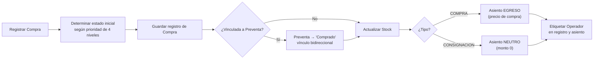

### 5.2 Registrar Venta

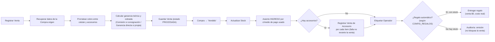

### 5.3 Registrar Preventa


*(La flecha punteada indica explícitamente que este evento NO ocurre: registrar una preventa nunca actualiza el stock de equipos.)*

### 5.4 Entregar Preventa

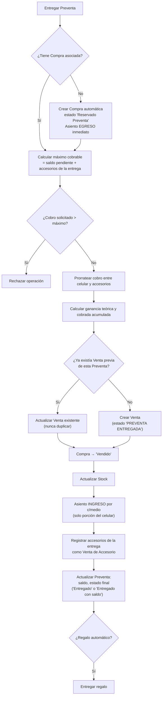

### 5.5 Registrar Reparación

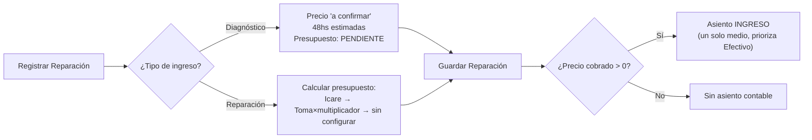

### 5.6 Aceptar Presupuesto de Diagnóstico

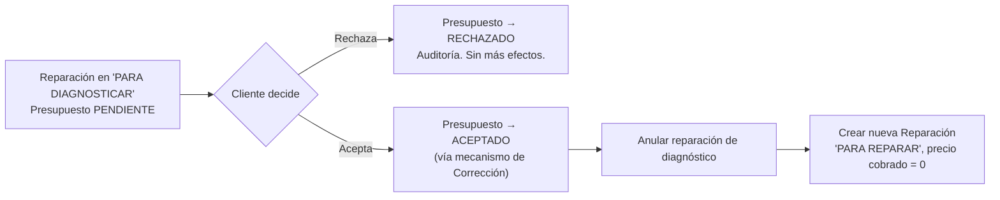

### 5.7 Registrar Gasto / Cambio de Moneda / Ajuste de Caja

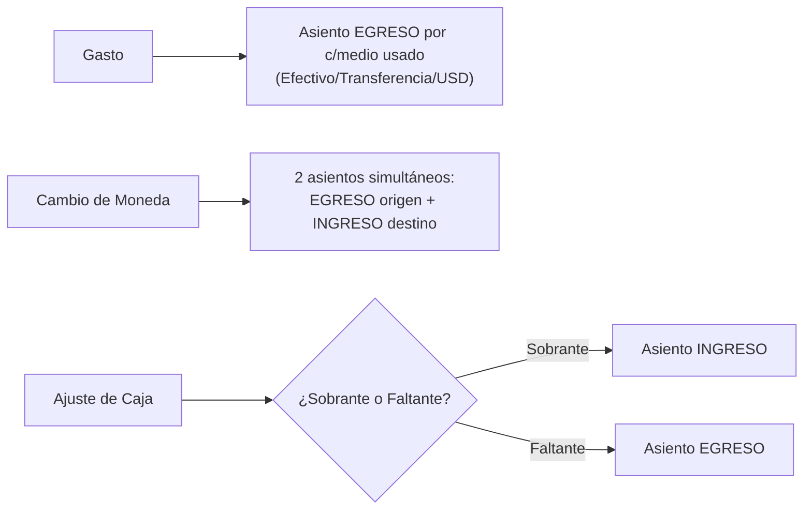

### 5.8 Movimiento de Inversor

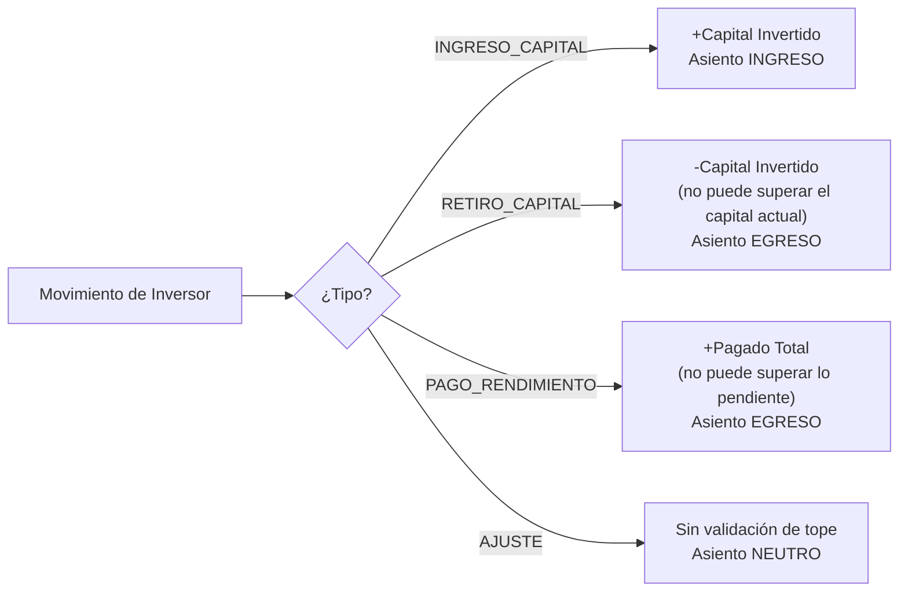

### 5.9 Compra y Venta de Accesorios

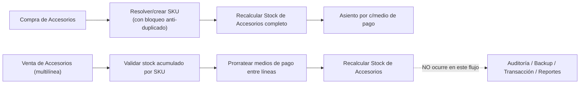

### 5.10 Anulación de una operación (genérico)

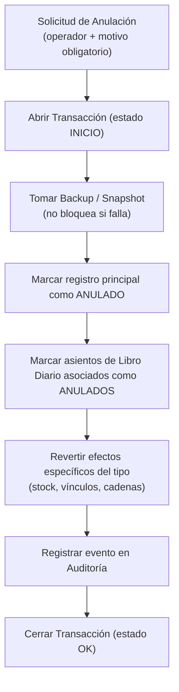

### 5.11 Corrección de una operación (genérico)

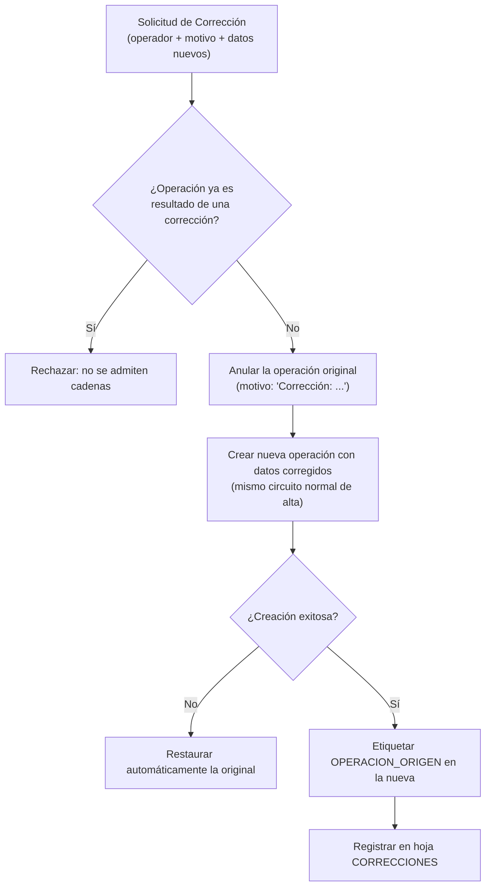

### 5.12 Health Check Automático (diario)

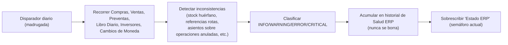

---

## 6. Reglas de negocio

> Lista consolidada y exhaustiva de todas las reglas de negocio verificadas en el sistema, organizadas por área. Los números no implican prioridad.

### 6.1 Reglas transversales (aplican a todo el sistema)

1. Ninguna anulación borra información: todo se marca con estado, nunca se elimina una fila.
2. Las celdas de estado de registro vacías se consideran ACTIVAS por convención (compatibilidad con datos históricos previos a la instalación del sistema de anulaciones).
3. Toda búsqueda de datos se hace por nombre de columna, nunca por posición fija.
4. Si falta una columna esperada, la operación se aborta con un error explícito, nunca se ejecuta parcialmente.
5. Toda conversión de USD a pesos usa la cotización de "venta", nunca la de "compra".
6. La cotización oficial se obtiene de una fuente externa en tiempo real con caché de 5 minutos y un mecanismo de respaldo en cascada (config → valor fijo de emergencia) para que el sistema nunca quede bloqueado por falta de cotización.
7. Los montos en dólares se preservan siempre como dólares reales en caja y Libro Diario; la conversión a pesos es solo informativa en observaciones, nunca reemplaza el monto real.
8. Todo movimiento de valor con múltiples medios de pago genera un asiento contable independiente por cada medio con monto mayor a 0 (nunca un asiento "mixto"), con la única excepción documentada de Reparaciones (ver §10).
9. Los números de operación son correlativos únicos con prefijo configurable y numeración secuencial; no requieren un contador persistido — se calculan a partir de la primera fila libre de la hoja.
10. Cualquier operador puede anular o corregir cualquier operación de cualquier otro operador, sin restricción de tiempo ni de "propiedad" de la operación.
11. Toda anulación o corrección exige un motivo obligatorio y queda registrada en Auditoría, Backup de Operación y (si es corrección) en la hoja de Correcciones.
12. Una operación que ya es resultado de una corrección no puede volver a corregirse (no se admiten cadenas de corrección sobre una corrección), pero sí puede anularse.
13. Toda anulación/restauración toma un backup completo ("foto antes") antes de tocar cualquier dato; el backup nunca bloquea la operación de negocio aunque falle su generación.
14. Las anulaciones y restauraciones se serializan con un bloqueo de concurrencia para evitar condiciones de carrera entre operaciones simultáneas.
15. Toda anulación/restauración se registra como una transacción con inicio y fin, para poder detectar ejecuciones que se cortaron a mitad de camino.
16. El diagnóstico y el Health Check siempre comparan el estado técnico de registro, nunca el campo de texto libre de negocio, porque este último puede desincronizarse.
17. El Health Check automático nunca corrige nada por sí mismo — solo detecta y reporta para revisión humana.
18. No existe control de permisos por rol a nivel de menú/interfaz: cualquier persona con acceso puede ejecutar cualquier operación, incluidas las destructivas.
19. Todos los montos calculados por el sistema (valor de toma, presupuestos, cuotas, prorrateos) se redondean al entero más cercano.

### 6.2 Compras

20. Una compra de tipo COMPRA exige precio de compra mayor a 0; una de tipo CONSIGNACIÓN exige precio acordado mayor a 0; son mutuamente excluyentes.
21. Una compra en consignación no genera egreso de caja al momento del ingreso del equipo (el pago ocurre recién al venderse).
22. Toda compra actualiza el Stock inmediatamente al registrarse.
23. El estado de una compra sigue prioridad estricta: Preventa+Reparación > Reservado Preventa > En Reparación > En Stock.
24. Una compra puede vincularse opcionalmente a una preventa existente en el momento de su creación.
25. No se puede anular una compra si el equipo ya figura "Vendido" (debe anularse primero la venta).
26. Al anular una compra reservada para una preventa activa, esa preventa vuelve automáticamente a "Esperando compra".

### 6.3 Ventas

27. Solo pueden venderse equipos en estado exactamente "En Stock".
28. El total cobrado (todos los medios, USD convertido) debe igualar el total de la operación (celular + accesorios), con tolerancia de $1.
29. El cobro de una venta con accesorios se prorratea proporcionalmente entre el celular y cada accesorio según su peso en el valor total.
30. La ganancia se llama "Comisión" si el equipo era en consignación, "Ganancia directa" si era compra propia; el costo base cambia según el mismo criterio.
31. Se distingue siempre ganancia teórica (según precio pactado) de ganancia cobrada (según medios efectivamente percibidos).
32. Al confirmarse una venta, el equipo se marca "Vendido" y deja de estar disponible en Stock.
33. Si falla el registro de un accesorio asociado a una venta, la venta del equipo principal ya confirmada no se revierte.
34. Al anular una venta, el equipo vuelve automáticamente a Stock con el estado que corresponda a su historial, y se anulan en cadena los accesorios vendidos junto con él (incluidos regalos automáticos).
35. Si la venta anulada provenía de una preventa, los montos ya cobrados en la entrega no se revierten automáticamente — requiere revisión manual explícita.
36. No se puede restaurar una venta si el equipo fue vendido nuevamente en otra operación mientras estaba anulada.

### 6.4 Preventas y Entrega de Preventas

37. Una preventa no puede cobrar más de lo pactado (tolerancia de centavos por redondeo).
38. Una preventa exige cliente, modelo, vendedor y al menos un cobro mayor a 0 para registrarse (a diferencia de Ventas, no exige cobrar el total).
39. El rango de fecha de entrega prometida "Desde" no puede ser posterior a "Hasta"; se sugiere automáticamente entre 7 y 10 días hábiles desde la fecha de la preventa.
40. Registrar una preventa nunca afecta el stock de equipos.
41. Una preventa nace siempre en estado "Esperando compra".
42. Una preventa nunca puede entregarse dos veces (rechazo si ya está "Entregado").
43. Una preventa cancelada no puede entregarse.
44. El cobro en el momento de la entrega nunca puede superar el máximo que corresponde (saldo pendiente + accesorios de la entrega); si se intenta cobrar de más, se rechaza la operación.
45. Si corresponde cobrar algo en la entrega y no se ingresa ningún cobro, el sistema exige confirmación explícita para permitir la entrega "a cuenta"/con deuda — no lo bloquea, pero tampoco lo permite silenciosamente.
46. Si una preventa ya generó una venta previa (entrega parcial anterior), la siguiente entrega de saldo actualiza esa misma venta, nunca crea un duplicado.
47. Un equipo comprado automáticamente al entregar una preventa nace en estado especial "Reservado Preventa", para impedir que se ofrezca a otro cliente.
48. La vinculación Preventa–Compra es bidireccional (registrada en ambos sentidos).
49. No se puede anular una preventa si ya fue entregada por completo o si tiene una compra/venta activa vinculada.

### 6.5 Reparaciones

50. Una reparación exige cliente, equipo y falla principal para poder registrarse.
51. El presupuesto automático es informativo/comparativo; solo el "Precio Cobrado" real genera movimiento contable.
52. Una reparación sin cobro (monto = 0) no genera ningún asiento contable.
53. El estado "Retirado" es terminal y excluye la reparación de la lista de reparaciones abiertas.
54. Solo los estados "Listo" y "Retirado" registran automáticamente la fecha de egreso.
55. En una reparación marcada explícitamente "a diagnóstico", nunca se calcula precio ni se consideran los trabajos tildados: precio "a confirmar", estimación fija de 48 horas.
56. El precio de cada trabajo se resuelve primero contra el tarifario de un proveedor externo (Icare); solo si este no cubre el modelo/categoría se recurre al método propio (descuento de Toma × multiplicador configurado).
57. Un trabajo configurado como "Activo = NO" no puede cotizarse.
58. El tiempo estimado de un presupuesto con múltiples trabajos es el máximo (no la suma) de horas entre los trabajos elegidos.
59. Rechazar un presupuesto de diagnóstico no crea ninguna operación nueva ni afecta stock, caja o Libro Diario.
60. Aceptar un presupuesto de diagnóstico se trata como una corrección: se anula el diagnóstico (marcado "ACEPTADO") y se crea una reparación real con precio cobrado en 0 (aceptar un presupuesto no es cobrar).
61. La garantía de toda reparación (no diagnóstico) es fija de 90 días.

### 6.6 Gastos, Cambio de Moneda y Ajuste de Caja

62. El monto total de un gasto debe ser mayor a cero; admite combinación simultánea de efectivo, transferencia y dólares.
63. Si se declara un monto total esperado de un gasto, debe coincidir (tolerancia $1) con la suma real de los medios de pago.
64. Un cambio de moneda solo puede ser entre una caja en pesos (Efectivo o Transferencia) y la caja USD; nunca entre dos cajas en pesos ni USD-USD.
65. La dirección de un cambio de moneda se deriva de cuál lado es USD, nunca se declara de forma independiente.
66. El monto en pesos de un cambio de moneda siempre se calcula en el servidor, nunca se acepta precalculado del cliente.
67. Un cambio de moneda es atómico: siempre genera exactamente dos asientos contables (egreso en origen, ingreso en destino) bajo el mismo número de operación.
68. La cotización usada en un cambio de moneda puede diferir deliberadamente de la oficial del día.
69. Un ajuste de caja exige un motivo obligatorio.
70. Un ajuste "Sobrante" siempre genera ingreso; un "Faltante" siempre genera egreso.

### 6.7 Inversores

71. No se puede retirar de un inversor más capital del que tiene invertido actualmente.
72. No se puede pagar a un inversor más rendimiento del que tiene pendiente de pago.
73. El pago de rendimiento no modifica el capital invertido, solo el acumulado pagado.
74. No puede generarse rendimiento mensual duplicado para el mismo inversor en el mismo período.
75. El rendimiento mensual generado queda "Pendiente" hasta que se registre su pago como movimiento separado; generarlo no mueve caja.
76. Todo movimiento de inversor se contabiliza siempre como medio "Transferencia".

### 6.8 Accesorios (Compra y Venta)

77. Una compra de accesorios debe tener al menos una línea con producto y cantidad mayor a 0.
78. El total pagado de una compra de accesorios debe coincidir (±$1) con el costo total calculado; si no, se rechaza toda la operación.
79. Una compra de accesorios no puede anularse si dejaría el stock del producto en negativo.
80. Una venta multilínea de accesorios valida el stock disponible acumulando todas las líneas que pidan el mismo SKU, no línea por línea de forma aislada.
81. El total cobrado en una venta multilínea debe coincidir (±$1) con el valor total de las líneas; los medios de pago se prorratean proporcionalmente.
82. Un producto de accesorio se identifica únicamente por la combinación normalizada Categoría+Producto+Marca+Color; combinaciones idénticas comparten el mismo SKU.
83. La creación de un SKU nuevo está protegida por bloqueo de concurrencia para evitar duplicados por compras simultáneas del mismo producto nuevo.
84. El stock de accesorios se recalcula íntegramente (no incrementalmente) a partir de catálogo + compras no anuladas − ventas no anuladas.
85. El costo/precio "vigentes" de un producto son los de su compra más reciente por fecha; el costo promedio es ponderado por todo el histórico.
86. El campo "Ubicación" del stock de accesorios es de mantenimiento manual exclusivo, preservado en cada recálculo.

### 6.9 Regalos Automáticos

87. Los regalos automáticos se determinan por coincidencia de texto entre el modelo vendido y la "familia" configurada, priorizando el nombre más largo/específico que coincida.
88. La entrega de un regalo automático nunca cobra al cliente (precio $0) pero sí impacta el costo/ganancia con el costo real del accesorio.
89. La falta de stock para un regalo automático no bloquea ni revierte la venta del equipo; solo se deja constancia en auditoría y se advierte al operador.
90. Los regalos automáticos solo se disparan desde los flujos de venta "con operador" (post-registro), nunca desde el registro puro.
91. Un regalo entregado nunca cuenta como "venta de accesorio" a efectos de facturación o comisión.

### 6.10 Caja, Libro Diario y Reportes

92. El saldo de caja de cada medio de pago se calcula sumando directamente los montos de INGRESO y restando los de EGRESO del Libro Diario para ese medio específico, nunca mediante un acumulado global mezclado entre medios.
93. El saldo corrido del Libro Diario se calcula en cadena: cada asiento nuevo parte del saldo final del asiento anterior.
94. Un asiento tipo INGRESO suma al saldo, uno EGRESO resta, uno NEUTRO no lo modifica.
95. El saldo de caja en pesos y el saldo de caja en dólares nunca se suman ni se mezclan en ningún indicador.
96. Un movimiento manual de caja requiere al menos un monto mayor a 0 y una descripción obligatoria.
97. Todos los cálculos de Reportes excluyen las filas marcadas como anuladas.
98. Los Reportes nunca almacenan un valor manual persistente; cada actualización sobrescribe por completo el bloque calculado.
99. La ganancia del mes en el Dashboard prioriza "Ganancia Cobrada" sobre "Ganancia Neta" cuando ambas están disponibles.

### 6.11 Operadores y trazabilidad

100. Toda operación creada desde la aplicación web queda asociada a un operador, tanto en su hoja de origen como en el asiento del Libro Diario.
101. La fecha de creación real (timestamp) de una fila se completa una sola vez y nunca se sobreescribe en retagueos posteriores.
102. El sistema no confía en un operador de sesión fijo por dispositivo: cada acción sensible vuelve a exigir seleccionar explícitamente qué persona la ejecuta.
103. Las filas anuladas se excluyen de todos los listados operativos, indicadores y resúmenes de comisiones.
104. Una anulación que forma parte de una corrección no se cuenta también como "anulación pura" a efectos de indicadores de desempeño por operador.

### 6.12 Calculadoras y herramientas de cotización

105. El valor de toma de un equipo usado = precio impecable − suma de descuentos de las fallas marcadas, con piso en cero (nunca negativo).
106. Ninguna calculadora (valor de toma, presupuesto de reparación, cuotas) registra una operación de negocio ni genera asiento contable por sí sola — son herramientas de cotización previas al registro real.
107. El precio de canje = precio de venta del equipo elegido (contado o preventa, según el tipo de venta) menos el valor de toma calculado; puede ser negativo.
108. Los coeficientes de cuotas se leen en vivo desde la configuración; una opción puede seguir calculándose internamente aunque esté marcada para no mostrarse al público.
109. Una fila de configuración repetida (mismo tipo de trabajo o misma cantidad de cuotas) nunca genera error: se conserva silenciosamente solo la primera definición encontrada.

### 6.13 Tarifario de proveedor externo (Icare)

110. Si el proveedor lista varias variantes de precio para el mismo modelo+categoría, se usa siempre la más cara (criterio conservador para no subpresupuestar).
111. El "Precio Público" de un repuesto Icare = Precio Guía del proveedor × 1.20, redondeado al peso entero.
112. Cada importación del tarifario reemplaza el contenido completo de la hoja — no es incremental.
113. Si el archivo de importación trae menos combinaciones modelo+categoría que las ya cargadas, el sistema exige confirmación explícita antes de reemplazar (protección contra archivos parciales o corruptos).
114. El matching de modelo sigue una cascada estricta (exacto → normalizado sin capacidad → exacto de nuevo) sin aproximaciones de texto libre; sin match, la categoría queda "sin configurar".

### 6.14 Días hábiles

115. Un día hábil excluye sábados, domingos y cualquier fecha cargada como feriado en la configuración.
116. La fecha estimada de entrega de una preventa debe caer entre 7 y 10 días hábiles posteriores a su registro.
117. La validación del plazo de entrega se aplica tanto en el frontend (días deshabilitados en el calendario) como, de forma independiente y obligatoria, en el backend.

### 6.15 Reinicio del sistema

118. Ningún bloque de reinicio del ERP borra estructura (hojas, encabezados, formatos, validaciones, fórmulas, protecciones) — solo vacía contenido de filas de datos.
119. El reinicio de Inversores conserva siempre el capital inicial y la estructura de paneles por inversor; solo elimina movimientos.
120. El reinicio de Operaciones nunca toca el Catálogo de Accesorios ni la configuración de Regalos, por ser datos maestros/configuración.
121. Ningún bloque de reinicio toca nunca "Lista de Precios" ni "Toma de Equipos".
122. No hace falta resetear ningún contador de numeración correlativa: al quedar vacía una hoja, el próximo número vuelve a arrancar en 001 automáticamente.
123. El reinicio completo del sistema (versión que respalda hojas enteras) genera automáticamente un backup completo de cada hoja operativa antes de borrar nada, y requiere confirmación explícita del usuario.

---

## 7. Dependencias entre módulos

### 7.1 Mapa de dependencias

```mermaid
flowchart TD
    Config["Configuración global"] --> Compras
    Config --> Ventas
    Config --> Preventas
    Config --> Reparaciones
    Config --> Gastos
    Config --> AccesoriosMod["Accesorios (compra/venta)"]

    ListaPrecios["Lista de Precios"] --> Ventas
    ListaPrecios --> Preventas
    TomaEquipos["Toma de Equipos"] --> Reparaciones
    TomaEquipos --> CalcToma["Calculadora de Toma / Canje"]
    ConfigReparaciones["CONFIG_REPARACIONES"] --> Reparaciones
    TarifarioIcare["TARIFARIO_ICARE"] --> Reparaciones
    ConfigCuotas["CONFIG_CUOTAS"] --> Calculadoras["Calculadora de Cuotas"]
    ConfigRegalos["CONFIG_REGALOS"] --> Regalos
    ConfigFeriados["CONFIG_FERIADOS"] --> DiasHabiles["Motor de Días Hábiles"]
    DiasHabiles --> Preventas

    Compras --> Stock
    Compras --> Preventas
    Preventas --> EntregaPreventa["Entrega de Preventa"]
    Compras --> Ventas
    EntregaPreventa --> Compras
    EntregaPreventa --> Ventas
    Ventas --> Stock
    Ventas --> VentaAcc["Venta de Accesorios"]
    Ventas --> Regalos
    EntregaPreventa --> Regalos
    Regalos --> StockAcc["Stock de Accesorios"]
    CompraAcc["Compra de Accesorios"] --> Catalogo["Catálogo SKU"]
    CompraAcc --> StockAcc
    VentaAcc --> StockAcc
    VentaAcc --> Catalogo

    Compras --> LibroDiario
    Ventas --> LibroDiario
    Preventas --> LibroDiario
    Reparaciones --> LibroDiario
    Gastos --> LibroDiario
    CambioMoneda --> LibroDiario
    AjusteCaja --> LibroDiario
    Inversores --> LibroDiario
    CompraAcc --> LibroDiario
    VentaAcc -.->|"solo flujo simple"| LibroDiario

    LibroDiario --> Caja
    LibroDiario --> Reportes
    LibroDiario --> Dashboard

    Operadores --> Compras
    Operadores --> Ventas
    Operadores --> Preventas
    Operadores --> EntregaPreventa
    Operadores --> Reparaciones
    Operadores --> Gastos
    Operadores --> Comisiones
    Operadores --> MisOperaciones["Mis Operaciones"]

    MisOperaciones --> Anulaciones
    Anulaciones --> Auditoria
    Anulaciones --> Backups
    Anulaciones --> Transacciones
    Anulaciones --> Stock
    Anulaciones --> LibroDiario
    Anulaciones --> Correcciones
    Correcciones --> Anulaciones

    SaludERP["Salud ERP"] --> Compras
    SaludERP --> Ventas
    SaludERP --> Preventas
    SaludERP --> LibroDiario
    SaludERP --> Inversores
    SaludERP --> CambioMoneda
```

### 7.2 Qué depende de qué (resumen textual)

- **Stock (equipos) depende exclusivamente de Compras.** No tiene existencia propia: es un espejo de Compras filtrado por estado. Si Compras se rompe, Stock se rompe.
- **Stock de Accesorios depende de Compras de Accesorios, Ventas de Accesorios y el Catálogo SKU.**
- **Libro Diario depende de absolutamente todos los módulos de captura**, salvo la venta de accesorios multilínea (brecha documentada, ver §10). Si el Libro Diario falla silenciosamente (por ejemplo, hoja no encontrada), la operación de negocio igual se completa, pero queda sin respaldo contable.
- **Caja, Reportes y Dashboard dependen exclusivamente del Libro Diario** — no leen las hojas de operaciones directamente para calcular saldos.
- **Ventas depende de Compras** (siempre referencia una compra existente) y puede depender de Preventas (si la venta nace de una entrega).
- **Entrega de Preventa depende de Preventas, y puede generar una Compra y una Venta en la misma operación.**
- **Reparaciones depende de Toma de Equipos, CONFIG_REPARACIONES y TARIFARIO_ICARE** para calcular presupuesto, pero puede registrarse sin ninguna de esas fuentes (el trabajo queda "sin configurar").
- **Regalos Automáticos depende de CONFIG_REGALOS y Stock de Accesorios**, y se dispara desde Ventas y Entrega de Preventa.
- **Anulaciones/Correcciones dependen de y modifican Stock y Libro Diario**, y generan registros en Auditoría, Backups y Transacciones.
- **Mis Operaciones depende de todos los módulos de captura** para su listado unificado, y de Auditoría/Correcciones para las vistas de historial.
- **Comisiones depende de Ventas, Preventas, Reparaciones, Ventas de Accesorios, Regalos, Correcciones y Anulaciones** — es puramente agregador, no fuente.
- **Salud ERP depende de Compras, Ventas, Preventas, Libro Diario, Inversores y Cambio de Moneda** — solo lee, nunca escribe en esos módulos.
- **Inversores es el módulo más aislado**: no depende de ningún otro módulo de captura, pero su integración con Libro Diario/Anulaciones es débil (identificación por nombre, no por número de operación).

### 7.3 Qué puede romper a qué

- Un error de configuración (nombre de hoja incorrecto, columna faltante) en **Config** puede bloquear cualquier módulo de captura que dependa de esos parámetros.
- Un fallo silencioso en **Libro Diario** (hoja no encontrada) no bloquea la operación de negocio, pero deja "invisible" ese movimiento a Caja, Reportes y Dashboard — riesgo de descuadre contable no detectado hasta el próximo Health Check.
- Un fallo en **Stock** al recalcularse tras una operación deja el inventario visualmente desactualizado sin afectar el registro de negocio subyacente (los datos reales siguen en Compras/Ventas), pero puede llevar a decisiones erróneas (ofrecer un equipo ya vendido).
- Anular una **Compra** vinculada a una **Preventa** o **Venta** activas está bloqueado por diseño — el sistema no permite dejar esas relaciones rotas.
- Anular un **Movimiento de Inversor** no puede revertir automáticamente su asiento contable específico — puede dejar el Libro Diario desalineado hasta una revisión manual.
- La **Venta de Accesorios multilínea** (web) no pasa por Auditoría/Backup/Transacciones — un error ahí no deja el mismo nivel de rastro de recuperación que el resto del sistema.

### 7.4 Módulos independientes

- **Configuraciones** (Lista de Precios, Toma de Equipos, CONFIG_*, TARIFARIO_ICARE): no dependen de ningún módulo transaccional; son consumidos, nunca escritos, por la operación diaria.
- **Calculadoras** (Cuotas, Toma, Canje): de solo lectura/cálculo en memoria, no dependen de ni afectan a ningún otro módulo transaccional.
- **Días Hábiles**: módulo utilitario aislado, consumido únicamente por Preventas.
- **Etiquetas**: generación de documento imprimible, sin dependencias de escritura hacia ningún módulo.

### 7.5 Módulos críticos (mayor impacto si fallan)

1. **Libro Diario** — es el núcleo contable transversal; su falla afecta Caja, Reportes, Dashboard y toda decisión financiera.
2. **Stock (equipos)** — su desincronización puede llevar a vender un equipo inexistente o dos veces el mismo.
3. **Anulaciones/Correcciones** — su falla compromete la posibilidad de corregir errores humanos sin dejar el sistema en un estado inconsistente permanente.
4. **Configuración global** — un parámetro mal cargado (nombre de hoja, prefijo) puede degradar silenciosamente varios módulos a la vez.

---

## 8. Flujo completo del ERP

Esta sección describe, de punta a punta, cómo un ciclo comercial completo atraviesa todo el sistema.

```mermaid
flowchart TD
    Start(["Ingresa mercadería"]) --> Decision1{"¿Equipo o Accesorio?"}

    Decision1 -->|Equipo| Compra["Se registra la Compra<br/>(propia o consignación)"]
    Decision1 -->|Accesorio| CompraAcc["Se registra Compra de Accesorios<br/>(multilínea, SKU auto)"]

    Compra --> StockUp1["Stock de equipos se actualiza"]
    CompraAcc --> StockUp2["Stock de accesorios se recalcula"]

    StockUp1 --> Asiento1["Asiento contable<br/>(egreso si compra propia)"]
    StockUp2 --> Asiento2["Asiento contable por medio de pago"]

    Asiento1 --> Disponible{"¿Venta directa o Preventa?"}

    Disponible -->|"Cliente presente,<br/>equipo en stock"| Venta["Se registra la Venta"]
    Disponible -->|"Cliente reserva<br/>equipo aún no disponible"| Preventa["Se registra la Preventa<br/>(cobro parcial o total,<br/>NO afecta stock)"]

    Preventa --> Espera["Preventa en 'Esperando compra'"]
    Espera --> CompraVinculada["Se compra el equipo<br/>(vinculado a la preventa)"]
    CompraVinculada --> PreventaComprado["Preventa → 'Comprado'"]
    PreventaComprado --> Entrega["Se Entrega la Preventa"]
    Entrega --> CobroSaldo["Se cobra el saldo pendiente<br/>(nunca el total ya cobrado)"]
    CobroSaldo --> VentaGenerada["Se genera/actualiza la Venta<br/>estado 'PREVENTA ENTREGADA'"]

    Venta --> StockDown["Stock: equipo deja de estar disponible"]
    VentaGenerada --> StockDown

    StockDown --> AsientoVenta["Asiento de ingreso por cada medio de pago"]
    AsientoVenta --> Regalo{"¿Corresponde regalo<br/>automático?"}
    Regalo -->|Sí| EntregaRegalo["Se entrega accesorio de regalo<br/>(venta $0, impacta costo)"]
    Regalo -->|No| Ganancia

    EntregaRegalo --> Ganancia["Se calcula ganancia<br/>(teórica y cobrada)"]
    Ganancia --> LibroDiarioUp["Libro Diario actualizado"]

    LibroDiarioUp --> CajaUp["Saldos de Caja recalculados<br/>(por medio de pago, sin mezclar monedas)"]
    CajaUp --> ReportesUp["Reportes y Dashboard<br/>reflejan la operación"]
    ReportesUp --> ComisionesUp["Indicadores de Comisiones<br/>del operador se actualizan"]

    ReportesUp --> Auditable{"¿Hubo un error de carga?"}
    Auditable -->|Sí, corregir| Correccion["Se corrige: anula original<br/>+ crea nueva vinculada"]
    Auditable -->|Sí, anular| Anulacion["Se anula: revierte stock,<br/>revierte contabilidad,<br/>registra en Auditoría"]
    Auditable -->|No| FinCiclo(["Ciclo comercial cerrado"])
    Correccion --> FinCiclo
    Anulacion --> FinCiclo

    FinCiclo --> HealthCheck["Health Check diario<br/>verifica consistencia global"]
```

**Narrativa del flujo de punta a punta:**

1. **Ingreso de mercadería:** el negocio compra o recibe en consignación un equipo, o compra accesorios a un proveedor. En ambos casos, el inventario correspondiente (Stock de equipos o Stock de accesorios) se actualiza de inmediato y se genera la contabilidad correspondiente (egreso si es compra propia, neutro si es consignación).

2. **Venta o reserva:** si el cliente está presente y el equipo ya existe en stock, se registra una Venta directa. Si el cliente quiere reservar un modelo que todavía no está disponible, se registra una Preventa — que cobra por adelantado sin tocar el stock.

3. **Resolución de la Preventa:** en algún momento posterior, se consigue/compra el equipo (vinculándolo a la preventa) y luego se lo entrega, cobrando el saldo pendiente (nunca el total ya cobrado). Este acto genera (o actualiza, si hubo entregas parciales) la Venta definitiva.

4. **Efectos automáticos de toda venta:** el equipo deja de estar disponible en Stock; se calcula la ganancia (distinguiendo lo teórico de lo efectivamente cobrado); si corresponde, se entrega un regalo automático sin afectar el resultado de la venta principal aunque no haya stock del regalo; se genera el asiento contable correspondiente.

5. **Consolidación:** el Libro Diario recibe el o los asientos; los saldos de Caja se recalculan a partir de él (nunca de un cálculo paralelo); Dashboard refleja la operación de inmediato (se recalcula en cada consulta); Reportes la refleja recién cuando se recalcula bajo demanda (botón manual o movimiento de caja manual, §4.17 — no automáticamente tras esta operación); los indicadores de Comisiones del operador responsable se actualizan.

6. **Gestión de errores:** si se detecta un error de carga, el operador puede corregir (reemplazar la operación por una nueva, con vínculo trazable) o anular (revertir todos los efectos, dejando constancia permanente en Auditoría).

7. **Vigilancia continua:** un chequeo de salud automático diario recorre todo el sistema buscando inconsistencias que ninguna validación puntual pudo prevenir, dejando un registro histórico de la salud del ERP.

En paralelo a este flujo, los módulos de **Reparaciones** (con su propio ciclo de diagnóstico → presupuesto → aceptación/rechazo → reparación → cobro) y **Gastos/Cambio de Moneda/Ajuste de Caja/Inversores** (movimientos de tesorería que no dependen de una venta) alimentan el mismo Libro Diario central, de modo que Caja, Reportes y Dashboard siempre reflejan el estado consolidado de **todo** el negocio, no solo de la compraventa de equipos.

---

## 9. Principios de diseño

### 9.1 Por qué existe el Libro Diario

Para que ningún movimiento de dinero del negocio dependa de la memoria o la disciplina de un operador. Al centralizar todo movimiento de valor en un único registro con saldo corrido, el sistema garantiza que Caja, Reportes y Dashboard siempre reflejan la misma verdad, sin necesidad de conciliar múltiples fuentes.

### 9.2 Por qué existe Auditoría

Porque, al no haber login ni control de permisos, la única forma de mantener responsabilidad y confianza en un sistema donde cualquiera puede anular cualquier cosa es garantizar que **toda** anulación/restauración quede registrada de forma permanente e inmutable, con quién, cuándo y por qué.

### 9.3 Por qué existen Operadores

Porque múltiples personas comparten los mismos dispositivos físicos y no hay sesiones de usuario. La única forma de saber quién hizo qué es preguntarlo explícitamente en cada acción sensible, sin confiar en "recordar" quién estaba usando el dispositivo.

### 9.4 Cómo está pensada la trazabilidad

En capas concéntricas: (1) el registro de negocio en sí mismo (con operador y timestamp), (2) el asiento contable relacionado (también etiquetado con operador), (3) el snapshot/backup tomado antes de cualquier alteración, y (4) el evento permanente en Auditoría. Ninguna capa reemplaza a la otra — se complementan para que, ante cualquier duda, siempre haya una fuente de verdad reconstruible.

### 9.5 Cómo se evita la duplicación

- El stock nunca se edita directamente: siempre se recalcula desde su fuente (Compras, o Compras/Ventas de Accesorios), evitando que existan "dos verdades" sobre qué hay disponible.
- El Libro Diario es la única fuente de saldo de caja: ningún módulo mantiene un saldo propio en paralelo.
- Una entrega de preventa nunca genera una segunda venta si ya existe una previa (actualiza, no duplica).
- El sistema puede reconstruirse (Libro Diario) a partir de un subconjunto declarado de sus fuentes — no de la totalidad de los tipos de movimiento, ver limitación en §10.1 —, lo cual es también una garantía de que la información que sí cubre esa reconstrucción no proviene de otro lugar que no sea un registro de negocio verificable.

### 9.6 Responsabilidades por módulo (síntesis)

- Los módulos de **Captura** son dueños de la verdad de su propia entidad (una compra es lo que dice la fila de Compras).
- El **Stock** nunca es dueño de la verdad: es una proyección.
- El **Libro Diario** es dueño de la verdad contable consolidada, pero cada asiento individual remite a la operación de negocio que lo originó (nunca es una fuente aislada).
- La **Auditoría** es dueña de la verdad histórica de qué se anuló/restauró — nunca se le pide que sea dueña de la verdad de "qué pasó al crear" una operación (eso es responsabilidad exclusiva del módulo de captura correspondiente).
- Las **Configuraciones** son dueñas de los parámetros de negocio, pero nunca ejecutan lógica transaccional por sí mismas.

### 9.7 Prioridad de continuidad operativa sobre perfección técnica

Repetidamente el sistema privilegia que la operación de negocio se complete aunque falle una capa secundaria: si no existe la hoja del Libro Diario, la operación sigue; si falla un backup, la anulación sigue; si falla la entrega de un regalo automático, la venta sigue. Este es un principio de diseño deliberado y consistente en todo el sistema, no un descuido puntual — aunque también es la raíz de varios de los riesgos documentados en la siguiente sección.

---

## 10. Riesgos

### 10.1 Puntos críticos

| Riesgo | Descripción | Módulo(s) afectado(s) |
|---|---|---|
| **Pérdida silenciosa de trazabilidad contable** | Si la hoja del Libro Diario no existe o está mal referenciada, el registro contable se omite silenciosamente, pero la operación de negocio se completa igual. Puede haber compras/ventas sin ningún asiento asociado. | Libro Diario, todos los módulos de captura |
| **Reconstrucción del Libro Diario no es íntegra y es destructiva para lo que no cubre** | El proceso borra el 100% de los asientos existentes y solo los regenera desde 6 de ~10 tipos de movimiento (Compras, Ventas, Reparaciones, Gastos, Preventas, Movimientos de Caja manuales). Cambio de Moneda, Ajuste de Caja, Compras/Ventas de Accesorios y Movimientos de Inversor **no** se recorren, por lo que ejecutar esta operación borra permanentemente el historial contable de esos cinco tipos. Además, no filtra explícitamente registros anulados en la mayoría de las fuentes que sí recorre (salvo ventas de preventa entregada). Debe verificarse con extremo cuidado antes de cualquier reconstrucción real. | Libro Diario |
| **Mecanismo legado de "Anular Movimiento"** | Coexiste con el sistema formal de anulaciones un mecanismo antiguo que solo oculta filas del Libro Diario sin revertir efectos ni pasar por Auditoría/Backups — una fila "anulada" por este camino seguiría contando en saldos y reportes. | Caja, Libro Diario |
| **Venta de Accesorios multilínea sin cobertura de integridad** | No dispara Auditoría, Backup de Operación, Transacción ni actualización de Reportes — asimetría real frente al resto del sistema. | Ventas de Accesorios |
| **Anulación de Movimiento de Inversor no ubica su asiento contable** | Los movimientos de inversor se identifican por nombre, no por número único; anular uno no puede automáticamente encontrar y revertir su asiento específico en el Libro Diario — requiere revisión manual. | Inversores, Libro Diario |
| **Reversión incompleta al anular una venta que completó una preventa** | Los montos ya cobrados en la entrega de la preventa no se revierten automáticamente al anular la venta — requiere ajuste manual. | Ventas, Preventas |
| **Duplicación de mecanismos de "reinicio total del ERP"** | Coexisten al menos dos implementaciones de reinicio completo (una en el núcleo del sistema, con backup automático de hojas enteras; otra más reciente, dividida en 4 bloques independientes para evitar timeouts). Ambas aparecen en el menú del sistema. | Todo el sistema |
| **Estado heredado "Ingresado" en Reparaciones** | Ya no lo asigna el flujo de alta actual, pero sigue siendo seleccionable manualmente en la actualización de estado — riesgo de inconsistencia de reporting si se usa. | Reparaciones |
| **Cobro de Reparaciones con un solo medio de pago** | A diferencia de todos los demás módulos de dinero, si un cliente paga una reparación combinando efectivo y transferencia, el asiento contable solo refleja un medio (prioriza efectivo), perdiendo el desglose real. | Reparaciones, Libro Diario |
| **Movimiento manual de caja tipo "Transferencia" sin egreso automático en origen** | Registra ingreso en los medios cargados sin descontar automáticamente del medio de origen — puede requerir que el operador cargue manualmente el lado negativo. | Caja |
| **Ausencia de entidad Cliente centralizada** | El cliente es texto libre no deduplicado en cada operación; no hay forma de ver el historial completo de un cliente ni de detectar duplicados/errores de tipeo. | Ventas, Preventas, Reparaciones |
| **Garantías sin control automático de vigencia** | La garantía es solo un texto fijo de 90 días en el comprobante impreso, sin fecha de vencimiento almacenada ni bloqueo/alerta si un reclamo llega fuera de plazo. | Reparaciones |
| **Catálogo de operadores hardcodeado en múltiples archivos de interfaz** | La lista de personas habilitadas está escrita en al menos tres archivos distintos en vez de una única fuente de configuración — riesgo de inconsistencia si cambia el equipo de personas. | Operadores, toda la interfaz |
| **Comisiones no calcula ningún monto real** | Puede prestarse a confusión si se asume que existe una fórmula de comisión dentro del sistema — hoy es solo un tablero de indicadores agregados. | Comisiones |
| **Numeración correlativa sin protección de concurrencia** | El número de operación de Compras, Ventas, Preventas, Reparaciones, Gastos, Cambio de Moneda y Ajuste de Caja se calcula como "primera fila libre", sin ningún bloqueo — a diferencia de la creación de SKU de accesorios (bloqueo de 15s) o las anulaciones (bloqueo de 30s), que sí lo tienen. Bajo uso simultáneo real (el propio objetivo del sistema, §1.2), dos operadores registrando el mismo tipo de operación casi al mismo tiempo podrían colisionar en el mismo número o sobreescribir una fila. | Compras, Ventas, Preventas, Reparaciones, Gastos, Cambio de Moneda, Ajuste de Caja |

### 10.2 Dependencias delicadas

- El **Stock de equipos** depende en un 100% de la integridad del campo Estado de Compras — cualquier inconsistencia ahí (por ejemplo, una edición manual directa de la hoja) desincroniza el stock visible sin que el sistema lo detecte hasta el próximo Health Check o validación manual de consistencia.
- La **contabilidad de Cambio de Moneda** depende de que el usuario ingrese una cotización coherente; el Health Check detecta ex-post si el monto en pesos ya no coincide matemáticamente con USD × cotización (indicio de edición manual posterior), pero no lo previene en el momento.
- El **cálculo de presupuesto de Reparaciones** depende en cascada de tres fuentes de datos distintas (Icare, Toma de Equipos, configuración de multiplicadores); un modelo nuevo sin datos en ninguna fuente queda "sin configurar" silenciosamente.

### 10.3 Módulos sensibles

1. **Libro Diario** — cualquier cambio en su estructura de columnas rompe potencialmente todo el sistema, ya que decenas de procesos lo escriben.
2. **Anulaciones** — es el módulo con más lógica condicional específica por tipo de operación; una migración incompleta de sus reglas dejaría el nuevo sistema con capacidad de generar estados inconsistentes que el ERP actual previene activamente.
3. **Sistema de Operadores** — al ser la única fuente de responsabilidad/trazabilidad en ausencia de login, cualquier degradación de su cobertura (como ya ocurre con Venta de Accesorios multilínea) es una regresión de gobierno de datos, no solo un detalle técnico.

### 10.4 Riesgos funcionales

- Posibilidad de que un equipo aparezca simultáneamente disponible en dos lugares si el recálculo puntual de Stock no se disparó correctamente tras una operación (mitigado, pero no eliminado, por la validación manual de consistencia).
- Posibilidad de un doble cobro si el prorrateo de medios de pago o el cálculo de saldo pendiente de una preventa tuvieran un error de redondeo acumulado en escenarios de múltiples entregas parciales sucesivas sobre la misma preventa.
- Posibilidad de que información contable quede "huérfana" (sin operación de origen reconstruible) si se anula una operación relacionada sin anular la que depende de ella, en los pocos casos donde la validación de dependencia no cubre todas las combinaciones.

### 10.5 Riesgos de migración

- **Confundir `llenarNuevoSheet` con el esquema del sistema.** No lo es: es una herramienta de migración histórica, ya ejecutada, desde una planilla predecesora. El modelo de datos real debe tomarse de los campos efectivamente usados por cada módulo (documentado en §3), no de esa función.
- **Asumir que "Garantías" y "Clientes" son módulos completos existentes.** No lo son en la implementación actual: son conceptos parcialmente heredados de un sistema anterior, hoy diluidos dentro de otros módulos (Reparaciones) o inexistentes como entidad propia (Clientes). Cualquier plan de migración que los liste como "módulos a migrar tal cual" debe primero decidir si se van a construir de cero como entidades reales.
- **Replicar comportamientos inconsistentes sin decisión explícita.** Varias de las asimetrías documentadas (venta de accesorios sin auditoría, reparaciones con un solo medio de pago, mecanismo legado de anulación de movimiento) son candidatas naturales a **no** replicarse tal cual en la nueva plataforma, pero decidir eso corresponde al negocio, no a una interpretación unilateral del equipo de migración — ver recomendaciones en §11.

---

## 11. Recomendaciones para migración

> Esta sección no prescribe una migración — solo señala qué conviene preservar, qué conviene rediseñar, y qué decisiones de negocio deberían tomarse explícitamente antes de escribir una sola línea de la nueva plataforma.

### 11.1 Qué conviene mantener tal cual (probado en producción)

- El principio de "nunca borrar, siempre marcar y auditar" en anulaciones.
- El motor de generación automática de asientos contables por cada movimiento de valor, con un asiento independiente por cada medio de pago usado (la excepción de Reparaciones debería corregirse, no imitarse — ver 11.3).
- La regla de que una preventa nunca afecta stock, y que entregarla nunca vuelve a cobrar lo ya percibido.
- El cálculo de saldo de caja separado estrictamente por medio de pago, sin mezclar pesos y dólares.
- El sistema de Corrección como reemplazo trazable (distinto de una simple edición), incluyendo la restauración automática ante fallo de la nueva operación.
- El principio de tolerancia a configuración incompleta (un ítem "sin configurar" en vez de un error bloqueante) en calculadoras y tarifarios.
- La política conservadora de tomar siempre el precio más caro entre variantes al importar un tarifario externo.

### 11.2 Qué conviene rediseñar

- **Autenticación real de operadores.** El mecanismo actual (selector manual sin sesión) resuelve el problema de dispositivos compartidos, pero renunciando a cualquier control de acceso. Una plataforma nueva puede mantener la exigencia de "declarar quién ejecuta la acción" sin renunciar a un login real por operador (con sesión y, opcionalmente, permisos diferenciados si el negocio lo desea).
- **Entidad Cliente centralizada**, con historial de compras/reparaciones/preventas por cliente, en vez de texto libre repetido en cada operación.
- **Entidad Garantía propia**, con fecha de vencimiento explícita y bloqueo/alerta automática ante reclamos fuera de plazo, en vez de un texto fijo sin control.
- **Cobertura de integridad uniforme** para absolutamente todas las operaciones (incluida la venta de accesorios multilínea): toda operación debería generar Auditoría, Backup y pasar por el sistema de Transacciones, sin excepciones.
- **Identificación única de movimientos de inversor** por número de operación (no por nombre), para que la anulación pueda ubicar y revertir automáticamente el asiento contable correspondiente.
- **Consolidar el catálogo de operadores** en una única fuente de configuración, consumida por toda la interfaz, en vez de listas repetidas.
- **Unificar el mecanismo de "reinicio total del ERP"** en una sola implementación, eliminando la duplicación actual.

### 11.3 Qué probablemente desaparezca

- El mecanismo legado de "Anular Movimiento" que solo oculta filas del Libro Diario — es funcionalmente inferior y potencialmente peligroso frente al sistema formal de anulaciones; no tiene razón de ser en una plataforma nueva.
- El estado heredado "Ingresado" de Reparaciones, ya reemplazado en la práctica por "Para Diagnosticar"/"Para Reparar".
- La inconsistencia de un solo medio de pago en el asiento contable de Reparaciones — debería generalizarse al mismo criterio de "un asiento por medio" que ya usan todos los demás módulos.
- `llenarNuevoSheet` como artefacto de migración histórica — no tiene función en el sistema en marcha y no debe migrarse en absoluto.

### 11.4 Qué módulos pueden reutilizarse "completos" (como especificación de comportamiento, no como código)

- Preventas + Entrega de Preventa (incluyendo el prorrateo y la regla de no doble cobro) — es uno de los subsistemas más maduros y consistentes del ERP.
- Anulaciones/Correcciones (salvo las brechas puntuales documentadas) — el diseño conceptual de "backup + auditoría + transacción + reversión específica por tipo" es sólido y trasladable a cualquier stack tecnológico.
- El motor de cálculo de presupuesto de Reparaciones (cascada Icare → Toma × multiplicador → sin configurar) — es una lógica de negocio bien definida y fácilmente portable.
- El cálculo de valor de toma y de cuotas — fórmulas simples, deterministas, ya validadas.

### 11.5 Reglas obligatorias que no deberían negociarse en la migración

- Ninguna anulación debe borrar información.
- Todo movimiento de valor debe quedar contabilizado, sin excepciones por tipo de operación.
- Una preventa nunca debe aumentar stock; entregarla nunca debe volver a cobrar lo ya percibido.
- Toda anulación/corrección debe exigir motivo y operador, y quedar auditada de forma permanente.
- El saldo de caja debe calcularse siempre por medio de pago, nunca mezclando monedas.

### 11.6 Eventos indispensables que cualquier reconstrucción debe disparar

- Compra confirmada → actualiza Stock, genera asiento contable.
- Venta confirmada → actualiza Stock, genera asiento(s), evalúa regalo automático, registra accesorios asociados.
- Preventa confirmada → genera asiento(s) por lo cobrado; **nunca** toca Stock.
- Entrega de preventa confirmada → posible creación de Compra, creación/actualización de Venta, actualización de Stock, asiento(s) por el cobro incremental, evaluación de regalo automático.
- Reparación con cobro → genera asiento; sin cobro, no genera nada.
- Cualquier anulación → backup + reversión de efectos específicos + asiento de reversión + registro en Auditoría.
- Cualquier corrección → anulación de la original + alta de la nueva + vínculo trazable + registro en Correcciones.

### 11.7 Decisiones de negocio a tomar explícitamente antes de migrar

1. ¿Se formaliza una entidad Cliente real, con historial? (Recomendado, ver 11.2).
2. ¿Se formaliza una entidad Garantía real, con vencimiento controlado? (Recomendado, ver 11.2).
3. ¿Se define de una vez por todas una fórmula de comisión real, o Comisiones sigue siendo solo un tablero de indicadores?
4. ¿Se introduce un control de permisos/roles, o se mantiene deliberadamente el modelo abierto actual ("cualquiera puede anular cualquier cosa")?
5. ¿Se resuelve la identificación única de movimientos de inversor antes de migrar los datos históricos, para no arrastrar la misma limitación a la plataforma nueva?

---

> **Nota de versión**: lo que sigue a partir de aquí (Parte II y Parte III) es una AMPLIACIÓN de este documento, agregada en una segunda etapa de análisis. Ningún capítulo de la Parte I fue modificado, resumido ni eliminado. El objetivo de esta ampliación es convertir este documento en la referencia oficial única del negocio GreatPhones, incorporando el análisis exhaustivo de la nueva plataforma web (`greatphones-next`, sitio público + panel administrativo) y una comparación funcional module a módulo contra el ERP descrito en la Parte I.

---

# Parte II — El proyecto GreatPhones (nueva plataforma)

## 12. Introducción a GreatPhones y arquitectura general

### 12.1 Qué es GreatPhones (la plataforma web)

GreatPhones es la nueva plataforma digital del mismo negocio documentado en la Parte I: un sitio de comercio electrónico público (venta de celulares, notebooks y accesorios, con checkout y pago online) combinado con un panel administrativo de uso interno, y una serie de capacidades que el ERP de Google Apps Script nunca tuvo (cuenta de cliente real, chat en tiempo real, pagos con pasarela, cálculo de envío, control digital de garantía, cotización online de equipos usados).

A diferencia del ERP —que era una única aplicación monolítica dentro de Google Sheets—, GreatPhones separa backend y frontend en dos capas físicamente distintas que conviene entender antes de leer el resto de esta parte:

- **Backend** (`greatphones-next`): una aplicación Next.js con base de datos PostgreSQL (vía Prisma ORM), autenticación (NextAuth + endpoints propios), integración con Mercado Pago (pagos), Andreani (envíos), Cloudinary (imágenes) y Socket.IO (chat en tiempo real). Expone una API REST completa bajo `/api/*`.
- **Frontend** (servido como archivos estáticos desde `greatphones-next/public`): una aplicación de una sola página (SPA) construida "a mano" en HTML/JavaScript vanilla —sin React, sin Vite, sin ningún framework de UI—, con un patrón muy similar en espíritu al de la Web App del ERP (un shell único con secciones que se muestran/ocultan). El backend Next.js sirve este `index.html` para cualquier ruta no reconocida como API (patrón SPA fallback), por lo que **backend y frontend despliegan juntos como una sola aplicación**, aunque su código está claramente separado.

### 12.2 Nota importante sobre el proyecto "legacy" descartado

Además de `greatphones-next`, existe una carpeta hermana (`C:\Users\samin\greatphones`, fuera de `greatphones-next`) con su propia carpeta `components/` y `lib/` en formato `.html`/`.js` vanilla. Se verificó que:

- Varios de sus subdirectorios (`components/admin`, `components/account`, `components/chat`, `components/sell`) están **vacíos**.
- El total de código de esa carpeta (~2.900 líneas) es una fracción mínima del frontend real (~21.000 líneas en `greatphones-next/public`).
- Su último commit real data de **marzo 2026** ("reorganize project structure"), mientras que `greatphones-next` tiene commits activos hasta la fecha de este análisis (julio 2026).

**Conclusión verificada**: esa carpeta es un scaffold/prototipo abandonado, anterior a la consolidación del proyecto en `greatphones-next`. No se la analizó en profundidad ni se la incluye en ninguna comparación de este documento, porque no representa el comportamiento vigente del negocio.

### 12.3 Arquitectura funcional de GreatPhones

```mermaid
flowchart TB
    subgraph PUBLICO["Sitio Público"]
        Home
        Shop["Catálogo (Shop / Accesorios / Ofertas)"]
        Detail["Ficha de Producto"]
        Cart["Carrito"]
        Checkout
        Sell["Vendé tu equipo (Quotes)"]
        Warranty["Garantías"]
        Chat["Chat / Mensajería"]
        Cuenta["Mi Cuenta"]
    end

    subgraph ADMIN["Panel Administrativo"]
        Dashboard_GP["Dashboard"]
        ProductosAdmin["Productos + Inventario"]
        AccesoriosAdmin["Accesorios"]
        StockAdmin["Stock"]
        Promociones
        PedidosAdmin["Pedidos"]
        ArrepAdmin["Arrepentimientos"]
        InstoreAdmin["Venta en Local"]
        ChatAdmin["Chat (bandeja admin)"]
        QuotesAdmin["Cotizaciones"]
    end

    subgraph BACKEND["Backend (Next.js API + Prisma + PostgreSQL)"]
        AuthAPI["Auth / Cuenta"]
        CatalogAPI["Productos / Accesorios / Proveedores"]
        InventoryAPI["Inventario (IMEI)"]
        CheckoutAPI["Checkout / Orders"]
        MPWebhook["Webhook Mercado Pago"]
        ShippingAPI["Envío (Andreani)"]
        QuotesAPI["Quotes"]
        ArrepAPI["Arrepentimiento"]
        WarrantyAPI["Warranty"]
        InstoreAPI["Instore Sale"]
        ConvAPI["Conversations / Chat"]
        NotifAPI["Notifications"]
    end

    subgraph EXTERNOS["Servicios externos"]
        MercadoPago
        Andreani
        Cloudinary
        GmailSMTP["Gmail SMTP"]
        GoogleOAuth["Google OAuth"]
        TAC["Base pública TAC/IMEI (Osmocom)"]
    end

    PUBLICO --> BACKEND
    ADMIN --> BACKEND
    CheckoutAPI --> MercadoPago
    MPWebhook --> MercadoPago
    ShippingAPI --> Andreani
    InventoryAPI --> TAC
    BACKEND --> Cloudinary
    BACKEND --> GmailSMTP
    AuthAPI --> GoogleOAuth
    ChatAdmin <-.->|"tiempo real"| Chat
```

### 12.4 Principios de diseño observados en GreatPhones

- **El cliente final es una entidad de primera clase** con cuenta, historial y autenticación real — el ERP nunca tuvo esto.
- **El inventario físico (`InventoryItem`) es una entidad con vida propia**, identificada de forma única por IMEI, en vez de ser una proyección derivada como el Stock del ERP.
- **La automatización reemplaza la carga manual en varios puntos clave**: identificación de equipo por IMEI (base TAC), cálculo de envío por API, verificación de pago vía webhook, cálculo de vigencia de garantía.
- **No hay, en ningún punto del sistema analizado, un equivalente al Libro Diario/Caja del ERP.** Esta es la ausencia estructural más importante detectada en todo el análisis de GreatPhones, y se retoma en cada capítulo siguiente.
- **El principio "nunca borrar" del ERP no se preserva de forma consistente**: GreatPhones permite borrado físico real de pedidos, productos, ítems de inventario y conversaciones, sin backup ni sistema de auditoría equivalente al de `anulaciones.gs`.
- **Prioridad de continuidad operativa sobre perfección técnica**, igual que en el ERP: si un email falla, la operación de negocio no se revierte; si el backup de una operación falla (en el ERP) o si Mercado Pago no está configurado (en GreatPhones), el sistema sigue funcionando en modo degradado.

---

## 13. Modelo conceptual de datos de GreatPhones

> A diferencia del ERP (donde el modelo de datos debía reconstruirse cruzando el código, porque no existía un esquema centralizado), GreatPhones sí tiene un esquema de datos explícito y autoritativo (`prisma/schema.prisma`, 670 líneas). Esta sección documenta cada entidad en términos de negocio.

### 13.1 Usuario (`User`)

Representa tanto a un cliente del sitio público como, mediante un campo de rol, a un administrador. Almacena: email (único, no editable después del alta), contraseña (opcional — una cuenta creada solo vía Google puede no tener contraseña), nombre, teléfono, DNI, dirección desagregada completa (calle, piso, CP, provincia, ciudad), rol (`CLIENT` o `ADMIN` — únicos dos valores posibles, sin niveles intermedios), indicador de email verificado, avatar. Relaciones: pedidos como comprador, pedidos cargados como administrador (venta en local), cotizaciones de venta de equipo usado, reparaciones, garantías, conversaciones (como cliente y, si es admin, como admin asignado), una billetera (`Wallet`), favoritos, y los modelos técnicos de autenticación (`Account`, `Session`).

**Restricciones**: el email es único en todo el sistema. El rol determina el único mecanismo de permisos existente — no hay roles intermedios equivalentes a "vendedor" u "operador" del ERP.

### 13.2 Producto de catálogo (`Product`)

La ficha pública de venta de un modelo. Almacena: nombre, imagen(es), marca, condición (Nuevo/Impecable/Muy bueno/Bueno/Usado), precio de venta, costo, stock (contador numérico agregado — no serializado por IMEI en este modelo), `reserved` (cantidad reservada mientras un pago está pendiente, separada del stock disponible), specs técnicas (almacenamiento, RAM, batería, procesador, pantalla, color), tipo (celular/notebook/tablet/desktop), `modelGroup` (agrupa variantes del mismo modelo para el catálogo), `sold` (contador acumulado de vendidos), y un sistema de oferta con **vigencia temporal explícita** (`isOffer`, `discount`, `offerStart`, `offerEnd` — algo que la Lista de Precios del ERP no tenía).

**Relación con Inventario**: un producto de catálogo puede vincularse opcionalmente a uno o más `InventoryItem` (equipos físicos individuales por IMEI). **Esto revela que coexisten dos sistemas de stock en paralelo**: uno agregado por contador (`Product.stock`, heredado conceptualmente de un modelo de e-commerce genérico) y uno serializado por unidad física (`InventoryItem`). No hay evidencia de sincronización automática permanente entre ambos más allá de los eventos puntuales de alta/venta.

### 13.3 Historial de Productos (`ProductLog`)

Snapshot histórico de cada alta/edición/duplicación de un producto (con un campo `source`: `manual`/`inventory`/`duplicate`), usado para exportar a Excel un historial auditable del catálogo — el equivalente funcional más cercano a un "Reporte" del ERP, pero como archivo descargable.

### 13.4 Inventario físico (`InventoryItem`)

La entidad más rica del modelo, equivalente funcional de "Compra + Stock" del ERP pero con vida propia. Almacena: código correlativo (`CMP-001`, `CMP-002`…), IMEI (**único a nivel de todo el sistema** — restricción que el ERP nunca tuvo), marca/modelo/almacenamiento/color/número de modelo/tipo, specs técnicas en JSON, precio de compra, condición cosmética y funcional, salud de batería, notas, `investor` (texto libre, financista de esa unidad — único rastro del concepto "Inversor" del ERP, sin ninguna lógica de rendimiento asociada), precio objetivo de venta, vínculo opcional a `Product` y a `Supplier`, `purchasedFrom`/`purchaseDate` (trazabilidad de origen), código QR generado automáticamente, `labelPrinted`, y trazabilidad de venta (`salePrice`, `soldAt`, `soldById`).

**Estados** (`InventoryStatus`, enum cerrado y mutuamente excluyente): `IN_STOCK`, `IN_REPAIR`, `RESERVED`, `ON_HOLD`, `SOLD`. A diferencia del ERP, no existen estados combinados (no hay equivalente a "Reservado + En Reparación").

**Creador obligatorio**: todo ítem de inventario tiene un `createdById` obligatorio (FK a un `User` autenticado real) — más estricto que el ERP, donde el "operador" era un selector manual sin verificación.

### 13.5 Historial de Inventario (`InventoryHistory`)

Bitácora por unidad (creación, cambio de estado, reparación, venta, impresión de etiqueta, nota), el equivalente más cercano a la Auditoría del ERP, pero acotado a un ítem individual. **Diferencia crítica de diseño**: esta tabla se borra en cascada si se elimina el `InventoryItem` padre — viola el principio "nunca borrar información histórica" que el ERP sí respeta consistentemente.

### 13.6 Caché de IMEI/TAC (`TacCache`)

Cachea, por los primeros 8 dígitos del IMEI (TAC — Type Allocation Code, estándar GSM), los datos de marca/modelo/specs resueltos contra una base pública (Osmocom, pre-cargada con más de 22.000 dispositivos reales). Permite autocompletar el alta de un equipo a partir de solo escanear o tipear el IMEI — funcionalidad sin ningún equivalente en el ERP, que exigía carga 100% manual de modelo/color/estado.

### 13.7 Pedido (`Order`)

La entidad central de toda venta, sea online o presencial — equivalente funcional de "Venta" del ERP, pero unificando en una sola entidad lo que el ERP separaba en Ventas + Preventas + Entrega de Preventas + parte de Caja. Almacena: código único, estado (`OrderStatus`: `PENDING`/`PROCESSING`/`SHIPPED`/`DELIVERED`/`CANCELLED`), garantía contratada (texto), cuotas, medio de pago, subtotal/costo de garantía/costo de envío/total, notas, datos de envío/facturación capturados de nuevo en cada pedido (no dependen del perfil del usuario), integración con Mercado Pago (`mpPreferenceId`, `mpPaymentId`, `mpStatus`), bloque de arrepentimiento embebido (`arrepStatus`, `arrepReason`, `refundProcessed`, `refundDate` — **parcialmente duplicado** con la entidad `Arrepentimiento` completa, ver §17), tracking de envío, y un bloque específico de venta presencial (`cashReceived`, `change`, `saleChannel` con default `"online"`, `adminId`).

**Hallazgo de arquitectura clave**: el campo `saleChannel` confirma que **la Venta en Local del panel administrativo reutiliza exactamente la misma entidad `Order` que el checkout del sitio público** — no son dos sistemas paralelos, sino un único modelo de venta con dos canales de origen.

### 13.8 Ítem de Pedido (`OrderItem`)

Vincula un pedido a un `Product`, o admite un ítem "custom" (`customName`/`customPrice`) sin catálogo — necesario para vender en el local algo no publicado como producto de e-commerce. **No existe vínculo estructural a `Accessory`** (ver §13.13 y riesgo en §17): un accesorio del catálogo solo puede incluirse en un pedido como ítem custom de texto libre, perdiendo su relación con el registro maestro y su descuento de stock automático.

### 13.9 Cotización de equipo usado (`Quote`)

El equivalente funcional de "Toma de Equipos"/Calculadora de Toma del ERP, pero **reformulado como una solicitud del cliente con evidencia**, no como un cálculo interno del operador. Almacena: dispositivo, almacenamiento, condición, precio base, precio final (ya calculado del lado del cliente), `bonus` (bonificaciones porcentuales aplicadas), estado (`QuoteStatus`: `PENDING`/`REVIEWING`/`APPROVED`/`REJECTED`/`COMPLETED`), método de envío/cobro preferido, datos de contacto/dirección completos, fotos del dispositivo, `extras` (array de bonificaciones aplicadas), motivo de rechazo, y **firma digital del cliente** — algo que el ERP nunca tuvo.

**Fórmula de cálculo** (verificada de forma cruzada entre el frontend `sell.js`/`constants.js` y las plantillas de email del backend, ambas coinciden exactamente):

```
precioFinal = round( PrecioBase[modelo] × MultiplicadorAlmacenamiento × MultiplicadorCondición × (1 + Σ bonificaciones%) )
```

Donde `MultiplicadorCondición` va de 1.0 (Impecable) a 0.42 (Con daños), `MultiplicadorAlmacenamiento` va de 0.75x (16GB) a 1.25x (1TB), y las bonificaciones porcentuales opcionales son: pantalla perfecta (+6%), batería con 80% o más de salud (+5%), cuenta iCloud/Google libre (+8%), caja original (+3%), accesorios originales (+3%). Si se elige cobrar en "Saldo GP" (crédito interno, ver §13.14), se suma un bono adicional del +5%.

**Esta fórmula es conceptualmente distinta a la del ERP** (que restaba montos fijos en pesos por cada falla puntual detectada, partiendo de un "Precio Impecable"). GreatPhones parte también de un precio base por condición perfecta, pero multiplica en vez de restar, e incorpora almacenamiento como variable de precio (algo que el ERP no modelaba). **No es una migración literal de la fórmula del ERP** — es un rediseño completo del criterio de tasación.

**Hallazgo de riesgo relevante**: la tabla de precios base (`COTIZ_BASE`), los multiplicadores de almacenamiento (`SMULT`) y las bonificaciones (`COTIZ_EXT`) están **hardcodeados en el código fuente del frontend** (`constants.js`), no en una configuración editable desde el panel administrativo. Actualizar un precio de cotización requiere modificar código y redesplegar — una regresión de mantenibilidad frente al ERP, donde "Toma de Equipos" era una hoja de cálculo editable por cualquier operador sin tocar código.

**Alcance real limitado**: pese a que el modelo de datos y las constantes ya contemplan categorías "iPad" y "MacBook", el flujo de cotización online (`sell.js`) está hoy **hardcodeado únicamente a la categoría iPhone** — es una funcionalidad construida parcialmente, no un límite del modelo de datos.

**Hallazgo de integridad relevante**: el endpoint que recibe la cotización persiste el precio final tal como llega del cliente, sin recalcularlo del lado del servidor — a diferencia de Cambio de Moneda en el ERP, donde ese mismo principio (nunca aceptar un monto precalculado por el cliente, regla 66 de la Parte I) sí se aplica. Ver riesgo ampliado en §17.15.

### 13.10 Venta (`Sale`)

Modelo con código único, dispositivo, storage, condición, IMEI, precio, medio de pago y estado (`SaleStatus`: `PENDING`/`PROCESSING`/`COMPLETED`/`CANCELLED`), sin relación con `OrderItem`, `Product` ni `InventoryItem`. **No fue referenciado por ninguno de los endpoints de checkout, pedidos ni venta en local analizados** — es un fuerte candidato a modelo heredado sin uso activo (ver §17 y §23). No debe asumirse como parte del flujo de venta vigente sin una verificación adicional explícita antes de cualquier decisión de migración.

### 13.11 Reparación (`Repair`) y Catálogo de Servicios (`RepairService`)

`RepairService` es un catálogo estructurado de tipos de reparación con nombre, ícono, descripción, precio y categoría — el equivalente en base de datos del tarifario de reparaciones del ERP. `Repair` vincula un dispositivo, un problema, opcionalmente un `RepairService`, precio y estado (`RepairStatus`: `PENDING`/`DIAGNOSIS`/`APPROVED`/`IN_PROGRESS`/`COMPLETED`/`DELIVERED` — más granular que los estados de Reparaciones del ERP, e incluye explícitamente las etapas `DIAGNOSIS` y `APPROVED` que corresponden 1:1 a la regla de negocio "presupuesto de diagnóstico" del ERP).

**Brecha real detectada**: el modelo de datos soporta este ciclo completo, pero el flujo público de "Servicio Técnico" (`servicio.html`) es hoy un **stub sin lógica real** (el botón de pedir presupuesto llama a una función `notAvailable()`) — la entidad existe en la base de datos, pero no hay ningún flujo operativo real conectado a ella en el sitio público al momento de este análisis. No se pudo confirmar si existe un flujo equivalente y funcional dentro del panel administrativo.

### 13.12 Garantía (`Guarantee`)

**Diferencia estructural mayor frente al ERP**: acá la garantía es una entidad de primera clase con fecha de inicio y **fecha de vencimiento explícita** (`expiresAt`), tipo, precio, y estado (`GuaranteeStatus`: `ACTIVE`/`EXPIRED`/`USED`/`CANCELLED`). El endpoint público de consulta de garantía (`/api/warranty`, verificado con el frontend `warranty.js`) calcula digitalmente si una garantía sigue vigente a partir de la fecha de compra + plazo (90 días por defecto, o 365/730 días si se contrató extensión), devolviendo días restantes y fecha exacta de vencimiento — **esto sí resuelve, de forma concreta y verificada, la brecha que el ERP tenía documentada como riesgo** ("garantía de 90 días sin ningún control automático de vigencia").

**Limitación real detectada**: la "extensión de garantía" (a 12 o 24 meses) no está automatizada como transacción — el botón correspondiente en el frontend solo abre una conversación de chat con un asesor humano; no hay un flujo de pago ni de generación automática de la extensión.

### 13.13 Proveedor (`Supplier`)

Entidad simple (nombre, tipo, teléfono, email, notas, total acumulado) vinculable tanto a `Product` como a `InventoryItem`. **Mejora real sobre el ERP**, donde el proveedor era siempre texto libre no reutilizable en cada compra.

### 13.14 Billetera (`Wallet`)

Una por usuario, con saldo, total ganado y total gastado — **concepto sin ningún equivalente en el ERP**. Sugiere un sistema de crédito interno (posiblemente alimentado por reembolsos de arrepentimiento o el bono de "Saldo GP" al vender un equipo usado). **Brecha de trazabilidad real**: no existe una tabla de movimientos de wallet — solo se guarda el saldo final, sin poder auditar cómo se llegó a él ni revertir un movimiento puntual (a diferencia del Libro Diario del ERP, que sí preserva cada movimiento individual).

### 13.15 Favorito (`Favorite`), Notificación (`Notification`), Accesorio (`Accessory`)

`Favorite` vincula usuario-producto con restricción de unicidad (no se puede duplicar). `Notification` cubre tipos MESSAGE/ORDER/OFFER/PROMO/LOYALTY, opcionalmente vinculada a una conversación/mensaje de chat. `Accessory` es un catálogo independiente de `Product` (categoría, marca, color, modelos compatibles, precio, precio de comparación tachado, stock simple, `isActive` como soft-delete, oferta con vigencia) — **sin ficha de inventario física individual** (los accesorios nunca son serializados por unidad, a diferencia de los equipos) y, como se señaló en §13.8, **sin vínculo estructural a `OrderItem`**.

### 13.16 Conversación (`Conversation`) y Mensaje (`Message`)

Sistema de chat sin ningún equivalente en el ERP. `Conversation` tiene tipo (`ConvType`: `COMPRA`/`COTIZACION`/`SERVICIO`/`REPARACION`/`GENERIC`), estado (`OPEN`/`CLOSED`/`ARCHIVED`), admin asignado, contadores de no leídos direccionales (por usuario y por admin, por separado). `Message` admite texto y/o imagen, con estado de entrega estilo mensajería (`SENT`/`DELIVERED`/`READ`). **Diferencia de gobierno de datos**: a diferencia del principio "nunca borrar" del ERP, una conversación **puede eliminarse físicamente** (mensajes y registro) desde el panel administrativo.

### 13.17 Modelos de autenticación y verificación (`Account`, `Session`, `VerificationToken`, `EmailVerification`, `PasswordReset`)

Infraestructura estándar de NextAuth más dos modelos propios de un solo uso con expiración (`EmailVerification`, `PasswordReset`) — ambos con restricción de unicidad y flag `used`, reflejando la regla de negocio "un código de verificación/recuperación es de un solo uso y expira".

### 13.18 Arrepentimiento (`Arrepentimiento`)

Ver contexto legal en `docs/legal-argentina.md` (derecho de retracto de 10 días, Resolución 424/2020, Ley 24.240). Vinculada a una `Order`, con estado propio (`ArrepEstado`: `PENDIENTE`/`APROBADO`/`RECHAZADO`/`COMPLETADO`) que **no está perfectamente sincronizado** con el campo embebido `Order.arrepStatus` (que solo maneja 2 valores de texto libre no tipados) — riesgo real de desincronización entre ambos lugares, documentado en §17.

### 13.19 Correspondencia de entidades ERP ↔ GreatPhones (resumen)

| Entidad del ERP (Parte I) | Entidad de GreatPhones | Naturaleza de la correspondencia |
|---|---|---|
| Compra (equipo) | `InventoryItem` | Equivalente directo, con mejoras (IMEI único, autocompletado TAC) |
| Venta | `Order` + `OrderItem` | Equivalente directo, con checkout de e-commerce real que el ERP no tenía |
| Preventa | *(sin equivalente directo)* | Brecha funcional real — ver §23 |
| Entrega de Preventa | *(sin equivalente directo)* | Brecha funcional real — ver §23 |
| Compras de Accesorios | *(no hay flujo de compra de accesorios en los endpoints analizados)* | Brecha a confirmar |
| Ventas de Accesorios | Parcial vía `OrderItem.customName`/`customPrice` | Sin vínculo estructural al catálogo de Accesorios |
| Stock (equipos) | `InventoryItem.status` + `Product.stock`/`reserved` | Mejora estructural, con dualidad de sistemas de stock a resolver |
| Reparaciones | `Repair` + `RepairService` | Modelo de datos superior, flujo público no operativo (stub) |
| Garantías | `Guarantee` | Mejora estructural real y verificada (control de vencimiento) |
| Clientes | `User` | Mejora estructural mayor (entidad real con historial, antes inexistente) |
| Gastos / Cambio de Moneda / Ajuste de Caja | *(sin equivalente)* | Brecha total — ver §17 y §23 |
| Caja | *(sin equivalente)* | Brecha total — ver §17 y §23 |
| Libro Diario | *(sin equivalente)* | Brecha total — ver §17 y §23 |
| Mis Operaciones | Parcial: listados de Pedidos/Cotizaciones/Arrepentimientos en el panel admin | Sin el nivel de auditoría/trazabilidad unificada del ERP |
| Comisiones | *(sin equivalente)* | No se encontró ningún cálculo de comisión por vendedor/admin |
| Dashboard | Dashboard admin (`admin/dashboard` + `render.js`) | Más rico en analítica comercial, sin dimensión de caja |
| Reportes | `ProductLog` + exportación a Excel (parcial) | Cobertura mucho menor que Reportes del ERP |
| Auditoría | `InventoryHistory` (parcial, solo por ítem de inventario, con borrado en cascada) | Cobertura parcial e inconsistente con el principio "nunca borrar" |
| Operadores | `User.role = ADMIN` | Autenticación real en vez de selector manual; sin registro de responsable en varias acciones administrativas |
| Configuraciones | Mezcla de datos hardcodeados en frontend (`constants.js`) y datos en base de datos (`CONFIG_CUOTAS` no existe como tal — sin coeficiente de interés) | Regresión de mantenibilidad respecto al modelo "todo editable sin tocar código" del ERP |
| Inversores | Campo de texto libre `investor` en `InventoryItem` | Sin entidad propia ni lógica de rendimiento — brecha real |
| Regalos Automáticos | *(sin equivalente verificado)* | No se encontró lógica de regalo automático en los endpoints/frontend analizados |
| Anulaciones y Correcciones | Borrado físico + `arrepentimiento` (solo para pedidos) | Sin sistema equivalente de anulación reversible con motivo, backup y auditoría para la mayoría de las entidades |
| Backups de Operación | *(sin equivalente)* | Brecha total |
| Transacciones (atomicidad ante fallos) | Transacciones de base de datos (Prisma `$transaction`) en puntos críticos (checkout, venta en local) | Cubierto de otra forma, tecnológicamente superior, pero sin el mecanismo de diagnóstico de "transacciones incompletas" del ERP |
| Estado ERP / Salud ERP | *(sin equivalente)* | Brecha total |

---

## 14. Módulos de GreatPhones

> Mismo nivel de detalle que el capítulo 4 de la Parte I (objetivo, entradas, proceso, salidas, eventos, dependencias, reglas, errores, casos especiales), aplicado a cada módulo de la nueva plataforma.

### 14.1 Cuenta de Usuario y Autenticación

**Objetivo**: dar de alta, autenticar y gestionar la identidad de un cliente o administrador.

**Entradas**: email, nombre, teléfono, DNI, provincia, ciudad, contraseña (alta); email + contraseña o sesión de Google (login); código de verificación (alta y recuperación).

**Proceso**: el alta exige verificar la propiedad del email mediante un código de 6 dígitos (10 minutos de validez) **antes** de crear la cuenta — el flag `verified` se establece ya en `true` al momento del alta si ese paso se completó. El login por contraseña exige email verificado; si no lo está, se rechaza aunque la contraseña sea correcta. El login por Google, en cambio, crea la cuenta automáticamente ya verificada la primera vez, sin pasar por código. Ante error de login o de recuperación de contraseña, el sistema nunca revela si el problema fue el email o la contraseña (mensajes genéricos, para no permitir enumerar cuentas registradas). La recuperación de contraseña usa un código de 6 dígitos (15 minutos), de un solo uso, y solo el más reciente emitido es válido. **Coexisten deliberadamente dos mecanismos de autenticación**: un circuito REST propio (email/contraseña, usado por el shell de la SPA) y NextAuth (usado específicamente para el login social de Google, cuya sesión se detecta y reconcilia en el cliente contra el usuario propio del sitio).

**Salidas**: usuario creado/autenticado; sesión persistida (token o cookie de NextAuth).

**Eventos que dispara**: creación de `Wallet` no confirmada explícitamente; en Google login, alta automática de usuario si no existe.

**Dependencias**: Gmail SMTP (envío de códigos), Google OAuth.

**Reglas y restricciones**: email único; rol fijo `CLIENT` en toda alta manual; límites de frecuencia anti-abuso (3 registros/hora, 5 intentos de login/15 min, 3 recuperaciones/hora, 5 verificaciones/hora, todos por email); contraseña mínima 6 caracteres.

**Errores esperables**: email duplicado; email no verificado al intentar loguear con contraseña; código vencido o ya usado; límite de frecuencia excedido.

**Casos especiales**: eliminación de cuenta es un borrado físico e irreversible, con doble confirmación en el frontend (checkbox + botón deshabilitado); no se pudo confirmar si existen reglas de borrado en cascada de pedidos/favoritos/conversaciones asociadas al eliminar un usuario.

### 14.2 Catálogo de Productos y Accesorios

**Objetivo**: exponer públicamente el catálogo de venta y darle mantenimiento desde el panel administrativo.

**Entradas** (alta/edición, panel admin): nombre, precio, stock, marca, descripción, condición, tipo, color, imágenes, y para accesorios además categoría, ícono, modelos compatibles.

**Proceso**: cada alta/edición manual registra un `ProductLog`. Existen **dos rutas de borrado de Producto con comportamiento distinto** (una borra en cascada `OrderItem`/`Favorite`, la otra solo desvincula el inventario) — ver riesgo en §17. El listado público filtra siempre accesorios `isActive=true`; los inactivos no se borran, solo se ocultan. El motor de presentación (`render.js`) agrupa variantes del mismo modelo (`modelGroup`) en una sola tarjeta "Desde $X, N variantes", consultando el inventario real por IMEI para ofrecer cada variante disponible (excluyendo las ya vendidas).

**Salidas**: catálogo público navegable; exportación a Excel del historial de productos.

**Eventos que dispara**: recalculo de caché de catálogo (TTL 30 segundos).

**Dependencias**: Cloudinary (imágenes), Inventario (para variantes por IMEI).

**Reglas y restricciones**: precio siempre entero positivo; descuento entre 0 y 100; batería entre 0 y 100.

**Errores esperables**: producto/accesorio sin nombre o precio (bloqueado en el panel admin); referencias huérfanas si se usa la ruta de borrado que no limpia `OrderItem`.

**Casos especiales**: un producto puede no tener ningún `InventoryItem` asociado (venta por contador simple) o tener varios (venta por unidad serializada) — ambos modelos de stock coexisten (ver §13.2).

### 14.3 Inventario (gestión de equipos por IMEI)

**Objetivo**: dar de alta, editar, vender y dar seguimiento a cada equipo físico individual.

**Entradas**: IMEI (validado como 15 dígitos numéricos), o datos manuales si no hay match en la base TAC; precio de compra, condición, proveedor, financista (`investor`), precio objetivo.

**Proceso**: al ingresar un IMEI, el sistema consulta primero su propia caché (`TacCache`), luego una base local de respaldo, y solo si no hay ningún dato disponible exige carga 100% manual — nunca inventa datos. Si el IMEI ya existía vinculado a un producto borrado (huérfano), se reutiliza la fila en vez de bloquear el alta. Cada alta genera un código QR (para imprimir y pegar en la caja física del equipo) y un correlativo `CMP-XXX`. Cada cambio de estado, edición relevante o venta genera una entrada en `InventoryHistory`; una edición que no cambia ningún campo relevante **no** genera entrada (evita ruido de auditoría).

**Salidas**: ítem de inventario con estado actualizado; historial por unidad; código QR.

**Eventos que dispara**: incremento/decremento del stock agregado del `Product` vinculado; venta directa desde el propio ítem (crea una `Order` de canal `in-store` en una sola operación).

**Dependencias**: base pública TAC (Osmocom), Catálogo de Productos, Proveedores.

**Reglas y restricciones**: IMEI único en todo el sistema; estados mutuamente excluyentes (`IN_STOCK`/`IN_REPAIR`/`RESERVED`/`ON_HOLD`/`SOLD`); un ítem `SOLD` no puede volver a venderse; un cambio de estado a un valor idéntico al actual se rechaza.

**Errores esperables**: IMEI inválido (no 15 dígitos); IMEI duplicado activo; intento de vender un ítem que no está `IN_STOCK`.

**Casos especiales**: el borrado físico de un `InventoryItem` revierte el incremento de stock si estaba `IN_STOCK`, pero borra en cascada su historial — a diferencia del principio "nunca borrar" del ERP.

### 14.4 Carrito y Checkout (venta online)

**Objetivo**: permitir a un cliente completar una compra de principio a fin sin intervención de un operador humano.

**Entradas**: ítems del carrito (persistido en el navegador, fusionado al iniciar sesión), datos de envío/facturación, opción de garantía extendida, tipo de envío, cantidad de cuotas, método de pago.

**Proceso**: (1) el carrito valida en el cliente que no se agregue más cantidad que el stock visible, pero **no reserva stock en ese momento** — la reserva real ocurre recién en el backend al confirmar el checkout; (2) el checkout busca o crea automáticamente un usuario a partir del email (no exige registro previo); (3) valida stock servidor-side de cada ítem; (4) arma la preferencia de pago de Mercado Pago incluyendo garantía extendida y envío como líneas separadas; (5) en una única transacción, **reserva el stock** (decrementa `stock`, incrementa `reserved`) y crea la `Order` en estado `PENDING`. El webhook de Mercado Pago, al confirmar el pago (`approved`), convierte la reserva en venta firme (`reserved`→`sold`); si el pago es rechazado/cancelado, libera el stock reservado automáticamente. El webhook es idempotente (un mismo `paymentId` nunca se reprocesa).

**Salidas**: `Order` creada; preferencia de pago de Mercado Pago; email de confirmación (al aprobarse el pago, no antes).

**Eventos que dispara**: reserva/liberación/consumo de stock; emails de confirmación y de cambio de estado; creación automática de usuario si no existía.

**Dependencias**: Mercado Pago, Andreani (costo de envío), Gmail SMTP.

**Reglas y restricciones**: el stock se reserva antes del pago, no después; costo de envío y garantía extendida siempre como ítems separados, nunca ocultos en el precio; cuotas entre 1 y 24, calculadas como división simple del total **sin coeficiente de interés** (a diferencia del ERP, que sí aplicaba un coeficiente configurable); el checkout exige sesión iniciada (no se permite comprar como invitado desde el frontend, aunque el backend técnicamente soporte crear un usuario nuevo en el mismo paso).

**Errores esperables**: stock insuficiente al confirmar (aunque el carrito lo permitía); provincia de envío no cotizable; firma de webhook inválida (si no está configurado el secreto, se acepta igual — riesgo, ver §17).

**Casos especiales**: si el catálogo cambió mientras el carrito estaba abierto (un producto fue eliminado), esos ítems se remueven silenciosamente antes de mostrar el resumen final, con aviso al usuario.

### 14.5 Pedidos (ciclo de vida y seguimiento)

**Objetivo**: dar seguimiento al estado de una compra desde que se confirma hasta que se entrega.

**Proceso**: estados `PENDING`→`PROCESSING`→`SHIPPED`→`DELIVERED`, con `CANCELLED` como salida alternativa. Las transiciones automáticas dependen del webhook de pago (`PENDING`↔`PROCESSING`↔`CANCELLED`); el paso a `SHIPPED`/`DELIVERED` es una acción manual del panel administrativo (marcar enviado exige cargar un número de tracking obligatorio). Cada cambio de estado dispara un email al cliente (no bloqueante). El seguimiento público (`orders/track`) no exige login: alcanza con el código de pedido + el email de compra.

**Salidas**: estado actualizado; email de notificación; vista de seguimiento pública.

**Eventos que dispara**: emails de cambio de estado.

**Dependencias**: Mercado Pago (para las transiciones automáticas), Gmail SMTP.

**Reglas y restricciones**: solo se puede aprobar/cancelar una orden de venta en local si está `PENDING`; el borrado físico de una orden no revierte stock ni genera auditoría (a verificar como riesgo, ver §17).

### 14.6 Venta en Local (Instore Sale) — panel administrativo

**Objetivo**: registrar una venta presencial hecha por un administrador en el local físico, combinando productos de catálogo, unidades de inventario serializado, e ítems personalizados en una misma operación.

**Entradas**: nombre y DNI del cliente (obligatorios; CUIL/teléfono/domicilio/email opcionales), ítems del carrito de venta (de tres orígenes distintos), tipo de pago (único pago o cuotas 2-36), método de pago (**solo efectivo o transferencia** — no admite pago mixto ni tarjeta), moneda (ARS o USD, selección única para toda la operación), monto recibido si es efectivo.

**Proceso**: valida stock de catálogo y estado `IN_STOCK` de cada ítem de inventario elegido. Si el pago es efectivo, la venta se confirma de inmediato (estado `DELIVERED`, stock descontado en firme, vuelto calculado automáticamente). Si es transferencia, la venta nace `PENDING` (stock pasa a "reservado", no a "vendido") y se genera un QR de pago de Mercado Pago; el frontend sondea cada 3 segundos (hasta 10 minutos) el estado del pago, o un administrador puede **aprobar manualmente** sin depender del webhook. Cancelar una venta pendiente repone el stock de catálogo y busca en el historial de inventario las entradas de venta que mencionen el código de esa orden (por coincidencia de texto, no por relación estructurada) para revertir el dispositivo a `IN_STOCK`. Al confirmarse, se genera un recibo en PDF (armado 100% en el navegador) con detalle de pago, garantía (texto fijo de **12 meses**, ver inconsistencia en §17) y firma; puede imprimirse, descargarse o enviarse por email.

**Salidas**: `Order` con `saleChannel: 'in-store'`; recibo PDF; stock actualizado.

**Eventos que dispara**: descuento/reserva de stock; creación de historial de inventario para los ítems serializados vendidos; generación de QR de pago si corresponde.

**Dependencias**: Inventario, Catálogo, Mercado Pago (pago por transferencia), Cloudinary/jsPDF (recibo).

**Reglas y restricciones**: el operador de la venta es siempre el administrador autenticado en sesión (no un selector manual como en el ERP); un ítem de inventario no puede agregarse dos veces a la misma venta; la cantidad de un ítem de catálogo no puede superar su stock.

**Errores esperables** (y un bug real detectado): al cancelar una venta pendiente, el código decrementa siempre `product.sold`, pero en la creación de esa misma venta (pago por transferencia) lo que se había incrementado era `reserved`, no `sold` — **esto puede dejar el contador `sold` de un producto en negativo o desincronizado** (ver detalle en §17).

**Casos especiales**: no genera ningún asiento contable ni registro de caja — es la manifestación más clara y directa de la ausencia de un Libro Diario equivalente al del ERP.

### 14.7 Cotizaciones de equipo usado (Quotes / "Vendé tu equipo")

Ver fórmula y modelo de datos en §13.9. **Objetivo**: permitir a un cliente cotizar y ofrecer en venta un equipo usado (hoy, solo iPhone) de forma 100% online, con evidencia fotográfica y firma digital, sujeto a aprobación posterior tras inspección física.

**Proceso**: exige sesión iniciada; el cliente recorre un wizard de 6 pasos (modelo → almacenamiento → condición y extras → datos de contacto/fotos → método de envío y cobro → declaración jurada + envío); el precio se calcula 100% en el cliente y se envía ya calculado al backend, que solo persiste la solicitud en estado `PENDING`. Un administrador la resuelve (`APPROVED`/`REJECTED` con motivo). **No se pudo confirmar** qué ocurre operativamente tras aprobar una cotización (si se genera un pago al cliente o un alta automática en Inventario) — queda señalado como pregunta abierta (ver §17).

**Reglas y restricciones**: máximo 3 fotos; declaración jurada obligatoria de propiedad/sin deuda antes de poder enviar; si se elige transferencia o Mercado Pago como cobro, es obligatorio cargar CBU/CVU o alias.

**Casos especiales**: el resultado mostrado al cliente es explícitamente "orientativo" — no hay compromiso de pago hasta la inspección física, igual criterio que la Calculadora de Toma del ERP.

### 14.8 Arrepentimiento (derecho de retracto)

**Objetivo**: cumplir la obligación legal argentina (Resolución 424/2020, Ley 24.240) de permitir a un cliente desistir de una compra dentro de un plazo, sin necesidad de justificar el motivo.

**Proceso**: el cliente solicita el arrepentimiento con número de orden + email; el sistema valida que la orden exista, que el email coincida con el de la orden, que no exista ya una solicitud previa para esa orden, y que no hayan pasado más de 10 días desde la creación de la orden. Nace `PENDIENTE`. Un administrador **aprueba** (cancela la orden, marca el reembolso como pendiente de gestión manual, envía email con instrucciones de devolución) o **rechaza** (exige motivo obligatorio, de una lista predefinida y/o texto libre).

**Reglas y restricciones — con dos inconsistencias reales verificadas** (ver detalle completo en §17): (1) el mensaje de error dice "10 días hábiles" pero el cálculo real usa días corridos; (2) el plazo se cuenta desde la creación de la orden, no desde la recepción del producto, que es lo que exige la normativa citada en la propia documentación legal del proyecto.

**Casos especiales**: aprobar un arrepentimiento **no ejecuta el reembolso de dinero automáticamente** (no hay integración con la API de reembolsos de Mercado Pago) ni repone stock automáticamente — ambos pasos quedan como gestión manual posterior, a diferencia de la Anulación de Venta del ERP, que sí revierte stock de forma automática.

### 14.9 Garantías (consulta pública)

Ver modelo de datos en §13.12. **Objetivo**: permitir a cualquier cliente, sin necesidad de login, verificar si la garantía de una compra sigue vigente.

**Proceso**: el cliente ingresa código de compra + IMEI; el sistema calcula digitalmente días restantes y fecha exacta de vencimiento, mostrando un estado binario claro (vigente/vencida). Si está dentro del período y no se contrató extensión, ofrece un botón para "extender" — que en la práctica solo abre una conversación de chat con un asesor, sin flujo de pago automatizado.

### 14.10 Servicio Técnico y Reparaciones (público)

**Estado real verificado**: el modelo de datos (`Repair`/`RepairService`) existe y está bien diseñado (con etapas de diagnóstico y aprobación de presupuesto equivalentes a las del ERP), pero el flujo público (`servicio.html`) es hoy un **stub no funcional**: el botón de "pedir presupuesto gratuito" no está conectado a ningún backend real. No se pudo confirmar si existe un flujo de gestión de reparaciones operativo dentro del panel administrativo (fuera del alcance de los archivos analizados). Esta es una brecha funcional real a resolver antes de considerar que GreatPhones reemplaza al módulo de Reparaciones del ERP (ver §21 y §23).

### 14.11 Panel Administrativo — Dashboard, Productos, Stock, Promociones

**Dashboard**: consolida ingresos y pedidos del mes (con comparación % contra el mes anterior), ticket promedio, nuevos usuarios, serie histórica anual, últimos pedidos, productos más vendidos, alertas de bajo stock (productos y accesorios combinados), distribución de pedidos por estado, y ventas por marca — **sin ningún indicador de caja o ganancia/margen** (solo ingresos brutos). Existe evidencia contradictoria entre dos análisis independientes sobre si este Dashboard está completamente implementado: el motor de renderizado (`render.js`) muestra una implementación real y activa con gráficos (Chart.js) y refresco automático cada 5 minutos, mientras que funciones de nombre similar dentro de `admin.js` (`renderDash`, `switchChart`) están explícitamente deshabilitadas (`notAvailable()`). La lectura más consistente es que `admin.js` contiene una implementación anterior ya reemplazada por la de `render.js`, pero **esto debe confirmarse operativamente** (por ejemplo, abriendo el panel en un navegador) antes de asumir cuál código es el que efectivamente se ejecuta.

**Productos + Inventario**: unificados en una sola sección (la pestaña "Inventario" separada fue deprecada explícitamente, con redirección a Productos). Incluye alta por escaneo de IMEI (con validación Luhn), duplicar producto, y generación/descarga de código QR por unidad.

**Stock**: vista combinada de productos + accesorios con edición inline de cantidad, guardado en lote solo de lo modificado, clasificación visual de stock crítico/bajo.

**Promociones**: selección múltiple de productos/accesorios y aplicación/remoción de descuentos en lote.

**Sección "Usuarios"**: existe como pestaña de primer nivel pero es un **placeholder explícito** ("Próximamente podrás gestionar usuarios") — no implementada.

### 14.12 Chat y Mensajería

**Objetivo**: canal de atención al cliente en tiempo real, sin ningún equivalente en el ERP.

**Proceso**: un cliente logueado tiene como máximo una conversación activa con el negocio (se reutiliza siempre la misma, no se crean múltiples hilos). Puede enviar texto y/o imagen; recibe respuestas automáticas por palabra clave (pagos, envíos, garantía, horarios, devoluciones — citando explícitamente la Ley 24.240) una única vez por sesión de página. El administrador ve una bandeja única con todas las conversaciones de todos los clientes (sin asignación por vendedor específico salvo autoasignación al primero disponible), puede usar "respuestas rápidas" configurables, compartir tarjetas de producto del catálogo dentro del chat, generar una cotización de trade-in directamente desde la conversación, buscar texto dentro de los mensajes, y exportar la conversación a un archivo de texto. La entrega en tiempo real usa Socket.IO, con persistencia HTTP de respaldo (ningún mensaje se pierde si el destinatario está desconectado). Eliminar una conversación es un borrado físico permanente.

**Dependencias**: Socket.IO, Cloudinary (imágenes), tabla de Notificaciones.

**Reglas y restricciones**: mensaje debe tener texto o imagen (no vacío); las respuestas rápidas configuradas en el backend tienen un **fallback hardcodeado en el frontend** que puede sobrescribir accidentalmente la configuración real guardada si falla una carga previa (ver riesgo en §17).

### 14.13 Notificaciones, Favoritos, Comparador

**Notificaciones**: tipos MESSAGE/ORDER/OFFER/PROMO/LOYALTY; solo las de tipo MESSAGE son clickeables (navegan al chat); "marcar todas como leídas" preserva el historial, "limpiar todas" lo borra físicamente — mismo principio de distinción que el ERP aplicaba a nivel de auditoría (preservar vs. destruir).

**Favoritos**: funcionan sin login (persistencia local) y con login (sincronizados contra el backend); al iniciar sesión, la lista del servidor **reemplaza** (no fusiona) la lista local anónima — un cliente que marcó favoritos sin cuenta y luego se registra puede perderlos si el servidor no tenía nada guardado.

**Comparador**: compara exactamente 2 dispositivos (nunca accesorios), marcando con un check verde el mejor valor de cada atributo numérico comparable.

### 14.14 Cookies y Consentimiento de Datos

Banner y modal de consentimiento con categorías Necesarias/Analytics/Marketing; los scripts de Google Analytics y Meta Pixel solo se cargan tras aceptación explícita de la categoría correspondiente — **implementación real y verificada** de la obligación de la Ley 25.326 de Protección de Datos Personales mencionada en la documentación legal del proyecto.

### 14.15 Configuración de negocio (comparación de enfoque con el ERP)

A diferencia del ERP —donde prácticamente todo parámetro de negocio vivía en una hoja de configuración editable sin tocar código (Config, CONFIG_CUOTAS, CONFIG_REPARACIONES, CONFIG_REGALOS, CONFIG_FERIADOS)—, en GreatPhones varios parámetros equivalentes están **hardcodeados directamente en el código fuente del frontend**: la tabla de precios base de cotización de equipos usados (`COTIZ_BASE`), los multiplicadores de condición/almacenamiento, los montos de garantía extendida y de costo de envío mostrados en la ficha de producto. Esta es una regresión real de mantenibilidad operativa que se retoma como hallazgo central en §17 y en la Matriz de Reutilización (§22).

---

## 15. Eventos del sistema GreatPhones

### 15.1 Checkout de venta online

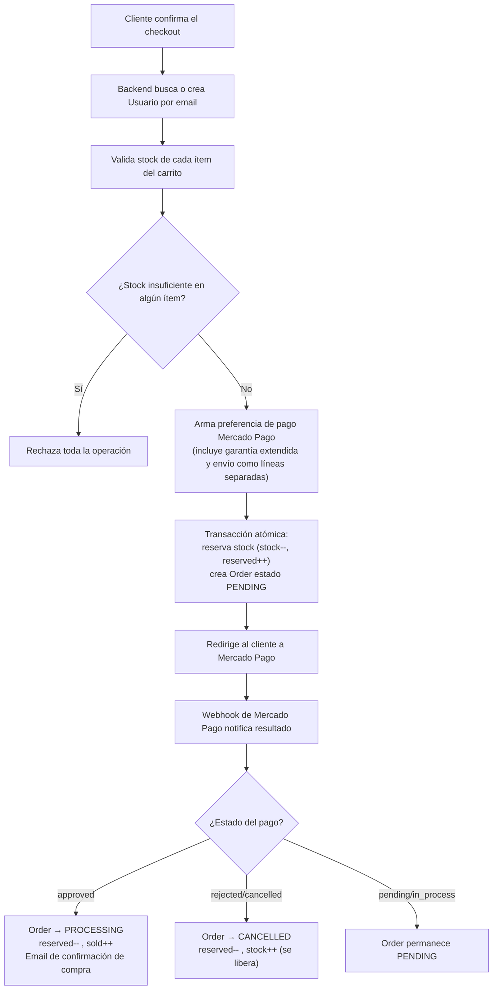

### 15.2 Venta en Local (instore)

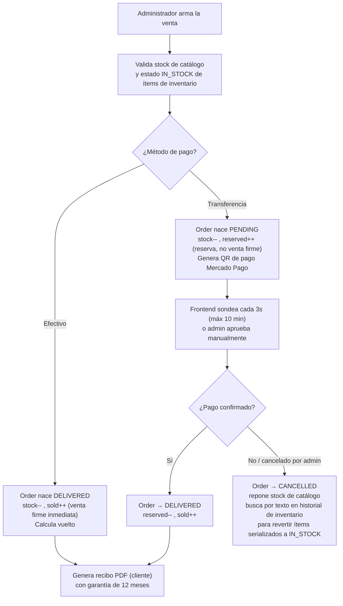

### 15.3 Cotización de equipo usado (Quote)

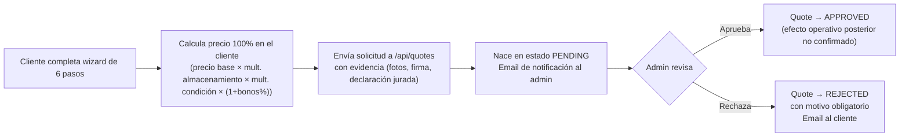

### 15.4 Arrepentimiento (derecho de retracto)

```mermaid
flowchart TB
    A["Cliente solicita arrepentimiento<br/>(N° de orden + email)"] --> B["Valida: orden existe,<br/>email coincide,<br/>≤10 días desde creación de la orden,<br/>sin solicitud previa para esa orden"]
    B --> C["Arrepentimiento nace PENDIENTE<br/>Email interno + email de confirmación al cliente"]
    C --> D{"Admin decide"}
    D -->|Aprueba| E["Arrepentimiento → APROBADO<br/>Order → CANCELLED (arrepStatus=ARREP_OK)<br/>Email con instrucciones de devolución<br/>(reembolso NO automático)"]
    D -->|Rechaza| F["Arrepentimiento → RECHAZADO<br/>(motivo obligatorio)<br/>Email al cliente"]
```

### 15.5 Chat / Mensajería

```mermaid
flowchart LR
    A["Cliente abre el chat"] --> B{"¿Ya tiene conversación activa?"}
    B -->|No| C["Se crea una conversación GENERIC"]
    B -->|Sí| D["Se reutiliza la existente"]
    C --> E["Envía mensaje (texto y/o imagen)"]
    D --> E
    E --> F["Se persiste vía HTTP<br/>+ se emite en vivo por Socket.IO"]
    F --> G{"¿Admin conectado?"}
    G -->|Sí| H["Recibe en vivo + contador no-leídos"]
    G -->|No| I["Email de nuevo mensaje al admin<br/>+ notificación pendiente"]
    H --> J["Admin responde<br/>(texto, imagen, tarjeta de producto,<br/>o genera una Quote desde el chat)"]
    J --> K["Cliente recibe en vivo o por notificación"]
```

### 15.6 Alta de Inventario por IMEI

```mermaid
flowchart LR
    A["Se escanea o tipea un IMEI"] --> B["Valida formato: 15 dígitos"]
    B --> C{"¿Existe en TacCache?"}
    C -->|Sí| D["Autocompleta marca/modelo/specs"]
    C -->|No| E{"¿Existe en base de respaldo local?"}
    E -->|Sí| D
    E -->|No| F["Exige carga 100% manual"]
    D --> G{"¿IMEI ya existe activo?"}
    F --> G
    G -->|Sí, vinculado a producto activo| H["Rechaza (409)"]
    G -->|Sí, pero huérfano (producto borrado)| I["Reutiliza la fila existente"]
    G -->|No existe| J["Crea InventoryItem nuevo<br/>Genera código QR + correlativo CMP-XXX<br/>Busca o crea Product de catálogo<br/>Incrementa Product.stock"]
    I --> K["Registra InventoryHistory: CREATED"]
    J --> K
```

---

## 16. Reglas de negocio de GreatPhones

> Lista consolidada, organizada por área, con el mismo criterio de exhaustividad que el capítulo 6 de la Parte I.

### 16.1 Cuenta y autenticación

1. El email de un usuario es único en todo el sistema.
2. El rol de un usuario es exclusivamente `CLIENT` o `ADMIN`, sin niveles intermedios.
3. Un login por contraseña exige email verificado, incluso si la contraseña es correcta.
4. Un login por Google crea la cuenta automáticamente ya verificada, sin pasar por código.
5. Ante error de login o de recuperación de contraseña, la respuesta nunca revela si el email existe.
6. Un código de verificación o de recuperación de contraseña es de un solo uso y expira (10 y 15 minutos respectivamente).
7. Solo el código más reciente emitido para un email es válido al resetear contraseña.
8. Límites de frecuencia anti-abuso: 3 registros/hora, 5 logins fallidos/15 min, 3 recuperaciones/hora, 5 verificaciones/hora, todos por email.
9. Eliminar la cuenta es un borrado físico e irreversible, con doble confirmación explícita en la interfaz.

### 16.2 Catálogo, Inventario y Stock

10. El IMEI de un ítem de inventario es único en todo el sistema.
11. Un IMEI huérfano (producto de catálogo vinculado ya borrado) se reutiliza automáticamente al reingresarlo, en vez de bloquear el alta.
12. Un ítem de inventario vendido (`SOLD`) no puede volver a venderse.
13. Un cambio de estado de inventario a un valor idéntico al actual se rechaza.
14. Un accesorio con `isActive=false` desaparece de la búsqueda pública pero no se borra.
15. El precio de un producto o accesorio siempre debe ser un entero positivo; el descuento, entre 0 y 100.
16. Solo se genera una entrada de historial de inventario si al menos un campo relevante cambió realmente.

### 16.3 Checkout, Pedidos y Pagos

17. El stock se reserva atómicamente en el momento del checkout, antes de que el pago se confirme.
18. Si el pago es rechazado o cancelado, el stock reservado se libera automáticamente.
19. La reserva se convierte en venta firme recién cuando el pago se aprueba, nunca antes.
20. El webhook de pago es idempotente: un mismo identificador de pago nunca se reprocesa dos veces.
21. Un usuario se crea automáticamente a partir del email en el primer checkout, sin registro previo obligatorio en el backend (aunque el frontend público exige sesión iniciada para llegar a esa pantalla).
22. El costo de envío y la garantía extendida se facturan siempre como ítems separados, nunca ocultos en el precio del producto.
23. Las cuotas del checkout online se calculan como división simple del total, sin coeficiente de recargo.
24. Un pedido de venta en local por transferencia nace `PENDING`; por efectivo, nace `DELIVERED` de inmediato.
25. Solo se puede aprobar o cancelar una venta en local que esté en estado `PENDING`.
26. El monto recibido en efectivo debe ser mayor o igual al total de la venta en local; el vuelto se calcula automáticamente.
27. Un pedido no puede tener menos de un ítem para poder crearse.

### 16.4 Cotizaciones (Quotes)

28. El precio final de una cotización de equipo usado se calcula como precio base × multiplicador de almacenamiento × multiplicador de condición general × (1 + suma de bonificaciones porcentuales).
29. Elegir cobro en "Saldo GP" agrega una bonificación adicional del 5%.
30. Máximo 3 fotos por cotización.
31. Es obligatorio aceptar una declaración jurada de propiedad y ausencia de deuda antes de poder enviar la cotización.
32. El resultado de una cotización online es siempre orientativo — ningún pago se efectiviza sin inspección física del equipo.
33. El flujo de cotización online solo admite hoy la categoría iPhone.

### 16.5 Arrepentimiento y Garantías

34. Una orden solo puede tener una solicitud de arrepentimiento activa a la vez.
35. El email declarado en la solicitud de arrepentimiento debe coincidir con el de la orden.
36. Rechazar un arrepentimiento exige motivo obligatorio; aprobarlo no.
37. Aprobar un arrepentimiento cancela la orden y dispara instrucciones de devolución, pero no ejecuta el reembolso de dinero de forma automática.
38. La garantía por defecto de un pedido online es de 90 días desde la fecha de creación de la orden.
39. La garantía puede extenderse a 12 o 24 meses solo dentro de los primeros 90 días y solo si no se contrató ya una extensión — pero la extensión en sí no está automatizada (se resuelve por chat).
40. La vigencia de una garantía puede consultarse públicamente con solo el código de compra y el IMEI, sin necesidad de login.

### 16.6 Chat y Notificaciones

41. Un mismo cliente solo puede tener una conversación activa con el negocio a la vez.
42. Un mensaje debe tener texto o imagen — no puede enviarse vacío.
43. Las respuestas automáticas por palabra clave se disparan como máximo una vez por sesión de página.
44. Una conversación sin administrador asignado se autoasigna al primer administrador disponible al recibir el primer mensaje.
45. Los contadores de mensajes no leídos son direccionales (uno para el cliente, uno para el administrador), no un único contador compartido.
46. "Marcar todas las notificaciones como leídas" preserva el historial; "limpiar todas" las elimina físicamente — son operaciones distintas.
47. Un usuario no puede marcar el mismo producto como favorito más de una vez.

### 16.7 Panel Administrativo

48. Un pedido no puede marcarse como enviado sin cargar un número de tracking.
49. Toda acción destructiva relevante en el panel (eliminar producto/accesorio, eliminar cotización, eliminar conversación) exige un modal de confirmación explícito.
50. Eliminar un producto o accesorio ofrece una ventana de "deshacer" solo en memoria del navegador (no persistente).
51. La gestión de unidades de inventario por IMEI está unificada dentro de la sección "Productos"; ya no existe una sección de Inventario separada en el panel.

---

## 17. Riesgos y hallazgos específicos de GreatPhones

### 17.1 Ausencia total de un equivalente al Libro Diario / Caja del ERP

**El hallazgo más importante de todo el análisis de GreatPhones.** Ningún endpoint ni modelo de datos analizado (checkout, orders, instore-sale, admin/dashboard) genera un asiento contable, mantiene un saldo de caja por medio de pago, ni ofrece un mecanismo de conciliación o ajuste de caja. La única fuente de verdad monetaria es el campo `total`/`payment` de cada `Order` individual y el saldo final (sin historial de movimientos) de `Wallet`. Si el negocio pretende usar GreatPhones como reemplazo integral del ERP para el control financiero diario, **este es un módulo a diseñar completamente desde cero**, no algo que ya exista de forma parcial.

### 17.2 Tres duraciones de garantía distintas conviviendo sin unificar

Se verificaron, de forma cruzada e independiente entre varios análisis, tres valores de garantía distintos y activos simultáneamente en el sistema: **90 días** (modelo `Guarantee`, validación de checkout, plantilla de email de confirmación de compra, página pública de garantías), **12 meses** (texto legal hardcodeado en el recibo PDF de Venta en Local), y **6 meses** (mínimo legal exigido por la Ley 24.240, citado en la propia documentación legal del proyecto, `docs/legal-argentina.md`). Es una inconsistencia real de negocio/legal, no solo técnica, que debe resolverse con una decisión explícita antes de cualquier auditoría legal del sitio.

### 17.3 Plazo de arrepentimiento con dos imprecisiones respecto a la normativa citada

(a) El mensaje de error dice "10 días **hábiles**" pero el cálculo real usa días corridos (que es, de hecho, lo que exige la norma — el error está en el texto, no en el cálculo). (b) El plazo se cuenta desde la **creación de la orden**, no desde la **recepción del producto**, que es lo que exige la Resolución 424/2020 citada en la documentación legal del propio proyecto — para envíos con demora, esto podría acortar indebidamente el plazo real del consumidor.

### 17.4 Verificación de firma del webhook de Mercado Pago es opcional

Si la variable de entorno del secreto de webhook no está configurada, la función de verificación devuelve válido sin comprobar nada — una condición de configuración de producción a confirmar, no un defecto de lógica, pero un riesgo real si el secreto no está seteado.

### 17.5 Bug funcional verificado en la cancelación de Venta en Local

Al cancelar una venta en local pendiente, el código siempre decrementa el contador `sold` del producto, pero en la creación de esa misma venta (pago por transferencia, la única cancelable) lo que se había incrementado fue `reserved`, no `sold`. Esto puede dejar el contador de vendidos de un producto negativo o desincronizado tras cancelaciones repetidas. Es un hallazgo de código concreto, no una interpretación.

### 17.6 Borrado físico sin red de seguridad en múltiples entidades

A diferencia del principio "nunca borrar" del ERP (reforzado por Auditoría + Backups + Transacciones), GreatPhones permite borrado físico real de: pedidos (`DELETE /api/orders`), productos (con dos rutas de borrado de comportamiento distinto entre sí), ítems de inventario (con borrado en cascada de su propio historial), y conversaciones de chat completas (mensajes incluidos). Ninguna de estas operaciones deja un snapshot recuperable equivalente al Backup de Operación del ERP.

### 17.7 Modelo `Sale` posiblemente heredado y sin uso

Existe en el esquema de datos pero no fue referenciado por ningún endpoint de checkout, pedidos, ni venta en local analizado. No debe asumirse como parte del flujo de venta vigente sin verificación adicional explícita.

### 17.8 Dos implementaciones de panel administrativo, una de ellas inalcanzable

Existe un fragmento de HTML (`#p-admin-login`) con su propio login legado (usuario/contraseña propio, distinto del login general del sitio) y una estructura de secciones más simple, que **no es alcanzable desde el sistema de navegación actual** (ningún `nav()` referencia esos IDs). Es fuertemente indicativo de una versión anterior del panel, nunca eliminada del HTML.

### 17.9 Dashboard administrativo: evidencia contradictoria sobre su estado real

Un análisis del motor de renderizado (`render.js`) documentó un Dashboard completamente funcional con gráficos y KPIs reales; un análisis independiente del archivo `admin.js` encontró funciones de nombre equivalente (`renderDash`, `switchChart`) explícitamente deshabilitadas. La lectura más probable es que `admin.js` contiene una implementación anterior ya reemplazada, pero **se recomienda verificación operativa directa** (abrir el panel en un navegador) antes de dar esto por sentado en cualquier decisión de migración.

### 17.10 Tres líneas de negocio con interfaz completa pero desactivadas en producción

Las secciones "Servicio Técnico", "Notebooks" y "Mayorista" tienen HTML completo, funciones de renderizado dedicadas, y accesos visibles en la topbar/footer/catnav — pero el propio router (`navigation.js`) las redirige forzosamente a `home` antes de mostrarlas, mediante una lista explícita de secciones ocultas. Además, el formulario de Mayorista no está conectado a ningún backend, y el botón de "pedir presupuesto" de Servicio Técnico es un stub sin funcionalidad. Esto representa una decisión de negocio activa (pausar estas líneas) o funcionalidad incompleta pendiente de terminar — debe confirmarse con el negocio cuál de las dos.

### 17.11 Configuración de precios y costos hardcodeada en el frontend

Los precios base de cotización de equipos usados, sus multiplicadores, los montos de garantía extendida y los costos de envío mostrados en la ficha de producto están escritos como constantes literales en el código fuente del cliente, no en una fuente de configuración editable desde el panel. Cualquier ajuste de estos valores requiere modificar código y redesplegar — una regresión de mantenibilidad operativa frente al modelo del ERP, donde estos parámetros vivían en hojas de configuración editables por cualquier operador.

### 17.12 Duplicación y posible pisado de configuración de respuestas rápidas de chat

Las "respuestas rápidas" (canned replies) se persisten en un archivo JSON en el sistema de archivos del servidor (no en base de datos, vulnerable a pérdida en entornos con redeploys/contenedores efímeros), y el frontend tiene además un array hardcodeado de respaldo que, ante ciertos errores de carga, podría sobrescribir accidentalmente la configuración real guardada en el servidor.

### 17.13 Falta de registro de responsable en varias acciones administrativas

A diferencia del ERP —donde el operador quedaba etiquetado en cada operación y en cada asiento contable—, no se encontró evidencia de que acciones administrativas como aceptar un pedido, rechazar un arrepentimiento, o eliminar un producto queden asociadas al administrador puntual que las ejecutó (más allá de la sesión activa en el momento). Esta es una posible regresión de trazabilidad de responsabilidad frente al ERP.

### 17.14 Brechas de vinculación estructural en el modelo de datos

El modelo `Accessory` no está vinculado estructuralmente a `OrderItem` (solo puede incluirse como ítem de texto libre `customName`/`customPrice`), lo que impide un descuento de stock automático y trazable al venderse un accesorio dentro de un pedido. El campo `investor` de `InventoryItem` no tiene ninguna lógica de rendimiento o cuenta corriente asociada (a diferencia del módulo Inversores completo del ERP). El modelo `Wallet` no tiene tabla de movimientos, solo el saldo final.

### 17.15 Cotizaciones acepta el precio final sin recálculo del lado del servidor

El endpoint de Cotizaciones (`/api/quotes`) persiste el precio final tal como lo envía el cliente, sin recalcularlo ni validarlo contra las reglas de negocio del lado del servidor — a diferencia de Cambio de Moneda en el ERP, donde ese mismo principio de integridad (nunca aceptar un monto que el cliente pudo manipular) sí está aplicado y documentado como regla explícita (Parte I, §6.6 regla 66). La revisión manual de un administrador antes de aprobar la cotización mitiga parcialmente este riesgo, pero no reemplaza una validación automática.

---

# Parte III — Documento maestro comparativo (ERP ↔ GreatPhones)

## 18. Matriz completa de eventos (unificada)

> Esta matriz complementa (no reemplaza) los mapas de eventos ya detallados en §5 (ERP) y §15 (GreatPhones), presentando cada evento de negocio de ambos sistemas en formato tabular con sus siete dimensiones solicitadas: disparador, módulos participantes, qué modifica, qué crea, qué actualiza, dependencias, reglas de negocio aplicadas e impacto sobre el resto del sistema.

### 18.1 Eventos del ERP (formato matriz)

| Evento | Disparador | Módulos participantes | Qué crea | Qué actualiza | Dependencias | Reglas clave aplicadas | Impacto en el resto del sistema |
|---|---|---|---|---|---|---|---|
| Registrar Compra | Operador carga una compra | Compras, Stock, Libro Diario, Operadores, Preventas (si vinculada) | Registro de Compra; asiento contable | Stock; estado de Preventa vinculada | Configuración (prefijo, cotización) | Precio mutuamente excluyente según tipo; consignación no genera egreso | Habilita el equipo para venta o lo reserva para una preventa |
| Registrar Venta | Operador confirma una venta | Ventas, Compras, Stock, Libro Diario, Ventas de Accesorios, Regalos, Operadores | Registro de Venta; asiento(s) contable(s); ventas de accesorios asociadas | Compra→"Vendido"; Stock | Compras (equipo origen), Configuración | Cobro debe igualar total (±$1); prorrateo de medios | Libera el equipo del stock disponible; dispara comisiones e indicadores |
| Registrar Preventa | Operador registra una seña/reserva | Preventas, Libro Diario, Días Hábiles | Registro de Preventa; asiento(s) por lo cobrado | — (nunca Stock) | Configuración, Días Hábiles | Cobro no puede superar el precio pactado | Ninguno sobre Stock; solo contable |
| Entregar Preventa | Operador entrega el equipo y cobra el saldo | Preventas, Compras (posible alta), Ventas, Stock, Libro Diario, Ventas de Accesorios, Regalos | Compra (si no existía); Venta (o actualiza la existente) | Preventa (estado y saldo); Stock; Compra→"Vendido" | Prorrateo de medios de pago | Nunca cobra de más; permite entrega con deuda | Cierra el ciclo preventa→venta; puede generar compra retroactiva |
| Registrar Reparación | Cliente ingresa un equipo | Reparaciones, Libro Diario (si hay cobro) | Registro de Reparación; presupuesto | — | Toma de Equipos, Tarifario Icare, CONFIG_REPARACIONES | Sin cobro, sin asiento; diagnóstico nunca fija precio | Ninguno sobre Stock |
| Aceptar/Rechazar presupuesto de diagnóstico | Cliente decide sobre un diagnóstico | Reparaciones, Correcciones, Auditoría | Nueva Reparación (si acepta) | Reparación de diagnóstico anulada | Sistema de Correcciones | Precio cobrado en 0 al aceptar | Cierra o continúa el ciclo de la reparación |
| Registrar Gasto / Cambio de Moneda / Ajuste de Caja | Operador registra un movimiento de tesorería | Gastos/Cambio de Moneda/Ajuste de Caja, Libro Diario | Registro correspondiente; asiento(s) contable(s) | Caja | Configuración (cotización) | Un asiento por medio de pago; motivo obligatorio en ajustes | Afecta directamente el saldo de Caja |
| Movimiento de Inversor | Operador registra aporte/retiro/pago de rendimiento | Inversores, Libro Diario | Fila de movimiento en el panel del inversor; asiento contable | Capital invertido o pagado total del inversor | — | Topes de capital/pendiente; siempre medio "Transferencia" | Afecta Caja; no afecta Stock |
| Compra/Venta de Accesorios | Operador carga una operación de accesorios | Compras/Ventas de Accesorios, Catálogo SKU, Stock de Accesorios, Libro Diario (parcial) | Línea(s) de operación; SKU nuevo si corresponde | Stock de Accesorios | — | Un asiento por medio; validación de stock acumulado por SKU | Venta multilínea no genera auditoría/backup/transacción (riesgo) |
| Anular Operación | Cualquier operador, cualquier operación, cualquier momento | Anulaciones, Auditoría, Backups, Transacciones, Stock, Libro Diario | Snapshot/backup; evento de auditoría | Estado de registro; efectos revertidos (stock, vínculos) | Motivo obligatorio | Nunca borra; revierte exactamente los efectos originales | Puede afectar en cadena Compras/Ventas/Preventas relacionadas |
| Corregir Operación | Operador reemplaza una operación con datos erróneos | Correcciones, Anulaciones, módulo de origen | Nueva operación vinculada; entrada en Correcciones | Operación original (anulada) | — | No se admiten cadenas de corrección sobre una corrección | Preserva trazabilidad completa del reemplazo |
| Health Check Automático | Disparador diario (madrugada) | Salud ERP, Estado ERP | Entradas de problema detectado | Estado ERP (semáforo) | Compras, Ventas, Preventas, Libro Diario, Inversores, Cambio de Moneda | Nunca corrige, solo detecta y reporta | Da visibilidad de inconsistencias acumuladas |

### 18.2 Eventos de GreatPhones (formato matriz)

| Evento | Disparador | Módulos participantes | Qué crea | Qué actualiza | Dependencias | Reglas clave aplicadas | Impacto en el resto del sistema |
|---|---|---|---|---|---|---|---|
| Checkout online | Cliente confirma su compra | Checkout, Catálogo, Mercado Pago, Email | `Order` (PENDING) | `Product.stock`/`reserved` | Mercado Pago, Andreani (envío) | Stock se reserva antes del pago | Bloquea temporalmente el stock para otros compradores |
| Webhook de pago aprobado | Mercado Pago notifica pago aprobado | Checkout/Orders, Inventario/Catálogo, Email | — | `Order`→PROCESSING; `reserved`→`sold` | Mercado Pago | Idempotente por `paymentId` | Confirma la venta en firme; dispara email |
| Webhook de pago rechazado | Mercado Pago notifica rechazo/cancelación | Checkout/Orders, Catálogo | — | `Order`→CANCELLED; `reserved`→`stock` | Mercado Pago | Libera stock automáticamente | Libera inventario para otros compradores |
| Venta en Local (efectivo) | Administrador confirma venta presencial en efectivo | Instore Sale, Inventario, Catálogo | `Order` (DELIVERED, `saleChannel=in-store`); recibo PDF | Stock (firme); `InventoryItem`→SOLD | — | Vuelto calculado automáticamente | Sin registro contable central (riesgo) |
| Venta en Local (transferencia) | Administrador confirma venta presencial por transferencia | Instore Sale, Mercado Pago | `Order` (PENDING); QR de pago | Stock (reservado) | Mercado Pago | Solo aprobable/cancelable en PENDING | Bug conocido en `sold` al cancelar (ver §17.5) |
| Alta de Inventario por IMEI | Administrador escanea/carga un IMEI | Inventario, TacCache, Catálogo | `InventoryItem`; `InventoryHistory` (CREATED); código QR | `Product.stock` (+1) | Base pública TAC | IMEI único; huérfano se reutiliza | Publica automáticamente el equipo como variante de un producto |
| Venta desde Inventario | Se vende un ítem de inventario directamente | Inventario, Catálogo, Orders | `Order` (canal in-store) | `InventoryItem`→SOLD; `Product.stock`/`sold` | — | No puede venderse un ítem ya SOLD | Equivalente directo de `procesarVenta` del ERP |
| Cotización de equipo usado (Quote) | Cliente envía una cotización de trade-in | Quotes, Email | `Quote` (PENDING) | — | — | Máx. 3 fotos; declaración jurada obligatoria | Solo informativo hasta aprobación + inspección |
| Aprobar/Rechazar Quote | Administrador resuelve una cotización | Quotes, Email | — | `Quote`→APPROVED/REJECTED | — | Rechazo exige motivo | Efecto operativo posterior no confirmado (pregunta abierta) |
| Solicitud de Arrepentimiento | Cliente solicita desistir de una compra | Arrepentimiento, Orders, Email | `Arrepentimiento` (PENDIENTE) | `Order.arrepStatus` | — | ≤10 días desde creación de la orden; sin duplicados por orden | Puede llevar a la cancelación de la orden |
| Aprobar Arrepentimiento | Administrador aprueba la solicitud | Arrepentimiento, Orders, Email | — | `Arrepentimiento`→APROBADO; `Order`→CANCELLED | — | Reembolso NO automático | Requiere gestión manual posterior de devolución de dinero |
| Consulta de Garantía | Cliente consulta vigencia con código+IMEI | Garantías (Warranty), Orders | — | — (solo lectura) | — | Cálculo digital de vencimiento real | Reemplaza el texto fijo sin control del ERP |
| Nuevo mensaje de chat | Cliente o admin envía un mensaje | Chat/Conversations, Notificaciones, Email, Socket.IO | `Message`; `Notification` (si corresponde) | Contadores de no leídos direccionales | Socket.IO | Autoasignación de admin si no hay uno asignado | Sin equivalente en el ERP |
| Eliminación física (Order/Product/InventoryItem/Conversation) | Acción administrativa de borrado | Módulo correspondiente | — | Borra el registro (y, en Inventario, su historial en cascada) | — | Sin backup ni auditoría equivalente al ERP | Rompe el principio "nunca borrar" del ERP |

---

## 19. Contrato funcional de cada módulo

> Formato estandarizado para TODOS los módulos de ambos sistemas: Objetivo · Entradas · Salidas · Validaciones · Garantías · Restricciones · Errores esperables · Eventos que genera · Eventos que consume · Dependencias. Los módulos del ERP ya fueron descritos en prosa en el capítulo 4 de la Parte I; aquí se presentan en formato de contrato compacto para referencia cruzada rápida, junto a los de GreatPhones (descritos en prosa en el capítulo 14).

### 19.1 Módulos del ERP (contrato compacto)

| Módulo | Objetivo | Entradas clave | Salidas | Validaciones/Garantías | Restricciones | Errores esperables | Genera eventos hacia | Consume eventos de | Dependencias |
|---|---|---|---|---|---|---|---|---|---|
| Compras | Ingresar un equipo al inventario | Modelo, IMEI, precio, tipo | Registro de Compra | Precio excluyente por tipo | No vender fuera de estado "En Stock" | Falta de columna; precio inconsistente | Stock, Libro Diario, Preventas | Preventas (vínculo opcional) | Configuración |
| Ventas | Vender un equipo en stock | Equipo, cliente, medios de pago | Venta, ganancia calculada | Cobro=total±$1 | Solo equipos "En Stock" | Descuadre de cobro | Stock, Libro Diario, Ventas de Accesorios, Regalos | Compras | Configuración |
| Preventas | Reservar venta futura con cobro anticipado | Modelo, cliente, cobro parcial | Preventa | Cobro≤pactado | Nunca afecta Stock | Cobro que excede lo pactado | Libro Diario | Días Hábiles | Configuración |
| Entrega de Preventas | Consumar la preventa entregando el equipo | Preventa, cobro de saldo | Compra (posible), Venta, Preventa actualizada | Cobro≤saldo pendiente | No duplica venta en entregas parciales | Cobro que excede el saldo | Stock, Libro Diario, Ventas de Accesorios, Regalos | Preventas, Compras | Prorrateo de medios |
| Compras de Accesorios | Ingresar mercadería de accesorios | Líneas de producto, pago | Líneas de compra, SKU | Total pagado=costo±$1 | Al menos 1 línea | Descuadre; SKU duplicado (mitigado por lock) | Stock de Accesorios, Libro Diario | Catálogo SKU | — |
| Ventas de Accesorios | Vender accesorios (simple o multilínea) | Producto/SKU, cantidad, pago | Registro(s) de venta | Stock acumulado por SKU validado | — | Stock insuficiente | Stock de Accesorios | Compras de Accesorios | — |
| Stock (Equipos+Accesorios) | Vista siempre actualizada de disponibilidad | Estado de Compras/Accesorios | Proyección de stock | Nunca editable directamente | — | Hoja no encontrada (aborta silencioso) | — | Compras, Ventas, Compras/Ventas Accesorios | — |
| Reparaciones | Gestionar ciclo de reparación/diagnóstico | Cliente, equipo, fallas, trabajos | Presupuesto, registro | Solo cobro>0 genera asiento | Diagnóstico nunca fija precio | Falta de datos obligatorios | Libro Diario (si cobra) | Toma de Equipos, Tarifario Icare | CONFIG_REPARACIONES |
| Gastos/Cambio Moneda/Ajuste Caja | Movimientos de tesorería no ligados a mercadería | Monto, medio, motivo | Registro, asiento(s) | Un asiento por medio | Motivo obligatorio (ajustes) | Descuadre de montos | Libro Diario | — | Configuración |
| Caja | Visibilidad de saldo por medio de pago | — | Saldos, conciliación | Nunca mezcla monedas | — | — | — | Libro Diario | — |
| Libro Diario | Registro contable central | Cualquier operación de valor | Asiento contable | Saldo corrido en cadena | Es la fuente de verdad contable | Hoja no encontrada (omite silenciosamente) | Caja, Reportes, Dashboard | Todos los módulos de captura | — |
| Mis Operaciones | Vista unificada + acciones de anular/corregir | — | Listado, acciones | Cualquiera puede anular/corregir | — | — | Anulaciones, Correcciones | Todos los módulos de captura | — |
| Comisiones | Indicadores agregados por operador | — | Indicadores (no montos de comisión) | Excluye anuladas | No calcula comisión real | — | — | Ventas, Preventas, Reparaciones, Accesorios | Operadores |
| Dashboard | Foto general del negocio | — | Indicadores consolidados | Recalculado en cada consulta | — | — | — | Todos los módulos | — |
| Reportes | Consolidado contable/comercial | — | Bloques de reporte | Excluye anuladas | Recalculo bajo demanda (no siempre automático) | — | — | Libro Diario, Ventas, Preventas, Accesorios | — |
| Auditoría | Registro permanente de anulaciones/restauraciones | — | Evento de auditoría | Nunca se edita/borra | Solo agregado | — | — | Anulaciones | — |
| Operadores | Trazabilidad de responsable sin login | Selector manual | Etiquetado de operador | Sin restricción de permisos | — | — | — | Todos los módulos | — |
| Configuraciones | Parámetros de negocio editables | — | Valores de configuración | Tolerante a ausencia | — | Falta de columna clave | — | — | — |
| Inversores | Cuenta corriente de capital externo | Movimiento, monto | Registro, asiento | Topes de capital/pendiente | Siempre medio "Transferencia" | Exceso de retiro/pago | Libro Diario | — | — |
| Regalos Automáticos | Entrega de accesorio de regalo por venta | Modelo vendido | Venta de accesorio a $0 | No bloquea la venta principal | Solo desde flujos "con operador" | Falta de stock (no bloqueante) | Stock de Accesorios | Ventas, Entrega de Preventas | CONFIG_REGALOS |
| Anulaciones y Correcciones | Revertir/reemplazar operaciones | Motivo, operador | Backup, evento de auditoría | Nunca borra | Restricciones cruzadas por tipo | Operación relacionada activa bloquea | Stock, Libro Diario | Mis Operaciones | Backups, Transacciones |
| Backups de Operación | Snapshot previo a anular/restaurar | — | Snapshot JSON | Nunca bloquea la operación aunque falle | — | Snapshot truncado (>50k caracteres) | — | Anulaciones | — |
| Transacciones | Detectar ejecuciones cortadas a mitad de camino | — | Registro INICIO/OK/ERROR/ABORTADA | Bloqueo de 30s anti-concurrencia | — | Transacción incompleta | — | Anulaciones | — |
| Estado ERP / Salud ERP | Autodiagnóstico periódico | — | Problemas clasificados INFO-CRITICAL | Nunca corrige, solo detecta | — | — | — | Compras, Ventas, Preventas, Libro Diario, Inversores, Cambio Moneda | — |
| Garantías | N/A — no existe como módulo real en el ERP; ver §4.9 | — | — | — | — | — | — | — | Reparaciones (clasificación de tipo únicamente) |
| Clientes | N/A — no existe como módulo real en el ERP; ver §4.10 | — | — | — | — | — | — | — | Ventas, Preventas, Reparaciones (texto libre por operación) |

### 19.2 Módulos de GreatPhones (contrato compacto)

| Módulo | Objetivo | Entradas clave | Salidas | Validaciones/Garantías | Restricciones | Errores esperables | Genera eventos hacia | Consume eventos de | Dependencias |
|---|---|---|---|---|---|---|---|---|---|
| Cuenta/Auth | Identidad de cliente/admin | Email, contraseña, código | Usuario autenticado | Email único; verificación obligatoria para login por contraseña | Rol fijo CLIENT/ADMIN | Email duplicado; código vencido | — | — | Gmail SMTP, Google OAuth |
| Catálogo (Productos/Accesorios) | Exponer y mantener el catálogo público | Alta/edición desde panel | Ficha pública, `ProductLog` | Precio entero positivo | Dos rutas de borrado inconsistentes (riesgo) | Producto sin nombre/precio | Caché de catálogo | Inventario (variantes) | Cloudinary |
| Inventario | Alta/gestión de equipos por IMEI | IMEI, condición, precio | `InventoryItem`, historial, QR | IMEI único; estados excluyentes | No se puede vender lo ya SOLD | IMEI inválido/duplicado | Product.stock | TacCache | Base TAC Osmocom |
| Checkout/Orders | Venta online de punta a punta | Carrito, envío, pago | `Order`, preferencia MP | Stock reservado antes del pago | Exige sesión iniciada | Stock insuficiente al confirmar | Stock, Email | Mercado Pago (webhook) | Mercado Pago, Andreani |
| Venta en Local (Instore) | Venta presencial desde el panel | Cliente, ítems, pago | `Order` (canal in-store), recibo PDF | Stock validado antes de confirmar | Solo efectivo o transferencia (no mixto) | Bug conocido en cancelación (§17.5) | Stock, Inventario | Inventario, Catálogo | Mercado Pago (QR) |
| Cotizaciones (Quotes) | Cotizar equipo usado (trade-in) | Modelo, condición, fotos | `Quote` | Declaración jurada obligatoria | Solo iPhone implementado | Precio hardcodeado (riesgo) | Email | — | — |
| Arrepentimiento | Derecho de retracto legal | N° orden, email | `Arrepentimiento` | ≤10 días desde creación de orden | Una solicitud por orden | Plazo vencido; email no coincide | Order (cancelación) | Orders | Email |
| Garantías | Consulta pública de vigencia | Código + IMEI | Estado de vigencia | Cálculo digital real | Extensión no automatizada | Código/IMEI no coincide | — | Orders | — |
| Servicio Técnico | Presupuesto de reparación (público) | Descripción de falla | *(stub, no operativo)* | — | No conectado a backend | Funcionalidad no disponible | — | — | — |
| Panel Admin (Dashboard/Stock/Promociones) | Gestión y analítica interna | — | Indicadores, cambios en lote | Confirmación en acciones destructivas | Sin indicador de caja/margen | Estado de Dashboard incierto (§17.9) | Catálogo, Inventario | Orders, Inventario | Chart.js |
| Chat/Mensajería | Atención al cliente en tiempo real | Mensajes, imágenes | `Message`, `Notification` | Una conversación activa por cliente | Autoasignación de admin | Mensaje vacío rechazado | Notificaciones, Email | Socket.IO | Cloudinary |
| Notificaciones/Favoritos/Comparador | Utilidades de experiencia de cliente | — | Registros de usuario | Sin duplicados en favoritos | Comparador limita a 2 productos | — | — | Catálogo, Chat | — |
| Cookies/Consentimiento | Cumplimiento legal de datos personales | Elección de categorías | Consentimiento persistido | Scripts de tracking condicionados al consentimiento | — | — | — | — | Google Analytics, Meta Pixel |

---

## 20. Mapa de dependencias (unificado)

```mermaid
flowchart TD
    subgraph ERP_DEPS["Dependencias — ERP (resumen, ver §7 para detalle completo)"]
        E_Compras["Compras"] --> E_Stock["Stock"]
        E_Ventas["Ventas"] --> E_Stock
        E_Ventas --> E_LibroDiario["Libro Diario"]
        E_Compras --> E_LibroDiario
        E_LibroDiario --> E_Caja["Caja"]
        E_Caja --> E_Reportes["Reportes"]
        E_Reportes --> E_Dashboard["Dashboard"]
        E_Anulaciones["Anulaciones"] --> E_Stock
        E_Anulaciones --> E_LibroDiario
    end

    subgraph GP_DEPS["Dependencias — GreatPhones"]
        G_Checkout["Checkout"] --> G_Stock["Product.stock/reserved"]
        G_Checkout --> G_MP["Mercado Pago"]
        G_MP --> G_Orders["Orders"]
        G_Orders --> G_Dashboard["Dashboard Admin"]
        G_Instore["Venta en Local"] --> G_Stock
        G_Instore --> G_Inventory["Inventario"]
        G_Inventory --> G_Catalog["Catálogo"]
        G_Quotes["Quotes"] --> G_Email["Email"]
        G_Arrep["Arrepentimiento"] --> G_Orders
        G_Chat["Chat"] --> G_Notif["Notificaciones"]
    end

    E_LibroDiario -.->|"SIN EQUIVALENTE EN"| G_DEPS
    G_DEPS -.->|"aporta lo que el ERP no tenía:"| Cliente_Real["Cliente real con historial"]
    G_DEPS -.-> ChatRT["Chat en tiempo real"]
    G_DEPS -.-> PagoOnline["Pago online (Mercado Pago)"]
    G_DEPS -.-> GarantiaDigital["Garantía con control de vigencia"]
```

### 20.1 Qué depende de qué — GreatPhones (resumen textual)

- **Product.stock/reserved depende de dos orígenes simultáneos**: altas de Inventario (por IMEI) y ediciones manuales desde el panel — un doble camino de escritura que el ERP no tiene (allí Stock depende exclusivamente de Compras).
- **Orders es el núcleo transversal de GreatPhones**, equivalente al rol que cumple el Libro Diario en el ERP, pero **sin preservar historial de movimientos individuales** — es un registro por operación, no un libro de asientos.
- **Dashboard Admin depende de Orders y Catálogo**, nunca de un concepto de Caja (que no existe).
- **Chat depende de Notificaciones y de Socket.IO**, y es completamente independiente del resto del flujo comercial — puede fallar sin afectar ventas.
- **Garantías y Arrepentimiento dependen de Orders** para calcular vigencia/elegibilidad, pero no generan ningún efecto automático sobre Stock (Arrepentimiento) ni sobre pagos (ninguno de los dos).
- **Venta en Local depende de Inventario, Catálogo y opcionalmente Mercado Pago** (si el medio es transferencia) — es el módulo con más puntos de dependencia cruzada, y el que más se parece estructuralmente a un módulo del ERP (Ventas+Compras+Caja combinados).

### 20.2 Qué es crítico en GreatPhones

1. **Orders/Checkout** — cualquier falla aquí bloquea toda venta, online o presencial (Venta en Local reutiliza la misma entidad).
2. **Inventario** — de fallar, se pierde tanto la venta por unidad serializada como el catálogo de productos vinculados a IMEIs.
3. **Integración con Mercado Pago** — es el único mecanismo de cobro automatizado de todo el sistema; su caída deja a la Venta en Local por transferencia y al Checkout online sin forma de confirmarse automáticamente (aunque persiste la vía de aprobación manual del administrador).

---

## 21. Comparación ERP vs GreatPhones

> Para cada módulo del ERP, se indica su situación real en GreatPhones, verificada contra el código, no asumida.

| Módulo del ERP | Situación en GreatPhones | Clasificación |
|---|---|---|
| Compras (equipos) | Cubierto y mejorado por Inventario (IMEI único, autocompletado TAC) | **Ya existe completamente**, con mejoras |
| Ventas | Cubierto por Checkout (online) + Venta en Local (presencial), ambos sobre `Order` | **Ya existe completamente**, con automatización que el ERP no tenía |
| Preventas | No hay ningún flujo de "reservar y cobrar antes de tener stock" | **No existe** |
| Entrega de Preventas | Sin equivalente, por ausencia de Preventas | **No existe** |
| Compras de Accesorios | No se encontró un flujo de alta de stock de accesorios equivalente en los endpoints analizados | **Existe parcialmente / a confirmar** |
| Ventas de Accesorios | Solo como ítem de texto libre dentro de un pedido, sin vínculo estructural al catálogo de Accesorios | **Existe parcialmente** |
| Stock (equipos) | Cubierto y mejorado, con dualidad de sistemas de stock (agregado + serializado) a resolver | **Ya existe completamente**, requiere rediseño de la dualidad |
| Reparaciones | Modelo de datos superior (`Repair`/`RepairService` con etapas de diagnóstico), pero flujo público no operativo | **Existe parcialmente** (backend/modelo sí, flujo de cliente no) |
| Garantías | Control digital real de vigencia, resolviendo la brecha documentada del ERP | **Ya existe completamente**, mejor que el ERP |
| Clientes | Entidad real con historial, autenticación y perfil — brecha del ERP resuelta | **Ya existe completamente**, mejor que el ERP |
| Gastos / Cambio de Moneda / Ajuste de Caja | Sin ningún equivalente encontrado | **No existe** |
| Caja | Sin ningún equivalente encontrado | **No existe** |
| Libro Diario | Sin ningún equivalente encontrado | **No existe** |
| Mis Operaciones | Cubierto parcialmente por los listados de Pedidos/Cotizaciones/Arrepentimientos del panel admin, sin la unificación ni el nivel de auditoría del ERP | **Existe parcialmente** |
| Comisiones | Sin ningún cálculo de comisión por vendedor encontrado | **No existe** |
| Dashboard | Existe y es más rico en analítica comercial, pero sin dimensión de caja/margen; estado de implementación a verificar (§17.9) | **Ya existe completamente** (con brechas de contenido) |
| Reportes | Cobertura mucho menor (solo exportación de historial de productos) | **Existe parcialmente** |
| Auditoría | Cubierta solo para Inventario (`InventoryHistory`), y con borrado en cascada que contradice el principio del ERP | **Existe parcialmente**, debe rediseñarse |
| Operadores | Reemplazado por autenticación real (mejora), pero sin registro de responsable en varias acciones administrativas | **Existe parcialmente**, mejor base pero con brechas |
| Configuraciones | Parcialmente hardcodeada en el frontend en vez de editable — regresión de mantenibilidad | **Existe parcialmente**, debe rediseñarse |
| Inversores | Solo un campo de texto libre sin lógica de negocio | **No existe** (más allá de una etiqueta) |
| Regalos Automáticos | Sin ningún equivalente encontrado | **No existe** |
| Anulaciones y Correcciones | Reemplazado por borrado físico directo en la mayoría de las entidades, sin motivo obligatorio general ni backup | **No existe** de forma equivalente; ya no tiene sentido migrar tal cual, debe rediseñarse |
| Backups de Operación | Sin ningún equivalente encontrado | **No existe** |
| Transacciones (atomicidad) | Cubierta técnicamente por transacciones de base de datos en puntos críticos, sin el mecanismo de diagnóstico de "transacciones incompletas" | **Existe parcialmente**, de forma tecnológicamente distinta |
| Estado ERP / Salud ERP | Sin ningún equivalente encontrado | **No existe** |
| *(Nuevo en GreatPhones, sin origen en el ERP)* Chat/Mensajería | — | Funcionalidad enteramente nueva |
| *(Nuevo en GreatPhones, sin origen en el ERP)* Cotizaciones online con firma/evidencia | — | Funcionalidad enteramente nueva |
| *(Nuevo en GreatPhones, sin origen en el ERP)* Arrepentimiento legal | — | Funcionalidad enteramente nueva (obligación legal de e-commerce) |
| *(Nuevo en GreatPhones, sin origen en el ERP)* Wallet/Saldo interno | — | Funcionalidad enteramente nueva, sin trazabilidad de movimientos aún |

---

## 22. Matriz de reutilización

> Clasificación por módulo: REUTILIZAR COMPLETO / REUTILIZAR PARCIALMENTE / REDISEÑAR / REEMPLAZAR / ELIMINAR, con justificación técnica y de negocio. La "reutilización" se refiere siempre a la LÓGICA DE NEGOCIO documentada en la Parte I, nunca al código Google Apps Script en sí (que no debe migrarse literalmente en ningún caso).

| Módulo/Lógica del ERP | Clasificación | Justificación |
|---|---|---|
| Regla "el Libro Diario es la fuente de verdad contable, un asiento por cada movimiento de valor" | **REUTILIZAR COMPLETO** (como especificación de comportamiento) | Es la ausencia más crítica detectada en GreatPhones (§17.1). Debe implementarse en la nueva plataforma con el mismo rigor conceptual: todo movimiento de valor (venta online, venta en local, arrepentimiento aprobado, ajuste manual) debe generar un asiento verificable, independientemente de la tecnología usada. |
| Regla "una anulación nunca borra, siempre marca y revierte con backup + auditoría" | **REUTILIZAR COMPLETO** (como especificación de comportamiento) | GreatPhones hoy permite borrado físico en múltiples entidades sin red de seguridad (§17.6). Esta es la garantía de integridad más importante del ERP y debe preservarse conceptualmente al evolucionar GreatPhones, no descartarse por ser "más simple" borrar directamente. |
| Regla "una preventa nunca aumenta stock; entregarla nunca vuelve a cobrar lo ya percibido" | **REDISEÑAR** | El concepto de negocio (vender antes de tener stock, cobrando por adelantado) no tiene hoy ningún equivalente en GreatPhones. Si el negocio sigue necesitando esta operatoria (por ejemplo, para importar bajo pedido), debe diseñarse como una entidad nueva sobre el modelo de datos de GreatPhones (posiblemente extendiendo `Order` con un estado de "reserva sin stock" o creando una entidad `Preorder` dedicada) — no debe copiarse la implementación de Sheets, pero sí la regla de negocio subyacente. |
| Motor de cálculo de presupuesto de Reparaciones (cascada tarifario externo → descuento de Toma × multiplicador → sin configurar) | **REUTILIZAR PARCIALMENTE** | El modelo de datos de GreatPhones (`Repair`/`RepairService`) ya es superior estructuralmente al del ERP, pero el flujo público está inactivo (stub). Se recomienda reutilizar la LÓGICA de resolución en cascada del ERP (fuente externa → fórmula propia → sin configurar) para completar el flujo de `servicio.html`, en vez de diseñar una fórmula nueva desde cero. |
| Calculadora de Toma / Canje de equipos usados | **REEMPLAZAR** por la fórmula ya implementada en Quotes | GreatPhones ya tiene una fórmula propia, distinta pero funcional y con mejor evidencia (fotos, firma, declaración jurada) que la del ERP. No tiene sentido migrar la fórmula del ERP; sí conviene sacar del hardcodeo del frontend la tabla de precios base y moverla a configuración editable (ver fila de Configuraciones más abajo), y extender el flujo a todas las categorías de equipo (hoy solo iPhone). |
| Garantía fija de 90 días sin control automático | **ELIMINAR** (ya resuelta y superada) | GreatPhones ya implementa control digital real de vigencia. La única tarea pendiente es unificar la duración real (ver §17.2), no reintroducir la lógica del ERP. |
| Sistema de Operadores (selector manual sin sesión) | **ELIMINAR** (ya resuelto y superado) | GreatPhones ya tiene autenticación real con roles. Debe conservarse la INTENCIÓN de negocio (todo evento sensible queda asociado a un responsable identificable), completando las brechas puntuales donde hoy no se registra qué administrador ejecutó una acción (§17.13), pero no reintroducir el selector manual del ERP. |
| Módulo Inversores (cuenta corriente, topes, rendimiento mensual) | **REDISEÑAR** | GreatPhones solo tiene un campo de texto libre (`investor`) sin ninguna lógica. Si el negocio sigue trabajando con financistas externos de mercadería, esta lógica completa (capital invertido, topes de retiro, cálculo y pago de rendimiento) debe diseñarse de cero sobre el modelo de datos nuevo — el ERP aporta la especificación de reglas de negocio completa y probada (§4.21 y §6.7 de la Parte I). |
| Regalos Automáticos por familia de modelo | **REDISEÑAR** | Sin equivalente encontrado en GreatPhones. Es una regla comercial simple (si se vende un modelo de cierta familia, entregar un accesorio de regalo sin cargo) perfectamente trasladable al modelo de datos de GreatPhones (por ejemplo, como una regla de promoción automática vinculada a `modelGroup` que agregue un `OrderItem` de accesorio a precio $0 al confirmarse el checkout). |
| Comisiones (indicadores por operador, sin cálculo de monto) | **REDISEÑAR** | Ninguno de los dos sistemas calcula un monto de comisión real. Es una oportunidad de diseñar, de una vez, una fórmula real de comisión sobre el modelo de datos de GreatPhones (que ya tiene `adminId` en cada `Order, lo cual facilita esto más que el ERP). |
| Health Check / Salud ERP / Estado ERP (autodiagnóstico periódico de inconsistencias) | **REUTILIZAR COMPLETO** (como especificación de comportamiento) | Concepto directamente trasladable y muy recomendable dado que GreatPhones ya mostró inconsistencias reales detectables por reglas automáticas (bug de `sold` en cancelación, duplicación de estado de arrepentimiento, dualidad de sistemas de stock) — un chequeo periódico similar habría detectado varias de las brechas de este mismo análisis. |
| Configuraciones editables sin tocar código (Config, CONFIG_CUOTAS, CONFIG_REPARACIONES, CONFIG_REGALOS, CONFIG_FERIADOS) | **REDISEÑAR** | GreatPhones retrocedió en este aspecto respecto al ERP: varios parámetros de negocio (precios base de cotización, montos de garantía extendida, costos de envío en la ficha de producto) están hardcodeados en el frontend. Se recomienda una tabla de configuración de negocio real (editable desde el panel admin) para todos estos valores, replicando el principio del ERP de "todo parámetro de negocio es editable sin desplegar código". |
| Catálogo de Accesorios con creación automática de SKU por combinación normalizada | **REUTILIZAR PARCIALMENTE** | GreatPhones tiene un catálogo de Accesorios manual, sin auto-resolución de variantes ni vínculo estructural a `OrderItem`. La lógica de identidad del ERP (Categoría+Producto+Marca+Color normalizado = mismo SKU) es reutilizable para completar la vinculación faltante. |
| Sistema legado "Anular Movimiento" (oculta filas sin revertir efectos) | **ELIMINAR** | Explícitamente señalado como riesgo/código legado en la Parte I; no debe migrarse a GreatPhones bajo ninguna forma. |
| `llenarNuevoSheet` (herramienta de migración histórica del ERP) | **ELIMINAR** | Ya documentado en la Parte I como artefacto de una migración anterior sin función en el sistema vigente. |
| Modelo `Sale` de GreatPhones (posiblemente sin uso) | **ELIMINAR** (pendiente de confirmación) | No referenciado por ningún endpoint analizado; antes de eliminarlo formalmente, confirmar con una búsqueda exhaustiva en el resto del código no cubierto por este análisis. |
| `#p-admin-login` (panel administrativo legado, inalcanzable) | **ELIMINAR** | Markup muerto confirmado por ausencia de rutas de navegación que lo referencien. |

---

## 23. Brechas funcionales

### 23.1 ¿Qué funcionalidades administrativas ya existen en GreatPhones?

Gestión de catálogo (productos y accesorios) con historial exportable; gestión de inventario serializado por IMEI con autocompletado; venta presencial unificada con la venta online sobre la misma entidad de pedido; gestión de pedidos con estados y notificación por email; gestión de arrepentimientos (aprobar/rechazar) con motivos estructurados; gestión de cotizaciones de trade-in; panel de chat con respuestas rápidas y generación de cotizaciones desde la conversación; dashboard con analítica comercial mensual/anual; gestión de promociones en lote; gestión de stock combinado (edición inline).

### 23.2 ¿Cuáles faltan?

Un módulo de Caja/Libro Diario con saldo por medio de pago (inexistente); un sistema de Preventas con cobro anticipado sin stock (inexistente); un módulo de Inversores con cuenta corriente real (solo un campo de texto); un cálculo real de Comisiones por vendedor (solo indicadores, igual que en el ERP); un sistema de Anulación/Corrección con motivo obligatorio, backup y auditoría aplicado de forma uniforme a todas las entidades (hoy solo cubierto parcialmente por Arrepentimiento, y solo para pedidos); un flujo público funcional de Servicio Técnico/Reparaciones (hoy stub); una gestión real de usuarios desde el panel admin (placeholder "Próximamente"); un mecanismo de Regalos Automáticos; una fuente de configuración de negocio unificada y editable sin tocar código (precios de cotización, garantía extendida, costos de envío).

### 23.3 ¿Cuáles son mejores en el ERP?

La integridad transaccional (nunca borrar, siempre revertir con backup y auditoría); el modelo de configuración 100% editable sin desplegar código; el control de pago mixto/prorrateado entre múltiples medios en una sola operación; el mecanismo de Health Check automático que detecta activamente inconsistencias; el módulo de Inversores completo con reglas de tope y rendimiento.

### 23.4 ¿Cuáles son mejores en GreatPhones?

La existencia de una entidad Cliente real con historial y autenticación (brecha total del ERP); el control digital de vigencia de garantía (brecha total del ERP); la automatización de checkout/pago/envío sin intervención humana; el chat en tiempo real con clientes; la identificación de equipos por IMEI con autocompletado contra una base pública; el cumplimiento verificado de obligaciones legales de e-commerce (cookies, arrepentimiento) que no aplicaban al ERP por no vender online.

### 23.5 ¿Qué conviene conservar de cada uno?

Del ERP: la disciplina de integridad (nunca borrar, motivo obligatorio, backup previo, auditoría permanente), el principio de configuración editable sin tocar código, y las reglas de negocio de Preventas, Inversores y Regalos Automáticos como especificación a re-implementar (no como código). De GreatPhones: toda la infraestructura de cliente, pagos, envío, chat y garantía digital ya construida, que sería un retroceso descartar.

---

## 24. Roadmap funcional de migración

> Roadmap funcional, no técnico: orden recomendado para incorporar la lógica de negocio del ERP al panel administrativo de GreatPhones, priorizando lo crítico y evitando migrar procesos que la nueva arquitectura ya resuelve mejor por otro camino.

### Etapa 1 — Cerrar la brecha contable (crítica, bloqueante para reemplazar al ERP)

Diseñar e implementar un módulo de Libro Diario/Caja sobre el modelo de datos de GreatPhones: un asiento por cada movimiento de valor (venta online, venta en local, aprobación de arrepentimiento con reembolso, ajuste manual), con saldo por medio de pago y por moneda, nunca mezclando ARS y USD. **Justificación de prioridad**: sin esto, GreatPhones no puede reemplazar al ERP como sistema de control financiero diario del negocio — es la brecha más grande y la más riesgosa de postergar.

### Etapa 2 — Unificar el gobierno de integridad (crítica)

Extender el patrón ya usado parcialmente en Arrepentimiento (motivo obligatorio, cambio de estado sin borrado) a todas las entidades sensibles: Pedidos, Productos, Ítems de Inventario. Implementar un mecanismo de snapshot/backup antes de cualquier borrado o cambio de estado irreversible, y una tabla de auditoría transversal (no solo `InventoryHistory`). **Justificación**: hoy un error humano (borrar un producto o cancelar una venta) no tiene forma de revertirse con la misma seguridad que en el ERP.

### Etapa 3 — Resolver las inconsistencias ya detectadas (alta prioridad, bajo esfuerzo)

Unificar la duración de garantía (90 días / 12 meses / 6 meses) en una sola fuente de verdad; corregir el bug de cancelación de Venta en Local (`sold` vs `reserved`); corregir el texto de plazo de arrepentimiento ("10 días hábiles" vs. el cálculo real de días corridos) y evaluar si el plazo debe contarse desde la entrega en vez de la creación de la orden; confirmar y limpiar el modelo `Sale` y el markup `#p-admin-login` si se confirman como código muerto. **Justificación**: son hallazgos concretos, de bajo costo de corrección, con riesgo legal/contable real si se postergan.

### Etapa 4 — Mover la configuración de negocio a una fuente editable (alta prioridad)

Sacar del hardcodeo del frontend los precios base de cotización de trade-in, los montos de garantía extendida y los costos de envío, moviéndolos a un panel de configuración administrable — replicando el principio del ERP de "todo parámetro de negocio editable sin tocar código". **Justificación**: sin esto, cada ajuste de precio comercial requiere intervención de desarrollo, lo cual es una regresión operativa real frente al ERP.

### Etapa 5 — Completar el módulo de Reparaciones/Servicio Técnico (media prioridad)

Conectar el flujo público de `servicio.html` al modelo de datos ya existente (`Repair`/`RepairService`), reutilizando la lógica de cálculo en cascada del ERP (tarifario externo → fórmula propia → sin configurar) para dar de alta presupuestos reales desde el sitio público. **Justificación**: el modelo de datos ya está listo; es la brecha de "construido pero no conectado" más barata de cerrar con alto valor de negocio (Reparaciones era un módulo activo y usado en el ERP).

### Etapa 6 — Decidir el futuro de Preventas (media prioridad, requiere decisión de negocio primero)

Antes de construir nada, el negocio debe decidir si sigue necesitando "vender antes de tener stock, cobrando por adelantado" en el nuevo canal online/presencial. Si la respuesta es sí, diseñar una entidad nueva (no una copia de Sheets) que preserve las reglas críticas documentadas en la Parte I (nunca aumenta stock; entregar nunca vuelve a cobrar lo ya percibido; permite entrega con saldo pendiente). **Justificación de la prioridad media y no alta**: a diferencia de las etapas 1-3, esta depende de una decisión comercial previa, no solo de una brecha técnica objetiva.

### Etapa 7 — Diseñar Inversores y Comisiones reales (prioridad media-baja)

Ambos módulos del ERP son valiosos pero no bloqueantes para la operación diaria de venta: Inversores (cuenta corriente de capital externo) y Comisiones (cálculo real de comisión, no solo indicadores) pueden diseñarse de cero sobre el modelo de datos de GreatPhones, que en el caso de Comisiones ya tiene una ventaja de partida (`adminId` en cada `Order`) que el ERP no tenía. **Justificación**: son procesos de gestión financiera secundaria, no de venta ni de atención al cliente — pueden postergarse sin afectar la operación del día a día.

### Etapa 8 — Regalos Automáticos y mejoras de catálogo de Accesorios (baja prioridad)

Reintroducir la regla comercial de regalo automático por familia de modelo, y vincular estructuralmente `Accessory` a `OrderItem` (para descuento de stock trazable). **Justificación**: son mejoras de experiencia comercial y de integridad de datos, no brechas críticas — el negocio puede seguir operando sin ellas mientras se completan las etapas anteriores.

### Etapa 9 — Salud/Estado del sistema (recomendado, transversal, para ejecutar en paralelo desde la Etapa 1)

Implementar, desde el inicio de la migración (no al final), un chequeo automático periódico de inconsistencias sobre el nuevo modelo de datos —equivalente al Health Check del ERP—, ya que este mismo análisis demostró su valor al detectar de forma manual varias inconsistencias reales (bug de cancelación, duplicación de estados, dualidad de sistemas de stock) que un chequeo automático habría señalado tempranamente. **Justificación**: cuanto antes se implemente, más brechas de las etapas 1-8 puede ayudar a verificar automáticamente en el tiempo, en vez de depender de análisis manuales puntuales como este.

---

*Fin de la ampliación (Parte II y Parte III). Este documento, en su conjunto (Partes I, II y III), fue construido a partir del análisis exhaustivo y verificado del código fuente completo de ambos proyectos: el ERP GreatPhones sobre Google Apps Script (Code.gs, anulaciones.gs, operadores.gs, webapp.gs, y la totalidad de los archivos .html y .gs auxiliares) y la plataforma GreatPhones sobre Next.js/Prisma (backend completo bajo `src/app/api`, modelo de datos `prisma/schema.prisma`, e infraestructura transversal bajo `src/lib`) junto con su frontend SPA vanilla-JS completo (`public/index.html`, `public/pages`, `public/lib`), sin inferencias no verificadas contra el comportamiento real de ninguno de los dos sistemas. Toda afirmación comparativa señala explícitamente cuándo se trata de un hallazgo verificado y cuándo de una pregunta abierta pendiente de confirmación adicional.*

---

> **Nota de versión**: lo que sigue (Parte IV) es una nueva ampliación de este documento, incorporada tras una decisión de arquitectura tomada explícitamente por el negocio. No modifica ningún capítulo anterior. Su objetivo es dejar registrada, como parte oficial de la especificación funcional, la decisión de que **la base de datos de GreatPhones es la única fuente de verdad del sistema**, y que Google Sheets deja de tener cualquier responsabilidad operativa, pasando a cumplir exclusivamente un rol de repositorio histórico sincronizado automáticamente.

---

# Parte IV — Decisión de arquitectura: Google Sheets como repositorio histórico

## 25. Google Sheets como repositorio histórico

### 25.1 Contexto y motivo de la decisión

A lo largo de las Partes I a III de este documento se estableció, módulo por módulo, que el ERP construido sobre Google Apps Script y Google Sheets cumplía simultáneamente dos roles que en cualquier sistema maduro conviene separar: era, a la vez, **el motor operativo del negocio** (el lugar donde se decide, se valida, se calcula stock, se calcula caja, se generan asientos contables) y **el registro histórico** de todo lo que pasó. Esta doble función tuvo sentido mientras GreatPhones no existía como plataforma propia, pero deja de tenerlo una vez que la nueva plataforma (documentada en la Parte II) asume el rol operativo del negocio.

El Roadmap de la Parte III (§24, Etapa 1) ya recomendaba cerrar la brecha contable implementando un Libro Diario/Caja **dentro del modelo de datos de GreatPhones**. La decisión de arquitectura que este capítulo formaliza va más allá de esa recomendación puntual: establece, de forma explícita y definitiva, que **ninguna lógica de negocio vuelve a vivir en Google Sheets**, ni siquiera de forma transitoria ni parcial. Google Sheets dejará de ser un ERP y pasará a ser un espejo.

### 25.2 Principio rector

> **La base de datos de GreatPhones es la única fuente de verdad del sistema. Google Sheets es un repositorio histórico sincronizado automáticamente, nunca una fuente de decisión.**

De este principio rector se derivan, sin excepción, las siguientes consecuencias:

1. Toda operación de negocio (una venta, una compra, una reparación, un asiento contable, una anulación) se registra **primero y únicamente** en la base de datos de GreatPhones.
2. Una vez que la operación queda confirmada en la base de datos, un proceso de sincronización automático —y solo automático, nunca manual— replica la información relevante hacia Google Sheets.
3. La dirección del flujo de sincronización es **siempre** Base de Datos → Google Sheets. **Nunca al revés.** Ningún dato cargado o editado directamente en una hoja de cálculo vuelve a tener efecto sobre GreatPhones.
4. La aplicación GreatPhones **nunca lee Google Sheets** para tomar ninguna decisión, calcular ningún valor, ni validar ninguna regla de negocio. Google Sheets es, desde el punto de vista de la aplicación, un destino de escritura de solo salida (write-only desde la perspectiva del sistema operativo — de solo lectura desde la perspectiva de las personas que lo consultan).
5. Si Google Sheets estuviera caído, inaccesible, o la sincronización fallara, **la operación de negocio en GreatPhones no se ve afectada ni bloqueada**. La sincronización es un efecto secundario de la operación, nunca una condición para que la operación se complete — el mismo principio de diseño ("prioridad a la continuidad operativa") que regía en el ERP original al registrar auditoría o backups (Parte I, §9.7), aplicado ahora en sentido inverso: de la aplicación hacia el histórico, no del histórico hacia la aplicación.

### 25.3 Ventajas de esta arquitectura

- **Elimina la duplicación de lógica de negocio.** Hoy la lógica de cálculo de stock, caja, comisiones y contabilidad está parcialmente en Apps Script y parcialmente (según la Parte II) ausente o incompleta en GreatPhones. Con esta decisión, esa lógica vive en un solo lugar, evitando el riesgo — ya documentado repetidamente en este documento como fuente de inconsistencias (por ejemplo, la dualidad de sistemas de stock señalada en §13.2 y §17.14) — de que dos sistemas calculen lo mismo de dos formas distintas y se desincronicen.
- **Preserva lo mejor del ERP sin heredar sus limitaciones técnicas.** Google Sheets seguirá siendo, para el negocio, un lugar familiar donde consultar información, exportar, filtrar y armar reportes manuales ad-hoc — algo que el equipo ya sabe usar — sin depender de que Google Apps Script siga sosteniendo la integridad transaccional del negocio (una plataforma con límites de ejecución, sin transacciones nativas reales, y con los riesgos ya documentados en la Parte I: reconstrucción del Libro Diario sin filtrar anulados, mecanismos de anulación legados, etc.).
- **Reduce drásticamente el riesgo operativo.** Ninguna edición manual accidental de una celda en Google Sheets puede volver a alterar el stock, la caja o el resultado de una venta — algo que en el ERP actual era técnicamente posible (una hoja de cálculo es, por diseño, editable por cualquier persona con acceso).
- **Simplifica la migración.** No es necesario re-implementar en GreatPhones ninguna lógica de lectura desde Sheets, ni mantener sincronización bidireccional (la variante más costosa y más propensa a conflictos de cualquier arquitectura de sincronización).
- **Mantiene la trazabilidad histórica que el negocio valora del ERP** (Parte I, §9.2 y §9.4: por qué existe Auditoría, cómo está pensada la trazabilidad) sin necesidad de que esa trazabilidad dependa de que Google Sheets sea también el sistema operativo.

### 25.4 Responsabilidades de Google Sheets (lo que sí hace)

Bajo esta arquitectura, Google Sheets conserva exactamente las siguientes cuatro responsabilidades, y ninguna otra:

1. **Histórico**: conservar una copia legible y navegable de toda operación que ocurrió en GreatPhones, con la misma filosofía de "nunca borrar" que regía en el ERP (Parte I, §6.1, regla 1) — pero ahora aplicada a un repositorio pasivo, no a un sistema que además decide.
2. **Auditoría**: permitir reconstruir, a partir de las hojas sincronizadas, qué pasó, cuándo y con qué datos — de forma manual y humana, como capa adicional de confianza, no como mecanismo activo de integridad (esa responsabilidad recae ahora enteramente en la base de datos y en las reglas de negocio implementadas dentro de GreatPhones).
3. **Consultas manuales y reportes**: seguir siendo el lugar donde el dueño del negocio o un contador externo arma tablas dinámicas, filtros ad-hoc, o exporta información para un tercero (por ejemplo, un estudio contable), sin necesidad de acceso técnico a la base de datos de GreatPhones.
4. **Respaldo operativo**: actuar como una copia de seguridad legible por humanos de la información crítica del negocio, independiente de la infraestructura técnica de GreatPhones (base de datos, hosting, proveedor de nube) — una garantía de continuidad de negocio ante un incidente técnico grave de la plataforma principal.

### 25.5 Lo que Google Sheets deja de hacer (nunca más)

Para que no quede ambigüedad, se listan explícitamente las responsabilidades que el ERP actual le asigna a Google Sheets (documentadas en la Parte I) y que **desaparecen por completo** bajo la nueva arquitectura:

- **Nunca más decide nada.** Ninguna fórmula, script o macro de Google Sheets vuelve a determinar el resultado de una operación de negocio.
- **Nunca más valida nada.** Las validaciones de negocio (cobro debe igualar el total, precio de compra excluyente por tipo, motivo obligatorio en una anulación, etc. — Parte I, capítulo 6) viven exclusivamente en GreatPhones.
- **Nunca más calcula stock.** El motor de Stock del ERP (Parte I, §4.7), que era una proyección derivada de Compras recalculada en Apps Script, deja de existir como mecanismo de cálculo. El stock vive y se calcula únicamente en la base de datos de GreatPhones (con la dualidad "Product.stock agregado + InventoryItem serializado" documentada en la Parte II, §13.2, que debe resolverse dentro de GreatPhones, no compensarse desde Sheets).
- **Nunca más calcula caja.** El cálculo de saldo por medio de pago (Parte I, §4.12) —incluida la corrección histórica documentada de "sumar por medio, no por acumulado global"— deja de ejecutarse en Apps Script. Vive en el Libro Diario que GreatPhones debe implementar (Parte III, §24, Etapa 1).
- **Nunca más calcula comisiones.** Aunque el ERP nunca calculó un monto real de comisión (solo indicadores, Parte I, §4.15), cualquier fórmula de comisión que se implemente en el futuro (Parte III, §24, Etapa 7) vive en GreatPhones, no en una hoja.
- **Nunca más es consultado por la aplicación para tomar una decisión.** GreatPhones no vuelve a leer una hoja de Google Sheets como parte de ningún flujo operativo (ni para validar un dato, ni para obtener una configuración, ni para calcular un precio).
- **El sistema de Anulaciones/Correcciones (Parte I, §4.23) deja de ejecutarse en Apps Script.** La reversión de una operación, con motivo obligatorio, backup previo y registro de auditoría, pasa a ser una responsabilidad exclusiva de GreatPhones; Sheets solo recibe, después del hecho, el reflejo histórico de que algo fue anulado o corregido.
- **El sistema de Salud ERP / Estado ERP (Parte I, §4.26) deja de autodiagnosticarse dentro de Apps Script.** Si el negocio decide mantener un chequeo periódico de inconsistencias (recomendado en Parte III, §24, Etapa 9), ese chequeo corre sobre la base de datos de GreatPhones; Sheets, a lo sumo, recibe un registro histórico de los resultados.
- **El mecanismo legado "Anular Movimiento"** (Parte I, §10.1, ya señalado como riesgo en el propio ERP) **deja de tener sentido de forma definitiva** bajo cualquier escenario: no solo era riesgoso dentro del ERP, sino que directamente contradice el principio rector de esta arquitectura (ninguna edición dentro de Sheets puede tener efecto sobre el sistema).

### 25.6 Qué información debe sincronizarse

Como regla general, debe sincronizarse hacia Google Sheets toda la información que, en el ERP documentado en la Parte I, constituía un **registro de negocio con valor histórico o de auditoría**: el equivalente a cada fila que hoy existe en Compras, Ventas, Preventas, Reparaciones, Gastos, Cambio de Moneda, Ajustes de Caja, Compras y Ventas de Accesorios, Inversores, Libro Diario, Auditoría y Correcciones. En términos de GreatPhones (Parte II), esto equivale a sincronizar cada `InventoryItem` dado de alta o vendido, cada `Order` confirmada (con su detalle de ítems), cada `Repair`, cada movimiento de Wallet si se implementa con historial (ver brecha señalada en §17.14), cada `Quote` resuelta, cada `Arrepentimiento` resuelto, y —una vez implementado según la Etapa 1 del roadmap— cada asiento del nuevo Libro Diario de GreatPhones.

La sincronización debe incluir siempre: identificador de la operación, fecha, montos, estado, y el responsable (usuario/administrador) que la ejecutó — preservando el mismo nivel de trazabilidad que el ERP exigía a través de su sistema de Operadores (Parte I, §4.19).

### 25.7 Qué información NO debe sincronizarse

No toda la información que existe en la base de datos de GreatPhones tiene sentido —ni es deseable, por motivos de privacidad, performance o simple irrelevancia de negocio— replicarla en una hoja de cálculo:

- **Credenciales y secretos**: hashes de contraseña, tokens de sesión, códigos de verificación de email o de recuperación de contraseña (`EmailVerification`, `PasswordReset`) — son datos de seguridad transitorios, sin valor histórico de negocio, y su exposición en una hoja compartida sería un riesgo de seguridad innecesario.
- **Estado efímero de interacción en tiempo real**: indicadores de "usuario escribiendo" en el chat, presencia en línea/desconectado, contadores de no leídos que cambian constantemente — no aportan valor histórico y generarían una carga de sincronización sin ningún beneficio.
- **Contenido del carrito de compras no confirmado**: mientras una compra no se confirma como `Order`, no es una operación de negocio — es un estado transitorio de navegación que no debe sincronizarse (igual criterio que el ERP, que nunca registró nada hasta que una operación se confirmaba formalmente).
- **Contenido binario o archivos adjuntos**: imágenes de productos, fotos de cotizaciones de equipos usados, adjuntos de chat — deben sincronizarse como **referencia** (URL de Cloudinary) y no como archivo embebido, tanto por el límite práctico de tamaño de celda de Google Sheets (ya documentado como problema real en el ERP, Parte I, §4.24, con snapshots truncados al superar 50.000 caracteres) como porque Sheets no es un repositorio de archivos.
- **El contenido textual completo de las conversaciones de chat**, salvo que el negocio decida explícitamente lo contrario. Se recomienda sincronizar únicamente metadatos de la conversación (cliente, tipo, estado, fecha de inicio/cierre, cantidad de mensajes) y no el cuerpo de cada mensaje individual, por motivos de privacidad del cliente y de volumen de datos — esta es una recomendación, no una regla cerrada; si el negocio necesita auditar conversaciones completas, deberá decidirlo explícitamente y dimensionar el volumen resultante.
- **Configuración de negocio editable** (precios base, coeficientes, parámetros): bajo esta arquitectura, la configuración vive únicamente en la base de datos de GreatPhones (retomando el principio de "todo parámetro editable sin tocar código" señalado como recomendación en la Parte III, §22). No corresponde sincronizar configuración hacia Sheets como si fuera un dato operativo — a lo sumo, podría exportarse como referencia de solo lectura, nunca como mecanismo de edición.

### 25.8 Qué hojas siguen teniendo sentido y cuáles no (resumen — detalle completo en el capítulo 27)

En términos generales: **las hojas que hoy registran operaciones de negocio concretas** (Compras, Ventas, Preventas, Reparaciones, Gastos, Cambio de Moneda, Ajustes de Caja, Compras y Ventas de Accesorios, Inversores, Libro Diario, Auditoría, Correcciones) **siguen teniendo sentido**, pero cambian de naturaleza: pasan de ser la fuente de la operación a ser el espejo histórico de una operación que ya ocurrió y se validó en GreatPhones. **Las hojas que hoy son una proyección calculada o un mecanismo técnico interno del propio Apps Script** (Stock, Stock de Accesorios como recálculo en vivo, Transacciones, Backup de Operaciones como snapshot previo a anular, el mecanismo legado de "Anular Movimiento") **dejan de tener sentido tal como existen hoy**, porque su razón de ser era sostener la integridad operativa dentro de Apps Script — responsabilidad que ya no le corresponde a Sheets. El detalle completo, hoja por hoja, está en el capítulo 27.

### 25.9 Qué procesos desaparecen completamente del antiguo ERP

Bajo esta arquitectura, los siguientes procesos —tal como estaban implementados dentro de Google Apps Script en la Parte I— **desaparecen por completo** y no deben reconstruirse nunca dentro de Sheets, ni siquiera en una versión simplificada:

1. **El proceso de actualización de Stock** (`actualizarStock_`, Parte I §4.7): ya no hay nada que recalcular dentro de la hoja de cálculo; el stock vive y se calcula en GreatPhones.
2. **El proceso de actualización de Reportes y Dashboard como fórmulas recalculadas en Sheets** (Parte I §4.16-4.17): el Dashboard y los Reportes operativos del día a día viven en GreatPhones (Parte II, §14.11); Sheets puede seguir recibiendo, como mucho, una exportación periódica de esos mismos números para archivo histórico, pero no vuelve a recalcularlos con sus propias fórmulas.
3. **Todo el sistema de Anulaciones y Correcciones como mecanismo activo** (`anulaciones.gs`, `operadores.gs`, Parte I §4.23): anular o corregir una operación es, de ahora en más, una acción que ocurre en GreatPhones; Sheets solo refleja el resultado.
4. **El sistema de Transacciones para detectar ejecuciones cortadas a mitad de camino** (Parte I §4.25): este mecanismo existía específicamente para compensar una limitación técnica de Google Apps Script (falta de transacciones atómicas nativas). GreatPhones, al estar construido sobre una base de datos relacional real, ya tiene transacciones atómicas nativas (documentado en la Parte II, §13 y §20.2) — este proceso no tiene ningún motivo para volver a existir en ninguna forma.
5. **El Health Check / Salud ERP / Estado ERP como proceso que corre dentro de Apps Script** (Parte I §4.26): si se mantiene esta capacidad (recomendado en la Etapa 9 del roadmap, Parte III §24), corre sobre la base de datos de GreatPhones, nunca sobre las hojas sincronizadas.
6. **El mecanismo legado "Anular Movimiento"** (Parte I §10.1): desaparece sin reemplazo — ya era señalado como un riesgo dentro del propio ERP, y esta arquitectura lo vuelve directamente incompatible con el principio rector.
7. **La función de migración histórica `llenarNuevoSheet`** (Parte I §3, nota metodológica): ya estaba documentada como un artefacto de una migración anterior sin función en el sistema vigente; con esta decisión, se confirma que no debe revivirse bajo ninguna forma para esta nueva etapa.

### 25.10 Limitaciones de este modelo

Es importante documentar también las limitaciones que el negocio acepta al adoptar esta arquitectura, para que la decisión quede tomada con pleno conocimiento de sus contrapartidas:

- **Latencia de sincronización**: por diseño, la información en Google Sheets nunca es "en vivo" — hay, inevitablemente, un desfasaje entre el momento en que algo ocurre en GreatPhones y el momento en que se refleja en la hoja correspondiente (ver frecuencias recomendadas por módulo en el capítulo 26). Cualquier decisión operativa urgente debe tomarse consultando GreatPhones, nunca Sheets.
- **Si la sincronización falla silenciosamente, el histórico puede quedar incompleto** sin que eso afecte al negocio operativo (esto es deseable desde la perspectiva de continuidad operativa, pero exige que el propio mecanismo de sincronización tenga su propio monitoreo y alerta de fallos — de lo contrario, el "respaldo operativo" documentado en §25.4 dejaría de ser confiable sin que nadie lo note).
- **Google Sheets sigue teniendo límites técnicos propios** (tamaño máximo de celda, cantidad de filas, cuota de llamadas a la API de Google) que deben tenerse en cuenta al diseñar la frecuencia y el volumen de la sincronización, especialmente para módulos de alto volumen (Libro Diario, mensajes de chat si se decidiera sincronizarlos).
- **Cualquier edición manual que alguien haga directamente en una hoja sincronizada se perderá o quedará inconsistente** en la próxima sincronización automática (que sobrescribe o agrega desde la base de datos) — esto debe comunicarse claramente a cualquier persona del negocio que use Sheets, para evitar el hábito, heredado del ERP anterior, de "corregir algo directamente en la planilla".
- **La trazabilidad de "quién corrigió algo directamente en Sheets" desaparece**, porque ya no tiene sentido corregir nada ahí — cualquier corrección debe hacerse en GreatPhones, usando su propio mecanismo de anulación/corrección (a diseñar según la Etapa 2 del roadmap, Parte III §24).

---

## 26. Matriz de sincronización

> Para cada módulo: qué información permanece únicamente en la base de datos de GreatPhones, qué información también se copia a Google Sheets, la frecuencia recomendada de sincronización, y la dirección del flujo (siempre Base de Datos → Google Sheets; nunca al revés, sin excepciones en todo este documento).

```mermaid
flowchart LR
    subgraph GP["GreatPhones (única fuente de verdad)"]
        DB[("Base de datos<br/>PostgreSQL / Prisma")]
    end
    subgraph SYNC["Proceso de sincronización automático"]
        S["Sincronizador<br/>(disparado por evento o por lote periódico)"]
    end
    subgraph SHEETS["Google Sheets (repositorio histórico)"]
        H["Hojas espejo<br/>(histórico, auditoría, consulta manual)"]
    end
    DB -->|"Operación confirmada"| S
    S -->|"Escritura de solo salida"| H
    H -.->|"NUNCA"| DB
    H -.->|"NUNCA valida, calcula ni decide"| GP
```

### 26.1 Ventas (online y en local)

- **Permanece únicamente en la base de datos**: contenido del carrito antes de confirmarse; estado intermedio de reserva de stock (`reserved`); datos de sesión de pago con Mercado Pago (tokens, preferencia); reintentos de verificación de pago.
- **También se copia a Google Sheets**: cada `Order` confirmada (`PROCESSING` en adelante), con número, fecha, cliente, ítems, medios de pago, total, canal (online/en local), y el administrador responsable si es venta en local.
- **Frecuencia**: inmediata — al confirmarse el pago (o al registrarse la venta en local en efectivo, que se confirma en el acto).
- **Dirección**: Base de datos → Google Sheets. Nunca al revés.

### 26.2 Compras / Alta de Inventario

- **Permanece únicamente en la base de datos**: caché de resolución de IMEI contra la base TAC; historial de ediciones menores que no generan entrada de `InventoryHistory`.
- **También se copia a Google Sheets**: cada `InventoryItem` dado de alta (equipo, IMEI, condición, costo, proveedor, financista si aplica) y cada cambio de estado relevante (venta, reparación, baja).
- **Frecuencia**: inmediata — al confirmarse el alta o el cambio de estado.
- **Dirección**: Base de datos → Google Sheets. Nunca al revés.

### 26.3 Reparaciones

- **Permanece únicamente en la base de datos**: el detalle interno de cálculo de presupuesto (fórmulas, fuentes de precio consultadas) mientras la reparación está en estado de diagnóstico no resuelto.
- **También se copia a Google Sheets**: cada `Repair` en cualquier estado relevante para el histórico (presupuestada, aceptada, en curso, entregada), con el mismo criterio de trazabilidad que el ERP aplicaba (Parte I, §4.8).
- **Frecuencia**: inmediata en cada cambio de estado.
- **Dirección**: Base de datos → Google Sheets. Nunca al revés.

### 26.4 Libro Diario (a implementar en GreatPhones según Etapa 1 del roadmap)

- **Permanece únicamente en la base de datos**: el cálculo en vivo del saldo corrido y cualquier consulta de saldo en tiempo real.
- **También se copia a Google Sheets**: cada asiento contable generado (fecha, origen, tipo, medio de pago, monto, saldo resultante, operador) — es, de todos los módulos, el que más fielmente debe reflejar el detalle fila por fila, porque es la base de cualquier auditoría contable externa (por ejemplo, un contador).
- **Frecuencia**: inmediata — cada asiento se sincroniza en el momento en que se genera.
- **Dirección**: Base de datos → Google Sheets. Nunca al revés.

### 26.5 Stock (equipos y accesorios)

- **La fuente oficial es exclusivamente la base de datos de GreatPhones.** Google Sheets nunca vuelve a calcular ni a decidir stock.
- **Google Sheets solo conserva snapshots históricos periódicos** (por ejemplo, una foto diaria de cuánto había en stock y su valorización), útiles para análisis histórico de inventario, pero **nunca para tomar una decisión operativa del día** (esa decisión se toma siempre consultando GreatPhones en vivo).
- **Frecuencia**: snapshot periódico (diario o semanal, a definir por el negocio), no evento por evento — a diferencia de Ventas/Compras/Reparaciones, que sí sincronizan cada operación individual.
- **Dirección**: Base de datos → Google Sheets. Nunca al revés.

### 26.6 Preventas y Entrega de Preventas (si se decide reimplementar, ver Parte III §24 Etapa 6)

- **Permanece únicamente en la base de datos**: el estado intermedio mientras se decide si el negocio reintroduce este concepto.
- **También se copiaría a Google Sheets** (una vez implementado): cada preventa registrada y cada entrega/cierre, igual criterio que Ventas.
- **Frecuencia**: inmediata, igual que Ventas.
- **Dirección**: Base de datos → Google Sheets. Nunca al revés.

### 26.7 Gastos, Cambio de Moneda, Ajustes de Caja

- **Permanece únicamente en la base de datos**: ninguno — son operaciones de bajo volumen y alto valor de auditoría, no hay razón para no sincronizarlas completas.
- **También se copia a Google Sheets**: cada registro completo (fecha, categoría/tipo, monto, medio, responsable, motivo).
- **Frecuencia**: inmediata.
- **Dirección**: Base de datos → Google Sheets. Nunca al revés.

### 26.8 Compras y Ventas de Accesorios

- **Permanece únicamente en la base de datos**: el detalle de resolución de SKU/catálogo si se reintroduce esa lógica.
- **También se copia a Google Sheets**: cada línea de compra o venta de accesorio confirmada.
- **Frecuencia**: inmediata.
- **Dirección**: Base de datos → Google Sheets. Nunca al revés.

### 26.9 Inversores (si se decide reimplementar, ver Parte III §24 Etapa 7)

- **Permanece únicamente en la base de datos**: los cálculos de rendimiento y validación de topes de capital/pendiente.
- **También se copiaría a Google Sheets**: cada movimiento de capital/rendimiento, con el mismo detalle que el ERP mantenía en los paneles por inversor (Parte I, §3.8).
- **Frecuencia**: inmediata.
- **Dirección**: Base de datos → Google Sheets. Nunca al revés.

### 26.10 Cotizaciones (Quotes / "Vendé tu equipo") y Arrepentimiento

- **Permanece únicamente en la base de datos**: fotos y firma digital adjuntas (se sincroniza la referencia/URL, no el archivo, ver §25.7).
- **También se copia a Google Sheets**: cada cotización resuelta (aprobada/rechazada) y cada arrepentimiento resuelto, con motivo y fecha.
- **Frecuencia**: inmediata, al resolverse (no mientras está `PENDING` de revisión, salvo que el negocio prefiera verlas también en ese estado).
- **Dirección**: Base de datos → Google Sheets. Nunca al revés.

### 26.11 Garantías

> Nota de nomenclatura: la hoja de destino descrita acá es una hoja **nueva** de la arquitectura de sincronización, distinta de la hoja heredada "Garantías" del ERP (artefacto de la migración `llenarNuevoSheet`, clasificada en §27 categoría 4, "puede eliminarse"). Comparten nombre por conveniencia descriptiva, no son la misma hoja ni tienen el mismo contenido.

- **Permanece únicamente en la base de datos**: el cálculo en vivo de días restantes de vigencia (se recalcula en cada consulta, no tiene sentido "congelarlo" en una hoja).
- **También se copia a Google Sheets**: el registro de cada garantía otorgada (producto, fecha de inicio, plazo, si se contrató extensión) como historial fijo.
- **Frecuencia**: inmediata al otorgarse o extenderse.
- **Dirección**: Base de datos → Google Sheets. Nunca al revés.

### 26.12 Auditoría y Correcciones (del propio GreatPhones, a diseñar según Etapa 2 del roadmap)

- **Permanece únicamente en la base de datos**: ninguno — la auditoría es, por definición, un registro que debe poder consultarse también manualmente; se sincroniza siempre completa.
- **También se copia a Google Sheets**: cada evento de anulación/corrección/borrado sensible, con motivo, operador, fecha y referencia a la operación afectada.
- **Frecuencia**: inmediata.
- **Dirección**: Base de datos → Google Sheets. Nunca al revés.

### 26.13 Clientes / Usuarios

> Nota de nomenclatura: la hoja de destino descrita acá es una hoja **nueva** de la arquitectura de sincronización, distinta de la hoja heredada "Clientes" del ERP (artefacto de la migración `llenarNuevoSheet`, clasificada en §27 categoría 4, "puede eliminarse"). Comparten nombre por conveniencia descriptiva, no son la misma hoja ni tienen el mismo contenido.

- **Permanece únicamente en la base de datos**: contraseñas (hasheadas), tokens de sesión, códigos de verificación — nunca se sincronizan (ver §25.7).
- **También se copia a Google Sheets**: datos de perfil no sensibles (nombre, email, teléfono, fecha de alta) para tener un directorio histórico de clientes consultable manualmente — resolviendo, del lado del histórico, la ausencia total de una entidad "Cliente" que tenía el ERP (Parte I, §4.10).
- **Frecuencia**: inmediata al alta o edición de perfil, o en lote diario (a definir según el volumen de altas del negocio).
- **Dirección**: Base de datos → Google Sheets. Nunca al revés.

### 26.14 Chat / Mensajería

- **Permanece únicamente en la base de datos**: el contenido completo de los mensajes, salvo decisión explícita en contrario del negocio (ver §25.7); todo estado efímero (escribiendo, en línea).
- **También se copia a Google Sheets**: metadatos de cada conversación (cliente, tipo, estado, fecha de inicio y cierre, cantidad de mensajes, si generó una cotización o una venta).
- **Frecuencia**: al cerrarse la conversación, o en lote diario.
- **Dirección**: Base de datos → Google Sheets. Nunca al revés.

### 26.15 Dashboard y Reportes

- **Permanece únicamente en la base de datos**: el cálculo en vivo de todos los indicadores (siempre recalculados al consultarse, nunca leídos desde una hoja).
- **También se copia a Google Sheets**: una exportación periódica (por ejemplo, un snapshot mensual) de los indicadores clave, para tener un histórico comparable en el tiempo sin depender de que GreatPhones conserve para siempre cada estado intermedio.
- **Frecuencia**: periódica (mensual o semanal, a definir), nunca en vivo — a diferencia de los módulos transaccionales, este es un resumen, no un registro operación por operación.
- **Dirección**: Base de datos → Google Sheets. Nunca al revés.

### 26.16 Comisiones (si se implementa un cálculo real, ver Parte III §24 Etapa 7)

- **Permanece únicamente en la base de datos**: el cálculo en vivo mientras el período no cierra.
- **También se copia a Google Sheets**: el resumen final de comisiones liquidadas por operador y período, una vez cerrado.
- **Frecuencia**: al cierre de cada período de liquidación (mensual, quincenal, según defina el negocio).
- **Dirección**: Base de datos → Google Sheets. Nunca al revés.

---

## 27. Clasificación de las hojas actuales del ERP

> Cada hoja del ERP documentado en la Parte I, clasificada en una de cuatro categorías, con la justificación de negocio de cada decisión. Esta clasificación asume el escenario objetivo de esta arquitectura (GreatPhones como única fuente de verdad); no describe un estado transitorio de convivencia, que debe planificarse aparte según el roadmap de la Parte III.

| Hoja del ERP | Categoría | Justificación |
|---|---|---|
| **Compras** | 1. Debe seguir existiendo (como histórico sincronizado) | Cada compra de equipo confirmada en GreatPhones (alta de `InventoryItem`) debe reflejarse aquí como registro histórico consultable, igual criterio que el resto de las operaciones transaccionales. |
| **Ventas** | 1. Debe seguir existiendo (como histórico sincronizado) | Ídem: cada `Order` confirmada se refleja aquí; es, junto con Libro Diario, la hoja de mayor valor de consulta manual para el negocio. |
| **Preventas** | 1. Debe seguir existiendo, condicionado a que el negocio decida reimplementar el concepto (Etapa 6 del roadmap) | Si el negocio no reintroduce Preventas en GreatPhones, esta hoja deja de recibir datos nuevos y pasa a ser puramente un archivo histórico del período del ERP; no debe eliminarse mientras exista historia de negocio de valor en ella. |
| **Reparaciones** | 1. Debe seguir existiendo (como histórico sincronizado) | Cada `Repair` confirmada se refleja aquí, igual criterio que Compras/Ventas. |
| **Gastos** | 1. Debe seguir existiendo (como histórico sincronizado) | Bajo el nuevo Libro Diario de GreatPhones (Etapa 1), todo gasto seguirá generando un registro sincronizable; el negocio valora tener el detalle de gastos operativos consultable en una hoja simple, sin necesidad de acceso técnico. |
| **Cambio de Moneda (CAMBIO_MONEDA)** | 1. Debe seguir existiendo (como histórico sincronizado) | Mismo criterio que Gastos: bajo/mediano volumen, alto valor de auditoría (movimientos de tesorería entre cajas). |
| **Ajustes de Caja (AJUSTES_CAJA)** | 1. Debe seguir existiendo (como histórico sincronizado) | Cada ajuste, por definición, requiere motivo y trazabilidad — el histórico en Sheets es un canal adicional de transparencia frente a diferencias de caja detectadas. |
| **Compras de Accesorios** | 1. Debe seguir existiendo (como histórico sincronizado) | Mismo criterio que Compras de equipos; se sincroniza si el negocio mantiene el flujo de accesorios con el detalle que tenía el ERP. |
| **Venta Accesorios** | 1. Debe seguir existiendo (como histórico sincronizado) | Ídem; corresponde además resolver, del lado de GreatPhones, la vinculación estructural Accesorio↔Pedido señalada como brecha en la Parte II (§17.14) antes de poder sincronizar este detalle con la misma fidelidad que tenía el ERP. |
| **Inversores** | 1. Debe seguir existiendo, condicionado a que el negocio decida reimplementar el módulo (Etapa 7 del roadmap) | Igual razonamiento que Preventas: si no se reimplementa, queda como archivo histórico del ERP, sin recibir datos nuevos. |
| **Libro Diario** | 1. Debe seguir existiendo (como histórico sincronizado) — es la hoja más importante de todas bajo esta arquitectura | Es el equivalente exacto, en Sheets, del nuevo Libro Diario que GreatPhones debe implementar como fuente de verdad (Etapa 1 del roadmap); su sincronización fila por fila es la base de cualquier auditoría contable externa del negocio. |
| **Stock** | 2. Debe convertirse en histórico (deja de calcularse, pasa a ser snapshot) | La fuente oficial de stock es, de ahora en más, exclusivamente la base de datos de GreatPhones (§26.5). Esta hoja deja de recalcularse en vivo dentro de Apps Script y pasa a recibir snapshots periódicos de solo lectura. |
| **Stock Accesorios** | 2. Debe convertirse en histórico (deja de calcularse, pasa a ser snapshot) | Mismo razonamiento que Stock: el cálculo en vivo (catálogo + compras − ventas) deja de ejecutarse en Sheets. |
| **Auditoría (AUDITORIA)** | 1. Debe seguir existiendo (como histórico sincronizado) | Su función de "registro permanente de anulaciones/restauraciones" (Parte I, §4.18) se preserva plenamente como espejo de lo que ahora audita GreatPhones internamente. |
| **Correcciones (CORRECCIONES)** | 1. Debe seguir existiendo (como histórico sincronizado) | Igual criterio que Auditoría: refleja, para consulta manual, el historial de reemplazos de operaciones que ahora gestiona GreatPhones. |
| **Transacciones (TRANSACCIONES)** | 3. Ya no tiene sentido mantenerla (como mecanismo activo) | Existía específicamente para compensar la falta de transacciones atómicas nativas de Google Apps Script (Parte I, §4.25). GreatPhones, sobre una base de datos relacional real, ya tiene esa garantía nativamente — no hay "ejecuciones cortadas a mitad de camino" que detectar del lado de Sheets, porque Sheets ya no ejecuta nada. |
| **Backup de Operaciones (BACKUP_OPERACIONES)** | 3. Ya no tiene sentido mantenerla (como mecanismo activo de snapshot previo a anular) | Su función (foto de "antes" previa a anular/restaurar, Parte I §4.24) queda cubierta, de forma tecnológicamente superior, por el propio sistema transaccional y de versionado que debe implementarse dentro de GreatPhones (Etapa 2 del roadmap). Puede conservarse, como mucho, una exportación puntual de las anulaciones históricas ya ocurridas en el ERP, pero no como mecanismo vigente hacia adelante. |
| **Salud ERP (SALUD_ERP)** | 2. Debe convertirse en histórico, hasta que se decida si se reimplementa en GreatPhones (Etapa 9 del roadmap) | El chequeo activo de inconsistencias deja de correr sobre las hojas (ya no hay nada que auto-diagnosticar ahí, porque Sheets ya no calcula ni decide); si el negocio reimplementa un chequeo equivalente dentro de GreatPhones, esta hoja podría volver a recibir, como snapshot, el historial de resultados de esos chequeos. |
| **Estado ERP (ESTADO_ERP)** | 2. Debe convertirse en histórico, mismo razonamiento que Salud ERP | Ídem — deja de ser un semáforo calculado en Sheets; si se reimplementa el concepto en GreatPhones, esta hoja pasaría a recibir solo el historial de esos estados, nunca a calcularlos. |
| **Config (global)** | 3. Ya no tiene sentido mantenerla como fuente operativa | Todo parámetro de configuración de negocio pasa a vivir en GreatPhones (retomando la recomendación de la Parte III, §22, de resolver el hardcodeo actual de configuración en el frontend de GreatPhones con una tabla de configuración real). Esta hoja deja de ser leída por ningún proceso operativo. |
| **CONFIG_REGALOS** | 3. Ya no tiene sentido mantenerla como fuente operativa, condicionado a que se reimplemente Regalos Automáticos en GreatPhones (Etapa 8) | Si el negocio reintroduce esta regla comercial, su configuración debe vivir en GreatPhones, no en Sheets. |
| **CONFIG_FERIADOS** | 3. Ya no tiene sentido mantenerla como fuente operativa | El cálculo de días hábiles (usado en el ERP para el plazo de entrega de Preventas) debe migrar, si se reimplementa Preventas, a una configuración dentro de GreatPhones. |
| **CONFIG_CUOTAS** | 3. Ya no tiene sentido mantenerla como fuente operativa | GreatPhones ya tiene su propio cálculo de cuotas (hoy sin coeficiente de interés, Parte II §14.4); si se decide incorporar un coeficiente, debe configurarse dentro de GreatPhones, no en esta hoja. |
| **CONFIG_REPARACIONES** | 3. Ya no tiene sentido mantenerla como fuente operativa, hasta completar la Etapa 5 del roadmap | Su lógica de multiplicadores por tipo de trabajo debe incorporarse al modelo `RepairService` de GreatPhones (que ya existe y es superior estructuralmente, Parte II §13.11) para completar el flujo público de Servicio Técnico. |
| **TARIFARIO_ICARE** | 3. Ya no tiene sentido mantenerla como fuente operativa | El tarifario de un proveedor externo de repuestos debe importarse, de reimplementarse este flujo, directamente a una tabla de GreatPhones, no a Sheets. |
| **Lista de Precios** | 4. Puede eliminarse completamente después de la migración | GreatPhones ya tiene su propio catálogo de precios (`Product`, Parte II §13.2), con su propio sistema de ofertas con vigencia temporal, superior al de esta hoja. Una vez confirmada la paridad de datos entre ambos catálogos, esta hoja no cumple ninguna función adicional. |
| **Toma de Equipos** | 4. Puede eliminarse completamente después de la migración, con una salvedad | GreatPhones ya tiene su propio mecanismo de cotización de equipos usados (`Quote`, con una fórmula distinta pero funcional, Parte II §13.9). La salvedad: si el negocio decide sacar del hardcodeo del frontend la tabla de precios base de cotización (recomendado en la Parte III, §22, fila de Configuraciones), esos valores deben migrar a una tabla de configuración de GreatPhones, no revivir esta hoja como fuente operativa. |
| **Clientes** (artefacto de la migración histórica `llenarNuevoSheet`, hoja heredada vacía de datos reales) | 4. Puede eliminarse completamente después de la migración | Ya estaba documentada en la Parte I (§3) como no utilizada activamente por el ERP vigente; GreatPhones ya resuelve, de forma muy superior, la necesidad de negocio que esta hoja intentaba cubrir (entidad `User` real, Parte II §13.1). Distinta de la hoja nueva "Clientes / Usuarios" que la arquitectura de sincronización debe crear (§26.13) — comparten nombre, no contenido ni origen. |
| **Garantías** (artefacto de la migración histórica `llenarNuevoSheet`, hoja heredada vacía de datos reales) | 4. Puede eliminarse completamente después de la migración | Mismo razonamiento que Clientes: no forma parte del flujo operativo vigente del ERP, y GreatPhones ya tiene un modelo de Garantías real y superior (`Guarantee`, Parte II §13.12). Distinta de la hoja nueva "Garantías" que la arquitectura de sincronización debe crear (§26.11) — comparten nombre, no contenido ni origen. |
| **Dashboard** (hoja de fórmulas recalculadas) | 2. Debe convertirse en histórico (deja de recalcularse en vivo) | El Dashboard operativo del día a día vive en GreatPhones (Parte II, §14.11); esta hoja puede seguir recibiendo, como mucho, una exportación periódica de indicadores para archivo histórico comparable en el tiempo (§26.15), pero deja de ser una hoja de fórmulas en vivo. |
| **Reportes** (hoja de fórmulas recalculadas) | 2. Debe convertirse en histórico (deja de recalcularse en vivo) | Mismo razonamiento que Dashboard. |

### 27.1 Resumen de la clasificación

- **Categoría 1 (debe seguir existiendo, como histórico sincronizado)**: Compras, Ventas, Preventas (condicionada), Reparaciones, Gastos, Cambio de Moneda, Ajustes de Caja, Compras de Accesorios, Venta Accesorios, Inversores (condicionada), Libro Diario, Auditoría, Correcciones.
- **Categoría 2 (debe convertirse en histórico/snapshot, deja de calcularse en vivo)**: Stock, Stock Accesorios, Salud ERP, Estado ERP, Dashboard, Reportes.
- **Categoría 3 (ya no tiene sentido mantenerla como fuente operativa)**: Transacciones, Backup de Operaciones, Config, CONFIG_REGALOS, CONFIG_FERIADOS, CONFIG_CUOTAS, CONFIG_REPARACIONES, TARIFARIO_ICARE.
- **Categoría 4 (puede eliminarse completamente después de la migración)**: Lista de Precios, Toma de Equipos, Clientes (artefacto histórico), Garantías (artefacto histórico).

Esta clasificación confirma, hoja por hoja, la decisión de arquitectura enunciada al inicio de esta parte: **toda la lógica de negocio migra o permanece exclusivamente en GreatPhones; Google Sheets conserva únicamente aquello que tiene valor como historia, auditoría o consulta manual del negocio, y pierde por completo cualquier hoja cuya única razón de existir era sostener un cálculo o una decisión operativa.**

---

*Fin de la ampliación (Parte IV). Esta parte documenta una decisión de arquitectura tomada explícitamente por el negocio — que la base de datos de GreatPhones es la única fuente de verdad del sistema y que Google Sheets pasa a ser un repositorio histórico sincronizado automáticamente, nunca una fuente de decisión — y no implica, por sí misma, ningún cambio de código ni de la aplicación existente: es una definición de arquitectura futura que debe guiar las próximas etapas del roadmap ya documentado en la Parte III (§24), en particular las Etapas 1 y 2, que quedan reforzadas y precisadas por esta decisión.*

---

> **Nota de versión**: lo que sigue (Parte V) es la ampliación final de este documento. No modifica ningún capítulo anterior — los reorganiza conceptualmente alrededor de EVENTOS de negocio en vez de módulos, como capa de lectura adicional pensada explícitamente para que un equipo de desarrollo pueda implementar GreatPhones (o evolucionarlo) leyendo únicamente este catálogo, sin necesidad de estudiar el ERP original. Todo evento aquí descrito está construido consolidando el comportamiento ya documentado en las Partes I a IV: no se inventa ningún comportamiento nuevo, se lo reorganiza y se lo formaliza como arquitectura de eventos.

---

# Parte V — Arquitectura de eventos del negocio

## 28. Arquitectura basada en eventos

### 28.1 Por qué eventos y no módulos

En las Partes I a IV de este documento, el sistema se describió principalmente organizado por **módulos** (Compras, Ventas, Reparaciones, Stock, Libro Diario, etc.), porque esa era la forma en que el ERP original estaba construido y la forma más natural de auditarlo tal como existe. Pero esa misma documentación reveló, una y otra vez, que el verdadero comportamiento del negocio nunca respetó los límites de un solo módulo: **registrar una venta nunca fue solo "escribir una fila en Ventas"** — disparó, siempre, una cadena de reacciones en Stock, Libro Diario, Comisiones, Auditoría y Reportes (Parte I, §5.2). Ese patrón —un hecho de negocio dispara una cadena de reacciones en múltiples módulos— es, en esencia, un **evento**.

Organizar la especificación (y, eventualmente, la implementación) alrededor de eventos en vez de módulos tiene ventajas concretas para este negocio, ya evidenciadas por los propios hallazgos de este documento:

- **Hace explícitas las reacciones que hoy están implícitas o dispersas.** La Parte II documentó, como riesgo, que la Venta en Local no genera ningún asiento contable ni registro central (§17.1); pensar en el evento `VentaConfirmada` obliga a decidir, de una vez, exactamente qué debe pasar siempre que ese hecho ocurra, sin importar por qué canal (checkout online o venta en local) se originó.
- **Separa lo que debe pasar sí o sí de lo que puede pasar después.** El ERP ya aplicaba este principio de forma implícita ("prioridad a la continuidad operativa sobre la perfección técnica", Parte I §9.7): si el registro de auditoría fallaba, la operación de negocio igual se completaba. Pensar en eventos hace este criterio explícito y sistemático: cada evento declara qué reacciones son inmediatas (bloqueantes) y cuáles son de segundo plano (no bloqueantes), en vez de que cada desarrollador lo decida caso por caso.
- **Evita que una nueva necesidad de negocio obligue a tocar el módulo de origen.** Si mañana el negocio decide que además de todo lo que hace `VentaConfirmada` también debe disparar una campaña de fidelización, se agrega un nuevo reactor a ese evento — el checkout no necesita saber que la fidelización existe. Este es exactamente el problema que la Parte II identificó como riesgo en sentido inverso (Accesorio sin vínculo estructural a `OrderItem`, §17.14): módulos que crecieron acoplados entre sí en vez de comunicarse por eventos bien definidos.
- **Encaja naturalmente con la arquitectura de sincronización hacia Google Sheets (Parte IV).** Bajo el principio rector de la Parte IV, Sheets nunca decide ni valida — solo reacciona, después del hecho, a algo que ya ocurrió. Eso es, precisamente, lo que un reactor de eventos hace: la sincronización hacia Sheets no es un paso especial dentro de cada módulo, es un reactor más que escucha eventos, igual que Stock, Libro Diario o Auditoría.
- **Es compatible, por diseño, con el principio "nunca borrar" del ERP.** Una arquitectura de eventos registra hechos que ya ocurrieron (`VentaConfirmada`, `OperacionAnulada`) — nunca "el estado actual editado in situ". Esto es exactamente la misma filosofía que ya regía la Auditoría del ERP (Parte I, §4.18: "la auditoría nunca se edita ni se borra; toda fila es un evento histórico permanente"), extendida ahora a **todo** el sistema, no solo a las anulaciones.
- **Permite escalar el equipo de desarrollo sin coordinación excesiva.** Cada evento y sus reactores pueden implementarse, probarse y desplegarse de forma relativamente independiente, siempre que se respete el contrato del evento (qué información recibe, qué información genera) — el mismo espíritu de "cada módulo del ERP era responsable de su propia entidad" (Parte I, §9.6) pero aplicado a un sistema donde los módulos se comunican explícitamente por eventos, no por lectura/escritura directa entre sí.

### 28.2 Qué es un evento de negocio en este sistema

Un **evento primario** es el registro de un hecho de negocio real, disparado siempre por una acción de una persona (un cliente, un administrador) o por un sistema externo (Mercado Pago, un disparador programado). Un evento primario **ya ocurrió** — no se puede "cancelar" un evento, solo se puede disparar un nuevo evento que revierta sus efectos (por ejemplo, `VentaConfirmada` no se deshace editándolo: se dispara `OperacionAnulada` sobre esa venta).

Un **evento derivado (o secundario)** es una consecuencia directa de uno o más eventos primarios, y nunca se dispara directamente por una acción humana — solo como reacción a otro evento (por ejemplo, `AsientoContableRegistrado` nunca ocurre por sí solo; siempre es la reacción a `VentaConfirmada`, `GastoRegistrado`, `CompraRegistrada`, etc.). Los eventos derivados transversales que reaparecen en múltiples eventos primarios se documentan una sola vez en el §29.1 y se referencian por nombre desde cada evento primario, para no repetir su definición decenas de veces.

### 28.3 Estructura conceptual de un evento

Todo evento de negocio de este sistema —primario o derivado— debe poder responder, como mínimo, a las siguientes preguntas (en términos de negocio, no de implementación técnica):

- **¿Qué pasó?** (el tipo de evento, ej. `VentaConfirmada`)
- **¿Cuándo pasó?** (marca de tiempo exacta)
- **¿Quién lo causó?** (el cliente o el administrador responsable — preservando el mismo principio de trazabilidad de responsable que regía el sistema de Operadores del ERP, Parte I §4.19, y que la Parte II señaló como parcialmente perdido en varias acciones administrativas de GreatPhones, §17.13 — este catálogo exige que **todo** evento primario declare un responsable, cerrando esa brecha de forma sistemática)
- **¿A qué operación de negocio se refiere?** (un identificador único y estable — número de orden, número de reparación, etc. — que permite reconstruir toda la cadena de eventos relacionados a esa operación, igual función que cumplía el "Número de operación" transversal del ERP, Parte I §6.1 regla 9)
- **¿Qué datos trae?** (el contenido específico de ese evento — por ejemplo, para `VentaConfirmada`: ítems, montos, medios de pago)

### 28.4 Regla de oro: procesos inmediatos vs. procesos en segundo plano

Cada evento de este catálogo distingue explícitamente entre dos tipos de reacción, siguiendo el mismo criterio que ya regía —de forma implícita— en el ERP:

- **Procesos inmediatos (síncronos, bloqueantes)**: deben completarse *antes* de que la operación se considere exitosa y se informe al usuario. Son los que afectan directamente la integridad de los datos operativos: descontar stock, registrar el pedido, validar un cobro. Si un proceso inmediato falla, **toda la operación debe fallar** (el mismo principio que ya regía en Checkout: "la reserva de stock y la creación de la orden ocurren en una única transacción atómica", Parte II §14.4).
- **Procesos en segundo plano (asíncronos, no bloqueantes)**: pueden ejecutarse después de confirmada la operación, pueden reintentarse si fallan, y **su fallo nunca revierte ni bloquea la operación de negocio ya confirmada**. Son, típicamente: el envío de emails, la sincronización hacia Google Sheets (Parte IV), las notificaciones push, y cualquier cálculo agregado no crítico (por ejemplo, recalcular un indicador de Dashboard). Este es exactamente el mismo criterio de diseño que el ERP ya aplicaba de forma consistente ("si la hoja del Libro Diario no existe, el sistema omite el registro contable pero no bloquea la operación de negocio", Parte I §10.1; "el backup nunca bloquea la operación de negocio aunque falle", §6.1 regla 13).

**Regla de oro aplicable a todo el catálogo**: ningún proceso en segundo plano puede, bajo ninguna circunstancia, ser la única fuente de un dato crítico de negocio. Si Google Sheets, un email o una notificación fallan, el negocio no debe enterarse tarde de que una venta ocurrió — la base de datos de GreatPhones (Parte IV, §25.2) ya tiene esa información de forma completa e inmediata; los procesos en segundo plano son siempre una copia o una comunicación adicional, nunca la fuente.

### 28.5 Relación con la sincronización hacia Google Sheets

Todo evento de este catálogo que dispare una sincronización hacia Google Sheets lo hace **siempre** como proceso en segundo plano (nunca inmediato), y **siempre** en la dirección Base de Datos → Google Sheets, consistente con el principio rector de la Parte IV (§25.2). Ningún evento de este catálogo lee información desde Google Sheets como parte de su procesamiento — la palabra "Sheets" solo aparece en la columna de salida de cada evento, nunca en la de entrada.

### 28.6 Relación con Auditoría y el principio "nunca borrar"

Todo evento primario de este catálogo queda, por definición, registrado de forma permanente (el mismo principio "nunca borrar" del ERP, Parte I §6.1 regla 1, ahora aplicado como propiedad estructural de la arquitectura de eventos, no como una hoja aparte). Los eventos `OperacionAnulada` y `OperacionCorregida` (§29.12) no eliminan el evento original: se agregan como nuevos eventos que revierten o reemplazan sus efectos, preservando siempre la cadena completa y reconstruible de qué pasó.

### 28.7 Cómo leer el catálogo de eventos (capítulo 29)

Cada evento del capítulo 29 se documenta con la siguiente estructura fija:

- **Disparador**: qué acción humana o de sistema externo lo origina.
- **Información que recibe**: los datos de entrada necesarios para procesarlo.
- **Información que genera**: qué registro(s) nuevo(s) de negocio produce.
- **Módulos que reaccionan**: qué partes del sistema (en el sentido conceptual de la Parte II, no de implementación) se ven involucradas.
- **Procesos inmediatos**: lo que debe completarse antes de confirmar éxito al usuario.
- **Procesos en segundo plano**: lo que ocurre después, sin bloquear ni poder revertir lo ya confirmado.
- **Sincronización hacia Google Sheets**: qué información concreta viaja hacia el repositorio histórico (Parte IV, capítulo 26).
- **Información que jamás sale de la base de datos**: datos sensibles, transitorios o irrelevantes para el histórico (mismo criterio que Parte IV, §25.7).
- **Eventos secundarios que genera**: la cadena de eventos derivados que dispara, referenciando el catálogo transversal del §29.1 cuando corresponde.

Cada evento incluye además un diagrama de flujo de su cadena de reacción.

---

## 29. Catálogo de eventos del negocio

### 29.1 Eventos derivados transversales

> Estos eventos nunca se disparan por sí solos — son siempre la reacción a uno o más eventos primarios del resto de este catálogo. Se documentan una única vez acá y se referencian por nombre desde cada evento primario.

**`AsientoContableRegistrado`** — se dispara cada vez que un evento primario mueve valor (dinero) dentro del negocio. Genera un asiento en el Libro Diario de GreatPhones (a implementar según la Etapa 1 del roadmap, Parte III §24): fecha, origen, tipo (ingreso/egreso/neutro), medio de pago, monto, saldo resultante, y el evento primario que lo originó. Reacciona actualizando el saldo de Caja por medio de pago (nunca mezclando ARS y USD, Parte I §6.1 regla 95). Se sincroniza siempre hacia la hoja Libro Diario de Google Sheets (Parte IV, §26.4), de forma inmediata pero como proceso en segundo plano respecto del evento primario que lo generó. Información que jamás sale de la base de datos: el detalle técnico interno de cómo se calculó el saldo previo, más allá del saldo resultante ya registrado. Eventos secundarios que genera: ninguno — es el evento derivado terminal de la cadena contable.

**`StockActualizado`** — se dispara cada vez que cambia la disponibilidad de un equipo (`InventoryItem`) o de un producto/accesorio de catálogo. Es un proceso inmediato siempre que la operación que lo origina sea una venta o reserva (para no vender dos veces lo mismo), y puede ser en segundo plano cuando se trata de una actualización agregada no crítica (por ejemplo, recalcular un contador de "productos con bajo stock" para el Dashboard). Sincronización hacia Google Sheets: no directamente — el cambio de disponibilidad llega a Sheets a través del evento primario que lo originó (Parte IV, §26.5). Información que jamás sale de la base de datos: el detalle de por qué cambió (ese detalle vive en el evento primario). Eventos secundarios que genera: ninguno.

**`ClienteHistorialActualizado`** — se dispara cada vez que se agrega una operación al historial de un cliente (una compra, una reparación, una cotización, un arrepentimiento). Siempre en segundo plano; alimenta la sección "Mi Cuenta" del cliente (Parte II §14.13) y, potencialmente, el histórico sincronizado a Sheets (Parte IV §26.13). Información que jamás sale de la base de datos: nada especial — este evento solo agrega una referencia a una operación ya sincronizada por su propio evento primario. Eventos secundarios que genera: ninguno.

**`ComisionesActualizadas`** — se dispara cada vez que una operación con impacto en la comisión de un vendedor/administrador se confirma (venta, reparación, accesorio vendido). Siempre en segundo plano, salvo que el negocio implemente el cálculo real de comisiones (Etapa 7 del roadmap), en cuyo caso su liquidación final sí debe ser un proceso verificable e inmediato al momento del cierre de período. Sincronización hacia Google Sheets: no directamente en este evento — se sincroniza como parte del evento primario que lo origina, salvo al cierre de período (Parte IV, §26.16). Información que jamás sale de la base de datos: el detalle de cálculo intermedio previo al cierre de período. Eventos secundarios que genera: ninguno.

**`DashboardRecalculado`** — recalculo de indicadores agregados (ingresos, pedidos, stock, alertas). Siempre en segundo plano y siempre derivado — nunca se "dispara" a propósito, ocurre como reacción pasiva a cualquier evento que afecte a los números que el Dashboard muestra. Sincronización hacia Google Sheets: no aplica de forma directa — solo el snapshot periódico descrito en la Parte IV, §26.15. Información que jamás sale de la base de datos: el cálculo en vivo en sí mismo, que nunca se persiste como tabla materializada. Eventos secundarios que genera: ninguno.

**`AuditoriaRegistrada`** — se dispara ante cualquier evento de la familia de Integridad (`OperacionAnulada`, `OperacionCorregida`) y, opcionalmente, ante cualquier borrado físico que el negocio decida seguir permitiendo. Es siempre un proceso inmediato (la auditoría de una anulación no puede quedar pendiente de confirmarse después, por el mismo motivo que el ERP la trataba como bloqueante en su propio flujo de anulación, Parte I §4.23). Información que genera: una fila permanente de auditoría (fecha, operador, motivo, operación afectada). Módulos que reaccionan: Integridad/Auditoría. Sincronización hacia Google Sheets: siempre, de forma completa (Parte IV, §26.12). Información que jamás sale de la base de datos: nada — es, por el contrario, uno de los eventos que debe sincronizarse más completo, por su valor de auditoría. Eventos secundarios que genera: ninguno adicional.

**`SincronizacionSheetsCompletada` / `SincronizacionSheetsFallida`** — evento técnico-operativo (no de negocio en sí mismo) que confirma si la copia hacia Google Sheets de un evento anterior se completó. Siempre en segundo plano. Su fallo debe generar una alerta operativa al equipo técnico (para no perder silenciosamente la garantía de "respaldo operativo" documentada en la Parte IV, §25.10), pero **nunca** revierte ni bloquea el evento de negocio original. Información que genera: un registro del resultado de la sincronización (éxito o fallo, con detalle de error si corresponde). Información que jamás sale de la base de datos: no aplica — es un evento puramente técnico-operativo, sin dato de negocio propio. Eventos secundarios que genera: ninguno, salvo la alerta operativa ya mencionada ante un fallo.

**`NotificacionEnviada`** — envío de un email, notificación push o mensaje de sistema como consecuencia de otro evento (confirmación de compra, cambio de estado de un pedido, nuevo mensaje de chat). Siempre en segundo plano y no bloqueante — mismo principio que el ERP ya aplicaba a sus emails (Parte II §14: "si un email falla, la operación de negocio no se revierte"). Información que genera: un registro del envío (canal, destinatario, momento). Sincronización hacia Google Sheets: no aplica. Información que jamás sale de la base de datos: el contenido completo de la notificación, salvo que el negocio decida lo contrario. Eventos secundarios que genera: ninguno.

---

### 29.2 Eventos de Cliente y Cuenta

#### `ClienteRegistrado`

- **Disparador**: una persona completa el formulario de alta con email verificado, o inicia sesión por primera vez con Google.
- **Información que recibe**: email, nombre, teléfono, DNI, provincia, ciudad, contraseña (o token de Google).
- **Información que genera**: un registro de Cliente (`User`) con rol `CLIENT`, email verificado según el camino de alta.
- **Módulos que reaccionan**: Cuenta/Autenticación (Parte II §14.1).
- **Procesos inmediatos**: validar unicidad del email; crear el registro de cliente; iniciar sesión.
- **Procesos en segundo plano**: crear la billetera (`Wallet`) inicial del cliente si corresponde; email de bienvenida.
- **Sincronización hacia Google Sheets**: nombre, email, teléfono, fecha de alta (Parte IV, §26.13) — nunca la contraseña.
- **Información que jamás sale de la base de datos**: hash de contraseña, tokens de sesión, códigos de verificación usados.
- **Eventos secundarios que genera**: `ClienteHistorialActualizado` (inicialización vacía).

```mermaid
flowchart TD
    A[ClienteRegistrado] --> B[Validar email único]
    B --> C[Guardar en Base de Datos]
    C --> D[Iniciar sesión del cliente]
    D --> E[Crear Wallet inicial]
    E --> F[Enviar email de bienvenida]
    F --> G[Sincronizar Google Sheets<br/>solo datos no sensibles]
```

#### `ClienteEmailVerificado`

- **Disparador**: el cliente ingresa el código de verificación de 6 dígitos enviado a su email.
- **Información que recibe**: email, código.
- **Información que genera**: flag `verified=true` en el cliente (o habilita la creación de la cuenta si la verificación ocurre antes del alta, Parte II §14.1).
- **Módulos que reaccionan**: Cuenta/Autenticación.
- **Procesos inmediatos**: validar que el código no esté vencido ni ya usado; marcar el código como usado.
- **Procesos en segundo plano**: ninguno relevante.
- **Sincronización hacia Google Sheets**: no aplica (es un cambio de estado interno de seguridad, no una operación de negocio).
- **Información que jamás sale de la base de datos**: el código de verificación en sí.
- **Eventos secundarios que genera**: ninguno.

```mermaid
flowchart TD
    A[ClienteEmailVerificado] --> B[Validar código: no vencido, no usado]
    B --> C[Marcar código como usado]
    C --> D[Habilitar login por contraseña]
```

#### `ClienteSesionIniciada`

- **Disparador**: login exitoso por contraseña o por Google.
- **Información que recibe**: email + contraseña, o token de Google.
- **Información que genera**: sesión activa.
- **Módulos que reaccionan**: Cuenta/Autenticación.
- **Procesos inmediatos**: validar credenciales; aplicar límite de frecuencia anti-fuerza-bruta (Parte II §16.1 regla 8).
- **Procesos en segundo plano**: ninguno relevante.
- **Sincronización hacia Google Sheets**: no aplica — es un evento de seguridad/sesión, no un hecho de negocio con valor histórico.
- **Información que jamás sale de la base de datos**: intentos fallidos de login, dirección IP, tokens de sesión.
- **Eventos secundarios que genera**: ninguno.

```mermaid
flowchart TD
    A[ClienteSesionIniciada] --> B{Credenciales válidas?}
    B -->|No| C[Rechazar sin revelar la causa]
    B -->|Sí| D[Crear sesión activa]
```

#### `ClientePerfilActualizado`

- **Disparador**: el cliente edita su perfil (nombre, teléfono, dirección) desde "Mi Cuenta".
- **Información que recibe**: los campos modificados.
- **Información que genera**: registro de cliente actualizado (actualización parcial, nunca pisa campos no enviados — Parte II §14.1).
- **Módulos que reaccionan**: Cuenta/Autenticación.
- **Procesos inmediatos**: guardar los cambios.
- **Procesos en segundo plano**: ninguno relevante.
- **Sincronización hacia Google Sheets**: actualización del registro de cliente en el histórico (Parte IV §26.13).
- **Información que jamás sale de la base de datos**: nada especial más allá de las reglas generales de credenciales.
- **Eventos secundarios que genera**: ninguno.

```mermaid
flowchart TD
    A[ClientePerfilActualizado] --> B[Guardar solo los campos modificados]
    B --> C[Sincronizar Google Sheets]
```

#### `ClienteCuentaEliminada`

- **Disparador**: el cliente confirma, con doble paso explícito, la eliminación de su cuenta.
- **Información que recibe**: identificador del cliente.
- **Información que genera**: borrado (o anonimización, según se decida al implementar la Etapa 2 del roadmap) del registro de cliente.
- **Módulos que reaccionan**: Cuenta/Autenticación; potencialmente Ventas, Favoritos, Chat (si tienen referencias directas al cliente).
- **Procesos inmediatos**: verificar confirmación explícita; ejecutar el borrado o anonimización.
- **Procesos en segundo plano**: limpieza de referencias relacionadas (favoritos, sesiones).
- **Sincronización hacia Google Sheets**: se sincroniza el hecho histórico de que la cuenta fue eliminada (fecha, motivo si se solicita), nunca se borra el registro histórico de sus operaciones pasadas en Sheets — el histórico de negocio (ventas ya confirmadas) sobrevive a la baja de la cuenta, igual criterio que el ERP nunca borraba una venta al "eliminar" un cliente (que ni siquiera existía como entidad, Parte I §4.10).
- **Información que jamás sale de la base de datos**: credenciales.
- **Eventos secundarios que genera**: ninguno directo (las operaciones históricas del cliente ya generaron sus propios eventos en su momento y no se revierten).

```mermaid
flowchart TD
    A[ClienteCuentaEliminada] --> B[Confirmación explícita de doble paso]
    B --> C[Borrar o anonimizar datos personales]
    C --> D[Preservar el historial de operaciones ya confirmadas]
    D --> E[Sincronizar Google Sheets: baja de cuenta]
```

---

### 29.3 Eventos de Catálogo e Inventario

#### `ProductoPublicado`

- **Disparador**: un administrador da de alta un producto en el catálogo, manualmente o como consecuencia de un `CompraRegistrada` (ver más abajo) que no encuentra un producto existente para vincular.
- **Información que recibe**: nombre, precio, marca, condición, specs, imágenes.
- **Información que genera**: un registro de Producto (`Product`) publicado; una entrada de `ProductLog`.
- **Módulos que reaccionan**: Catálogo (Parte II §14.2).
- **Procesos inmediatos**: validar precio entero positivo; guardar el producto.
- **Procesos en segundo plano**: recalcular la caché de catálogo (Parte II §16.6, regla 18).
- **Sincronización hacia Google Sheets**: no se sincroniza cada alta de catálogo individualmente (sería ruido); se refleja indirectamente a través de `CompraRegistrada`/`VentaConfirmada` cuando ese producto efectivamente participa de una operación.
- **Información que jamás sale de la base de datos**: nada especial.
- **Eventos secundarios que genera**: ninguno directo.

```mermaid
flowchart TD
    A[ProductoPublicado] --> B[Validar precio entero positivo]
    B --> C[Guardar en Base de Datos]
    C --> D[Registrar ProductLog]
    D --> E[Invalidar caché de catálogo]
```

#### `ProductoActualizado` / `ProductoEliminado`

- **Disparador**: edición o baja de un producto/accesorio desde el panel administrativo.
- **Información que recibe**: campos modificados, o identificador a eliminar.
- **Información que genera**: registro actualizado, o baja (física, hoy — ver riesgo de doble ruta de borrado, Parte II §17.6, a resolver según la Etapa 2 del roadmap antes de que este evento se considere completamente seguro).
- **Módulos que reaccionan**: Catálogo, Inventario (si tiene `InventoryItem` vinculados), Ventas (referencias en `OrderItem`/`Favorite`).
- **Procesos inmediatos**: limpiar o desvincular referencias relacionadas de forma consistente (unificando, según la Etapa 2, las dos rutas de borrado hoy inconsistentes).
- **Procesos en segundo plano**: invalidar caché de catálogo.
- **Sincronización hacia Google Sheets**: no aplica para ediciones menores; una baja definitiva de un producto con historial de ventas sí debe reflejarse como nota en el histórico correspondiente.
- **Información que jamás sale de la base de datos**: nada especial.
- **Eventos secundarios que genera**: `StockActualizado` si el producto tenía unidades en stock.

```mermaid
flowchart TD
    A[ProductoActualizado o ProductoEliminado] --> B{Tiene referencias activas?<br/>InventoryItem / OrderItem / Favorite}
    B -->|Sí| C[Resolver referencias de forma consistente]
    B -->|No| D[Aplicar cambio directamente]
    C --> E[Guardar en Base de Datos]
    D --> E
    E --> F[Invalidar caché de catálogo]
```

#### `CompraRegistrada`

- **Disparador**: un administrador da de alta un equipo físico (escaneando o tipeando su IMEI) proveniente de una compra o consignación.
- **Información que recibe**: IMEI, condición cosmética/funcional, precio de compra, proveedor, financista si aplica.
- **Información que genera**: un `InventoryItem` en estado `IN_STOCK`; un código QR; un correlativo; una entrada `InventoryHistory` tipo `CREATED`.
- **Módulos que reaccionan**: Inventario (Parte II §14.3), Catálogo (se busca o crea el producto vinculado), Proveedores.
- **Procesos inmediatos**: validar que el IMEI sea único y tenga formato válido; resolver los datos del equipo contra la caché TAC o exigir carga manual si no hay match; crear el `InventoryItem`; incrementar el stock del `Product` vinculado.
- **Procesos en segundo plano**: generar el código QR; recalcular indicadores de Dashboard.
- **Sincronización hacia Google Sheets**: fila completa del equipo ingresado (Parte IV §26.2) — equivalente exacto a lo que el ERP registraba en la hoja Compras (Parte I §3.1).
- **Información que jamás sale de la base de datos**: el detalle de las consultas realizadas contra la caché TAC (irrelevante como historia de negocio).
- **Eventos secundarios que genera**: `StockActualizado`.

```mermaid
flowchart TD
    A[CompraRegistrada] --> B[Validar IMEI único y con formato válido]
    B --> C{Match en caché TAC?}
    C -->|Sí| D[Autocompletar marca/modelo/specs]
    C -->|No| E[Exigir carga manual]
    D --> F[Crear InventoryItem IN_STOCK]
    E --> F
    F --> G[Generar código QR + correlativo]
    G --> H[Buscar o crear Producto de catálogo]
    H --> I[Incrementar stock del Producto]
    I --> J[Registrar InventoryHistory: CREATED]
    J --> K[Sincronizar Google Sheets]
    K --> L[Recalcular Dashboard]
```

#### `EquipoEstadoCambiado`

- **Disparador**: un administrador cambia el estado de un equipo de inventario (a `IN_REPAIR`, `RESERVED`, `ON_HOLD`), o el sistema lo cambia automáticamente como consecuencia de `VentaConfirmada`/`OperacionAnulada`.
- **Información que recibe**: identificador del equipo, nuevo estado, motivo opcional.
- **Información que genera**: `InventoryItem` con estado actualizado; entrada `InventoryHistory` tipo `STATUS_CHANGE`.
- **Módulos que reaccionan**: Inventario, Catálogo (disponibilidad visible).
- **Procesos inmediatos**: rechazar si el nuevo estado es igual al actual (Parte II §16.2 regla 13); registrar el historial.
- **Procesos en segundo plano**: recalcular vistas de catálogo que dependan de disponibilidad.
- **Sincronización hacia Google Sheets**: actualización del estado del equipo en el histórico (Parte IV §26.2).
- **Información que jamás sale de la base de datos**: nada especial.
- **Eventos secundarios que genera**: `StockActualizado`.

```mermaid
flowchart TD
    A[EquipoEstadoCambiado] --> B{Nuevo estado = estado actual?}
    B -->|Sí| C[Rechazar]
    B -->|No| D[Actualizar InventoryItem.status]
    D --> E[Registrar InventoryHistory: STATUS_CHANGE]
    E --> F[Sincronizar Google Sheets]
```

#### `CompraAccesorios`

- **Disparador**: un administrador registra el ingreso de mercadería de accesorios (una o varias líneas de producto).
- **Información que recibe**: categoría, producto, marca, color, cantidad, costo unitario por línea; forma de pago.
- **Información que genera**: registro(s) de ingreso de accesorio; alta o reutilización del SKU/catálogo de accesorio correspondiente.
- **Módulos que reaccionan**: Catálogo de Accesorios, Stock de Accesorios, Proveedores.
- **Procesos inmediatos**: validar que exista al menos una línea con cantidad positiva; resolver o crear el accesorio de catálogo; actualizar el stock agregado.
- **Procesos en segundo plano**: recalcular costo promedio ponderado si se decide preservar ese cálculo (Parte I §6.8, reglas 84-85).
- **Sincronización hacia Google Sheets**: cada línea de ingreso confirmada (Parte IV §26.8).
- **Información que jamás sale de la base de datos**: nada especial.
- **Eventos secundarios que genera**: `AsientoContableRegistrado` (egreso por el costo total pagado), `StockActualizado`.

```mermaid
flowchart TD
    A[CompraAccesorios] --> B[Validar al menos 1 línea con cantidad&gt;0]
    B --> C[Resolver o crear Accesorio de catálogo por línea]
    C --> D[Guardar líneas de ingreso]
    D --> E[Actualizar Stock de Accesorios]
    E --> F[AsientoContableRegistrado: egreso]
    F --> G[Sincronizar Google Sheets]
```

---

### 29.4 Eventos de Ventas

#### `VentaConfirmada`

- **Disparador**: el pago de un checkout online es aprobado por Mercado Pago, **o** un administrador confirma una venta en local (en efectivo, de inmediato; por transferencia, al aprobarse el pago).
- **Información que recibe**: ítems vendidos, cliente, medio de pago, monto, canal (online/en local), administrador responsable si es venta en local.
- **Información que genera**: un `Order` en estado firme (`PROCESSING`/`DELIVERED` según canal); consumo definitivo de stock (`reserved`→`sold` o descuento directo).
- **Módulos que reaccionan**: Ventas, Stock/Inventario, Cliente, Comisiones, Garantías (se otorga la garantía correspondiente), Regalos Automáticos (si se reimplementa, Etapa 8 del roadmap).
- **Procesos inmediatos**: validar que el identificador de pago no haya sido procesado previamente (idempotencia — un mismo pago nunca debe reprocesarse, Parte II §14.3); confirmar el consumo de stock en una única transacción atómica; crear/actualizar el `Order`; calcular el total final; otorgar la garantía por defecto vinculada al pedido.
- **Procesos en segundo plano**: envío del email de confirmación de compra; recálculo de indicadores de Dashboard; evaluación de Regalo Automático si corresponde; actualización de indicadores de Comisiones.
- **Sincronización hacia Google Sheets**: el pedido completo (número, fecha, cliente, ítems, medios de pago, total, canal, responsable) — Parte IV §26.1.
- **Información que jamás sale de la base de datos**: los tokens/identificadores internos de la sesión de pago con Mercado Pago (solo se sincroniza el resultado final, no el detalle técnico de la transacción de pago).
- **Eventos secundarios que genera**: `AsientoContableRegistrado` (ingreso, uno por medio de pago), `StockActualizado`, `ClienteHistorialActualizado`, `ComisionesActualizadas`, `GarantiaCreada`, `DashboardRecalculado`, `NotificacionEnviada`.

```mermaid
flowchart TD
    A[VentaConfirmada] --> B[Guardar en Base de Datos]
    B --> C[Actualizar Stock: reserved/stock → sold]
    C --> D[Actualizar historial del Cliente]
    D --> E[Actualizar Comisiones del responsable]
    E --> F[AsientoContableRegistrado en Libro Diario]
    F --> G[GarantiaCreada]
    G --> H[Evaluar Regalo Automático]
    H --> I[Registrar Auditoría]
    I --> J[Sincronizar Google Sheets]
    J --> K[Recalcular Dashboard]
    K --> L[Recalcular Reportes]
    L --> M[Enviar email de confirmación]
```

#### `VentaCancelada`

- **Disparador**: Mercado Pago notifica un pago rechazado/cancelado, o un administrador cancela una venta en local que estaba `PENDING`.
- **Información que recibe**: identificador del pedido, motivo (si es cancelación manual).
- **Información que genera**: `Order`→`CANCELLED`; liberación del stock reservado.
- **Módulos que reaccionan**: Ventas, Stock/Inventario.
- **Procesos inmediatos**: revertir la reserva de stock (`reserved`→`stock` disponible, o el equipo serializado vuelve a `IN_STOCK`).
- **Procesos en segundo plano**: recálculo de Dashboard.
- **Sincronización hacia Google Sheets**: actualización del estado del pedido a cancelado en el histórico.
- **Información que jamás sale de la base de datos**: detalle técnico del motivo de rechazo de Mercado Pago (se sincroniza solo el hecho de la cancelación, no el código de error de la pasarela).
- **Eventos secundarios que genera**: `StockActualizado`, `AsientoContableRegistrado` (reversión, si ya se había generado un ingreso — no debería ocurrir si el pago nunca se aprobó, pero sí aplica al cancelar una venta en local que había generado adelanto).

```mermaid
flowchart TD
    A[VentaCancelada] --> B[Order → CANCELLED]
    B --> C[Liberar stock reservado]
    C --> D[Revertir InventoryItem a IN_STOCK si aplica]
    D --> E[Sincronizar Google Sheets]
    E --> F[Recalcular Dashboard]
```

#### `AccesorioVendido`

- **Disparador**: un accesorio se vende, sea dentro de un pedido (junto a un equipo) o como venta independiente en el local.
- **Información que recibe**: accesorio/SKU, cantidad, precio, pedido asociado si corresponde.
- **Información que genera**: línea de venta de accesorio; descuento del stock del accesorio.
- **Módulos que reaccionan**: Stock de Accesorios, Ventas.
- **Procesos inmediatos**: validar stock disponible (acumulando todas las líneas del mismo accesorio dentro de la misma operación, Parte I §6.8 regla 80); descontar stock.
- **Procesos en segundo plano**: recalcular indicadores de accesorios más vendidos.
- **Sincronización hacia Google Sheets**: la línea de venta confirmada (Parte IV §26.8).
- **Información que jamás sale de la base de datos**: nada especial.
- **Eventos secundarios que genera**: `StockActualizado`, `AsientoContableRegistrado` (si se factura por separado del pedido principal).

```mermaid
flowchart TD
    A[AccesorioVendido] --> B[Validar stock disponible acumulado]
    B --> C[Descontar Stock de Accesorios]
    C --> D[Registrar línea de venta]
    D --> E[Sincronizar Google Sheets]
```

#### `RegaloAutomaticoEntregado`

> Condicionado a que el negocio decida reimplementar esta regla comercial en GreatPhones (equivalente a Regalos Automáticos del ERP, Parte I §4.22 y §6.9 — Etapa 8 del roadmap, Parte III §24). Se documenta acá, dentro de Ventas, porque es siempre una consecuencia directa de `VentaConfirmada` o `PreventaEntregada`, nunca un hecho independiente.

- **Disparador**: consecuencia directa de `VentaConfirmada` o `PreventaEntregada` cuando el modelo vendido tiene un regalo configurado por familia (funda y/o cable).
- **Información que recibe**: modelo vendido, número de venta asociado.
- **Información que genera**: una línea de venta de accesorio a precio $0 con costo real, asociada al número de venta del celular.
- **Módulos que reaccionan**: Ventas, Stock de Accesorios, Comisiones (exclusión).
- **Procesos inmediatos**: determinar la familia del modelo por coincidencia de texto, priorizando la más específica (Parte I §6.9 regla 87); verificar stock del accesorio de regalo.
- **Procesos en segundo plano**: ninguno relevante.
- **Sincronización hacia Google Sheets**: la línea de regalo entregado, igual criterio que `AccesorioVendido` (Parte IV §26.8), marcada como regalo para no inflar los indicadores comerciales (Parte I §6.9 regla 91).
- **Información que jamás sale de la base de datos**: nada especial.
- **Eventos secundarios que genera**: `StockActualizado`; si no hay stock del regalo, `AuditoriaRegistrada` (deja constancia de la omisión, pero nunca bloquea ni revierte la venta del equipo — Parte I §6.9 regla 89).

```mermaid
flowchart TD
    A[RegaloAutomaticoEntregado] --> B[Determinar familia del modelo vendido]
    B --> C{Hay accesorio de regalo<br/>configurado y con stock?}
    C -->|Sí| D[Registrar venta de accesorio a $0<br/>con costo real]
    C -->|No| E[Registrar omisión en Auditoría<br/>no bloquea la venta]
    D --> F[StockActualizado]
    D --> G[Sincronizar Google Sheets]
```

#### `PedidoEliminado`

- **Disparador**: un administrador elimina físicamente un pedido desde el panel administrativo — comportamiento hoy posible en GreatPhones (Parte II §17.6).
- **Información que recibe**: identificador del pedido.
- **Información que genera**: baja física del registro de `Order` — a diferencia del resto del catálogo, que nunca borra (Parte I §6.1 regla 1, heredada como principio general del negocio).
- **Módulos que reaccionan**: Ventas/Pedidos.
- **Procesos inmediatos**: ninguno de reversión de stock ni de auditoría está garantizado hoy — este es el riesgo ya señalado en la Parte II (§17.6): el borrado es directo, sin snapshot previo ni registro de auditoría obligatorio.
- **Procesos en segundo plano**: ninguno.
- **Sincronización hacia Google Sheets**: no aplica sobre el registro ya borrado; si el pedido había sido sincronizado antes de eliminarse, esa copia histórica en Sheets queda como la única evidencia que sobrevive.
- **Información que jamás sale de la base de datos**: no aplica.
- **Eventos secundarios que genera**: ninguno garantizado hoy — a resolver junto con la Etapa 2 del roadmap (Parte III §24), que ya prevé unificar el gobierno de integridad para entidades como esta.

---

### 29.5 Eventos de Preventas

> Condicionados a que el negocio decida reimplementar este concepto en GreatPhones (Parte III §24, Etapa 6) — hoy no tiene equivalente operativo (Parte II §21). Se documentan igualmente para que, si se decide avanzar, el equipo de desarrollo tenga el contrato completo sin necesidad de estudiar el ERP original.

#### `PreventaCreada`

- **Disparador**: un cliente o vendedor reserva la venta futura de un modelo aún no disponible, cobrando total o parcialmente por adelantado.
- **Información que recibe**: modelo solicitado, cliente, precio pactado, cobro inicial por medio de pago, plazo de entrega prometido.
- **Información que genera**: un registro de Preventa en estado inicial ("esperando compra"); asiento(s) por lo efectivamente cobrado.
- **Módulos que reaccionan**: Preventas, Cliente.
- **Procesos inmediatos**: validar que el cobro no supere el precio pactado (Parte I §6.4 regla 37); guardar el registro.
- **Procesos en segundo plano**: cálculo del plazo de entrega sugerido en días hábiles.
- **Sincronización hacia Google Sheets**: el registro completo de la preventa (Parte IV §26.6).
- **Información que jamás sale de la base de datos**: nada especial.
- **Eventos secundarios que genera**: `AsientoContableRegistrado` (ingreso por lo cobrado). **Nunca genera `StockActualizado`** — esta es la regla de negocio más importante de este evento, heredada sin excepción del ERP (Parte I §6.4 regla 40: "registrar una preventa nunca afecta el stock de equipos").

```mermaid
flowchart TD
    A[PreventaCreada] --> B[Validar: cobro ≤ precio pactado]
    B --> C[Guardar en Base de Datos]
    C --> D[AsientoContableRegistrado: ingreso por lo cobrado]
    D --> E[Sincronizar Google Sheets]
    E -.->|NUNCA| F[Actualizar Stock]
```

#### `PreventaEntregada`

- **Disparador**: se entrega el equipo reservado y se cobra el saldo pendiente (total o parcial).
- **Información que recibe**: identificador de la preventa, cobro adicional por medio de pago.
- **Información que genera**: `VentaConfirmada` (nueva o actualizando una entrega parcial previa); actualización de la Preventa (saldo, estado).
- **Módulos que reaccionan**: Preventas, Ventas, Stock/Inventario (si el equipo no existía, dispara además `CompraRegistrada`).
- **Procesos inmediatos**: calcular el máximo cobrable (saldo pendiente + accesorios de la entrega) y rechazar si se intenta cobrar de más (Parte I §6.4 regla 44); confirmar la venta.
- **Procesos en segundo plano**: cálculo de ganancia teórica vs. cobrada.
- **Sincronización hacia Google Sheets**: la entrega confirmada, con el mismo criterio que `VentaConfirmada`.
- **Información que jamás sale de la base de datos**: nada especial.
- **Eventos secundarios que genera**: `VentaConfirmada`, `CompraRegistrada` (si corresponde), `StockActualizado`, `AsientoContableRegistrado` (solo por el cobro incremental, nunca por lo ya cobrado en `PreventaCreada` — regla central heredada del ERP, Parte I §6.4 regla 44).

```mermaid
flowchart TD
    A[PreventaEntregada] --> B{Tiene equipo asociado?}
    B -->|No| C[CompraRegistrada automática]
    B -->|Sí| D
    C --> D[Calcular máximo cobrable: saldo + accesorios]
    D --> E{Cobro solicitado > máximo?}
    E -->|Sí| F[Rechazar]
    E -->|No| G[VentaConfirmada nueva o actualizada]
    G --> H[Actualizar Preventa: saldo y estado final]
    H --> I[AsientoContableRegistrado: solo el cobro incremental]
    I --> J[Sincronizar Google Sheets]
```

#### `PreventaCancelada`

- **Disparador**: se cancela una preventa que aún no fue entregada por completo.
- **Información que recibe**: identificador de la preventa, motivo.
- **Información que genera**: Preventa en estado "cancelada".
- **Módulos que reaccionan**: Preventas.
- **Procesos inmediatos**: verificar que no tenga compra/venta activa vinculada (Parte I §6.4 regla 49); marcar como cancelada.
- **Procesos en segundo plano**: ninguno relevante.
- **Sincronización hacia Google Sheets**: actualización del estado en el histórico.
- **Información que jamás sale de la base de datos**: nada especial.
- **Eventos secundarios que genera**: `AuditoriaRegistrada` (si se trata como una variante de `OperacionAnulada`).

```mermaid
flowchart TD
    A[PreventaCancelada] --> B{Tiene Compra/Venta activa vinculada?}
    B -->|Sí| C[Rechazar]
    B -->|No| D[Preventa → Cancelada]
    D --> E[Sincronizar Google Sheets]
```

---

### 29.6 Eventos de Reparaciones

#### `ReparacionRegistrada`

- **Disparador**: se ingresa un equipo para reparación o diagnóstico.
- **Información que recibe**: cliente, equipo, falla(s), tipo de ingreso (reparación directa o diagnóstico), trabajos seleccionados si aplica.
- **Información que genera**: un registro de Reparación en estado `PENDING`/`DIAGNOSIS` según corresponda; presupuesto calculado si no es diagnóstico.
- **Módulos que reaccionan**: Reparaciones.
- **Procesos inmediatos**: validar datos obligatorios (cliente, equipo, falla principal); calcular presupuesto según la cascada tarifario externo → fórmula propia → sin configurar (Parte I §6.5 regla 56, a completar según la Etapa 5 del roadmap).
- **Procesos en segundo plano**: generación de etiqueta/comprobante imprimible.
- **Sincronización hacia Google Sheets**: el registro completo de la reparación (Parte IV §26.3).
- **Información que jamás sale de la base de datos**: nada especial.
- **Eventos secundarios que genera**: `PresupuestoDiagnosticoGenerado` (si es diagnóstico).

```mermaid
flowchart TD
    A[ReparacionRegistrada] --> B{Tipo de ingreso?}
    B -->|Diagnóstico| C[Precio 'a confirmar', estado DIAGNOSIS]
    B -->|Reparación directa| D[Calcular presupuesto: tarifario externo → fórmula propia → sin configurar]
    C --> E[Guardar en Base de Datos]
    D --> E
    E --> F[Sincronizar Google Sheets]
```

#### `PresupuestoDiagnosticoGenerado`

- **Disparador**: consecuencia directa de `ReparacionRegistrada` cuando el tipo de ingreso es diagnóstico.
- **Información que recibe**: la reparación en cuestión.
- **Información que genera**: estado del presupuesto = "pendiente de aprobación del cliente".
- **Módulos que reaccionan**: Reparaciones, Cliente (se le comunica el presupuesto).
- **Procesos inmediatos**: dejar la reparación a la espera de la decisión del cliente.
- **Procesos en segundo plano**: notificación al cliente de que el presupuesto está listo.
- **Sincronización hacia Google Sheets**: no aplica hasta que se resuelva (evita ruido de estados intermedios).
- **Información que jamás sale de la base de datos**: nada especial.
- **Eventos secundarios que genera**: `NotificacionEnviada`.

```mermaid
flowchart TD
    A[PresupuestoDiagnosticoGenerado] --> B[Estado: PENDIENTE de aprobación]
    B --> C[Notificar al cliente]
```

#### `PresupuestoDiagnosticoAceptado`

- **Disparador**: el cliente acepta el presupuesto de diagnóstico.
- **Información que recibe**: identificador del diagnóstico.
- **Información que genera**: una nueva Reparación real en estado "para reparar", con precio cobrado en 0 (aceptar no es cobrar — Parte I §6.5 regla 60); el diagnóstico original queda anulado/reemplazado (vía `OperacionCorregida`).
- **Módulos que reaccionan**: Reparaciones, Integridad (Correcciones).
- **Procesos inmediatos**: ejecutar la corrección (anular el diagnóstico, crear la reparación real).
- **Procesos en segundo plano**: ninguno relevante.
- **Sincronización hacia Google Sheets**: la reparación real resultante, con referencia al diagnóstico que la originó.
- **Información que jamás sale de la base de datos**: nada especial.
- **Eventos secundarios que genera**: `OperacionCorregida`, `ReparacionRegistrada` (la nueva).

```mermaid
flowchart TD
    A[PresupuestoDiagnosticoAceptado] --> B[OperacionCorregida: anula diagnóstico]
    B --> C[Crea nueva Reparación 'para reparar', precio=0]
    C --> D[Sincronizar Google Sheets]
```

#### `PresupuestoDiagnosticoRechazado`

- **Disparador**: el cliente rechaza el presupuesto de diagnóstico.
- **Información que recibe**: identificador del diagnóstico.
- **Información que genera**: estado del presupuesto = "rechazado". Sin creación de ninguna operación nueva.
- **Módulos que reaccionan**: Reparaciones, Auditoría.
- **Procesos inmediatos**: marcar el rechazo.
- **Procesos en segundo plano**: ninguno relevante.
- **Sincronización hacia Google Sheets**: actualización del estado en el histórico.
- **Información que jamás sale de la base de datos**: nada especial.
- **Eventos secundarios que genera**: `AuditoriaRegistrada`.

```mermaid
flowchart TD
    A[PresupuestoDiagnosticoRechazado] --> B[Estado: RECHAZADO]
    B --> C[Registrar Auditoría]
    C --> D[Sincronizar Google Sheets]
```

#### `ReparacionEstadoActualizado`

- **Disparador**: un administrador avanza el estado de una reparación (en proceso, lista, etc.).
- **Información que recibe**: identificador, nuevo estado, observaciones opcionales.
- **Información que genera**: reparación con estado actualizado; fecha de egreso si corresponde.
- **Módulos que reaccionan**: Reparaciones.
- **Procesos inmediatos**: guardar el nuevo estado.
- **Procesos en segundo plano**: ninguno relevante.
- **Sincronización hacia Google Sheets**: actualización del estado en el histórico.
- **Información que jamás sale de la base de datos**: nada especial.
- **Eventos secundarios que genera**: ninguno, salvo que el nuevo estado sea terminal (ver `ReparacionTerminada`).

```mermaid
flowchart TD
    A[ReparacionEstadoActualizado] --> B[Guardar nuevo estado]
    B --> C[Sincronizar Google Sheets]
```

#### `ReparacionTerminada`

- **Disparador**: la reparación se marca como lista/entregada y, si corresponde, se cobra.
- **Información que recibe**: identificador, precio cobrado final, medio de pago.
- **Información que genera**: reparación en estado terminal; asiento contable si hubo cobro.
- **Módulos que reaccionan**: Reparaciones, Comisiones.
- **Procesos inmediatos**: registrar el cobro si lo hubo (a diferencia del ERP, que solo permitía cobrar en el alta — Parte I §10.1, riesgo a corregir en GreatPhones: este evento debe soportar el cobro en cualquier punto del ciclo de vida, no solo al ingresar el equipo).
- **Procesos en segundo plano**: actualización de indicadores de Comisiones.
- **Sincronización hacia Google Sheets**: el cierre de la reparación con el cobro final.
- **Información que jamás sale de la base de datos**: nada especial.
- **Eventos secundarios que genera**: `AsientoContableRegistrado` (si hubo cobro), `ComisionesActualizadas`.

```mermaid
flowchart TD
    A[ReparacionTerminada] --> B{Hubo cobro?}
    B -->|Sí| C[AsientoContableRegistrado]
    B -->|No| D[Sin asiento contable]
    C --> E[Actualizar Comisiones]
    D --> E
    E --> F[Sincronizar Google Sheets]
```

---

### 29.7 Eventos de Tesorería

#### `GastoRegistrado`

- **Disparador**: se carga un egreso operativo (alquiler, sueldos, servicios, etc.).
- **Información que recibe**: categoría, descripción, monto por medio de pago, responsable.
- **Información que genera**: registro de gasto; asiento(s) contable(s) de egreso.
- **Módulos que reaccionan**: Tesorería, Libro Diario.
- **Procesos inmediatos**: validar monto>0; guardar el gasto.
- **Procesos en segundo plano**: ninguno relevante.
- **Sincronización hacia Google Sheets**: el registro completo (Parte IV §26.7).
- **Información que jamás sale de la base de datos**: nada especial.
- **Eventos secundarios que genera**: `AsientoContableRegistrado` (uno por cada medio de pago con monto, Parte I §6.1 regla 8).

```mermaid
flowchart TD
    A[GastoRegistrado] --> B[Validar monto&gt;0]
    B --> C[Guardar en Base de Datos]
    C --> D[AsientoContableRegistrado por cada medio de pago]
    D --> E[Sincronizar Google Sheets]
```

#### `CambioMonedaRegistrado`

- **Disparador**: se registra una conversión interna entre caja en pesos y caja en dólares.
- **Información que recibe**: caja origen, caja destino, monto en USD, cotización usada.
- **Información que genera**: registro de cambio de moneda; dos asientos contables simultáneos (egreso en origen, ingreso en destino).
- **Módulos que reaccionan**: Tesorería, Libro Diario.
- **Procesos inmediatos**: validar que exactamente un lado sea la caja USD (Parte I §6.6 regla 64); calcular el monto en pesos siempre en el servidor (regla 66).
- **Procesos en segundo plano**: ninguno relevante.
- **Sincronización hacia Google Sheets**: el registro completo.
- **Información que jamás sale de la base de datos**: nada especial.
- **Eventos secundarios que genera**: `AsientoContableRegistrado` (×2, mismo número de operación, Parte I §6.6 regla 67).

```mermaid
flowchart TD
    A[CambioMonedaRegistrado] --> B[Validar: exactamente un lado es USD]
    B --> C[Calcular monto en pesos en el servidor]
    C --> D[Guardar en Base de Datos]
    D --> E[AsientoContableRegistrado: egreso origen]
    D --> F[AsientoContableRegistrado: ingreso destino]
    E --> G[Sincronizar Google Sheets]
    F --> G
```

#### `AjusteCajaRegistrado`

- **Disparador**: se registra un sobrante o faltante detectado en un arqueo de caja.
- **Información que recibe**: caja afectada, tipo (sobrante/faltante), monto, motivo obligatorio.
- **Información que genera**: registro de ajuste; asiento contable.
- **Módulos que reaccionan**: Tesorería, Libro Diario.
- **Procesos inmediatos**: exigir motivo obligatorio (Parte I §6.6 regla 69); guardar.
- **Procesos en segundo plano**: ninguno relevante.
- **Sincronización hacia Google Sheets**: el registro completo.
- **Información que jamás sale de la base de datos**: nada especial.
- **Eventos secundarios que genera**: `AsientoContableRegistrado` (ingreso si sobrante, egreso si faltante).

```mermaid
flowchart TD
    A[AjusteCajaRegistrado] --> B[Exigir motivo obligatorio]
    B --> C{Sobrante o Faltante?}
    C -->|Sobrante| D[AsientoContableRegistrado: ingreso]
    C -->|Faltante| E[AsientoContableRegistrado: egreso]
    D --> F[Sincronizar Google Sheets]
    E --> F
```

---

### 29.8 Eventos de Inversores

> Condicionados a que el negocio decida reimplementar este módulo en GreatPhones (Parte III §24, Etapa 7) — hoy solo existe un campo de texto libre sin lógica (Parte II §13.4, §17.14).

#### `MovimientoInversorRegistrado`

- **Disparador**: se registra un aporte, retiro o pago de rendimiento a un inversor.
- **Información que recibe**: inversor, tipo de movimiento, monto, detalle.
- **Información que genera**: movimiento en la cuenta corriente del inversor; asiento contable.
- **Módulos que reaccionan**: Inversores, Libro Diario.
- **Procesos inmediatos**: validar topes (un retiro no puede superar el capital invertido; un pago de rendimiento no puede superar lo pendiente — Parte I §6.7 reglas 71-72).
- **Procesos en segundo plano**: ninguno relevante.
- **Sincronización hacia Google Sheets**: el movimiento completo (Parte IV §26.9).
- **Información que jamás sale de la base de datos**: nada especial.
- **Eventos secundarios que genera**: `AsientoContableRegistrado`.

```mermaid
flowchart TD
    A[MovimientoInversorRegistrado] --> B{Tipo de movimiento?}
    B -->|Retiro| C{Supera el capital invertido?}
    B -->|Pago de rendimiento| D{Supera lo pendiente de pago?}
    C -->|Sí| E[Rechazar]
    D -->|Sí| E
    C -->|No| F[Guardar movimiento]
    D -->|No| F
    F --> G[AsientoContableRegistrado]
    G --> H[Sincronizar Google Sheets]
```

#### `RendimientoMensualGenerado`

- **Disparador**: proceso periódico (mensual) que calcula el rendimiento devengado de cada inversor.
- **Información que recibe**: período, capital base de cada inversor, tasa configurada.
- **Información que genera**: entradas de rendimiento pendiente de pago por inversor.
- **Módulos que reaccionan**: Inversores.
- **Procesos inmediatos**: validar que no exista ya un rendimiento generado para ese inversor en ese período (Parte I §6.7 regla 74).
- **Procesos en segundo plano**: ninguno relevante — **no mueve caja** (regla 75), a diferencia de `MovimientoInversorRegistrado` de tipo pago.
- **Sincronización hacia Google Sheets**: el rendimiento generado por período.
- **Información que jamás sale de la base de datos**: nada especial.
- **Eventos secundarios que genera**: ninguno (el pago real es un `MovimientoInversorRegistrado` separado y posterior).

```mermaid
flowchart TD
    A[RendimientoMensualGenerado] --> B{Ya existe rendimiento para ese período?}
    B -->|Sí| C[Omitir, informar]
    B -->|No| D[Calcular: capital × tasa]
    D --> E[Guardar como PENDIENTE de pago]
    E --> F[Sincronizar Google Sheets]
```

---

### 29.9 Eventos de Garantías

#### `GarantiaCreada`

- **Disparador**: consecuencia directa de `VentaConfirmada` — toda venta otorga automáticamente una garantía por defecto.
- **Información que recibe**: pedido asociado, producto, fecha de inicio.
- **Información que genera**: un registro de Garantía con fecha de vencimiento calculada (90 días por defecto, Parte II §13.12).
- **Módulos que reaccionan**: Garantías.
- **Procesos inmediatos**: calcular y guardar la fecha exacta de vencimiento.
- **Procesos en segundo plano**: ninguno relevante.
- **Sincronización hacia Google Sheets**: el registro de la garantía otorgada (Parte IV §26.11).
- **Información que jamás sale de la base de datos**: nada especial.
- **Eventos secundarios que genera**: ninguno.

```mermaid
flowchart TD
    A[GarantiaCreada] --> B[Calcular fecha de vencimiento: inicio + plazo]
    B --> C[Guardar en Base de Datos]
    C --> D[Sincronizar Google Sheets]
```

#### `GarantiaExtendida`

- **Disparador**: el cliente contrata una extensión de garantía (12 o 24 meses), hoy resuelto manualmente por chat (Parte II §17 — brecha a automatizar).
- **Información que recibe**: garantía original, plazo de extensión, pago de la extensión.
- **Información que genera**: garantía con nueva fecha de vencimiento extendida.
- **Módulos que reaccionan**: Garantías, Ventas (si la extensión se cobra como un ítem adicional).
- **Procesos inmediatos**: validar que la garantía original siga vigente y no tenga ya una extensión contratada (Parte II §16.5 regla 39); recalcular vencimiento.
- **Procesos en segundo plano**: ninguno relevante.
- **Sincronización hacia Google Sheets**: la extensión registrada.
- **Información que jamás sale de la base de datos**: nada especial.
- **Eventos secundarios que genera**: `AsientoContableRegistrado` (si la extensión tiene costo).

```mermaid
flowchart TD
    A[GarantiaExtendida] --> B{Garantía original vigente<br/>y sin extensión previa?}
    B -->|No| C[Rechazar]
    B -->|Sí| D[Recalcular fecha de vencimiento]
    D --> E[AsientoContableRegistrado si tiene costo]
    E --> F[Sincronizar Google Sheets]
```

---

### 29.10 Eventos de Arrepentimiento

#### `ArrepentimientoSolicitado`

- **Disparador**: un cliente solicita desistir de una compra dentro del plazo legal.
- **Información que recibe**: número de orden, email, motivo opcional.
- **Información que genera**: solicitud de arrepentimiento en estado "pendiente".
- **Módulos que reaccionan**: Arrepentimiento, Ventas.
- **Procesos inmediatos**: validar que la orden exista, que el email coincida, que esté dentro del plazo legal (10 días — a corregir para contarse desde la recepción del producto, no desde la creación de la orden, Parte II §17.3), y que no exista ya una solicitud previa para esa orden.
- **Procesos en segundo plano**: notificación interna al equipo de atención al cliente.
- **Sincronización hacia Google Sheets**: no aplica hasta que se resuelva (evita ruido de solicitudes en curso; se sincroniza recién al aprobarse o rechazarse, Parte IV §26.10).
- **Información que jamás sale de la base de datos**: nada especial.
- **Eventos secundarios que genera**: `NotificacionEnviada`.

```mermaid
flowchart TD
    A[ArrepentimientoSolicitado] --> B[Validar: orden existe, email coincide,<br/>dentro del plazo legal, sin solicitud previa]
    B --> C[Guardar como PENDIENTE]
    C --> D[Notificar al equipo interno]
    D --> E[Enviar confirmación al cliente]
```

#### `ArrepentimientoAprobado`

- **Disparador**: un administrador aprueba la solicitud.
- **Información que recibe**: identificador de la solicitud.
- **Información que genera**: solicitud→"aprobada"; pedido asociado→cancelado.
- **Módulos que reaccionan**: Arrepentimiento, Ventas, Stock (reingreso, a implementar — hoy es una brecha manual, Parte II §17).
- **Procesos inmediatos**: marcar la solicitud como aprobada; cancelar el pedido asociado.
- **Procesos en segundo plano**: envío de instrucciones de devolución al cliente; gestión del reembolso (hoy manual, recomendado automatizar como parte de la Etapa 2 del roadmap).
- **Sincronización hacia Google Sheets**: la resolución completa (Parte IV §26.10).
- **Información que jamás sale de la base de datos**: nada especial.
- **Eventos secundarios que genera**: `VentaCancelada`, `StockActualizado` (una vez automatizado el reingreso), `AuditoriaRegistrada`.

```mermaid
flowchart TD
    A[ArrepentimientoAprobado] --> B[Solicitud → APROBADO]
    B --> C[VentaCancelada]
    C --> D[Reingreso de stock]
    D --> E[Registrar Auditoría]
    E --> F[Enviar instrucciones de devolución]
    F --> G[Sincronizar Google Sheets]
```

#### `ArrepentimientoRechazado`

- **Disparador**: un administrador rechaza la solicitud.
- **Información que recibe**: identificador, motivo obligatorio.
- **Información que genera**: solicitud→"rechazada".
- **Módulos que reaccionan**: Arrepentimiento.
- **Procesos inmediatos**: exigir motivo obligatorio (Parte II §16.5 regla 36); guardar.
- **Procesos en segundo plano**: notificación al cliente con el motivo.
- **Sincronización hacia Google Sheets**: la resolución completa.
- **Información que jamás sale de la base de datos**: nada especial.
- **Eventos secundarios que genera**: `NotificacionEnviada`, `AuditoriaRegistrada`.

```mermaid
flowchart TD
    A[ArrepentimientoRechazado] --> B[Exigir motivo obligatorio]
    B --> C[Solicitud → RECHAZADO]
    C --> D[Registrar Auditoría]
    D --> E[Notificar al cliente con el motivo]
    E --> F[Sincronizar Google Sheets]
```

---

### 29.11 Eventos de Cotizaciones (venta de equipo usado)

#### `CotizacionSolicitada`

- **Disparador**: un cliente envía una cotización de trade-in desde el wizard online o desde el chat.
- **Información que recibe**: dispositivo, condición, extras, precio calculado, fotos, firma digital, declaración jurada aceptada.
- **Información que genera**: una `Quote` en estado `PENDING`.
- **Módulos que reaccionan**: Cotizaciones, Chat (si se originó ahí).
- **Procesos inmediatos**: validar declaración jurada aceptada y máximo de fotos (Parte II §16.4 reglas 30-31); guardar.
- **Procesos en segundo plano**: notificación al administrador.
- **Sincronización hacia Google Sheets**: no aplica hasta que se resuelva.
- **Información que jamás sale de la base de datos**: las fotos y la firma se sincronizan como referencia (URL), nunca como archivo embebido (Parte IV §25.7).
- **Eventos secundarios que genera**: `NotificacionEnviada`.

```mermaid
flowchart TD
    A[CotizacionSolicitada] --> B[Validar declaración jurada y máx. 3 fotos]
    B --> C[Guardar como PENDING]
    C --> D[Notificar al administrador]
```

#### `CotizacionAprobada`

- **Disparador**: un administrador aprueba la cotización tras inspección física del equipo.
- **Información que recibe**: identificador de la cotización.
- **Información que genera**: cotización→"aprobada"; efecto operativo posterior (pago al cliente y/o alta del equipo en Inventario) — **a definir explícitamente al implementar este evento**, dado que la Parte II (§14.7) señaló esto como pregunta abierta no confirmada en el sistema actual.
- **Módulos que reaccionan**: Cotizaciones, potencialmente Inventario (si se decide dar de alta el equipo automáticamente) y Tesorería (si se paga al cliente en el momento).
- **Procesos inmediatos**: marcar la aprobación.
- **Procesos en segundo plano**: notificación al cliente.
- **Sincronización hacia Google Sheets**: la resolución completa.
- **Información que jamás sale de la base de datos**: nada especial.
- **Eventos secundarios que genera**: `NotificacionEnviada`; opcionalmente `CompraRegistrada` (si se decide que aprobar una cotización da de alta automáticamente el equipo comprado) y `AsientoContableRegistrado` (el pago al cliente vendedor).

```mermaid
flowchart TD
    A[CotizacionAprobada] --> B[Cotización → APPROVED]
    B --> C{Se define alta automática de equipo?}
    C -->|Sí| D[CompraRegistrada]
    C -->|No| E[Registro manual posterior]
    D --> F[AsientoContableRegistrado: pago al cliente]
    E --> G[Sincronizar Google Sheets]
    F --> G
```

#### `CotizacionRechazada`

- **Disparador**: un administrador rechaza la cotización.
- **Información que recibe**: identificador, motivo (predefinido o libre).
- **Información que genera**: cotización→"rechazada".
- **Módulos que reaccionan**: Cotizaciones.
- **Procesos inmediatos**: guardar el motivo.
- **Procesos en segundo plano**: notificación al cliente.
- **Sincronización hacia Google Sheets**: la resolución completa.
- **Información que jamás sale de la base de datos**: nada especial.
- **Eventos secundarios que genera**: `NotificacionEnviada`.

```mermaid
flowchart TD
    A[CotizacionRechazada] --> B[Cotización → REJECTED, con motivo]
    B --> C[Notificar al cliente]
    C --> D[Sincronizar Google Sheets]
```

---

### 29.12 Eventos de Integridad (Anulación y Corrección)

> Estos dos eventos son, junto con `VentaConfirmada`, los más transversales de todo el catálogo — pueden aplicarse sobre cualquier evento primario anterior de este documento (una venta, una compra, un gasto, una reparación, un movimiento de inversor). Formalizan, para GreatPhones, exactamente el mismo mecanismo que el ERP ya tenía (Parte I §4.23) y que la Parte III (§24, Etapa 2) recomendó reconstruir como parte crítica del roadmap.

#### `OperacionAnulada`

- **Disparador**: cualquier operador autorizado anula una operación existente, indicando motivo obligatorio.
- **Información que recibe**: tipo y número de la operación a anular, operador responsable, motivo.
- **Información que genera**: la operación original queda marcada como anulada (nunca borrada); se revierten sus efectos específicos.
- **Módulos que reaccionan**: el módulo de origen de la operación (Ventas, Compras, Reparaciones, etc.), Stock/Inventario, Libro Diario, Auditoría.
- **Procesos inmediatos**: verificar las restricciones cruzadas específicas del tipo de operación (por ejemplo, no se puede anular una compra si el equipo ya está vendido — Parte I §6.2 regla 25); tomar un snapshot de "antes" (equivalente al Backup de Operación del ERP; este mecanismo **no lo da gratis** la base de datos relacional de GreatPhones — debe construirse explícitamente como tabla de historial, tal como ya hace `InventoryHistory` para inventario, como parte de la Etapa 2 del roadmap, Parte III §24; ver también Parte IV §27, categoría 3 de Backup de Operaciones); marcar el estado; revertir los efectos (stock, vínculos); registrar en Auditoría.
- **Procesos en segundo plano**: recálculo de Dashboard y Comisiones afectados.
- **Sincronización hacia Google Sheets**: el evento de anulación completo (motivo, operador, fecha, referencia a la operación afectada) — Parte IV §26.12.
- **Información que jamás sale de la base de datos**: nada especial — este es, por el contrario, uno de los eventos que **más** completos deben sincronizarse, por su valor de auditoría.
- **Eventos secundarios que genera**: `StockActualizado` (si corresponde), `AsientoContableRegistrado` (de reversión), `AuditoriaRegistrada`, `DashboardRecalculado`, `ComisionesActualizadas`.

```mermaid
flowchart TD
    A[OperacionAnulada] --> B[Verificar restricciones cruzadas del tipo de operación]
    B --> C{Restricción bloqueante?}
    C -->|Sí| D[Rechazar]
    C -->|No| E[Marcar operación como ANULADA]
    E --> F[Revertir efectos: Stock, vínculos]
    F --> G[AsientoContableRegistrado: reversión]
    G --> H[Registrar Auditoría]
    H --> I[Sincronizar Google Sheets]
    I --> J[Recalcular Dashboard y Comisiones]
```

#### `OperacionCorregida`

- **Disparador**: un operador reemplaza una operación con datos erróneos por una nueva con los datos correctos.
- **Información que recibe**: operación original, datos corregidos, motivo.
- **Información que genera**: la operación original queda anulada (vía `OperacionAnulada`); una nueva operación se crea con los datos corregidos, vinculada a la original.
- **Módulos que reaccionan**: el módulo de origen correspondiente, Integridad (Correcciones), Auditoría.
- **Procesos inmediatos**: verificar que la operación original no sea ya el resultado de una corrección previa (Parte I §6.1 regla 12: no se admiten cadenas de corrección sobre una corrección); ejecutar `OperacionAnulada` sobre la original; crear la nueva operación; si la creación falla, restaurar automáticamente la original (Parte I §4.23) para no dejar el negocio sin ningún registro de esa operación.
- **Procesos en segundo plano**: ninguno relevante — este evento es, por su naturaleza, enteramente crítico y por lo tanto síncrono en su totalidad.
- **Sincronización hacia Google Sheets**: el registro completo de la corrección (operación original, operación nueva, motivo, operador) — Parte IV §26.12.
- **Información que jamás sale de la base de datos**: nada especial.
- **Eventos secundarios que genera**: `OperacionAnulada`, el evento primario correspondiente a la nueva operación (por ejemplo, una nueva `VentaConfirmada` si se corrige una venta), `AuditoriaRegistrada`.

```mermaid
flowchart TD
    A[OperacionCorregida] --> B{Operación ya es resultado<br/>de una corrección previa?}
    B -->|Sí| C[Rechazar: no se admiten cadenas]
    B -->|No| D[OperacionAnulada sobre la original]
    D --> E[Crear nueva operación con datos corregidos]
    E --> F{Creación exitosa?}
    F -->|No| G[Restaurar automáticamente la original]
    F -->|Sí| H[Vincular: OPERACION_ORIGEN]
    H --> I[Registrar en Correcciones]
    I --> J[Registrar Auditoría]
    J --> K[Sincronizar Google Sheets]
```

---

### 29.13 Eventos de Chat

#### `ConversacionIniciada`

- **Disparador**: un cliente logueado abre el chat por primera vez (o reutiliza su única conversación activa existente).
- **Información que recibe**: cliente, tipo de conversación (compra/cotización/servicio/reparación/genérica).
- **Información que genera**: una `Conversation` nueva, o se reutiliza la existente.
- **Módulos que reaccionan**: Chat.
- **Procesos inmediatos**: verificar si ya existe una conversación activa para ese cliente (Parte II §16.6 regla 41); crearla si no existe.
- **Procesos en segundo plano**: autoasignación al primer administrador disponible si no hay uno asignado.
- **Sincronización hacia Google Sheets**: no se sincroniza la apertura en sí, solo los metadatos al cerrarse (Parte IV §26.14).
- **Información que jamás sale de la base de datos**: nada especial en este punto — el contenido se trata en `MensajeEnviado`.
- **Eventos secundarios que genera**: ninguno directo.

```mermaid
flowchart TD
    A[ConversacionIniciada] --> B{Ya existe conversación activa?}
    B -->|Sí| C[Reutilizar existente]
    B -->|No| D[Crear nueva Conversation]
    D --> E[Autoasignar administrador si no hay uno]
```

#### `MensajeEnviado`

- **Disparador**: un cliente o administrador envía un mensaje (texto y/o imagen).
- **Información que recibe**: conversación, remitente, texto y/o imagen.
- **Información que genera**: un `Message`; actualización de contadores de no leídos direccionales.
- **Módulos que reaccionan**: Chat, Notificaciones.
- **Procesos inmediatos**: validar que el mensaje no esté vacío (Parte II §16.6 regla 42); persistir el mensaje.
- **Procesos en segundo plano**: emisión en tiempo real vía sockets al destinatario si está conectado; email de notificación si no lo está.
- **Sincronización hacia Google Sheets**: no se sincroniza el contenido de cada mensaje individual (ver §25.7); solo contribuye al contador de mensajes de la conversación, sincronizado al cierre.
- **Información que jamás sale de la base de datos**: el contenido textual completo de los mensajes, salvo decisión explícita del negocio en contrario.
- **Eventos secundarios que genera**: `NotificacionEnviada`.

```mermaid
flowchart TD
    A[MensajeEnviado] --> B[Validar: texto o imagen presente]
    B --> C[Persistir Message]
    C --> D[Actualizar contadores no-leídos direccionales]
    D --> E{Destinatario conectado?}
    E -->|Sí| F[Emitir en tiempo real vía sockets]
    E -->|No| G[Enviar email de notificación]
```

#### `ConversacionCerrada`

- **Disparador**: un administrador cierra una conversación (resuelta) o la marca como archivada.
- **Información que recibe**: identificador de la conversación.
- **Información que genera**: `Conversation`→"cerrada", con fecha de cierre.
- **Módulos que reaccionan**: Chat.
- **Procesos inmediatos**: marcar el cierre.
- **Procesos en segundo plano**: ninguno relevante.
- **Sincronización hacia Google Sheets**: los metadatos completos de la conversación (cliente, tipo, estado, fecha de inicio y cierre, cantidad de mensajes, si generó una cotización o una venta) — Parte IV §26.14.
- **Información que jamás sale de la base de datos**: el contenido de los mensajes.
- **Eventos secundarios que genera**: ninguno.

```mermaid
flowchart TD
    A[ConversacionCerrada] --> B[Conversation → CLOSED, fecha de cierre]
    B --> C[Sincronizar Google Sheets: metadatos]
```

#### `ConversacionEliminada`

- **Disparador**: un administrador elimina físicamente una conversación desde el panel administrativo — comportamiento hoy posible en GreatPhones (Parte II §17.6).
- **Información que recibe**: identificador de la conversación.
- **Información que genera**: baja física de la conversación y de sus mensajes — a diferencia del resto del catálogo, que nunca borra (Parte I §6.1 regla 1).
- **Módulos que reaccionan**: Chat.
- **Procesos inmediatos**: ninguna auditoría ni snapshot previo está garantizado hoy — mismo riesgo señalado en la Parte II (§17.6).
- **Procesos en segundo plano**: ninguno.
- **Sincronización hacia Google Sheets**: no aplica sobre la conversación ya borrada; si sus metadatos ya habían sido sincronizados por un `ConversacionCerrada` previo, esa copia histórica en Sheets queda como la única evidencia que sobrevive.
- **Información que jamás sale de la base de datos**: no aplica.
- **Eventos secundarios que genera**: ninguno garantizado hoy — a resolver junto con la Etapa 2 del roadmap (Parte III §24).

---

### 29.14 Índice rápido de eventos

| Evento | Categoría | Estado en GreatPhones hoy |
|---|---|---|
| ClienteRegistrado, ClienteEmailVerificado, ClienteSesionIniciada, ClientePerfilActualizado, ClienteCuentaEliminada | Cliente y Cuenta | Ya implementado |
| ProductoPublicado, ProductoActualizado, ProductoEliminado | Catálogo | Ya implementado (con brecha de doble ruta de borrado, §17.6) |
| CompraRegistrada, EquipoEstadoCambiado, CompraAccesorios | Inventario | `CompraRegistrada`/`EquipoEstadoCambiado` ya implementados; `CompraAccesorios` a confirmar (§13.19) |
| VentaConfirmada, VentaCancelada, AccesorioVendido, PedidoEliminado | Ventas | Ya implementado (`AccesorioVendido` con la brecha de vínculo estructural, §17.14; `PedidoEliminado` describe un riesgo hoy vigente sin red de seguridad, §17.6) |
| RegaloAutomaticoEntregado | Ventas | No existe — condicionado a Etapa 8 del roadmap |
| PreventaCreada, PreventaEntregada, PreventaCancelada | Preventas | No existe — condicionado a Etapa 6 del roadmap |
| ReparacionRegistrada, PresupuestoDiagnosticoGenerado/Aceptado/Rechazado, ReparacionEstadoActualizado, ReparacionTerminada | Reparaciones | Modelo de datos listo; flujo público no operativo (stub) — Etapa 5 del roadmap |
| GastoRegistrado, CambioMonedaRegistrado, AjusteCajaRegistrado | Tesorería | No existe — Etapa 1 del roadmap (Libro Diario) |
| MovimientoInversorRegistrado, RendimientoMensualGenerado | Inversores | No existe — condicionado a Etapa 7 del roadmap |
| GarantiaCreada, GarantiaExtendida | Garantías | `GarantiaCreada` ya implementado; `GarantiaExtendida` no automatizada (resuelta hoy por chat manual) |
| ArrepentimientoSolicitado, ArrepentimientoAprobado, ArrepentimientoRechazado | Arrepentimiento | Ya implementado |
| CotizacionSolicitada, CotizacionAprobada, CotizacionRechazada | Cotizaciones | Ya implementado (con pregunta abierta sobre el efecto operativo de la aprobación, §14.7) |
| OperacionAnulada, OperacionCorregida | Integridad | No existe de forma uniforme — Etapa 2 del roadmap |
| ConversacionIniciada, MensajeEnviado, ConversacionCerrada, ConversacionEliminada | Chat | Ya implementado (`ConversacionEliminada` describe un riesgo hoy vigente sin red de seguridad, §17.6) |
| *(transversales)* AsientoContableRegistrado, StockActualizado, ClienteHistorialActualizado, ComisionesActualizadas, DashboardRecalculado, AuditoriaRegistrada, SincronizacionSheetsCompletada/Fallida, NotificacionEnviada | Derivados | Parcialmente implementados de forma dispersa; este catálogo los formaliza como reactores explícitos |

---

*Fin de la ampliación (Parte V) y del documento. Este catálogo de eventos consolida, sin inventar comportamiento nuevo, todo lo ya documentado en las Partes I a IV, reorganizado alrededor de los hechos de negocio que GreatPhones debe reconocer y ante los cuales debe reaccionar de forma consistente. Un equipo de desarrollo que implemente cada evento de este catálogo —con sus procesos inmediatos, sus procesos en segundo plano, y su sincronización hacia Google Sheets como repositorio histórico (Parte IV)— reconstruye el comportamiento funcional íntegro del negocio GreatPhones sin necesidad de estudiar el ERP original sobre Google Apps Script.*
