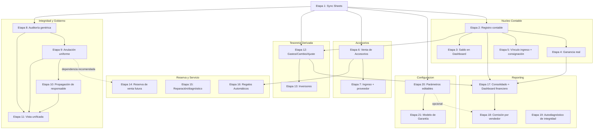

# Plan de Implementación Técnica — GreatPhones

## 0. Propósito y alcance de este documento

Este documento **no es documentación funcional**. Los cuatro documentos previos —`ESPECIFICACION_FUNCIONAL_ERP.md`, `AUDITORIA_ESPECIFICACION_FUNCIONAL.md`, `MATRIZ_DE_CAPACIDADES_GREATPHONES.md` y `PLAN_DE_EVOLUCION_GREATPHONES.md`— quedan **congelados como Especificación v1.0**. No se modifican, no se reinterpretan, no se vuelve a analizar código para cuestionar sus decisiones.

Este documento traduce exclusivamente lo ya aprobado en `PLAN_DE_EVOLUCION_GREATPHONES.md` a una secuencia de **etapas técnicas de desarrollo**: pequeñas, completas y desplegables de forma independiente. No diseña ninguna funcionalidad nueva. No introduce ninguna decisión de negocio nueva. Cada etapa fue verificada contra el código real de `greatphones-next` (schema de Prisma, árbol de endpoints, archivos de frontend) para que las rutas de archivo, nombres de modelo y convenciones citadas sean exactas, no aproximadas.

**Regla de oro de cada etapa**: al terminarla y desplegarla, el sistema sigue funcionando exactamente igual que antes para todo lo que ya funcionaba, y gana exactamente la capacidad nueva descripta — nunca más, nunca menos.

**Advertencia técnica transversal**: `public/lib/admin.js` declara una función `renderAdminContent` homónima a la de `public/lib/render.js`. Por el orden de carga de `<script defer>` en `index.html`, la de `render.js` sobrescribe a la de `admin.js` y es la única que efectivamente se ejecuta. **Todas las modificaciones de pantalla de este plan van en `public/lib/render.js`.** No tocar la función homónima de `admin.js` — no tiene efecto visible y tocarla solo generaría confusión.

**Comandos reales del proyecto**, usados de forma consistente en todas las etapas:
- `pnpm build` — compila (`prisma generate && next build`).
- `pnpm test` — corre tests unitarios con Vitest (patrón real: `*.route.test.ts` colocado junto a cada `route.ts`).
- `pnpm test:e2e` — corre tests end-to-end con Playwright (patrón real: `e2e/*.spec.ts`).
- `npx prisma migrate dev --name <descripcion>` — para cualquier cambio de schema (convención real de carpeta: `YYYYMMDDHHMMSS_descripcion`).

**Hallazgo que condiciona la Etapa 1**: se confirmó (grep exhaustivo) que **no existe hoy ninguna integración con Google Sheets** en el proyecto real — ni variables de entorno, ni librería, ni código. Toda la arquitectura de sincronización descripta en la Parte IV de la especificación funcional es, en términos de código, un punto de partida en cero. Por eso la primera etapa de este plan es exclusivamente esa infraestructura genérica, antes de que cualquier capacidad de negocio pueda "sincronizar" nada.

---

## 1. Orden de bloques y dependencias

Este plan sigue el orden de dependencias ya establecido en `PLAN_DE_EVOLUCION_GREATPHONES.md` §1.4:

1. **Infraestructura de sincronización con Google Sheets** (Etapa 1) — prerrequisito transversal de todo lo demás.
2. **Núcleo Contable** (Etapas 2-5) — todo lo relacionado con dinero depende de esto.
3. **Accesorios de Punta a Punta** (Etapas 6-7) e **Integridad y Gobierno de Operaciones** (Etapas 8-11) — pueden avanzar en paralelo entre sí, sin dependencia mutua salvo la referencia cruzada puntual señalada en la Etapa 14.
4. **Tesorería Derivada** (Etapas 12-13) y **Reporting e Inteligencia de Negocio** (Etapas 17-19) — dependen de que el Núcleo Contable ya exista.
5. **Reserva y Servicio** (Etapas 14-16) — Reserva y Reparaciones son independientes entre sí; Regalos Automáticos depende de que la Etapa 6 (Venta de Accesorios) ya esté en producción.
6. **Configuración de Negocio** (Etapas 20-21) — completamente independiente, puede desarrollarse en cualquier momento.



**Resumen ejecutivo de las 21 etapas**:

| # | Etapa | Bloque | Depende de | Complejidad |
|---|-------|--------|------------|-------------|
| 1 | Infraestructura de sincronización con Google Sheets | Transversal | ninguna | Media |
| 2 | Registro contable centralizado | Núcleo Contable | 1 | Media |
| 3 | Visibilidad de saldo de caja en Dashboard | Núcleo Contable | 2 | Baja |
| 4 | Ganancia real por venta | Núcleo Contable | — | Baja |
| 5 | Vínculo contable del ingreso + compra/consignación | Núcleo Contable | 2 | Media |
| 6 | Venta de Accesorios | Accesorios | 1 | Alta |
| 7 | Ingreso de mercadería de Accesorios + proveedor | Accesorios | — | Baja |
| 8 | Auditoría genérica y polimórfica | Integridad y Gobierno | 1 | Media |
| 9 | Anulación/corrección segura y uniforme | Integridad y Gobierno | 8 | Media |
| 10 | Propagación de responsable | Integridad y Gobierno | 9 | Baja |
| 11 | Vista unificada de operaciones | Integridad y Gobierno | 8,9,10 | Baja |
| 12 | Gastos + Cambio de Moneda + Ajuste de Caja | Tesorería Derivada | 2 | Media |
| 13 | Inversores (13a + 13b) | Tesorería Derivada | 12 | Alta |
| 14 | Reserva de venta futura | Reserva y Servicio | recomendado: 9 | Media |
| 15 | Reparación/diagnóstico técnico | Reserva y Servicio | — | Alta |
| 16 | Regalos Automáticos | Reserva y Servicio | 6 | Media |
| 17 | Consolidado financiero + Dashboard financiero | Reporting | 2,4 | Media |
| 18 | Comisión real por vendedor | Reporting | 17 | Media |
| 19 | Autodiagnóstico periódico de integridad | Reporting | — | Media |
| 20 | Parámetros de negocio editables | Configuración | — | Media |
| 21 | Consolidación del modelo de Garantía | Configuración | recomendado: 20 | Baja |

---

# Bloque: Infraestructura Transversal

## Etapa 1: Infraestructura base de sincronización con Google Sheets

**Objetivo**: contar con un mecanismo genérico, asíncrono y reutilizable para copiar hechos ya confirmados hacia Google Sheets, sin que ninguna etapa futura tenga que resolver esto de nuevo.

**Depende de**: ninguna.
**Bloquea a**: toda etapa posterior que mencione "sincronización con Google Sheets".

**Archivos que se modifican**: ninguno — es 100% aditiva.

**Archivos nuevos que se crean**:
- `src/lib/sheets-sync.ts` — módulo único con una función `syncToSheet(sheetTab: string, row: Record<string, unknown>): void` que encola la escritura y retorna inmediatamente (el llamador nunca espera). Internamente usa la librería oficial `googleapis` (cliente de cuenta de servicio) contra el Sheets API v4, `values.append` sobre la pestaña indicada.
- `src/lib/sheets-sync-queue.ts` — cola en memoria de proceso con reintento (hasta 3 intentos con backoff simple) y logging de fallo final a consola; si falla las 3 veces, descarta la fila y registra el error — nunca relanza la excepción hacia el llamador original.
- `src/lib/sheets-sync.test.ts` — test unitario (mock del cliente de Google): (a) un fallo del cliente de Sheets no lanza excepción hacia el llamador, (b) reintenta hasta 3 veces, (c) tras agotar reintentos continúa sin bloquear el proceso.

**Modelos Prisma que cambian**: ninguno.

**Endpoints que se agregan o modifican**: ninguno.

**Variables de entorno nuevas** (documentar en `.env.example`): `GOOGLE_SERVICE_ACCOUNT_EMAIL`, `GOOGLE_SERVICE_ACCOUNT_PRIVATE_KEY`, `GOOGLE_SHEETS_SPREADSHEET_ID` (un único spreadsheet destino, una pestaña por tipo de evento — el nombre de pestaña es el primer parámetro de `syncToSheet`).

**Pantallas que se modifican**: ninguna — cambio invisible para el usuario.

**Eventos nuevos**: ninguno de negocio — esta etapa es infraestructura pura, consumida por eventos de otras etapas.

**Sincronización con Google Sheets**: esta etapa *es* la sincronización — no sincroniza ningún dato de negocio todavía, solo prueba el mecanismo con una fila sintética.

**Pruebas manuales a realizar**:
1. Configurar las 3 variables de entorno contra una hoja de prueba (no la de producción).
2. Ejecutar un script puntual que llame `syncToSheet('Test', { hola: 'mundo' })` y confirmar que la fila aparece en la pestaña "Test" en menos de 60 segundos.
3. Apagar deliberadamente la credencial (variable vacía) y repetir la llamada — confirmar que la función no lanza excepción y la aplicación sigue funcionando con normalidad.

**Pruebas automáticas a agregar**: `src/lib/sheets-sync.test.ts`.

**Criterios de fin de etapa (Definition of Done)**:
- `pnpm build` y `pnpm test` pasan.
- Una llamada de prueba a `syncToSheet` escribe correctamente en la hoja configurada.
- Una falla simulada del cliente de Google nunca propaga una excepción al código que llamó a `syncToSheet` ni bloquea ninguna ruta existente.
- Ningún endpoint existente fue modificado — `pnpm test`/`pnpm test:e2e` de todo el proyecto siguen en verde exactamente igual que antes de esta etapa.

---

# Bloque: Núcleo Contable

## Etapa 2: Registro contable centralizado (tabla de movimientos de valor)

**Objetivo**: que cada hecho de negocio que mueve dinero quede registrado en un único lugar consultable, con saldo calculado siempre por agregación.

**Depende de**: Etapa 1.
**Bloquea a**: Etapa 3, 4, 5, y todo el bloque de Tesorería Derivada y Reporting.

**Archivos que se modifican**:
- `prisma/schema.prisma` — nuevo modelo (ver abajo).
- `src/app/api/webhooks/mercadopago/route.ts` — dentro del bloque `if (status === 'approved')`, agregar la creación de un `LedgerEntry` de ingreso por `order.total`, medio de pago `paymentMethod`, moneda `order.currency`, origen `'venta_online'`, referencia `order.id`. Este archivo hoy no envuelve sus escrituras en `prisma.$transaction` (usa `Promise.all` + updates sueltos) — agregar el `LedgerEntry` como una escritura más dentro del mismo `Promise.all`, sin convertir todo el webhook a `$transaction` (fuera de alcance de esta etapa; riesgo preexistente, no introducido por este cambio).
- `src/app/api/admin/instore-sale/route.ts` — dentro de la rama `paymentMethod === 'cash'` del `prisma.$transaction` ya existente, agregar la creación de un `LedgerEntry` de ingreso por `total`, medio `'Efectivo'`, origen `'venta_instore'`, referencia `newOrder.id`.
- `src/app/api/admin/instore-sale/[id]/approve/route.ts` — dentro del `prisma.$transaction` ya existente (confirmación por transferencia), agregar el mismo `LedgerEntry` con medio `'Transferencia'`.
- `src/app/api/inventory/[id]/sell/route.ts` — dentro del `prisma.$transaction` ya existente, agregar el mismo `LedgerEntry` con origen `'venta_inventario_directa'`.

**Archivos nuevos que se crean**:
- `src/lib/ledger.ts` — función `createLedgerEntry(tx, { type, amount, paymentMethod, currency, origin, referenceId, userId })` que centraliza la forma de escribir la entrada y dispara `syncToSheet('LibroDiario', {...})` de forma asíncrona (fire-and-forget) inmediatamente después de que la transacción de Prisma se confirma — nunca dentro de la transacción misma, para que un fallo de Sheets no pueda hacer rollback de una venta real.
- `src/lib/ledger.test.ts`.
- `src/app/api/admin/ledger/route.test.ts`.

**Modelos Prisma que cambian** (migración: `add_ledger_entry`):
```prisma
model LedgerEntry {
  id            String   @id @default(cuid())
  type          String   // INGRESO | EGRESO
  amount        Int      // siempre positivo; el signo lo da `type`
  paymentMethod String   // Efectivo | Transferencia | USD | ...
  currency      String   @default("ARS")
  origin        String   // venta_online | venta_instore | venta_inventario_directa | ingreso_inventario | gasto | cambio_moneda | ajuste_caja | comision | ...
  referenceType String?  // "Order" | "InventoryItem" | null
  referenceId   String?
  userId        String?
  note          String?
  createdAt     DateTime @default(now())
}
```
`referenceId` es genérico, sin FK obligatoria, porque etapas futuras (Inversores, Comisiones) referencian entidades que no son `Order`.

**Endpoints que se agregan o modifican**:
- `GET /api/admin/ledger?from=&to=&paymentMethod=` (nuevo) — lista paginada, admin-only. Solo consulta; no hay método de escritura directa — todo `LedgerEntry` nace como efecto secundario de otra operación.
- Los 4 endpoints de venta arriba listados no cambian su contrato de entrada/salida — solo ganan un efecto secundario interno.

**Pantallas que se modifican**: ninguna todavía (la visibilidad es la Etapa 3).

**Eventos nuevos**: `MovimientoValorRegistrado`.

**Sincronización con Google Sheets**: cada `LedgerEntry` se sincroniza, de forma inmediata y asíncrona, hacia la hoja "Libro Diario" (fecha, tipo, monto, medio, moneda, origen, referencia). Nunca se lee de vuelta.

**Pruebas manuales a realizar**:
1. Completar una compra online de punta a punta (checkout + pago aprobado sandbox) y confirmar el `LedgerEntry` de ingreso correcto.
2. Cargar una venta en local en efectivo y confirmar el `LedgerEntry` inmediato.
3. Cargar una venta en local por transferencia, dejarla pendiente, y confirmar que **no** se genera ningún `LedgerEntry` hasta la aprobación manual o el webhook de MP.
4. Vender un ítem de inventario directamente y confirmar el `LedgerEntry`.
5. Confirmar en Sheets que las filas aparecen dentro de 60 segundos.
6. Provocar un fallo deliberado de Sheets y repetir el punto 2 — la venta se registra igual, sin error visible.

**Pruebas automáticas a agregar**: `src/lib/ledger.test.ts`; extender `checkout/route.test.ts`; nuevo `webhooks/mercadopago/route.test.ts`; nuevo test en `admin/instore-sale/route.test.ts` para efectivo vs. transferencia.

**Criterios de fin de etapa (Definition of Done)**:
- `pnpm build`, `pnpm test`, `pnpm test:e2e` (incluido `e2e/checkout.spec.ts` sin modificar) en verde.
- Los 4 flujos de venta reales generan exactamente un `LedgerEntry` cada uno, nunca cero ni duplicado.
- Ninguna venta cancelada o rechazada por Mercado Pago genera `LedgerEntry`.
- Un fallo de Google Sheets nunca impide ni revierte una venta real.
- **Limitación conocida y aceptada**: la anulación de una venta ya confirmada todavía no genera una entrada de reversión — el saldo de caja puede quedar temporalmente sobrestimado hasta que exista la Etapa 9 (Anulación/corrección uniforme). No es responsabilidad de esta etapa resolverlo, pero queda documentado como hueco temporal aceptado.

## Etapa 3: Visibilidad de saldo de caja en el Dashboard

**Objetivo**: mostrar el saldo real de caja por medio de pago y moneda, sin mezclar ARS y USD, en el Dashboard ya existente.

**Depende de**: Etapa 2.
**Bloquea a**: Etapa 17 (Reportes/Dashboard financiero, que extiende este mismo punto).

**Archivos que se modifican**:
- `src/app/api/admin/dashboard/route.ts` — dentro del `Promise.all` ya existente, agregar `prisma.ledgerEntry.groupBy({ by: ['paymentMethod','currency','type'], _sum: { amount: true } })` y computar el saldo neto por combinación medio+moneda. Agregar `cashBalance: { paymentMethod, currency, balance }[]` a la respuesta, sin tocar ningún campo ya devuelto (`revenue`, `orders`, etc.).
- `public/lib/render.js` — dentro de `renderAdminContent('dashboard')`, agregar una tarjeta más al grid `.dash-kpis` por cada combinación medio+moneda devuelta, reutilizando el mismo componente visual de tarjeta que ya usan Ingresos/Pedidos/Ticket Promedio/Nuevos Usuarios — ninguna tarjeta de diseño distinto.

**Archivos nuevos que se crean**: ninguno.

**Modelos Prisma que cambian**: ninguno — consulta sobre `LedgerEntry`.

**Endpoints que se agregan o modifican**: `GET /api/admin/dashboard` (modificado): agrega `cashBalance`. Sin `from`/`to`, el saldo mostrado es acumulado histórico (no acotado al mes en curso como el resto de los KPIs) — dejarlo explícito para no confundirlo con los KPIs mensuales vecinos.

**Pantallas que se modifican**: Dashboard existente — nuevas tarjetas de saldo. Ninguna pantalla nueva.

**Eventos nuevos**: ninguno — lectura pura.

**Sincronización con Google Sheets**: ninguna nueva (ya cubierta por la Etapa 2).

**Pruebas manuales a realizar**:
1. Abrir el Dashboard y confirmar que los 4 KPIs originales se ven exactamente igual que antes.
2. Confirmar tarjetas de saldo por medio de pago, nunca sumadas entre sí.
3. Realizar una venta de prueba en efectivo y confirmar que el saldo sube sin recargar manualmente ningún botón.
4. Confirmar que un pedido `PENDING` (transferencia sin aprobar) no afecta ningún saldo.

**Pruebas automáticas a agregar**: `src/app/api/admin/dashboard/route.test.ts` (nuevo): shape incluye `cashBalance`; KPIs preexistentes sin cambio; ARS/USD nunca mezclados.

**Criterios de fin de etapa (Definition of Done)**:
- `pnpm build`/`pnpm test` pasan, sin regresión sobre el Dashboard existente.
- El saldo mostrado coincide, verificado manualmente contra `LedgerEntry`, con el saldo real.
- Ningún otro contenido del Dashboard cambia de comportamiento.

## Etapa 4: Cálculo de ganancia real por venta

**Objetivo**: que cada línea de pedido guarde el costo vigente al momento de la venta, para poder calcular margen real sin que un cambio de costo posterior lo distorsione.

**Depende de**: ninguna de este bloque (puede desarrollarse en paralelo a 2-3).
**Bloquea a**: Etapa 18 (Comisión) y Etapa 17 (Reportes financiero), ambas necesitan margen real.

**Archivos que se modifican**:
- `prisma/schema.prisma` — agregar campo a `OrderItem` (ver abajo).
- `src/app/api/checkout/route.ts` — en `tx.order.create`, al construir `items.create`, agregar `costAtSale: product.cost` para cada línea con `productId` (el `Map` `productMap` ya construido tiene el costo disponible, sin consulta adicional).
- `src/app/api/admin/instore-sale/route.ts` — en la construcción de `items.create` dentro del `$transaction`, agregar `costAtSale` usando el costo ya resuelto: `product.cost` para ítems `catalog`, `invRecord.purchasePrice` para ítems `inventory` (más preciso, costo real de ese ejemplar), `null` para ítems `custom` (sin costo conocido — fuera de alcance de esta etapa).
- `src/app/api/inventory/[id]/sell/route.ts` — en `tx.order.create`, agregar `costAtSale: item.purchasePrice`.

**Archivos nuevos que se crean**: ninguno.

**Modelos Prisma que cambian** (migración: `add_cost_at_sale`):
```prisma
model OrderItem {
  // ...campos existentes sin cambios...
  costAtSale Int? // costo vigente al momento de la venta; null si no hay costo conocido
}
```

**Endpoints que se agregan o modifican**: ninguno nuevo — los 3 endpoints de venta ganan el campo internamente.

**Pantallas que se modifican**: detalle de pedido existente — agregar columna "Ganancia" (`price - costAtSale`, solo si no es null).

**Eventos nuevos**: ninguno propio — se integra como dato adicional del evento de venta confirmada.

**Sincronización con Google Sheets**: `costAtSale` viaja como columna adicional en la fila que la Etapa 2 ya sincroniza a "Libro Diario" — sin hoja nueva.

**Pruebas manuales a realizar**:
1. Completar una venta online de un producto con costo cargado y confirmar la ganancia correcta en el detalle.
2. Vender un ítem de inventario con `purchasePrice` distinto del costo genérico y confirmar que la ganancia usa el costo específico del ejemplar.
3. Cambiar el costo de un producto después de una venta ya confirmada y confirmar que la ganancia de esa venta pasada no cambia.

**Pruebas automáticas a agregar**: extender `checkout/route.test.ts`; test nuevo para `inventory/[id]/sell/route.test.ts`.

**Criterios de fin de etapa (Definition of Done)**:
- `pnpm build`/`pnpm test` pasan.
- Todo pedido nuevo guarda `costAtSale` correctamente; pedidos anteriores quedan con `costAtSale = null` sin romper ninguna pantalla.

## Etapa 5: Vínculo contable del ingreso de inventario + Distinción compra propia/consignación

**Objetivo**: que dar de alta un equipo genere (si es compra propia) un egreso real de caja, y que un equipo en consignación no genere ningún movimiento hasta que efectivamente se venda.

**Depende de**: Etapa 2.
**Bloquea a**: ninguna etapa posterior de este bloque.

**Advertencia técnica encontrada**: el diseño asume que el alta de inventario "ya corre dentro de una lógica transaccional coherente". Se verificó el código real (`src/app/api/inventory/route.ts`, `POST`) y **esto no es así**: hoy es una secuencia de `await` sueltos, sin `prisma.$transaction`. Esta etapa introduce la primera escritura atómica real en este endpoint como parte de agregar el `LedgerEntry` — mínimo cambio estructural necesario para que el vínculo contable no quede a mitad de camino.

**Archivos que se modifican**:
- `prisma/schema.prisma` — agregar campo a `InventoryItem` (ver abajo).
- `src/app/api/inventory/route.ts` — en `POST`: (a) envolver la creación del `InventoryItem` y la creación condicional del `LedgerEntry` en un único `prisma.$transaction([...])`; (b) si `acquisitionType === 'OWN'`, crear un `LedgerEntry` de egreso por `purchasePrice`, origen `'ingreso_inventario'`; si `'CONSIGNMENT'`, no crear ningún `LedgerEntry` en esta ruta.
- `src/app/api/inventory/[id]/sell/route.ts` y las 3 rutas de venta de la Etapa 2 — si el `InventoryItem` vendido es `'CONSIGNMENT'`, crear (en la misma transacción que ya crea el ingreso de la venta) un segundo `LedgerEntry` de egreso por el monto acordado con el tercero (usar `purchasePrice` como ese monto, campo que ya representa "cuánto se le debe/pagó al proveedor" — no se introduce campo nuevo).
- Formulario real de alta de inventario en `public/lib/render.js` (verificar cuál renderiza el formulario antes de tocar, aplicando la misma verificación de override ya hecha para `renderAdminContent`) — agregar selector "Origen: Propio / Consignación".

**Archivos nuevos que se crean**: ninguno.

**Modelos Prisma que cambian** (migración: `add_inventory_acquisition_type`):
```prisma
model InventoryItem {
  // ...campos existentes sin cambios, incluido `investor` que se mantiene tal cual...
  acquisitionType String @default("OWN") // OWN | CONSIGNMENT
}
```
No se elimina ni renombra `investor` (texto libre existente) — sigue disponible para anotar de quién es la consignación; `acquisitionType` es el campo nuevo, cerrado, que condiciona el comportamiento contable.

**Endpoints que se agregan o modifican**: `POST /api/inventory` (acepta `acquisitionType` opcional, default `"OWN"` si no se envía — compatibilidad hacia atrás). Endpoints de venta de la Etapa 2: sin cambio de contrato.

**Pantallas que se modifican**: formulario de alta/edición de inventario existente — un selector más.

**Eventos nuevos**: ninguno propio — condiciones adicionales sobre `MovimientoValorRegistrado`.

**Sincronización con Google Sheets**: heredada de la Etapa 2, sin trabajo adicional.

**Pruebas manuales a realizar**:
1. Dar de alta un equipo "Propio" y confirmar el `LedgerEntry` de egreso y la baja de saldo de caja.
2. Dar de alta un equipo "Consignación" y confirmar que **no** se genera ningún `LedgerEntry`.
3. Vender ese equipo en consignación y confirmar los **dos** `LedgerEntry` (ingreso de venta + egreso al tercero) y el saldo neto correcto.
4. Repetir el alta sin enviar `acquisitionType` (integración antigua simulada) y confirmar comportamiento "Propio".

**Pruebas automáticas a agregar**: `src/app/api/inventory/route.test.ts` (nuevo): alta `'OWN'` genera egreso; `'CONSIGNMENT'` no genera ninguno; sin el campo se comporta como `'OWN'`. Extender tests de venta de la Etapa 2 para el caso consignación (dos `LedgerEntry` en la misma transacción).

**Criterios de fin de etapa (Definition of Done)**:
- `pnpm build`/`pnpm test` pasan.
- El alta de inventario nunca queda en estado intermedio (verificado provocando un fallo simulado a mitad de transacción).
- Un equipo en consignación no genera egreso hasta su venta real.
- El formulario de alta sigue funcionando para altas "Propio" exactamente igual que antes (regresión cero sobre el autocompletado por IMEI, que no se toca).

---

# Bloque: Accesorios de Punta a Punta

## Etapa 6: Venta de Accesorios

**Objetivo**: que un accesorio pueda venderse online (checkout), vía Mercado Pago (webhook) y en el local (Venta en Local), con stock real descontado, sin romper el flujo de `Product` ya funcionando.

**Depende de**: Etapa 1. Etapas 2-5 no son prerrequisito estricto, pero comparten la transacción de venta.
**Bloquea a**: Etapa 16 (Regalos Automáticos, técnicamente "una venta de accesorio a precio $0").

**Hallazgo real que acota el fix**: en `public/lib/instore.js`, la búsqueda de ítems ya llama a `/api/accessories` en paralelo con `/api/products` y marca cada resultado con `itemType:'accesorio'` o `'producto'` — el buscador de Venta en Local **ya muestra accesorios**. El bug está en `addFromSearch`: ignora `itemType` y siempre construye `{ type:'catalog', productId:id }`. Por eso el ID de un accesorio llega al backend como si fuera un producto y falla con "Producto no encontrado". En el checkout público, el problema es más profundo: no hay ningún discriminador de tipo, todo `item.id` se resuelve contra `prisma.product`.

**Archivos que se modifican**:
- `prisma/schema.prisma` — agregar a `Accessory`: `reserved Int @default(0)` y `sold Int @default(0)` (hoy solo tiene `stock`). Agregar a `OrderItem`: `accessoryId String?` + `accessory Accessory? @relation(...)` (mismo patrón que `productId`/`product`). Agregar a `Accessory`: relación inversa `orderItems OrderItem[]`.
- `src/app/api/checkout/route.ts` — cada ítem del body debe incluir `itemType` (`'producto'`|`'accesorio'`, ya generado hoy por el frontend). Separar `items` en dos grupos por `itemType`; resolver el grupo de accesorios contra `prisma.accessory.findMany`, validar `stock`, reservar en la misma transacción (`stock:{decrement}`, `reserved:{increment}`) y crear la línea con `accessoryId` en vez de `productId`.
- `src/app/api/webhooks/mercadopago/route.ts` — el `include` debe agregar `accessory: true`; los bloques que filtran `item.productId` deben ejecutar la misma lógica `reserved→sold` (aprobado) / `reserved→stock` (rechazado/cancelado) también para `item.accessoryId`.
- `src/app/api/admin/instore-sale/route.ts` — agregar cuarta categoría junto a `catalogItems`/`customItems`/`inventoryItems`: `accessoryItems`. Resolver contra `prisma.accessory.findMany`, validar stock igual que `catalogItems`. En la creación de líneas, agregar rama `type==='accessory'`. En la actualización de stock, agregar el mismo patrón cash→`sold`/transfer→`reserved` ya existente para `catalogItems`, aplicado a `Accessory`.
- `public/lib/instore.js` — `addFromSearch`: agregar parámetro `itemType`; si `'accesorio'`, empujar `{ type:'accessory', accessoryId:id, ... }`. El bloque que arma el payload final: agregar rama `type==='accessory'`.
- `public/lib/cart.js` — el carrito público debe guardar `itemType` por ítem y propagarlo al payload de checkout.

**Archivos nuevos que se crean**: ninguno — es extensión de rutas y archivos ya existentes.

**Modelos Prisma que cambian**: `Accessory` (+`reserved`, +`sold`, +`orderItems`), `OrderItem` (+`accessoryId`, +relación). Migración sugerida: `add_accessory_order_link`.

**Endpoints que se agregan o modifican**: `POST /api/checkout`, `POST /api/admin/instore-sale`, `POST /api/webhooks/mercadopago` (todos modificados, ninguno nuevo).

**Pantallas que se modifican**: Venta en Local (sin cambio visual, solo lógica interna). Carrito/checkout público: sin cambio visual, solo payload.

**Eventos nuevos**: ninguno — el evento de venta confirmada ya existente amplía su alcance a accesorios.

**Sincronización con Google Sheets**: ninguna nueva — la sincronización de "Venta" ya prevista amplía su alcance a líneas con `accessoryId`.

**Pruebas manuales a realizar**:
1. Agregar un accesorio al carrito público, completar checkout con MP sandbox, aprobar → `Accessory.stock` baja, `sold` sube, el pedido muestra el accesorio con su nombre real (no "Producto no encontrado").
2. Repetir rechazando el pago → stock se libera.
3. En Venta en Local, buscar un accesorio, agregarlo, cobrar en efectivo → `stock` baja, `sold` sube.
4. Repetir por transferencia → `reserved` sube; cancelar esa venta libera correctamente el `reserved` de accesorio (no solo el de producto).
5. Vender un `Product` normal (online y en local) → sin regresión.

**Pruebas automáticas a agregar**: extender `checkout/route.test.ts` (accesorio válido, stock insuficiente); nuevo test en `admin/instore-sale/route.test.ts` (accesorio efectivo y transferencia).

**Criterios de fin de etapa (Definition of Done)**: `pnpm build`/`pnpm test`/`pnpm test:e2e` (incluido `e2e/checkout.spec.ts` sin modificar) en verde; una compra de accesorio completa un ciclo online y presencial sin error; el flujo de `Product` sin diferencia de comportamiento.

## Etapa 7: Ingreso de mercadería de Accesorios + Trazabilidad de proveedor

**Objetivo**: que reponer stock de un accesorio registre costo real y proveedor, para que la ganancia de su venta deje de ser ficticia.

**Depende de**: ninguna (independiente de Etapa 6, aunque comparten el modelo `Accessory`).
**Bloquea a**: la utilidad real de accesorios en el Dashboard financiero (Etapa 17).

**Archivos que se modifican**:
- `prisma/schema.prisma` — agregar a `Accessory`: `cost Int @default(0)` (mismo rol que `Product.cost`) y `supplierId String?` + `supplier Supplier? @relation(...)` (mismo patrón que `Product`/`InventoryItem`). Agregar a `Supplier`: `accessories Accessory[]`.
- `src/app/api/accessories/route.ts` — los esquemas de creación/edición deben aceptar `cost` y `supplierId`; `POST`/`PUT` deben persistir ambos siguiendo el patrón `if (body.x !== undefined) data.x = ...` ya usado.
- `public/lib/admin.js` — `saveAccessory()`/`editAccessory(id)`: agregar `cost` y `supplierId` al payload y al formulario precargado, reutilizando el mismo selector de proveedor que ya existe en Producto/Inventario (no un componente nuevo).
- `src/app/api/accessories/route.ts` — agregar acción de "reponer stock" vía `PUT` con campo `restockQuantity` que incrementa `stock` y actualiza `cost`/`supplierId` de esa reposición (costo simple, no promedio ponderado).

**Archivos nuevos que se crean**: ninguno.

**Modelos Prisma que cambian**: `Accessory` (+`cost`, +`supplierId`, +relación), `Supplier` (+`accessories[]`). Migración sugerida: `add_accessory_cost_supplier`.

**Endpoints que se agregan o modifican**: `POST /api/accessories`, `PUT /api/accessories` (modificados, ninguno nuevo).

**Pantallas que se modifican**: pestaña Accesorios existente — campo de costo y selector de proveedor en el formulario, más botón "Reponer stock".

**Eventos nuevos**: ninguno (opcional a futuro, historial detallado de reposición — no obligatorio para el DoD de esta etapa).

**Sincronización con Google Sheets**: ninguna nueva — el costo/proveedor viaja como parte de la fila de Accesorio si esa hoja ya existe.

**Pruebas manuales a realizar**:
1. Editar un accesorio, cargar costo y proveedor, guardar → persiste.
2. Reponer stock con un costo distinto → stock sube, costo se actualiza.
3. Un accesorio sin costo/proveedor (dato legado) sigue vendiéndose sin error.

**Pruebas automáticas a agregar**: test que `cost`/`supplierId` se guardan y leen correctamente.

**Criterios de fin de etapa (Definition of Done)**: build/tests en verde; el formulario de Accesorios muestra y guarda costo y proveedor; ningún accesorio existente pierde datos ni queda invendible.

---

# Bloque: Integridad y Gobierno de Operaciones

## Etapa 8: Tabla de auditoría genérica y polimórfica

**Objetivo**: registrar, para cualquier entidad, qué cambió, quién lo cambió y cuál era el valor exacto antes del cambio — una sola tabla que sirve simultáneamente como auditoría y como snapshot recuperable.

**Depende de**: Etapa 1.
**Bloquea a**: Etapa 9, Etapa 10, Etapa 11.

**Archivos que se modifican**:
- `prisma/schema.prisma` — nuevo modelo (ver abajo). No se modifica ni elimina `InventoryHistory`.
- `src/app/api/inventory/[id]/history/route.ts` — sin cambios funcionales (sigue leyendo de `InventoryHistory`); se agrega solo un comentario indicando que es el punto de escritura a migrar en una etapa posterior, si se decide.

**Archivos nuevos que se crean**:
- `src/lib/audit.ts` — función `registerAudit({ entityType, entityId, action, oldValue, newValue, userId, description })`, invocada dentro de la misma transacción Prisma que modifica cada entidad (recibe el `tx` de la transacción, no una instancia nueva).
- `src/app/api/admin/audit/route.ts` — `GET` genérico, filtros opcionales `entityType`, `entityId`, `userId`, `from`, `to`, paginado (mismo patrón que `quotes?page=&limit=`).
- `src/lib/audit.test.ts`, `src/app/api/admin/audit/route.test.ts`.

**Modelos Prisma que cambian** (migración: `add_audit_log`):
```prisma
model AuditLog {
  id          String   @id @default(cuid())
  entityType  String   // "Order" | "Quote" | "Arrepentimiento" | "InventoryItem" | ...
  entityId    String
  action      String   // "CREATED" | "UPDATED" | "CANCELLED" | "STATUS_CHANGE" | ...
  oldValue    Json?    // snapshot completo del estado anterior (función de snapshot recuperable)
  newValue    Json?
  description String?
  userId      String?
  createdAt   DateTime @default(now())

  @@index([entityType, entityId])
}
```

**Decisión explícita sobre `InventoryHistory`**: **convive, no se deprecia en esta etapa.** `InventoryHistory` es hoy la única fuente real que lee `inventory/[id]/history/route.ts` y que escribe el flujo de cancelación de venta en local — ambos en producción, funcionando. Migrar su escritura al `AuditLog` genérico en esta misma etapa obligaría a tocar simultáneamente dos puntos críticos ya probados, violando el criterio de etapa pequeña. Desde esta etapa, `AuditLog` es el único punto de escritura para **toda entidad nueva** que empiece a auditarse (Pedido, Cotización, Arrepentimiento en la Etapa 9), mientras `InventoryItem` sigue escribiendo en `InventoryHistory` sin cambios hasta una etapa futura explícita (fuera de este plan) que decida migrarlo con su propio análisis de riesgo. Esta convivencia es una excepción documentada, no declarada permanente.

**Endpoints que se agregan o modifican**: `GET /api/admin/audit?entityType=&entityId=&userId=&from=&to=&page=&limit=` — admin-only, devuelve entradas ordenadas por `createdAt desc`.

**Pantallas que se modifican**: ninguna — etapa invisible.

**Eventos nuevos**: `AuditoriaRegistrada` — disparador: cualquier llamada a `registerAudit()`; reacción: sincronización asíncrona hacia Sheets.

**Sincronización con Google Sheets**: cada fila de `AuditLog` se sincroniza a la hoja "Auditoría" (entidad, id, acción, usuario, fecha, descripción — sin el JSON completo de `oldValue`/`newValue`, que queda solo en la base). Nunca se lee de vuelta.

**Pruebas manuales a realizar**:
1. Invocar manualmente `registerAudit` con datos de prueba y confirmar la fila en `GET /api/admin/audit`.
2. Confirmar que `GET /api/inventory/[id]/history` sigue devolviendo exactamente lo mismo (regresión cero).
3. Confirmar que `POST /api/admin/instore-sale/[id]/cancel` sigue funcionando igual (no se tocó).
4. Probar `GET /api/admin/audit` sin sesión admin → 401/403.

**Pruebas automáticas a agregar**: `registerAudit` inserta correctamente dentro de una transacción; filtros de consulta funcionan; admin-only.

**Criterios de fin de etapa (Definition of Done)**:
- `pnpm build`/`pnpm test` pasan.
- `InventoryHistory` y la cancelación de venta en local funcionan exactamente igual que antes.
- `AuditLog` existe y es consultable, sin que ninguna entidad lo use todavía para escribir (uso real empieza en Etapa 9).

## Etapa 9: Anulación/corrección segura y uniforme

**Objetivo**: una función genérica de "anular operación" reutilizable desde Pedidos, Cotizaciones y Arrepentimientos, con motivo obligatorio y reversión atómica de efectos.

**Depende de**: Etapa 8.
**Bloquea a**: Etapa 11.

**Hallazgo real a corregir de paso**: `admin/instore-sale/[id]/cancel/route.ts` hoy decrementa incondicionalmente `Product.sold`, aunque una venta pendiente de transferencia solo incrementó `reserved` al crearse, nunca `sold` — la función genérica de anulación debe corregir esto (decrementar `sold` solo si el pedido ya estaba en un estado donde `sold` se había incrementado). También reemplaza la búsqueda frágil `description: { contains: order.code }` por una relación real.

**Archivos que se modifican**:
- `src/app/api/admin/instore-sale/[id]/cancel/route.ts` — reescribir usando `voidOperation()` en vez de su lógica ad-hoc actual; corrige el bug de `sold` de paso.
- `public/lib/render.js` — agregar botón "Anular" (motivo obligatorio) a `openQuoteDetail()`, junto a los botones "Rechazar"/"Aceptar" ya existentes. Para Pedidos y Arrepentimientos: **no existe hoy ningún modal de detalle equivalente** (confirmado — solo `openQuoteDetail` existe; Pedidos y Arrepentimientos son listas planas) — esta etapa crea `openOrderDetail(id)`/`openArrepDetail(id)` replicando el patrón visual y estructural de `openQuoteDetail`, cada uno con su botón "Anular".
- `prisma/schema.prisma` — agregar `inventoryItemId String?` opcional a `OrderItem` para reemplazar la búsqueda por texto de la cancelación actual por una relación real.

**Archivos nuevos que se crean**:
- `src/lib/void-operation.ts` — función `voidOperation({ entityType, entityId, reason, userId })`: dentro de una transacción, revierte los efectos específicos de esa entidad (stock si es Pedido, condicionado al estado real previo — no incondicional), marca el estado terminal correspondiente ya existente, y llama a `registerAudit()` con `action:'CANCELLED'` y el estado anterior completo como `oldValue`.
- `src/app/api/admin/orders/[id]/void/route.ts`, `src/app/api/admin/quotes/[id]/void/route.ts`, `src/app/api/admin/arrepentimientos/[id]/void/route.ts` — tres endpoints delgados que validan `reason` no vacío y delegan en `voidOperation()`.
- Tests correspondientes.

**Modelos Prisma que cambian** (migración: `add_order_item_inventory_link`): `OrderItem.inventoryItemId String?` + relación opcional a `InventoryItem`.

**Endpoints que se agregan o modifican**: los tres `POST .../void` de arriba (`{ reason }`), cada uno 400 si `reason` vacío, 404 si no existe, 409 si ya en estado terminal.

**Pantallas que se modifican**: modal de Cotización existente (+botón Anular); modales nuevos de Pedido y Arrepentimiento (creados en esta etapa).

**Eventos nuevos**: `OperacionAnulada` — disparador: `voidOperation()` exitosa; reacción: reversión de efectos + `AuditoriaRegistrada` + sincronización a Sheets.

**Sincronización con Google Sheets**: cada `OperacionAnulada` viaja, vía el mismo mecanismo de la Etapa 8, a la hoja "Auditoría" ya creada.

**Pruebas manuales a realizar**:
1. Crear una venta en local pendiente por transferencia (sin confirmar), anularla, y confirmar que `Product.sold` **no** se decrementa (bug corregido) mientras `Product.reserved` sí se revierte.
2. Anular una Cotización pendiente sin motivo → 400.
3. Anular con motivo → estado terminal + aparece en `GET /api/admin/audit`.
4. Abrir el modal nuevo de Pedido/Arrepentimiento y confirmar el mismo estilo que Cotizaciones.
5. Anular dos veces la misma entidad → 409 en el segundo intento.

**Pruebas automáticas a agregar**: reversión de stock condicionada al estado previo (caso del bug corregido); rechazo de motivo vacío; rechazo de doble anulación; tests de los tres endpoints nuevos.

**Criterios de fin de etapa (Definition of Done)**:
- `pnpm build`/`pnpm test`/`pnpm test:e2e` (incluido `e2e/checkout.spec.ts` sin modificar) en verde.
- El bug de `Product.sold` decrementado incorrectamente queda corregido y cubierto por test automático.
- Pedido, Cotización y Arrepentimiento pueden anularse con motivo obligatorio, cada anulación queda en `AuditLog`.
- El chat, el historial de inventario y el resto del panel sin regresión.

## Etapa 10: Propagación de responsable

**Objetivo**: que Cotización y Arrepentimiento registren automáticamente qué administrador actuó, igual que ya hace Pedido con `adminId`.

**Depende de**: Etapa 9.
**Bloquea a**: ninguna de este bloque.
**Nota de dependencia cruzada**: si para este momento ya existe Reparación conectada a endpoints reales (Etapa 15, de otro bloque), agregar el mismo campo ahí también; si no, esta etapa se limita a Cotización y Arrepentimiento.

**Archivos que se modifican**:
- Endpoint real que procesa aprobación/rechazo de Cotización — agregar `adminId` tomado de la sesión (header ya usado en `requireAdmin`), nunca de un valor enviado por el cliente.
- `src/app/api/admin/arrepentimientos/route.ts` (PATCH) — agregar `adminId: auth.userId` al `data` del `update`.
- `src/lib/void-operation.ts` (Etapa 9) — confirmar que el `userId` recibido también popula el campo `adminId` de la entidad, no solo el `AuditLog`.

**Archivos nuevos que se crean**: ninguno.

**Modelos Prisma que cambian** (migración: `add_admin_id_to_quote_and_arrepentimiento`): `Quote.adminId String?` + relación (mismo patrón que `Order.adminId`/`Order.admin`); `Arrepentimiento.adminId String?` + relación.

**Endpoints que se agregan o modifican**: `PATCH /api/admin/arrepentimientos` (agrega `adminId` automático); endpoint de aprobación/rechazo de Cotizaciones (mismo tratamiento).

**Pantallas que se modifican**: modal de Cotización y modal nuevo de Arrepentimiento (Etapa 9) — línea "Gestionado por: {nombre}" cuando `adminId` no sea nulo.

**Eventos nuevos**: ninguno — atributo adicional de eventos ya existentes.

**Sincronización con Google Sheets**: el campo `adminId` (resuelto a nombre) se agrega como columna en las hojas de Cotizaciones y Arrepentimientos ya previstas.

**Pruebas manuales a realizar**:
1. Aprobar una Cotización como administrador X → el modal muestra "Gestionado por: X".
2. Rechazar un Arrepentimiento como administrador Y → lo mismo.
3. Enviar un `adminId` falso en el body → se ignora, siempre se usa el de la sesión.

**Pruebas automáticas a agregar**: test que confirma que `adminId` se toma de la sesión, no del body.

**Criterios de fin de etapa (Definition of Done)**: `pnpm build`/`pnpm test` pasan; `Quote.adminId` y `Arrepentimiento.adminId` se completan automáticamente en cada acción real; sin regresión en aprobación/rechazo existente.

## Etapa 11: Vista unificada de operaciones

**Objetivo**: un widget de "actividad reciente" en el Dashboard que combine Pedidos, Cotizaciones y Arrepentimientos (y Reparaciones si ya existen), con buscador simple por código, usando `AuditLog` como fuente.

**Depende de**: Etapa 8, Etapa 9, Etapa 10.
**Bloquea a**: ninguna.

**Archivos que se modifican**:
- `src/app/api/admin/dashboard/route.ts` — agregar bloque `recentActivity` consultando `AuditLog` (`orderBy createdAt desc`, `take: 20`), más parámetro opcional `?search=` que filtra por `entityId`/código relacionado.
- `public/lib/render.js` — dentro de `renderAdminContent('dashboard')`, agregar bloque "Actividad reciente" con input de búsqueda; cada fila enlaza al modal de detalle correspondiente (`openQuoteDetail`, `openOrderDetail`, `openArrepDetail`) según `entityType`.

**Archivos nuevos que se crean**: ninguno.

**Modelos Prisma que cambian**: ninguno.

**Endpoints que se agregan o modifican**: `GET /api/admin/dashboard?search=` — agrega `recentActivity` al JSON existente; sin parámetros, comportamiento idéntico salvo el campo nuevo.

**Pantallas que se modifican**: Dashboard existente — nuevo bloque "Actividad reciente" con buscador.

**Eventos nuevos**: ninguno — lectura sobre eventos ya generados en 8-10.

**Sincronización con Google Sheets**: ninguna nueva — puramente de lectura.

**Pruebas manuales a realizar**:
1. Anular una Cotización y un Arrepentimiento → ambas aparecen en "Actividad reciente" con su responsable.
2. Buscar por código de Pedido → filtra correctamente.
3. Confirmar que el Dashboard sigue mostrando sin cambios los 4 KPIs originales.
4. Clic en una fila de Cotización → abre el modal `quoteDetailModal` existente, no uno duplicado.

**Pruebas automáticas a agregar**: `recentActivity` devuelve las últimas 20 entradas correctas; `?search=` filtra; sin `search`, el resto de la respuesta no cambia.

**Criterios de fin de etapa (Definition of Done)**: `pnpm build`/`pnpm test`/`pnpm test:e2e` pasan; Dashboard muestra actividad combinada de al menos 3 tipos de entidad con buscador funcional; ningún KPI ni comportamiento previo cambió; etapas 8-11 verificadas end-to-end: crear → anular → ver en actividad reciente → ver responsable → ver en Sheets.

---

# Bloque: Tesorería Derivada

## Etapa 12: Movimientos manuales de Caja (Gastos + Cambio de Moneda + Ajuste de Caja)

**Objetivo**: dar de alta, desde una única pantalla, los tres tipos de movimiento manual de tesorería, todos escribiendo sobre `LedgerEntry`.

**Depende de**: Etapa 2, Etapa 1.
**Bloquea a**: Etapa 17, Etapa 13.

**Justificación de la pantalla única**: en el ERP eran tres hojas de Sheets separadas porque una hoja no puede modelar "un movimiento con tipo variable" sin volverse tres tablas distintas. En una base de datos relacional, los tres casos son la misma fila de `LedgerEntry` con `origin` distinto — construir tres pantallas copiaría la limitación técnica del ERP, no una necesidad real.

**Archivos que se modifican**:
- `public/lib/render.js` — en `renderAdminContent(tab)`: agregar rama `tab==='caja'` con formulario que cambia sus campos según un selector de tipo (`Gasto`/`Cambio de Moneda`/`Ajuste de Caja`); agregar `'caja'` a la lista de IDs de botones que se resetean.
- `public/index.html` — agregar botón `<button id="adm-caja" onclick="renderAdminContent('caja')">Caja</button>` junto a los demás.
- `prisma/schema.prisma` — documentar en comentario los nuevos valores de `origin` aceptados (`"gasto"`, `"cambio_moneda"`, `"ajuste_caja"`) — sin migración si `origin` ya es `String` libre.

**Archivos nuevos que se crean**:
- `src/app/api/admin/cash-movements/route.ts` — `POST` único para los tres tipos.
- `src/lib/validations.ts` — agregar `cashMovementSchema` (discriminado por `type`).
- `src/app/api/admin/cash-movements/route.test.ts`.

**Modelos Prisma que cambian**: ninguno nuevo. Se reutiliza `LedgerEntry` sin alterar su estructura.

**Endpoints que se agregan o modifican**:
- `POST /api/admin/cash-movements`:
  - `gasto`: `{ category, amount, method, receiptUrl?, note? }` → un `LedgerEntry` egreso.
  - `cambio_moneda`: `{ fromMethod, toMethod, usdAmount, rate }` → valida que exactamente uno de los métodos sea `USD`; calcula el monto en pesos server-side; crea **dos** `LedgerEntry` (egreso origen, ingreso destino) con `reference` común.
  - `ajuste_caja`: `{ method, adjustmentType:'sobrante'|'faltante', amount, reason }` → `reason` obligatorio; crea un `LedgerEntry` ingreso (sobrante) o egreso (faltante).
  - Todos admin-only, dentro de `prisma.$transaction`.

**Pantallas que se modifican**: pestaña nueva "Caja" — formulario con selector de tipo, historial reciente paginado.

**Eventos nuevos**: ninguno de primera clase — uso de `MovimientoValorRegistrado` con `origin` distinto. Opcional: `CambioMonedaRegistrado`.

**Sincronización con Google Sheets**: heredada automáticamente vía la Etapa 2 — sin trabajo nuevo, prueba de que el diseño del Núcleo Contable es extensible.

**Pruebas manuales a realizar**:
1. Cargar un Gasto de $5.000 en efectivo → saldo Efectivo baja $5.000.
2. Cargar un Cambio de Moneda de 10 USD a Efectivo con cotización 1000 → saldo USD baja 10, Efectivo sube $10.000, misma referencia en el historial.
3. Ajuste "Faltante" sin motivo → rechazo.
4. El mismo ajuste con motivo → saldo baja correctamente.
5. Confirmar la fila en Sheets dentro de 60 segundos.
6. Sin sesión admin → 401/403.

**Pruebas automáticas a agregar**: gasto válido crea 1 `LedgerEntry`; cambio de moneda crea 2 con misma referencia; cambio con ambos lados USD rechaza 400; ajuste sin motivo rechaza 400; sin sesión admin rechaza 401.

**Criterios de fin de etapa (Definition of Done)**:
- Los tres tipos se cargan sin error; el saldo del Dashboard (Etapa 3) refleja correctamente cada uno, sin mezclar monedas.
- Regresión cero (`pnpm test`/`pnpm test:e2e` en verde).
- Cada movimiento aparece en Sheets sin que la app dependa de esa sincronización para considerar la operación exitosa.

## Etapa 13: Inversores

> Dividida en dos sub-etapas independientes y desplegables por separado: **13a** (alta + movimientos básicos) puede usarse completa sin que **13b** (rendimiento periódico) exista todavía.

### Etapa 13a: Alta de Inversor y movimientos de capital

**Objetivo**: llevar la cuenta corriente de cada inversor (capital, pagado, pendiente) con movimientos vinculados por relación real, no por texto.

**Depende de**: Etapa 12, Etapa 2.
**Bloquea a**: Etapa 13b.

**Archivos que se modifican**:
- `public/lib/render.js` — dentro de `tab==='caja'`, agregar sub-navegación con dos vistas: "Movimientos" (Etapa 12) e "Inversores" (esta etapa) — no una pestaña de nivel superior nueva.
- `prisma/schema.prisma` — agregar los dos modelos nuevos.

**Archivos nuevos que se crean**:
- `src/app/api/admin/investors/route.ts` — `GET`/`POST`.
- `src/app/api/admin/investors/[id]/route.ts` — `GET`/`PUT`.
- `src/app/api/admin/investors/[id]/movements/route.ts` — `POST`.
- Tests correspondientes.

**Modelos Prisma que cambian** (migración: `add_investors`):
```prisma
model Investor {
  id              String   @id @default(cuid())
  name            String
  contact         String?
  capitalInvested Int      @default(0)
  totalPaid       Int      @default(0)
  pendingPayment  Int      @default(0)
  yieldRate       Float?
  createdAt       DateTime @default(now())
  updatedAt       DateTime @updatedAt
  movements       InvestorMovement[]
}

model InvestorMovement {
  id            String   @id @default(cuid())
  investorId    String
  investor      Investor @relation(fields: [investorId], references: [id])
  type          String   // CAPITAL_IN | CAPITAL_OUT | YIELD_PAYMENT | YIELD_ACCRUAL | ADJUSTMENT
  amount        Int
  note          String?
  ledgerEntryId String?  // vínculo real al asiento del Núcleo Contable, null si es YIELD_ACCRUAL
  createdById   String
  createdBy     User     @relation(fields: [createdById], references: [id])
  createdAt     DateTime @default(now())
}
```

**Endpoints que se agregan o modifican**:
- `POST /api/admin/investors` — `{ name, contact? }` → crea con capital en 0.
- `POST /api/admin/investors/[id]/movements` — `{ type, amount, note? }`:
  - `CAPITAL_IN`: incrementa `capitalInvested`, crea `LedgerEntry` ingreso, guarda `ledgerEntryId`.
  - `CAPITAL_OUT`: valida `amount <= capitalInvested` (400 si excede), decrementa, `LedgerEntry` egreso.
  - `YIELD_PAYMENT`: valida `amount <= pendingPayment` (400 si excede), incrementa `totalPaid`, decrementa `pendingPayment`, `LedgerEntry` egreso.
  - `ADJUSTMENT`: campo obligatorio `field: 'capitalInvested'|'pendingPayment'` que indica explícitamente qué campo toca (cierra la ambigüedad del ERP, donde "Ajuste" no modificaba nada de forma explícita).
  - Todo dentro de `prisma.$transaction`.

**Pantallas que se modifican**: sub-vista "Inversores" dentro de "Caja" — listado, detalle con historial, formulario de alta de movimiento.

**Eventos nuevos**: `MovimientoInversorRegistrado`.

**Sincronización con Google Sheets**: cada `InvestorMovement` se sincroniza a una hoja histórica "Inversores" (inversor, tipo, monto, fecha, responsable).

**Pruebas manuales a realizar**:
1. Dar de alta un inversor.
2. Aporte de $100.000 → `capitalInvested`=$100.000, `LedgerEntry` de ingreso reflejado en el saldo.
3. Retiro de $150.000 → rechazo (excede capital).
4. Retiro de $30.000 → `capitalInvested`=$70.000, egreso reflejado.
5. Pago de rendimiento de $1.000 sin `pendingPayment` → rechazo.
6. Confirmar el inversor en la hoja "Inversores" tras cada movimiento.

**Pruebas automáticas a agregar**: retiro que excede capital rechaza 400; pago que excede pendiente rechaza 400; aporte válido genera `LedgerEntry` vinculado por `ledgerEntryId` real; ajuste sin `field` rechaza 400.

**Criterios de fin de etapa (Definition of Done)**: un administrador puede dar de alta un inversor y registrar los 4 tipos de movimiento sin error; ningún movimiento con impacto de caja queda sin su `LedgerEntry` vinculado; los topes son imposibles de superar (verificado por test); regresión cero.

### Etapa 13b: Generación periódica de rendimiento

**Objetivo**: calcular, por período, el rendimiento devengado de cada inversor sin mover caja hasta que se pague explícitamente.

**Depende de**: Etapa 13a.
**Bloquea a**: ninguna.

**Archivos nuevos que se crean**: `src/app/api/admin/investors/generate-yield/route.ts` — `POST { period: 'YYYY-MM' }`.

**Endpoints que se agregan o modifican**: `POST /api/admin/investors/generate-yield` — para cada `Investor` con `yieldRate` definido, valida que no exista ya un `InvestorMovement` `YIELD_ACCRUAL` con ese período (rechaza duplicados), calcula `capitalInvested * yieldRate`, crea `InvestorMovement` `YIELD_ACCRUAL` (sin `ledgerEntryId`, no mueve caja), incrementa `pendingPayment`.

**Pantallas que se modifican**: sub-vista "Inversores" — botón "Generar rendimiento del mes" con selector de período.

**Eventos nuevos**: `RendimientoDevengado`.

**Sincronización con Google Sheets**: cada rendimiento generado se sincroniza a la misma hoja "Inversores".

**Pruebas manuales a realizar**: generar rendimiento para un período → `pendingPayment` sube sin mover el saldo de caja; generar el mismo período dos veces → se omite sin duplicar.

**Pruebas automáticas a agregar**: rendimiento duplicado en el mismo período se omite; rendimiento generado no crea ningún `LedgerEntry`.

**Criterios de fin de etapa (Definition of Done)**: rendimiento nunca duplica período; `pendingPayment` queda disponible para pagarse vía `YIELD_PAYMENT` sin ajuste manual.

---

# Bloque: Reserva y Servicio

## Etapa 14: Reserva de venta futura con cobro anticipado

**Objetivo**: permitir cobrar por adelantado algo que el negocio todavía no tiene en stock, sin bloquear el checkout público existente.

**Depende de**: ninguna de este bloque estrictamente. **Dependencia cruzada recomendada, no obligatoria**: que ya exista la Etapa 9 (Anulación uniforme) antes de producción — sin eso, cambiar el estado de una reserva no queda trazado a un responsable con motivo.
**Bloquea a**: ninguna.

**Archivos que se modifican**:
- `prisma/schema.prisma` — agregar valor `RESERVED` al enum `OrderStatus`. Agregar a `Order`: `amountPaid Int @default(0)` (acumulador de lo cobrado). El vínculo "ítem sin producto todavía" ya existe (`OrderItem.customName`/`customPrice`), no requiere campo nuevo.
- `src/app/api/orders/route.ts` — aceptar `RESERVED` como valor de `status` válido en listado/filtro.
- `src/app/api/admin/instore-sale/route.ts` — soporte para crear una orden `RESERVED` cuando el pago recibido es menor al total y el ítem es `type:'custom'`; saldo pendiente = `total - amountPaid`.
- `public/lib/instore.js` — indicador "Reservar sin stock" en el formulario existente cuando el ítem es personalizado y el pago es parcial.
- `public/lib/render.js` — extender filtros de la pestaña Pedidos para incluir `RESERVED` con su color/ícono (mismo patrón que `statusColors`/`statusLabels` de Cotizaciones).

**Archivos nuevos que se crean**:
- `src/app/api/admin/instore-sale/[id]/pay-balance/route.ts` — `POST`, cobra saldo adicional, incrementa `amountPaid`, pasa a `DELIVERED` si `amountPaid >= total`.
- `src/app/api/admin/instore-sale/[id]/assign-stock/route.ts` — `POST { productId | inventoryItemId }`, vincula la línea reservada a stock real ya ingresado (relación real, no texto).
- Tests correspondientes.

**Modelos Prisma que cambian** (migración: `add_reserved_order_status`): `OrderStatus` (+`RESERVED`), `Order` (+`amountPaid`).

**Endpoints que se agregan o modifican**: los dos nuevos de arriba, más `POST /api/admin/instore-sale` (acepta pago parcial).

**Pantallas que se modifican**: Venta en Local (indicador de reserva); Pedidos (filtro/estado nuevo, sin pantalla nueva).

**Eventos nuevos**: `ReservaCreada`, `ReservaAsignadaAStock`, `SaldoReservaCobrado`, `ReservaCancelada`.

**Sincronización con Google Sheets**: la reserva se sincroniza como cualquier pedido en la hoja de Pedidos ya prevista, con su estado `RESERVED` visible.

**Pruebas manuales a realizar**:
1. Crear una venta en local de un ítem personalizado con pago parcial → orden en `RESERVED` con `amountPaid` correcto.
2. Cobrar el saldo restante → pasa a `DELIVERED` al alcanzar el total.
3. Asignar un ítem de inventario real a esa reserva → vínculo real.
4. Confirmar que una venta normal no se ve afectada.

**Pruebas automáticas a agregar**: `pay-balance` rechaza sobre-cobro; `assign-stock` rechaza vincular a un ítem que no está `IN_STOCK`.

**Criterios de fin de etapa (Definition of Done)**: build/tests en verde; ciclo completo reserva→cobro de saldo→asignación de stock→entrega verificado; ninguna venta al contado cambia de comportamiento.

## Etapa 15: Reparación/diagnóstico técnico con presupuesto

**Objetivo**: activar el modelo `Repair`/`RepairService` ya existente (hoy sin ninguna ruta backend) conectándolo al flujo público y al cobro presencial.

**Depende de**: ninguna de este bloque.
**Bloquea a**: ninguna (opcionalmente, la Etapa 10 puede extender propagación de responsable a Reparación si ya existe).

**Hallazgo real**: `servicio.html` tiene un contenedor `#repairGrid`, poblado por `renderRepairGrid()` que itera sobre un arreglo **hardcodeado** `REPAIRS` en `constants.js` (con `ico`/`name`/`range` como texto fijo, ej. "$45.000 - $180.000") — no hay ningún click handler ni conexión a `RepairService`/`Repair`. Es puramente decorativa hoy, ni siquiera un botón sin backend.

**Archivos que se modifican**:
- `public/lib/constants.js` — eliminar el arreglo hardcodeado `REPAIRS`, reemplazado por una consulta real.
- `public/lib/render.js` — `renderRepairGrid()`: reemplazar la iteración de `REPAIRS` por `fetch(API_URL + '/api/repair-services')`, renderizando cada `RepairService` real con `onclick` que abre un formulario de solicitud.
- `public/lib/render.js` — generalizar `renderQuotesList`/`openQuoteDetail` para que la misma pestaña liste también `Repair` (discriminando por un campo `kind` en el objeto combinado), reutilizando el mismo layout de tarjeta y modal — sin duplicar código de renderizado.
- `src/app/api/admin/instore-sale/route.ts` — soporte para ítem `type:'repair'` con `repairId`, que al cobrarse marca `Repair.status` en estado terminal dentro de la misma transacción.

**Archivos nuevos que se crean**:
- `src/app/api/repair-services/route.ts` — `GET`, lista `RepairService` activos.
- `src/app/api/repairs/route.ts` — `GET` (listado admin paginado, mismo patrón que `quotes`), `POST` (público, crea `Repair` con `status:'PENDING'` o `'DIAGNOSIS'` según si el cliente ya eligió un servicio con precio).
- `src/app/api/repairs/[id]/route.ts` — `PATCH`, mismo contrato que `quotes` `PATCH` (`{status, price, rejectReason}`).
- Tests correspondientes.

**Modelos Prisma que cambian**: ninguno nuevo — `Repair`/`RepairService`/`RepairStatus` ya existen completos. Solo se agrega a `OrderItem`: `repairId String?` + relación (mismo patrón que `productId`/`accessoryId`).

**Endpoints que se agregan o modifican**: los tres nuevos de arriba, más `POST /api/admin/instore-sale` (acepta `type:'repair'`).

**Pantallas que se modifican**: `servicio.html`/`renderRepairGrid` (de estático a real); pestaña Cotizaciones existente, generalizada para listar también Reparaciones (sin pestaña nueva); Venta en Local (acepta cobrar una reparación).

**Eventos nuevos**: `ReparacionSolicitada`, `PresupuestoReparacionEnviado`, `PresupuestoReparacionAceptado`/`Rechazado`, `ReparacionEstadoActualizado`.

**Sincronización con Google Sheets**: cada reparación resuelta se sincroniza igual que cualquier operación, vía la infraestructura de la Etapa 1.

**Pruebas manuales a realizar**:
1. Desde `servicio.html`, solicitar una reparación con precio ya visible → crea `Repair` real con ese precio, sin diagnóstico.
2. Solicitar sin saber la falla → queda en `DIAGNOSIS` sin precio.
3. Como administrador, presupuestar desde Cotizaciones generalizada → el cliente puede aceptar/rechazar.
4. Cobrar una reparación aprobada como ítem de Venta en Local → pasa a estado terminal, admite cualquier medio de pago (no solo uno, a diferencia del ERP).
5. Confirmar que Cotizaciones de equipos usados no se ve afectado por la generalización.

**Pruebas automáticas a agregar**: creación con y sin servicio elegido; `PATCH` de presupuesto valida transición de estado; cobro vía Venta en Local marca estado terminal correcto.

**Criterios de fin de etapa (Definition of Done)**: build/tests en verde; ciclo completo solicitud→diagnóstico→presupuesto→aceptación→cobro verificado; Cotizaciones de equipos usados sin regresión.

## Etapa 16: Regalos Automáticos

**Objetivo**: entregar automáticamente un accesorio a precio $0 al vender ciertos modelos, sin intervención manual del vendedor.

**Depende de**: Etapa 6 (en producción — un regalo automático es, técnicamente, una venta de accesorio a precio cero).
**Bloquea a**: ninguna.

**Archivos que se modifican**:
- `src/app/api/checkout/route.ts` y `src/app/api/admin/instore-sale/route.ts` — dentro de la misma transacción que confirma la venta de un `Product`, después de crear las líneas, consultar si `Product.modelGroup` (ya existente) tiene una regla de regalo activa; si el accesorio vinculado tiene stock, agregar automáticamente una línea con `accessoryId`, `price:0`, decrementar stock/incrementar `sold`; si no hay stock, no bloquear la venta — solo notificación al administrador (reutilizando `Notification`/`NotifType` ya existente, sin tabla nueva).
- `public/lib/render.js` — extender Promociones existente con sub-sección "Reglas de regalo", reutilizando el mismo selector de productos/accesorios en lote (no un componente nuevo).

**Archivos nuevos que se crean**:
- `src/app/api/admin/gift-rules/route.ts` — `GET`/`POST`/`DELETE`.
- Tests correspondientes.

**Modelos Prisma que cambian** — única tabla nueva de este bloque, justificada en el plan de evolución:
```prisma
model GiftRule {
  id          String    @id @default(cuid())
  modelGroup  String    @unique
  accessoryId String
  accessory   Accessory @relation(fields: [accessoryId], references: [id])
  isActive    Boolean   @default(true)
  createdAt   DateTime  @default(now())
}
```
Migración sugerida: `add_gift_rule`. Agregar a `Accessory`: `giftRules GiftRule[]`.

**Endpoints que se agregan o modifican**: `GET/POST/DELETE /api/admin/gift-rules` (nuevo); `POST /api/checkout` y `POST /api/admin/instore-sale` (modificados).

**Pantallas que se modifican**: pestaña Promociones existente — sub-sección de reglas de regalo.

**Eventos nuevos**: `RegaloAutomaticoEntregado` (ya previsto en `ESPECIFICACION_FUNCIONAL_ERP.md` Parte V — esta etapa lo activa por primera vez).

**Sincronización con Google Sheets**: el ítem de regalo se sincroniza como cualquier línea de venta de accesorio, marcado explícitamente como regalo (`price:0`) para que Reportes lo excluya de facturación bruta.

**Pruebas manuales a realizar**:
1. Crear regla de regalo con stock disponible → vender un producto de ese grupo → línea de regalo automática a $0 y stock del accesorio bajó.
2. Repetir sin stock del accesorio → la venta se completa igual, sin el regalo, notificación al administrador.
3. Vender un producto sin regla asociada → sin línea extra.

**Pruebas automáticas a agregar**: regla activa con stock agrega línea de regalo; regla activa sin stock no bloquea la venta y genera notificación; producto sin regla no genera línea adicional.

**Criterios de fin de etapa (Definition of Done)**: build/tests en verde; el regalo se entrega automáticamente en checkout y Venta en Local sin intervención manual; ninguna venta sin regla configurada cambia de comportamiento.

---

# Bloque: Reporting e Inteligencia de Negocio

## Etapa 17: Consolidado Financiero y Dashboard con dimensión financiera

**Objetivo**: extender el Dashboard ya existente para mostrar saldo de caja por medio de pago y utilidad real del período, y agregar una vista "Financiero" exportable — sin crear una fuente de cálculo separada de la que ya usa el Dashboard comercial.

**Depende de**: Etapa 2, Etapa 4.
**Bloquea a**: Etapa 18.

**Por qué es una sola etapa y un solo endpoint**: separar "Dashboard" de "Reportes" en dos fuentes de cálculo fue un riesgo real y documentado del ERP anterior (podían mostrar cifras no coincidentes). Este diseño extiende el único endpoint `GET /api/admin/dashboard` en vez de crear uno paralelo, precisamente para que eso sea estructuralmente imposible.

**Archivos que se modifican**:
- `src/app/api/admin/dashboard/route.ts` — agregar soporte de query params opcionales `from`/`to` (si no vienen, comportamiento actual sin cambios). Agregar `cashBalance` (agregación de `LedgerEntry` agrupada por `paymentMethod`/`currency`, en el mismo `Promise.all` ya existente), `profit`/`profitChange` (calculado sobre `OrderItem.price - OrderItem.costAtSale` de pedidos no `CANCELLED` del período, mismo patrón de comparación mes-actual-vs-anterior ya usado para `revenueChange`/etc.), y `expenses` (suma de `LedgerEntry` egreso categoría "gasto operativo" del período — depende de que Etapa 12 exista; si no, devuelve `0` sin romper).
- `public/lib/render.js` — dentro de `renderAdminContent('dashboard')`, agregar botón `dashTabFinanciero` junto a `dashTabMensual`/`dashTabAnual`, invocando `setDashView('financiero')` reutilizando el mismo patrón condicional. La vista financiera agrega tres tarjetas al mismo grid `.dash-kpis`: "Saldo Efectivo", "Saldo Transferencia/USD" (separados, nunca sumados), "Utilidad del período" — mismo componente visual de tarjeta ya usado.

**Archivos nuevos que se crean**:
- `src/app/api/admin/dashboard/export/route.ts` — exportación a Excel del consolidado financiero (`from`/`to` como query params, admin-only), reutilizando exactamente el patrón técnico ya construido en `src/app/api/products/export/route.ts` (ExcelJS, mismo estilo de encabezado, mismo patrón de `Content-Disposition`). Columnas: fecha, categoría, medio de pago, ingreso, egreso, saldo corrido del período (calculado in-memory).

**Modelos Prisma que cambian**: ninguno. Etapa exclusivamente de consulta sobre `LedgerEntry` y `OrderItem.costAtSale` ya existentes.

**Endpoints que se agregan o modifican**:
- `GET /api/admin/dashboard` (modificado): agrega `?from=&to=`, agrega `cashBalance`/`profit`/`profitChange`/`expenses`. Sin parámetros: idéntico al actual.
- `GET /api/admin/dashboard/export?from=&to=` (nuevo): `.xlsx`, admin-only.

**Pantallas que se modifican**: Dashboard — sub-vista "Financiero" con botón de exportar.

**Eventos nuevos**: ninguno — capa de lectura sobre eventos ya generados (`MovimientoValorRegistrado`, `VentaConfirmada`).

**Sincronización con Google Sheets**: un snapshot mensual (disparado manualmente desde "Exportar", o por el mecanismo periódico de la Etapa 8/infra) hacia la hoja histórica "Reportes", mismas columnas del Excel. Nunca leído de vuelta.

**Pruebas manuales a realizar**:
1. Abrir Dashboard, confirmar que Ingresos/Pedidos/Ticket Promedio/Nuevos Usuarios muestran exactamente los mismos valores que antes.
2. Vista "Financiero" — saldo Efectivo y Transferencia/USD por separado, nunca sumados.
3. Registrar una venta de prueba y confirmar que saldo y utilidad se actualizan sin recargar manualmente ningún "botón de actualizar" (sin reintroducir el patrón de recálculo manual del ERP).
4. Exportar el Excel del mes en curso, confirmar totales coincidentes con lo mostrado en pantalla.
5. Probar el endpoint sin sesión admin → 401/403.

**Pruebas automáticas a agregar**: `src/app/api/admin/dashboard/route.test.ts` (nuevo): sin `from`/`to` mismo shape que hoy; con `from`/`to` filtra correctamente; `cashBalance` nunca suma ARS+USD; no-admin recibe 403. `src/app/api/admin/dashboard/export/route.test.ts`: buffer `.xlsx` válido; admin-only.

**Criterios de fin de etapa (Definition of Done)**:
- `pnpm build`/`pnpm test`/`pnpm test:e2e` (incluido `e2e/checkout.spec.ts` sin modificar) en verde.
- El Dashboard muestra los mismos 4 KPIs originales sin diferencia visual ni de valor.
- La vista "Financiero" es accesible, exportable, y sus cifras son auditables manualmente contra `LedgerEntry` (verificación cruzada, no solo confianza en la UI).

## Etapa 18: Comisión real por vendedor

**Objetivo**: calcular y liquidar, al cierre de un período, un monto de comisión real por administrador, sobre las ventas donde existe un responsable identificable.

**Depende de**: Etapa 2, Etapa 17.
**Bloquea a**: ninguna.
**Nota de secuencia**: el porcentaje de comisión debería leerse de la tabla de Configuraciones (Etapa 20). Si esa etapa no está lista al llegar acá, usar un valor fijo temporal marcado `TODO: leer de Configuración cuando exista`, migrable sin nueva migración de esquema.

**Alcance de negocio explícito, no ampliado por esta etapa**: `Order.adminId` hoy solo se completa en ventas presenciales (`saleChannel != 'online'`) — el checkout público no asigna administrador responsable. Esta etapa **no decide** si eso debe cambiar (por ejemplo, atribuir ventas online asistidas por chat a un administrador) — es una decisión de negocio pendiente ya señalada en la documentación existente. El cálculo de esta etapa opera únicamente sobre `Order` con `adminId` no nulo, tal como existe hoy.

**Archivos que se modifican**:
- `public/lib/render.js` — dentro de `renderAdminContent('dashboard')`, agregar sub-sección "Comisiones" (dentro de la vista "Financiero" de la Etapa 17, como tabla adicional, no una pestaña nueva) con tabla por administrador (ventas del período, base, comisión estimada) y botón "Cerrar período" con confirmación.

**Archivos nuevos que se crean**:
- `src/app/api/admin/commissions/route.ts` — `GET` (vista previa en vivo, no persistida).
- `src/app/api/admin/commissions/close/route.ts` — `POST` (cierre definitivo).
- Tests correspondientes.

**Modelos Prisma que cambian** (migración: `add_commission_settlement`):
```prisma
model CommissionSettlement {
  id          String   @id @default(cuid())
  adminId     String
  admin       User     @relation(fields: [adminId], references: [id])
  periodStart DateTime
  periodEnd   DateTime
  baseAmount  Int
  rate        Int      // % aplicado al momento del cierre (snapshot, no referencia viva a Configuración)
  amount      Int
  createdAt   DateTime @default(now())

  @@unique([adminId, periodStart, periodEnd])
}
```
La restricción `@unique` evita liquidar dos veces el mismo período para el mismo administrador. Agregar relación inversa `commissionSettlements CommissionSettlement[]` a `User`.

**Endpoints que se agregan o modifican**:
- `GET /api/admin/commissions?periodStart=&periodEnd=` — agrupa `Order` por `adminId` (`adminId: {not:null}`, `status: {not:'CANCELLED'}`, rango de fecha), calcula base y comisión estimada sin persistir. Admin-only.
- `POST /api/admin/commissions/close` — recibe `adminId`, `periodStart`, `periodEnd`; recalcula server-side (nunca confía en un monto del cliente); rechaza si ya existe liquidación para ese período/admin; en transacción, crea `CommissionSettlement` + `LedgerEntry` de egreso categoría "Comisión".

**Pantallas que se modifican**: Dashboard, vista "Financiero" — tabla de comisiones + botón de cierre.

**Eventos nuevos**: `ComisionLiquidada` — disparador: cierre confirmado; genera `CommissionSettlement` + `MovimientoValorRegistrado`; siempre síncrono.

**Sincronización con Google Sheets**: cada `ComisionLiquidada` se sincroniza, inmediata y en segundo plano, a la hoja "Comisiones" (administrador, período, base, tasa, monto, fecha de cierre).

**Pruebas manuales a realizar**:
1. Con al menos una venta en local con administrador identificado, abrir la vista previa del mes en curso y confirmar que el monto base coincide con la suma real.
2. Confirmar que una venta online (sin administrador) **no** aparece en ningún cálculo.
3. Cerrar el período → nuevo egreso en el saldo de caja (Etapa 17) por el monto liquidado.
4. Intentar cerrar el mismo período dos veces → rechazo en el segundo intento, sin duplicar egreso.
5. Confirmar que el monto nunca proviene de un valor editable por el navegador.

**Pruebas automáticas a agregar**: agregación correcta excluyendo ventas sin `adminId` y `CANCELLED`; rechazo de cierre duplicado; creación correcta del `LedgerEntry` asociado en la misma transacción.

**Criterios de fin de etapa (Definition of Done)**: `pnpm build`/`pnpm test` pasan, incluidos los de Etapa 17 sin modificar; ningún cierre puede duplicarse; el saldo de caja refleja correctamente cada egreso de comisión; la tasa usada queda guardada como snapshot en la propia liquidación — un cambio futuro de configuración nunca altera liquidaciones ya cerradas.

## Etapa 19: Autodiagnóstico periódico de inconsistencias

**Objetivo**: detectar proactivamente, sin corregir nada automáticamente, estados imposibles del negocio entre entidades relacionadas, y mostrar un semáforo de salud en el Dashboard.

**Depende de**: ninguna estrictamente (puede construirse en paralelo a 17/18), pero su valor crece con más etapas de este plan ya desplegadas.
**Bloquea a**: ninguna.

**Archivos que se modifican**:
- `public/lib/render.js` — dentro de `renderAdminContent('dashboard')`, agregar indicador de semáforo (verde/amarillo/rojo según severidad más alta de la última corrida) junto a los KPIs, con expansión a la lista breve de hallazgos activos.

**Archivos nuevos que se crean**:
- `src/app/api/admin/integrity/run/route.ts` — `POST`, dispara una corrida completa.
- `src/app/api/admin/integrity/latest/route.ts` — `GET`, resumen de la corrida más reciente.
- `src/lib/integrity-checks.ts` — módulo con las reglas de verificación como funciones versionadas en código (no editables desde el panel — decisión ya justificada en el plan de evolución). Reglas mínimas de la primera versión:
  1. `Order.status='DELIVERED'` con `OrderItem` vinculado a `InventoryItem` cuyo `status != 'SOLD'` — CRITICAL.
  2. `InventoryItem.status='SOLD'` sin ningún `OrderItem` que lo referencie — ERROR.
  3. `Product.stock < 0` — ERROR.
  4. `Arrepentimiento.estado='APROBADO'` con `Order.status != 'CANCELLED'` (doble representación de estado ya detectada en la auditoría previa) — CRITICAL.
  5. `Order.adminId` no nulo con `saleChannel='online'` (dato que hoy nunca debería darse) — WARNING.
  6. Suma de `LedgerEntry` asociados a un `Order` que no coincide con `Order.total` — ERROR.
- Tests correspondientes.

**Modelos Prisma que cambian** (migración: `add_integrity_finding`):
```prisma
model IntegrityFinding {
  id         String   @id @default(cuid())
  runId      String   // agrupa los hallazgos de una misma corrida
  rule       String
  severity   String   // INFO | WARNING | ERROR | CRITICAL
  entityType String
  entityId   String
  message    String
  createdAt  DateTime @default(now())
}
```
Una sola tabla — el "resumen de última corrida" se obtiene agrupando por `runId`.

**Endpoints que se agregan o modifican**:
- `POST /api/admin/integrity/run` — ejecuta las 6 reglas en secuencia, genera un `runId` nuevo, inserta un `IntegrityFinding` por hallazgo (corrida "limpia" = ausencia de filas con ese `runId`, más un registro mínimo de que la corrida ocurrió). Nunca modifica ninguna otra tabla.
- `GET /api/admin/integrity/latest` — agrupa por severidad los hallazgos del `runId` más reciente.
- **Nota de trigger**: el disparo periódico requiere un cron externo a la aplicación (de la plataforma de despliegue) llamando a `POST /api/admin/integrity/run` — la infraestructura exacta de ese cron queda fuera del alcance de esta etapa; el endpoint debe poder invocarse tanto por ese disparador como manualmente.

**Pantallas que se modifican**: Dashboard — semáforo + lista breve de hallazgos activos.

**Eventos nuevos**: `ChequeoIntegridadCompletado`, `InconsistenciaDetectada` (uno por hallazgo individual).

**Sincronización con Google Sheets**: cada corrida completa se sincroniza como fila histórica en "Salud del Sistema" (fecha, cantidad de hallazgos por severidad) — consulta manual, nunca fuente de verdad ni disparador de ninguna acción.

**Pruebas manuales a realizar**:
1. Ejecutar `POST /api/admin/integrity/run` sobre datos limpios → sin hallazgos.
2. Provocar deliberadamente (en ambiente de prueba, no producción) una de las 6 inconsistencias → la siguiente corrida la detecta con la severidad correcta.
3. Confirmar que ninguna corrida modifica ningún dato fuera de `IntegrityFinding` (los datos "rotos" siguen rotos después de correr el chequeo).
4. Confirmar que el semáforo refleja correctamente la severidad más alta de la corrida más reciente.

**Pruebas automáticas a agregar**: una por cada una de las 6 reglas, con casos positivo y negativo; `POST /api/admin/integrity/run` es admin-only, genera un `runId` nuevo en cada llamada, no modifica ninguna tabla fuera de `IntegrityFinding`.

**Criterios de fin de etapa (Definition of Done)**:
- `pnpm build`/`pnpm test` pasan, incluidos los de etapas anteriores sin modificar.
- Las 6 reglas iniciales cubiertas por test automatizado, cada una con al menos un caso positivo y uno negativo.
- Una corrida completa sobre la base de datos de producción actual no debe reportar ningún hallazgo CRITICAL sin que el equipo lo haya revisado y aceptado explícitamente antes de cerrar la etapa.
- El semáforo es visible sin afectar ningún otro contenido ya existente del Dashboard.

---

# Bloque: Configuración de Negocio

## Etapa 20: Parámetros de negocio editables sin tocar código

**Objetivo**: mover las cifras comerciales variables (tasación de equipos usados, garantía extendida, envío) desde código hardcodeado a una tabla de configuración editable desde el panel, y hacer que el servidor recalcule esos montos en vez de confiar en el cliente.

**Depende de**: ninguna.
**Bloquea a**: Etapa 18 (comisión, opcional — puede usar valor temporal si esta etapa no está lista).

**Hallazgos de verificación exactos** (inventario completo de lo que hay que migrar): (1) `public/lib/sell.js` lee `COTIZ_BASE`/`COTIZ_COND`/`COTIZ_EXT`/`SMULT` de `constants.js` **en el navegador del cliente** para calcular el precio de cotización de un equipo usado — el cliente puede alterar estos valores antes de enviar. (2) `src/app/api/quotes/route.ts` `POST` acepta `basePrice`/`finalPrice` directamente del body sin ningún recálculo server-side. (3) `src/app/api/checkout/route.ts` acepta `warrantyCost`/`deliveryCost` del body sin validarlos contra ninguna tabla de referencia. (4) `public/pages/detail.html` hardcodea `data-w="85000"`/`data-w="150000"` (garantía extendida) y `data-d="5000"`/`data-d="8000"` (envío) como atributos HTML.

**Archivos que se modifican**:
- `public/lib/sell.js` — reemplazar la lectura directa de constantes por una llamada a `GET /api/config/quote-pricing` al cargar la página (una vez, cacheada en memoria durante la sesión de cotización); el cálculo mostrado en pantalla sigue siendo client-side para feedback instantáneo, pero deja de ser la fuente de verdad.
- `src/app/api/quotes/route.ts` — en `POST`, antes de crear el `Quote`, recalcular `basePrice`/`finalPrice` server-side a partir de `device`/`storage`/`condition`/`extras` recibidos y los valores de configuración; descartar el valor del body si no coincide (usar el recalculado, no rechazar la request).
- `src/app/api/checkout/route.ts` — antes de usar `warrantyCost`/`deliveryCost`, recalcularlos server-side contra la configuración (clave de garantía según meses, clave de envío según zona), en vez de aceptar el monto del body.
- `public/pages/detail.html` — reemplazar los atributos `data-w`/`data-d` hardcodeados por valores inyectados en tiempo de carga desde `GET /api/config/quote-pricing` (mismo endpoint que consume `sell.js`, ampliado con las claves de garantía/envío).
- `public/lib/render.js` — agregar rama `tab==='config'` en `renderAdminContent(tab)`; agregar `'config'` a la lista de IDs de botones de pestaña.
- `public/index.html` — agregar botón `<button id="adm-config" onclick="renderAdminContent('config')">Configuración</button>`.

**Archivos nuevos que se crean**:
- `src/app/api/config/route.ts` — `GET` (lectura admin-only de todas o algunas claves) / `PUT` (escritura, admin-only).
- `src/app/api/config/quote-pricing/route.ts` — `GET` público, expone solo el subconjunto necesario para cotizar/garantía/envío (no expone claves internas de comisión u otras).
- `src/lib/config.ts` — `getConfig(key)`/`getConfigBatch(keys[])` con cache en memoria de corta duración, invalidada al escribir.
- Tests correspondientes.

**Modelos Prisma que cambian** (migración: `add_business_config`):
```prisma
model BusinessConfig {
  id          String   @id @default(cuid())
  key         String   @unique
  value       Json
  description String?
  updatedById String?
  updatedBy   User?    @relation(fields: [updatedById], references: [id])
  updatedAt   DateTime @updatedAt
  createdAt   DateTime @default(now())
}
```
Agregar relación inversa `configUpdates BusinessConfig[]` a `User`. Claves iniciales a poblar: `quote.cotizBase`, `quote.cotizCond`, `quote.cotizExt`, `quote.storageMult` (migradas de las constantes homónimas), `warranty.extended12m` (85000), `warranty.extended24m` (150000), `delivery.standard` (5000), `delivery.express` (8000).

**Endpoints que se agregan o modifican**:
- `GET /api/config?keys=a,b,c` (admin-only).
- `PUT /api/config` (admin-only) — recibe `{key, value}` o array; valida tipo por clave (Zod); registra `updatedById`/`updatedAt`; genera entrada de auditoría (Etapa 8, si ya existe; si no, log mínimo no bloqueante).
- `GET /api/config/quote-pricing` (público) — expone solo las 8 claves listadas.
- `POST /api/quotes` y `POST /api/checkout` (modificados): recalculan server-side.

**Pantallas que se modifican**: pantalla nueva "Configuración de Negocio" (única nueva de esta etapa, justificada en el plan de evolución) — grilla clave→valor editable en línea, mismo patrón visual de edición en línea ya usado en Stock/Promociones.

**Eventos nuevos**: `ConfiguracionActualizada` — disparador: `PUT /api/config`; genera: nuevo valor persistido + entrada de auditoría; siempre síncrono.

**Sincronización con Google Sheets**: cada `ConfiguracionActualizada` se sincroniza a una hoja histórica "Configuración" (clave, valor anterior, valor nuevo, quién, cuándo).

**Pruebas manuales a realizar**:
1. Cambiar `warranty.extended12m` de 85000 a 90000, guardar.
2. Abrir el detalle de un producto (sin redesplegar) y confirmar que la garantía de 12 meses muestra $90.000.
3. Completar un checkout con esa garantía y confirmar que el pedido se guarda con `warrantyCost=90000`.
4. Manipular manualmente (herramientas de red) el `warrantyCost` enviado y confirmar que el pedido persistido usa el monto recalculado por el servidor.
5. Repetir para una cotización de equipo usado (`finalPrice` manipulado).
6. Confirmar que un no-administrador no puede acceder a `PUT /api/config` (403).

**Pruebas automáticas a agregar**: lectura/escritura admin-only y rechazo de tipo inválido; `finalPrice` manipulado es descartado y reemplazado por el recalculado; `warrantyCost`/`deliveryCost` manipulados son recalculados server-side (extender `checkout/route.test.ts`).

**Criterios de fin de etapa (Definition of Done)**:
- `pnpm build`/`pnpm test`/`pnpm test:e2e` (incluido `e2e/checkout.spec.ts` sin modificar) en verde.
- Ningún valor de garantía/envío/cotización persiste sin haber pasado por el recálculo server-side (verificado con test automático).
- Cambiar un valor en "Configuración de Negocio" se refleja en checkout/cotización/detalle sin redespliegue de código.
- `constants.js` deja de ser la fuente de verdad para estos 4 valores (puede conservarlos como fallback de UI, nunca como lo que efectivamente se cobra o persiste).

## Etapa 21: Consolidación del modelo de datos de Garantía

**Objetivo**: que la confirmación de un pedido cree siempre un registro real de `Guarantee`, y que la consulta pública de garantía lea de ahí en vez de interpretar texto por coincidencia de substring.

**Depende de**: ninguna estrictamente (el modelo `Guarantee` ya existe en el schema); se beneficia de que la Etapa 20 ya exista para que la duración de cada tipo de garantía también salga de configuración — si no está lista, usar los mismos valores fijos que hoy usa `warranty/route.ts` (90/365/730 días), documentado como deuda a resolver luego.
**Bloquea a**: ninguna.

**Archivos que se modifican**:
- `src/app/api/webhooks/mercadopago/route.ts` y el punto equivalente de confirmación de venta en local (`admin/instore-sale/route.ts` / `.../approve/route.ts`) — en el mismo paso transaccional donde el pedido pasa a confirmado, crear un `Guarantee` vinculado (`userId`, `product`, `type` derivado de `order.warranty`, `expiresAt` calculado con la misma lógica de días que hoy vive en `warranty/route.ts`).
- `src/app/api/warranty/route.ts` — reemplazar el bloque de cálculo por substring (`order.warranty.toLowerCase().includes(...)`) por una consulta a `Guarantee` vinculado a ese `Order`. El contrato de respuesta del endpoint (`type`/`daysTotal`/`daysRemaining`/`expiresAt`/`isActive`/`canExtend`) **no cambia** — solo cambia su fuente de datos.
- `public/lib/render.js` — en el modal de detalle de Pedido existente, agregar indicador de estado de garantía (`ACTIVE`/`EXPIRED`/`USED`/`CANCELLED`) leyendo del `Guarantee` vinculado.

**Archivos nuevos que se crean**: ninguno — es reconexión de un modelo ya existente.

**Modelos Prisma que cambian** (migración: `add_guarantee_order_relation`): agregar a `Guarantee`: `orderId String?` + relación (nullable, la tabla está vacía hoy). Agregar a `Order`: relación inversa `guarantees Guarantee[]`.

**Endpoints que se agregan o modifican**: `GET /api/warranty` (modificado, mismo contrato público) — consulta `Guarantee` por `orderId` en vez de parsear `order.warranty`.

**Pantallas que se modifican**: modal de detalle de Pedido ya existente — indicador de estado de garantía.

**Eventos nuevos**: `GarantiaCreada` (disparador: confirmación de venta); `GarantiaExtendida` (si en el futuro se permite extender después de la compra — no forma parte del alcance mínimo si esa función no existe aún en el frontend).

**Sincronización con Google Sheets**: cada `GarantiaCreada` se sincroniza a la hoja histórica "Garantías" ya prevista en la arquitectura de sincronización (Parte IV de la especificación funcional).

**Pruebas manuales a realizar**:
1. Completar una compra online con garantía extendida de 12 meses, confirmar el pago, verificar que se creó un `Guarantee` con `expiresAt` a 365 días y `orderId` vinculado.
2. Consultar `GET /api/warranty?code=<código>` y confirmar que la respuesta coincide exactamente con lo que mostraba antes de esta etapa para pedidos ya existentes (que no tienen `Guarantee` vinculado — el endpoint debe hacer *fallback* al cálculo por texto legado únicamente para esos pedidos viejos, nunca para los nuevos).
3. Completar una venta en local con garantía básica (90 días) y confirmar la misma creación de `Guarantee`.
4. Abrir el modal de detalle de un pedido y confirmar que muestra el estado de garantía correctamente.

**Pruebas automáticas a agregar**: pedido con `Guarantee` vinculado devuelve datos desde ahí; pedido legado sin `Guarantee` cae al cálculo por texto (fallback); ambos casos devuelven el mismo shape de respuesta; la transacción de confirmación crea exactamente un `Guarantee` por pedido, nunca duplicado ante reintentos del webhook.

**Criterios de fin de etapa (Definition of Done)**:
- `pnpm build`/`pnpm test` pasan, incluidos los tests existentes de checkout y webhook sin modificar su comportamiento observable.
- `GET /api/warranty` devuelve exactamente los mismos resultados que antes de esta etapa para todos los pedidos creados antes del cambio.
- Todo pedido confirmado después de desplegar esta etapa tiene un `Guarantee` real vinculado — cero pedidos nuevos dependiendo del cálculo por substring.
- El webhook de Mercado Pago sigue siendo idempotente: un reintento no crea un segundo `Guarantee` para el mismo pedido.

---

# 2. Notas finales de consistencia

- **Nombres de modelo asumidos como sugerencia, no como decisión cerrada**: `LedgerEntry`, `AuditLog`, `BusinessConfig`, `GiftRule`, `Investor`/`InvestorMovement`, `CommissionSettlement`, `IntegrityFinding` son los nombres usados de forma consistente a lo largo de todo este plan para referirse a las tablas nuevas descriptas en `PLAN_DE_EVOLUCION_GREATPHONES.md` §5. Si al implementar se prefiere otro nombre, debe mantenerse consistente en todas las etapas que lo referencian.
- **Huecos temporales aceptados explícitamente por este plan** (no se resuelven solos, cada uno se cierra en una etapa posterior ya prevista): el saldo de caja puede quedar sobrestimado tras una cancelación entre la Etapa 2 y la Etapa 9 (se cierra en la Etapa 9); la tasa de comisión de la Etapa 18 puede ser un valor fijo temporal hasta que exista la Etapa 20.
- **Ninguna etapa de este plan diseña una funcionalidad no descripta en `PLAN_DE_EVOLUCION_GREATPHONES.md`.** Donde se corrige un bug real del código actual (decremento incorrecto de `Product.sold` en cancelaciones, Etapa 9; falta de transacción en el alta de inventario, Etapa 5; discriminador de tipo faltante en accesorios, Etapa 6), se señala explícitamente como hallazgo de verificación, no como diseño nuevo — son correcciones mínimas necesarias para que la capacidad ya aprobada funcione de forma consistente.
